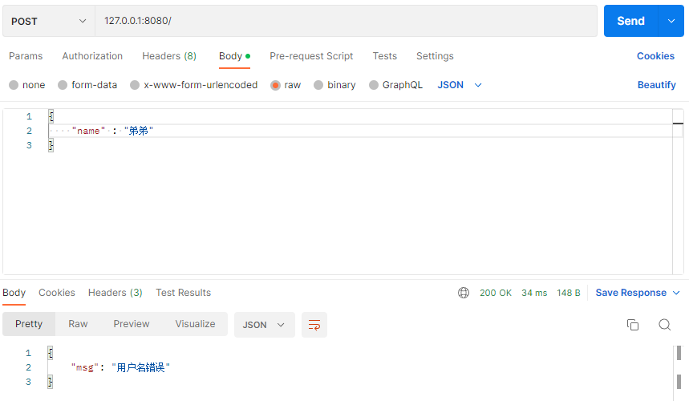
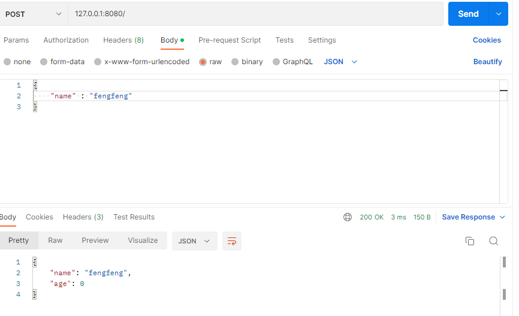

## 一、为指定的`binding`标签值注册验证器函数

### 1.1 注册验证器函数

```go
// github.com/go-playground/validator/v10
// 注意这个版本得是v10的

if v, ok := binding.Validator.Engine().(*validator.Validate); ok {
    v.RegisterValidation("sign", signValid)  //当字段的binding标签值为sign时，将调用signValid()函数
}
```

### 1.2 编写验证器函数

```go
// 如果用户名不等于fengfeng就校验失败
func signValid(fl validator.FieldLevel) bool {
  name := fl.Field().Interface().(string)
  if name != "fengfeng" {  //获取binding标签为sign的字段的值(在本例中也就是Name字段)
    return false
  }
  return true
}
```

### 1.3 结构体类

```go
type UserInfo struct {
  Name string `json:"name" binding:"sign" msg:"用户名错误"`
  Age  int    `json:"age" binding:""`
}
```

## 二、使用

```go
type User struct {
	Name string `json:"name" binding:"sign" msg:"用户名错误"` //指定binding标签为sign
	Age  int    `json:"age" binding:""`
}

// 如果用户名不等于fengfeng就校验失败
func signValid(fl validator.FieldLevel) bool {
	name := fl.Field().Interface().(string) //获取binding标签为sign的字段的值(在本例中也就是Name字段)
	if name != "fengfeng" {
		return false
	}
	return true
}

func CustomValidator() {
	router := gin.Default()
	router.POST("/", func(c *gin.Context) {
		type UserInfo struct {
			Name string `json:"name" binding:"sign" msg:"用户名错误"`
			Age  int    `json:"age" binding:""`
		}
		var user User
		err := c.ShouldBindJSON(&user)
		if err != nil {
			// 显示自定义的错误信息
			msg := GetValidMsg(err, &user)
			c.JSON(200, gin.H{"msg": msg})
			return
		}
		c.JSON(200, user)
	})
	// 注册自定义验证器函数
	if v, ok := binding.Validator.Engine().(*validator.Validate); ok {
		v.RegisterValidation("sign", signValid) //为binding标签的sign注册验证器函数
	}
	// 运行gin服务器
	router.Run(":8080")
}
```



