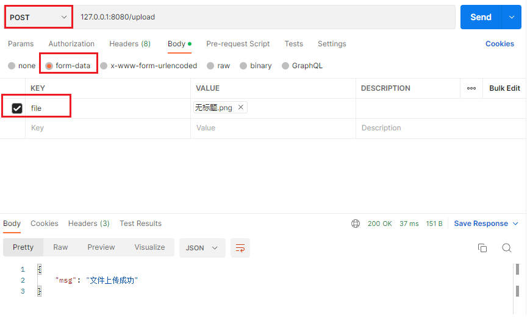
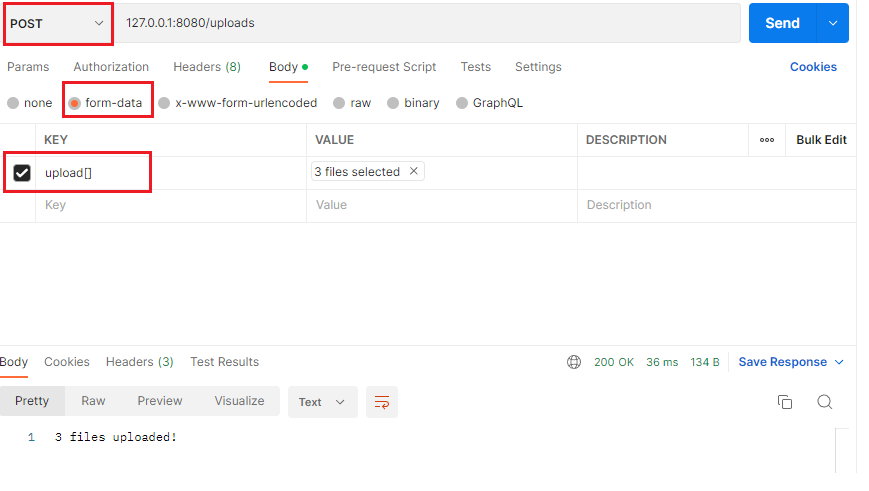

## 一、单文件上传至 `Gin` 服务端

### 1.1 处理`form`表单上传文件并存储的路由

```go
func fileUpload(c *gin.Context) {
	file, _ := c.FormFile("file") //参数为http请求form表单中文件对应的key值
	fmt.Println(file.Filename)
	fmt.Println(file.Size) //输出以字节为单位的文件大小

	dst_1 := "./file/" + "1.png"
	dst_2 := "./file/" + "2.png"

	// 方式一：直接在给定路径中存储form表单中获取的文件
	c.SaveUploadedFile(file, dst_1)

	// 方式二：使用Create+Copy的方式
	fileReader, _ := file.Open() //打开从表单中获取的文件
	// 可以直接读取表单文件(一般读取文本文件)
	//data, _ := io.ReadAll(fileReader)
	//fmt.Println(string(data))

	fileWriter, err := os.Create(dst_2) //在指定目录下创建指定名称的文件
	if err != nil {
		fmt.Println(err)
	}
	defer fileWriter.Close()        // 方式二需要记得关闭已经打开的文件
	io.Copy(fileWriter, fileReader) //文件复制

	c.JSON(http.StatusOK, gin.H{"msg": "文件上传成功"})
}
```

### 1.2 主业务函数

```go
func UpLoadFile() {
	router := gin.Default()
	// 为 multipart forms 设置较低的内存限制 (默认是 32 MiB)
	// 单位是字节， << 是左移预算符号，等价于 8 * 2^20
	// gin对文件上传大小的默认值是32MB
	router.MaxMultipartMemory = 8 << 20
	// 文件必须在form表单中上传，而form表单必须以POST方式上传
	router.POST("/upload", fileUpload)     //上传单文件
	
	router.Run(":8080")
}
```

### 1.3 使用



## 二、多文件上传至 `Gin` 服务端

### 2.1 处理`form`表单上传文件并存储的路由

```go
func mulFileUpload(c *gin.Context) {
	form, _ := c.MultipartForm()   //获取整个表单的对象form
	files := form.File["upload[]"] //根据键值key获取表单中的文件切片(key为 upload[])

	for _, file := range files { //将所有表单中上传的文件进行保存
		fmt.Println(file.Filename)
		// 上传文件至指定目录
		c.SaveUploadedFile(file, "./file/"+file.Filename)
	}
	c.String(http.StatusOK, fmt.Sprintf("%d files uploaded!", len(files)))
}
```

### 2.2 主业务函数

```go
func UpLoadFile() {
	router := gin.Default()

	router.MaxMultipartMemory = 8 << 20
	router.POST("/uploads", mulFileUpload) //上传多文件

	router.Run(":8080")
}
```

### 2.3 使用

