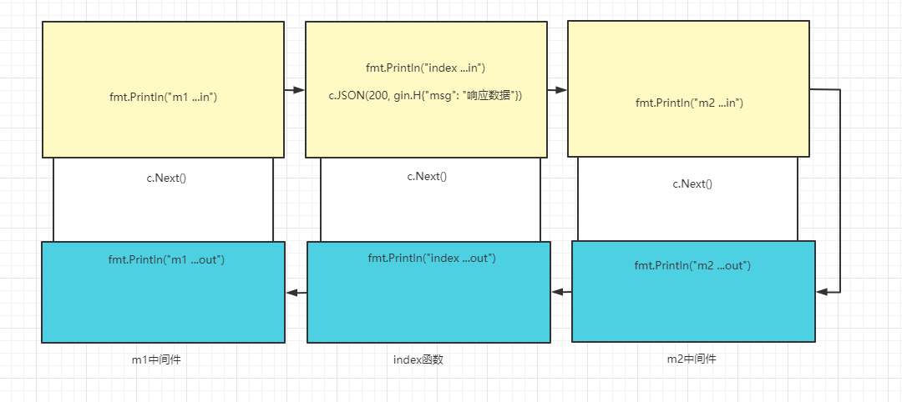

## 一、中间件的作用

Gin框架允许开发者在处理请求的过程中，加入用户自己的钩子（Hook）函数。这个**钩子函数就叫中间件**，中间件**适合处理一些公共的业务逻辑**，比如登录认证、权限校验、数据分页、记录日志、耗时统计等 即比如，**如果访问一个网页的话，不管访问什么路径都需要进行登录，此时就需要为所有路径的处理函数进行统一一个中间件**

Gin中的中间件必须是一个`gin.HandlerFunc`类型。

## 二、中间件的使用

`router.GET()`，后面可以跟很多`HandlerFunc`方法，这些方法其实都可以叫中间件

```go
package main

import (
  "fmt"
  "github.com/gin-gonic/gin"
)

func m1(c *gin.Context) {   //中间件1
  fmt.Println("m1 ...in")
}
func m2(c *gin.Context) {   //中间件2
  fmt.Println("m2 ...in")
}

func indexHandler(c *gin.Context) {  //主业务
  fmt.Println("index.....")
  c.JSON(http.StatusOK, gin.H{
    "msg": "index",
  })
}

func main() {
  router := gin.Default()

  router.GET("/", m1,index,m2)

  router.Run(":8080")
}

```

**上述程序，当访问`127.0.0.0.1:8080/`时，执行顺序为： 中间件`m1` -->  主业务`index` --> 中间件`m2`**

### 2.1 中间件拦截

当在其中一个中间件或主业务中使用`c.Abort()`拦截，后续的`HandlerFunc`就不会执行了

```go
package main

import (
  "fmt"
  "github.com/gin-gonic/gin"
)

func m1(c *gin.Context) {
  fmt.Println("m1 ...in")
  c.JSON(200, gin.H{"msg": "第一个中间件拦截了"})
  c.Abort()   //使用c.Abort()进行拦截
}
func m2(c *gin.Context) {
  fmt.Println("m2 ...in")
}

func main() {
  router := gin.Default()

  router.GET("/", m1, func(c *gin.Context) {
    fmt.Println("index ...")
    c.JSON(200, gin.H{"msg": "响应数据"})
  }, m2)

  router.Run(":8080")
}
```

**由于执行顺序本为：中间件`m1` -->  主业务`index` --> 中间件`m2 `。但现在在`m1`中加入了`c.Abort()`拦截，因此主业务`index`和中间件`m2 `都不会被执行。**

### 2.2 请求中间件和响应中间件

`c.Next()`，`Next`前后形成了其他语言中的请求中间件和响应中间件

```go
package main

import (
  "fmt"
  "github.com/gin-gonic/gin"
)

func m1(c *gin.Context) {
  fmt.Println("m1 ...in")   //请求中间件
  c.Next()
  fmt.Println("m1 ...out")  //响应中间件
}
func m2(c *gin.Context) {
  fmt.Println("m2 ...in")	 //请求中间件
  c.Next()
  fmt.Println("m2 ...out")	//响应中间件
}

func main() {
  router := gin.Default()

  router.GET("/", m1, func(c *gin.Context) {
    fmt.Println("index ...in")
    c.JSON(200, gin.H{"msg": "响应数据"})    //请求中间件
    c.Next()
    fmt.Println("index ...out")  //响应中间件
  }, m2)

  router.Run(":8080")
}
```

**此时的执行顺序为： m1...in --->  index...in --->  m2...in --->  m2...out ---> index...out  --->  m1...out** 。**类似于栈的原理**。



**如果其中一个中间件的请求中间件中包含`c.Abort()`，那么后续中间件的请求和响应中间件都将不再执行，直接按照顺序走完当前已运行的所有中间件响应中间件。**

### 2.3 全局注册中间件

上述我们在使用中间件时只针对于给定的路由函数。但其实中间件可以放到全局中，供所有路由函数使用，这样不管用户访问何种资源都会首先调用到这些中间件。

```go
package main

import (
  "fmt"
  "github.com/gin-gonic/gin"
)

func m10(c *gin.Context) {
  fmt.Println("m1 ...in")
  c.Next()
  fmt.Println("m1 ...out")
}

func index(c *gin.Context) {  //主业务
  fmt.Println("index.....")
  c.JSON(http.StatusOK, gin.H{
    "msg": "index",
  })
}

func main() {
  router := gin.Default()

  router.Use(m10)     // m10将作为全局中间件(router.Use()参数类型是gin.HandlerFunc... ,即列表)
  router.GET("/", func(c *gin.Context) {   // http://127.0.0.1:8080/
  	fmt.Println("index ...in")
    c.JSON(200, gin.H{"msg": "index"})
    c.Next()
    fmt.Println("index ...out")
  })
  router.GET("/index",index)		// http://127.0.0.1:8080/index

  router.Run(":8080")

}
```

**在上述的`gin`服务器中，不管用户访问`http://127.0.0.1:8080/`还是`http://127.0.0.1:8080/index`都会首先访问`m10中间件`**。

### 2.4 中间件传递数据

可以在中间件路由函数中使用`Context.Set()`设置一个`key-value`，在后续中间件中就可以使用`Context.Set()`来接收这个数据

```go
package main

import (
  "fmt"
  "github.com/gin-gonic/gin"
)

func m10(c *gin.Context) {
  fmt.Println("m1 ...in")
  c.Set("name", "fengfeng")   //设置一个key-value值
}

func main() {
  router := gin.Default()

  router.Use(m10)
  router.GET("/", func(c *gin.Context) {
    fmt.Println("index ...in")
    name, _ := c.Get("name")   //获取已设置key对应的value（value的类型是any类型）
    fmt.Println(name)
    
    c.JSON(200, gin.H{"msg": "index"})
  })

  router.Run(":8080")

}
```

**因为`value`的类型是`any`类型，所有我们可以用它传任意类型，在接收的时候做好断言即可**

```go
package main

import (
  "fmt"
  "github.com/gin-gonic/gin"
)

type User struct {
  Name string
  Age  int
}

func m10(c *gin.Context) {
  fmt.Println("m1 ...in")
  c.Set("name", User{"枫枫", 21})
  c.Next()
  fmt.Println("m1 ...out")
}

func main() {
  router := gin.Default()

  router.Use(m10)
  router.GET("/", func(c *gin.Context) {
    fmt.Println("index ...in")
    name, _ := c.Get("name")
    user := name.(User)    //对value进行类型断言
    fmt.Println(user.Name, user.Age)
    c.JSON(200, gin.H{"msg": "index"})
  })

  router.Run(":8080")

}
```

