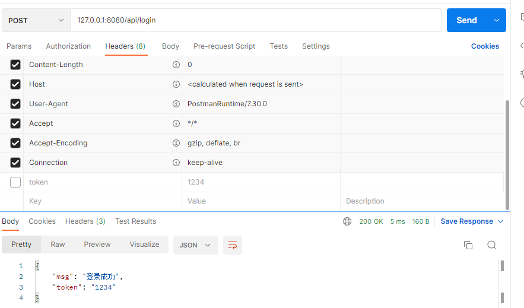
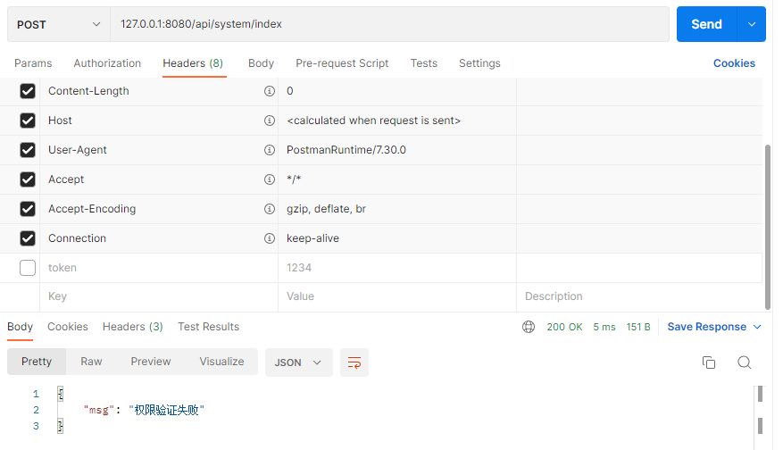

## 一、路由分组

**将一系列的路由放到一个组下，统一管理**。例如，以下的路由前面**统一加上api的前缀**

```go
func UserInfo(c *gin.Context) {
	c.JSON(http.StatusOK, gin.H{"msg": "这里是用户信息"})
}

func ArticleInfo(c *gin.Context) {
	c.JSON(http.StatusOK, gin.H{"msg": "这里是文章信息"})
}

func UserManagerInit(r *gin.RouterGroup) {
	um := r.Group("userManager")
    um.GET("/userInfo", UserInfo)   //两次分组，位于api组下的userManager小组，因此必须以		
   									//http://127.0.0.1:8080/api/userManager/userInfo进行访问
}

func ArticleManagerInit(r *gin.RouterGroup) {
	am := r.Group("articleManager")
	am.GET("/articleInfo", ArticleInfo)   //两次分组，位于api组下的articleManager小组，因此必须以		
   										  //http://127.0.0.1:8080/api/articleManager/articleInfo进行访问
}

func RouterGroup() {
	router := gin.Default()

	api := router.Group("api")   //建立api组
	
	UserManagerInit(api)
	ArticleManagerInit(api)

	router.Run(":8080")
}
```

## 二、路由器分组注册中间件

可以将路由器分组机制和中间件机制相结合，达到特定路由器组有属于自己的特殊中间件的效果。

```go
package main

import (
  "fmt"
  "github.com/gin-gonic/gin"
)

func middle(c *gin.Context) {
  fmt.Println("middle ...in")
}

func main() {
  router := gin.Default()

  r := router.Group("/api").Use(middle)  // 可以链式，也可以直接r.Use(middle)，且这里是传入中间件的名字
  //r.Use(middle) 
  r.GET("/index", func(c *gin.Context) {
    c.String(200, "index")
  })
  r.GET("/home", func(c *gin.Context) {
    c.String(200, "home")
  })

  router.Run(":8080")
}
```

这样写我们就可以指定哪一些分组下可以使用中间件了。**当然，中间件还有一种写法，就是使用函数加括号的形式**

```go
package main

import (
  "fmt"
  "github.com/gin-gonic/gin"
)

func middle(c *gin.Context) {
  fmt.Println("middle ...in")
}
func middle1() gin.HandlerFunc {    //必须是返回一个gin.HandlerFunc。也可以有参数，达到闭包的效果
  // 这里的代码是程序一开始就会执行
  return func(c *gin.Context) {
    // 这里是请求来了才会执行
    fmt.Println("middle1 ...inin")
  }
}

func main() {
  router := gin.Default()

  r := router.Group("/api").Use(middle, middle1())
  r.GET("/index", func(c *gin.Context) {
    c.String(200, "index")
  })
  r.GET("/home", func(c *gin.Context) {
    c.String(200, "home")
  })

  router.Run(":8080")
}
```

### 2.1 案例演示---权限验证

以前后端最流行的**`jwt`**为例，如果用户登录了，前端发来的每一次请求都会在请求头上携带上`token`。后台拿到这个`token`进行校验，验证是否过期，是否非法。如果通过就说明这个用户是登录过的，不通过就说明用户没有登录。

```go
package main

import (
  "github.com/gin-gonic/gin"
)

func JwtTokenMiddleware(c *gin.Context) {
  // 获取请求头的token
  token := c.GetHeader("token")
  // 调用jwt的验证函数
  if token == "1234" {
    // 验证通过
    c.Next()
    return
  }
  // 验证不通过，则不再继续往下执行其他gin.HandlerFunc
  c.JSON(200, gin.H{"msg": "权限验证失败"})
  c.Abort()
}

func main() {
  router := gin.Default()

  api := router.Group("/api")

  apiUser := api.Group("")
  {
    apiUser.POST("login", func(c *gin.Context) {  //用户首次登陆不需要验证，同时需要给用户前端返回一个token
        c.JSON(200, gin.H{"msg": "登录成功","token":"1234"})
    })
  }
  apiHome := api.Group("system").Use(JwtTokenMiddleware)  //使用jwt验证中间件
  {
    apiHome.GET("/index", func(c *gin.Context) {
      c.String(200, "index")
    })
    apiHome.GET("/home", func(c *gin.Context) {
      c.String(200, "home")
    })
  }

  router.Run(":8080")
}
```

使用：

- 前端访问`http://127.0.0.1:8080/api/login`进行登录，获取`token`



- 前端在请求头中加入获取到的`token`，以此与后端进行后续的通信


下面给出前端不加`token`进行后续访问的响应：



## 三、`gin.Default()`与`gin.New()`

下面给出`gin`中`Default()`的实现：

```go
func Default() *Engine {
  debugPrintWARNINGDefault()
  engine := New()
  engine.Use(Logger(), Recovery())
  return engine
}
```

可以看出，`gin.Default()`其实就是默认使用了`Logger`和`Recovery`中间件的`gin.New()`。其中：

Logger中间件将日志写入gin.DefaultWriter，即使配置了GIN_MODE=release。 Recovery中间件会recover任何panic。如果有panic的话，会写入500响应码。 **如果不想使用上面两个默认的中间件，可以使用gin.New()新建一个没有任何默认中间件的路由。**

以下的代码在作用上是相同的：

```go
router := gin.Default()


router :=gin.New().Use(Logger(), Recovery())
```

