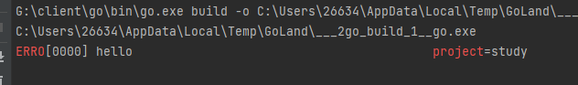
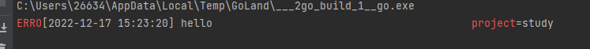

## 一、下载

```go
go get github.com/sirupsen/logrus
```

## 二、常用方法

```go
logrus.Debugln("Debugln")
logrus.Infoln("Infoln")
logrus.Warnln("Warnln")
logrus.Errorln("Errorln")
logrus.Println("Println")

// 输出如下
time="2022-12-17T14:02:01+08:00" level=info msg=Infoln   
time="2022-12-17T14:02:01+08:00" level=warning msg=Warnln
time="2022-12-17T14:02:01+08:00" level=error msg=Errorln 
time="2022-12-17T14:02:01+08:00" level=info msg=Println
```

**`debug`之所以没有输出，是因为`logrus`默认的日志输出等级是 `info`**

### 2.1 查看当前日志输出等级

```go
fmt.Println(logrus.GetLevel())  // 默认情况下是info
```

下面给出`logrus`的日志等级：

```go
PanicLevel  = iota   //级别从上到下依次降低(数值是升高的)，高级别(低数值)的日志系统不会输出低级别(高数值)的日志消息
FatalLevel  
ErrorLevel
WarnLevel
InfoLevel
DebugLevel
TraceLevel  
```

### 2.2 修改日志系统级别

如果你想显示Debug的日志，那么你可以更改日志显示等级。只需要在输出所有日志之前，采取以下配置：

```go
logrus.SetLevel(logrus.DebugLevel)
```

日志级别一般是和系统环境挂钩，例如开发环境，肯定就要显示`debug`信息，测试环境也是需要的

线上环境就不需要这些日志，可能只显示`warnning`的日志

### 2.3 日志消息设置特定字段

```go
log1 := logrus.WithField("project", "study")  //每次使用logrus.WithField追加一个，可以链式叠加
log1.Errorln("hello")
// time="2022-12-17T15:02:28+08:00" level=error msg=hello project=study  追加显示project = study键值对
log2 := logrus.WithFields(logrus.Fields{   //一次使用logrus.WithFields追加一堆(logrus.Fields是map类型)
  "func": "main",
})
log2.Warningf("你好")
// time="2022-12-17T15:02:28+08:00" level=warning msg="你好" func=main
log3 := log2.WithFields(logrus.Fields{  		//log3直接在log2的基础上叠加
  "auth": "枫枫",
})
// time="2022-12-17T15:02:28+08:00" level=warning msg="你好" auth="枫枫" func=main
log3.Warnln("你好")
```

通常，在一个应用中、或者应用的一部分中，都有一些固定的Field。

比如在处理用户`http`请求时，上下文中，所有的日志都会有`request_id`和`user_ip`

为了避免每次记录日志都要使用`log.WithFields(log.Fields{"request_id": request_id, "user_ip":  user_ip})`，我们可以创建一个`logrus.Entry`实例，为这个实例设置默认Fields，在上下文中使用这个`logrus.Entry`实例记录日志即可。

### 2.4 显示样式  `Text`和 `Json`

日志消息默认的是以text的形式展示，也可以设置为json

```go
logrus.SetFormatter(&logrus.JSONFormatter{})  //设置为Json格式 （logrus.TextFormatter{}是默认的文本格式）
log1 := logrus.WithField("project", "study")
log1.Errorln("hello")
// {"level":"error","msg":"hello","project":"study","time":"2022-12-17T15:08:24+08:00"}   json日志消息
```

### 2.5 自定义颜色

如果我们想要在控制中显示颜色，一般的做法都是使用

ANSI 控制码，用于设置文本颜色。`\033` 是控制码的开始，是八进制数字，`[31m` 表示将文本设置为(前景)红色。

ANSI 控制码是用于在终端和控制台中控制文本格式和颜色的一种标准。它们通常用于在命令行界面 (CLI) 程序中输出彩色文本或者在文本模式下的图形界面 (GUI) 中输出文本。

```go
func main() {
  // 前景色
  fmt.Println("\033[30m 黑色 \033[0m")
  fmt.Println("\033[31m 红色 \033[0m")
  fmt.Println("\033[32m 绿色 \033[0m")
  fmt.Println("\033[33m 黄色 \033[0m")
  fmt.Println("\033[34m 蓝色 \033[0m")
  fmt.Println("\033[35m 紫色 \033[0m")
  fmt.Println("\033[36m 青色 \033[0m")
  fmt.Println("\033[37m 灰色 \033[0m")
  // 背景色
  fmt.Println("\033[40m 黑色 \033[0m")
  fmt.Println("\033[41m 红色 \033[0m")
  fmt.Println("\033[42m 绿色 \033[0m")
  fmt.Println("\033[43m 黄色 \033[0m")
  fmt.Println("\033[44m 蓝色 \033[0m")
  fmt.Println("\033[45m 紫色 \033[0m")
  fmt.Println("\033[46m 青色 \033[0m")
  fmt.Println("\033[47m 灰色 \033[0m")
}
```

`logrus`本身也是支持颜色输出的，我们需要在配置中去进行开启:

```go
logrus.SetFormatter(&logrus.TextFormatter{ForceColors: true})
```



还有其他的一些配置:

```go
ForceColors：是否强制使用颜色输出。
DisableColors：是否禁用颜色输出。
ForceQuote：是否强制引用所有值。
DisableQuote：是否禁用引用所有值。
DisableTimestamp：是否禁用时间戳记录。
FullTimestamp：是否在连接到 TTY 时输出完整的时间戳。
TimestampFormat：用于输出完整时间戳的时间戳格式。
```

```go
logrus.SetFormatter(&logrus.TextFormatter{ForceColors: true, TimestampFormat: "2006-01-02 15:04:05", FullTimestamp: true})
```



### 2.6 日志输出到文件

默认的输出是在控制台上。但是后期想要找某些日志，翻控制台可能就不太好找了。

**使用函数`func SetOutput(out io.Writer)`即可重定向日志输出，但需要我们有一个`Writer`的对象**

```go
file, _ := os.OpenFile("info.log", os.O_CREATE|os.O_WRONLY|os.O_APPEND, 0666) //必须是os.O_APPEND追加方式
logrus.SetOutput(file)   //重定向日志到文件
```

### 2.7 同时输出到文件和屏幕

```go
file, err := os.OpenFile("checkemstools.log", os.O_CREATE|os.O_WRONLY|os.O_APPEND, 0666)
writers := []io.Writer{
     file,
     os.Stdout}
//  同时写文件和屏幕
fileAndStdoutWriter := io.MultiWriter(writers...)  //io.MultiWriter可以包含多个Writer对象
logrus.SetOutput(fileAndStdoutWriter)
```

## 三、`logrus`自定义格式

`logrus`默认的样式没有颜色输出，可以通过实现`Formatter(entry *logrus.Entry) ([]byte, error)` 方法来完成自定义格式输出。

```go
// 颜色
const (
  red    = 31
  yellow = 33
  blue   = 36
  gray   = 37
)

type LogFormatter struct{} //需要实现Formatter(entry *logrus.Entry) ([]byte, error)接口

func (t *LogFormatter) Formatter(entry *logrus.Entry) ([]byte, error) {
  var levelColor int
  switch entry.Level {    //根据不同的level去展示颜色
  case logrus.DebugLevel, logrus.TraceLevel:
    levelColor = gray
  case logrus.WarnLevel:
    levelColor = yellow
  case logrus.ErrorLevel, logrus.FatalLevel, logrus.PanicLevel:
    levelColor = red
  default:
    levelColor = blue
  }
  var b *bytes.Buffer
  if entry.Buffer != nil {
    b = entry.Buffer   //获取日志实例中的缓冲
  } else {
    b = &bytes.Buffer{}
  }
  //自定义日期格式
  timestamp := entry.Time.Format("2006-01-02 15:04:05")   //获取格式化的日志消息时间
  if entry.HasCaller() {  //检测日志实例是否开启  SetReportCaller(true)
    //自定义文件路径
    funcVal := entry.Caller.Function   //生成日志消息的函数名
    fileVal := fmt.Sprintf("%s:%d", path.Base(entry.Caller.File), entry.Caller.Line)  //生成日志的文件和日志行号
    //自定义输出格式
    fmt.Fprintf(b, "[%s] \x1b[%dm[%s]\x1b[0m %s %s %s\n", timestamp, levelColor, entry.Level, fileVal, funcVal, entry.Message)   //entry.Message是日志消息内容
  } else {
    fmt.Fprintf(b, "[%s] \x1b[%dm[%s]\x1b[0m %s\n", timestamp, levelColor, entry.Level, entry.Message)
  }
  return b.Bytes(), nil   //返回格式化的日志缓冲
}

var log *logrus.Logger

func init() {
  log = NewLog()
}

func NewLog() *logrus.Logger {
  mLog := logrus.New()               //新建一个实例
  mLog.SetOutput(os.Stdout)          //设置输出类型
  mLog.SetReportCaller(true)         //开启返回函数名和行号
  mLog.SetFormatter(&LogFormatter{}) //设置自己定义的Formatter
  mLog.SetLevel(logrus.DebugLevel)   //设置最低的Level
  return mLog
}
func main() {
  log.Errorln("你好")
  log.Infof("你好")
  log.Warnln("你好")
  log.Debugf("你好")
}
```

- 使用` mLog := logrus.New()`创建一个新的日志对象
- 使用`mLog.SetReportCaller(true) `开启函数名、文件、行号捕获功能
- 使用` mLog.SetFormatter(&LogFormatter{})`传入自定义`Format`对象
- 自定义`Format`对象需要自行实现`Formatter(entry *logrus.Entry) ([]byte, error)`方法
- `entry.Level`可以获取输出日志的等级
- `entry.Buffer`可以获取日志对象的输出缓冲
- `entry.Time.Format(2006-01-02 15:04:05)`可以获取格式化的日志产生时间
- `entry.Caller.Function`可以获取产生日志的函数名，`entry.Caller.File`获取文件名，`entry.Caller.Line`获取行号
- `entry.Message`获取日志消息内容

## 四、自定义`Hook`

`logrus`最令人心动的功能就是其可扩展的HOOK机制了，通过在初始化时为`logrus`添加hook，`logrus`可以实现各种扩展功能。

```go
// logrus在记录Levels()返回的日志级别的消息时会触发HOOK，
// 按照Fire方法定义的内容修改logrus.Entry。
type Hook interface {
  Levels() []Level    //确定hook作用的范围(作用于哪些日志等级的消息)
  Fire(*Entry) error   //在本方法中定义需要执行的hook
}
```

### 4.1 示例一

```go
type MyHook struct {
}

// 设置一个field
func (hook *MyHook) Fire(entry *logrus.Entry) error {
  entry.Data["app"] = "fengfeng"   //为每一条作用范围内的日志消息添加一个 app:fengfeng 键值对
  return nil
}

// 哪些等级的日志才会生效
func (hook *MyHook) Levels() []logrus.Level {
  return logrus.AllLevels   // logrus.AllLevels 意思是作用于全部的日志消息
}

func main() {
  // 日志的打开格式是追加，所以不能用os.Create
  logrus.SetFormatter(&logrus.TextFormatter{ForceColors: true, TimestampFormat: "2006-01-02 15:04:05", FullTimestamp: true})
  logrus.AddHook(&MyHook{})   //调用logrus.AddHook()添加自定义的Hook对象
  logrus.Errorf("hello")
}
```

### 4.2 示例二

比如，`error`级别的日志独立输出到`error.log`文件里，其他都放在一起。

```go
type MyHook struct {
  Writer *os.File  
}

func (hook *MyHook) Fire(entry *logrus.Entry) error {
  line, err := entry.String()
  if err != nil {
    fmt.Fprintf(os.Stderr, "Unable to read entry, %v", err)
    return err
  }
  hook.Writer.Write([]byte(line))  //将logrus.ErrorLevel级别的日志写入到特殊的文件中
  return nil
}

func (hook *MyHook) Levels() []logrus.Level {
  return []logrus.Level{logrus.ErrorLevel}  //范围只限logrus.ErrorLevel级别的日志
}

func main() {
  logrus.SetFormatter(&logrus.TextFormatter{ForceColors: true, TimestampFormat: "2006-01-02 15:04:05", FullTimestamp: true})
  logrus.SetReportCaller(true)
  file, _ := os.OpenFile("err.log", os.O_CREATE|os.O_WRONLY|os.O_APPEND, 0666)
  hook := &MyHook{Writer: file}   
  logrus.AddHook(hook)
  logrus.Errorf("hello")
}
```

