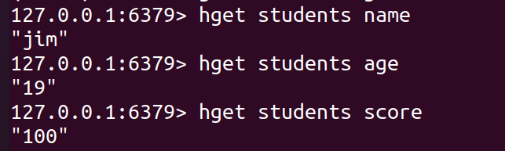

## 一、管道操作

​	请求/响应服务可以实现持续处理新请求。客户端可以一次性发送多个命令到服务器端而无需等待响应，最后再一次性读取服务器端的多个响应。

​	`Send()`、`Flush()`、`Receive()`方法支持管道化操作。

- `Send()`方法用于向连接的缓冲区写入命令。

- `Flush()`方法用于将连接的缓冲区内容清空并写入给服务器端。

- `Receive()`方法用于按照FIFO顺序依次读取服务器端的响应。

  

  示例代码如下：

```go
func main() {
	c, err := redis.Dial("tcp", "localhost:6379")
	if err != nil {
		fmt.Println("conn redis faile,err:", err)
	}
	defer c.Close()

	c.Send("set", "username1", "jim")
	c.Send("set", "username2", "mary")

	c.Flush()

	v, err := c.Receive() // 获取服务器端第一条Send数据的回复
	fmt.Printf("val:%v,err:%v\n", v, err)
	v, err = c.Receive() // 获取服务器端第二条Send数据的回复
	fmt.Printf("val:%v,err:%v\n", v, err)

	v, err = c.Receive() // 一直阻塞等待
	fmt.Printf("val:%v,err:%v\n", v, err)
}
```

运行结果如下：

```
val:OK,err:<nil>
val:OK,err:<nil>
```

## 二、实现并发

​	在日常开发中，有时候会遇到这样的场景，**多个人同时对同一个数据进行修改，导致并发问题发生**。使用`Redis`来解决这个问题是很好的选择。

​	`Redis`管道使得客户端能够用"无等待响应"的方式，来连续发送多条命令请求至`Redis`服务器端，然后服务器端按照请求顺序返回相应的结果。

​	`Redis`并发的示例如下：

### 2.1 示例一：

```go
func main() {
	conn, err := redis.Dial("tcp", "localhost:6379")
	if err != nil {
		fmt.Println("conn redis faile,err:", err)
	}
	defer conn.Close()

	conn.Send("hset", "students", "name", "jim", "age", "19")
	conn.Send("hset", "students", "score", "100")
	conn.Send("hget", "students", "age")

	conn.Flush()

	res1, err := conn.Receive()
    fmt.Printf("Receive res1:%v\n", res1)   // 返回写入成功的key-value对数(新创建的会返回1，覆写的返回0)
	res2, err := conn.Receive()
	fmt.Printf("Receive res2:%v\n", res2)
	res3, err := conn.Receive()
	fmt.Printf("Receive res3:%s\n", res3)
}
```

返回结果：

```
Receive res1:2
Receive res2:1
Receive res3:19
```



### 2.2 示例二

```go
func main() {
	conn, err := redis.Dial("tcp", "localhost:6379")
	if err != nil {
		fmt.Println("conn redis faile,err:", err)
	}
	defer conn.Close()

	conn.Send("hset", "students", "name", "jim", "age", "19", "score", "99")
	conn.Send("hset", "students", "score", "100", "course", "english")
	conn.Send("hget", "students", "age")

	conn.Flush()

	res1, err := conn.Receive()
	fmt.Printf("Receive res1:%v\n", res1)
	res2, err := conn.Receive()
	fmt.Printf("Receive res2:%v\n", res2)
	res3, err := conn.Receive()
	fmt.Printf("Receive res3:%s\n", res3)
}
```

返回结果：

```
Receive res1:3
Receive res2:1
Receive res3:19
```


注意：这里我们可以看到，**第二条写入操作的`score`覆盖了第一条写入操作的`score`**
