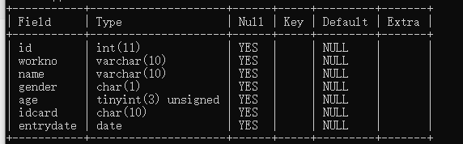

## 一、从数据库获取数据

假设我们的用户表`employee`的结构和内容如下：




这里我们根据此用户表，创建一个User结构体：

```go
type User struct{
    ID int
    WorkNo string
    Name string
    Gender string
    Age int
    IdCard string
    Entrydate string   //数据库的date类型在golang中可以用string类型存储，golang会在scan()中自动完成类型转换
}
```

## 二、单行查询

`database\sql`包中定义单行查询方法的定义如下：

```go
func (db *DB) QueryRow(query string,args ...interface{}) *Row
```

`QueryRow()`方法只执行一次查询，并返回最多一行结果。`QueryRow()`方法总是返回非nil的值，直到返回值的`Scan()`方法被调用时才会返回被延迟的错误。示例代码如下：

```go
func QueryRow(db *sql.DB) *User {

   u := new(User)
   err := db.QueryRow("select id,name,entrydate from `employee` where id = ?", 1).Scan(&u.ID, &u.Name, &u.Entrydate)      //查询方法其实就是输入标准的SQL查询语句，注意scan的参数必须是地址类型
   if err != nil {
      fmt.Println("数据库读取失败,err:", err)
      return nil
   }
   fmt.Printf("id:%d,name:%s,entrydate:%s\n", u.ID, u.Name, u.Entrydate)
   return u
}
```

## 三、多行查询

Query()方法**执行一次查询，但是返回多行(Rows)结果**，一般用于执行SELECT类型的SQL命令。Query()方法的定义如下：

```go
func (db *DB)Query(query string,args ...interface{}) (*Rows,error)
```
其中，参数query表示SQL语句，参数args表示query查询语句中的占位参数。

```go
func QueryMultiRow(db *sql.DB) []User {
	rows, err := db.Query("select id,name,age from `employee` where age between ? and ?", 18, 30)
	if err != nil {
		fmt.Println("数据库读取失败,err:", err)
		return nil
	}
	defer rows.Close()

	u := new(User)
	users := make([]User, 0)
	for rows.Next() {
		if err := rows.Scan(&u.ID, &u.Name, &u.Age); err != nil {
			fmt.Printf("row scan is failed,err:%v\n", err)
		}
		fmt.Printf("id:%d,name:%s,age:%d\n", u.ID, u.Name, u.Age)
		users = append(users, *u)
	}

	return users
}
```

使用Query()进行查询，需要注意的事项有：

- 应该**始终检查 `for rows.Next()` 循环的末尾是否有错误**。如果循环过程中出现错误，您需要知道它。不要只假设循环会迭代，直到您处理完所有行。**(因为db.Query()返回的rows集合中始终不会有nil，必须通过rows.Scan()来进一步判断是否出错)**
- **只要存在打开的结果集(由 `rows` 表示)，底层连接就处于被占用的状态，不能用于任何其他查询**。这**意味着它在连接池中不可用**。如果使用 `rows.Next()` 迭代所有行，最终将**读取最后一行，并且`rows.Next()` 将遇到内部 EOF 错误并为您调用 `rows.Close()`**。但是，如果**出于某种原因您退出该循环——提前返回，等等情况——那么 `rows` 不会关闭，连接保持打开。**(不过，**如果`rows.Next()` 由于错误返回 false，那么它会自动关闭**)。这是耗尽资源的一种简单方式。
- 如果 `rows.Close()` 已经关闭，那么它是一个无害的 no-op，因此您可以多次调用它。但是请注意，我们**首先需要检查错误，只有在没有错误时才调用 `rows.Close()`，以避免 runtime panic。**
- 您应该 **始终** `defer rows.Close()`，或者循环末尾显式调用 `rows.Close()`。

## 四、Scan() 是如何进行工作的

**当遍历rows并将其扫描到目标变量中时，Go 会基于目标变量的类型在后台执行数据类型转换**。

例如，假设**从用字符串列定义的表中选择一些行，例如`VARCHAR(45)`**。但是，您偶然知道**该表始终包含数字**。如果将**指针传递给字符串**，Go 会将字节复制到字符串中。**使用Scan()完成扫描之后，您可以使用 `strconv.ParseInt()` 或类似方法将字符串转换为数字。**

或者，您**可以仅为 `Scan()`传递指向整数的指针**。 **Go 将检测到该情况并自动调用 `strconv.ParseInt()`。如果转换中出现错误，则对 `Scan()` 的调用将返回该错误**。这也是使用 `database/sql` 的推荐方法。


## 五、参数占位符语法

预处理语句中占位符参数的语法是特定于数据库的。例如，下面比较 MySQL、PostgreSQL 和 Oracle：

```
MySQL                PostgreSQL                Oracle
============         ==================        =============
WHERE col = ?        WHERE col = $1            WHERE col = :col
VALUES(?, ?, ?)      VALUES($1, $2, $3)        VALUES(:val1, :val2, :val3)
```
