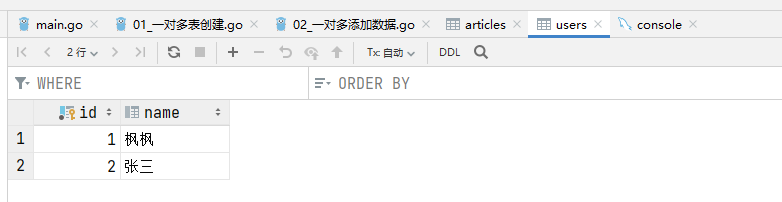

## 一、创建用户(父表行)，同时为其添加文章(子表行)

```go
// 创建用户，并为其添加文章
db.Create(&User{
    Name: "枫枫",
    Articles: []Article{
        {Title: "golang"},
        {Title: "python"},
    },
})
```

运行的结果如下：


## 二、为已有用户添加文章

有两种方式：

```go
// 为已有用户添加文章，方式一:用已有用户的UserID
db.Create(&Article{
    Title:  "golang专家编程",
    UserID: 1,
})
// 为已有用户添加文章，方式二:直接用已有的User对象
var user User
db.Take(&user, 2) //取出主键为2的user
db.Create(&Article{
    Title: "go Web开发",
    User:  user,
})
```

运行结果：


## 三、创建文件，并为其创建并添加所属用户

```go
db.Create(&Article{
    Title: "golang以太坊开发",
    User: User{
        Name: "张三",
        // Articles: []Article{}   也可以同时为张三用户添加其他的文章
    },
})
```

运行结果：




## 四、通过外键添加数据

### 4.1 给已有用户添加已有文章

```go
// 1.1 给现有用户添加文章 -- 使用DB.Save()
var user User
db.Take(&user, 1)

var article Article
db.Take(&article, 5)

user.Articles = []Article{article} //修改Articles字段
db.Save(&user)

// 1.2 给现有用户添加文章 -- 使用DB.Association()
user = User{}
db.Take(&user, 2)

article = Article{}
db.Take(&article, 5)

db.Model(&user).Association("Articles").Append(&article) //修改Articles字段
```

### 4.2 给已有文章添加已有用户

```go
// 2.1 给现有文章关联用户 -- 使用DB.Save()
article = Article{}
db.Take(&article, 1)

article.UserID = 2 //修改UserID字段
db.Save(&article)

// 2.2 给现有文章关联用户 -- 使用DB.Association()
user = User{}
db.Take(&user, 2)

article = Article{}
db.Take(&article, 4)

db.Model(&article).Association("User").Append(&user) //修改UserID字段
```

