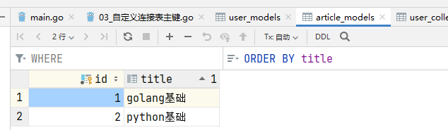

## 一、自定义连接表的需求

默认的连接表，只有双方的主键id，展示不了更多信息了，因此如果我们想要展示更多信息，就必须自定义连接表(第三张表)。

下面是一个例子，我们想要在连接表中记录每一条连接的创建时刻：

```go
type Sarticle struct {
	ID    uint
	Title string
	Stags []Tag `gorm:"many2many:sarticle_tags"`
}

type Stag struct {
	ID   uint
	Name string
}

type SarticleTag struct {
  SarticleID uint `gorm:"primaryKey"`   //gorm默认会生成的字段
  StagID     uint `gorm:"primaryKey"`   //gorm默认会生成的字段
  CreatedAt time.Time   //自定义字段
}
```

## 二、生成自定义连接表

```go
// 设置Article的Tags表为ArticleTag --->  手动为其指向第三张表
db.SetupJoinTable(&Sarticle{}, "Stags", &SarticleTag{})
// 如果tag要反向应用Article，那么也得加上 --> 但本例中Tag对象没有与Article关联的字段，因此不需要
// db.SetupJoinTable(&Stag{}, "Sarticles", &SarticleTag{})
err := db.AutoMigrate(&Sarticle{}, &Stag{}, &SarticleTag{})  // 把自定义的连接表结构也作为参数
fmt.Println(err)
```

## 三、添加Hook()函数

即使通过自定义连接表创建了自定义字段`CreatedAt` ，但是我们在添加数据时程序并不会为其赋值，因此我们需要手动为其添加值，通常将这种操作封装在Hook()函数中：

```go
func (sat *SarticleTag) BeforeCreate(tx *gorm.DB) (err error) {
	sat.CreatedAt = time.Now()
	return nil
}
```

**注：如果发现Hook()函数没有被执行，可以尝试在更新数据(查询不需要)时手动调用`SetupJoinTable`方法**

## 四、添加数据

### 4.1 添加文章并添加标签，并自动关联

```go
db.SetupJoinTable(&Sarticle{}, "Stags", &SarticleTag{})  
db.Create(&Sarticle{
    Title: "flask零基础入门",
    Stags: []Stag{
        {Name: "python"},
        {Name: "后端"},
        {Name: "web"},
    },
})
```

注：**所有对自定义第三张表的修改操作，都必须先调用`db.SetupJoinTable(&Sarticle{}, "Stags", &SarticleTag{})`将程序导向自定义第三张表，否则将会使用默认第三张表。**

### 4.2 添加文章，并关联已有标签

```go
db.SetupJoinTable(&Sarticle{}, "Stags", &SarticleTag{})
var tags []Stag
db.Find(&tags, "name in ?", []string{"python", "web"})
db.Create(&Sarticle{
    Title: "flask请求对象",
    Stags: tags,
})
```

### 4.3 给已有文章关联标签

```go
db.SetupJoinTable(&Sarticle{}, "Stags", &SarticleTag{})
article := Sarticle{
    Title: "django基础",
}
db.Create(&article)

var at Sarticle
tags = []Stag{}
db.Find(&tags, "name in ?", []string{"python", "web"})
db.Take(&at, article.ID).Association("Stags").Append(tags)
```

### 4.4 替换已有文章的标签

```go
db.SetupJoinTable(&Sarticle{}, "Stags", &SarticleTag{})
var article Sarticle
var tags []Stag
db.Find(&tags, "name in ?", []string{"后端"})
db.Take(&article, "title = ?", "django基础")
db.Model(&article).Association("Stags").Replace(tags)
```

## 五、查询

```go
// 查询所有文章，以及他们的关联标签
func QueryCustomTable(db *gorm.DB) {
	var articles []Sarticle
	db.Preload("Stags").Find(&articles)
	fmt.Println(articles)
}
```

## 六、自定义连接表主键

这个功能还是很有用的，例如你的文章表 可能叫`ArticleModel`，你的标签表可能叫`TagModel`。那么按照`gorm`默认的主键名，那就分别是`ArticleModelID`，`TagModelID`，太长了，根本就不实用。为此我们可以使用`gorm`标签的下面这两项：

- `joinForeignKey `   连接的主键id
- `JoinReferences`    关联的主键id

```go
type ArticleModel struct {
  ID    uint
  Title string
  Tags  []TagModel `gorm:"many2many:article_tags;joinForeignKey:ArticleID;JoinReferences:TagID"`
}

type TagModel struct {
  ID       uint
  Name     string
  Articles []ArticleModel `gorm:"many2many:article_tags;joinForeignKey:TagID;JoinReferences:ArticleID"`
}

type ArticleTagModel struct {
  ArticleID uint `gorm:"primaryKey"` // article_id
  TagID     uint `gorm:"primaryKey"` // tag_id
  CreatedAt time.Time
}
```

**注意对于` ArticleModel` 和 `TagModel` , 关联字段 `Tags` 和 `Articles`的标签内容是不一样的**

### 6.1 生成表结构

```sgo
DB.SetupJoinTable(&ArticleModel{}, "Tags", &ArticleTagModel{})
DB.SetupJoinTable(&TagModel{}, "Articles", &ArticleTagModel{})
err := DB.AutoMigrate(&ArticleModel{}, &TagModel{}, &ArticleTagModel{})
fmt.Println(err)
```

## 七、操作自定义连接表

比如查询某篇文章关联了哪些标签，或者是查询某个用户在什么时候收藏了哪篇文章。无论是通过用户关联文章，还是文章关联用户都不太好查，最简单的就是**直接查自定义连接表。**

### 7.1 表结构创建

```go
type UserModel struct {
  ID       uint
  Name     string
  Collects []ArticleModel `gorm:"many2many:user_collect_models;joinForeignKey:UserID;JoinReferences:ArticleID"`
}

type ArticleModel struct {
  ID    uint
  Title string
  // 这里也可以反向引用，根据文章查哪些用户收藏了
}

// UserCollectModel 用户收藏文章表
type UserCollectModel struct {
  UserID    uint `gorm:"primaryKey"` // article_id
  ArticleID uint `gorm:"primaryKey"` // tag_id
  CreatedAt time.Time
}
```

```
func CreateModelTable(db *gorm.DB) {
   db.SetupJoinTable(&UserModel{}, "Collects", &UserCollectModel{})
   db.AutoMigrate(&UserModel{}, &ArticleModel{}, &UserCollectModel{})
}
```

### 7.2 添加数据





### 7.3 传统简单查询

```go
// 传统查询,拿不到时间，只能拿到两个默认的主键
var user UserModel
db.Preload("Collects").Take(&user, "name = ?", "枫枫")
fmt.Println(user)
```

查询结果：

```sh
{2 枫枫 [{1 golang基础} {2 python基础}]}
```

### 7.4 进阶版查询

```go
// 进阶版查询，可以拿到时间，但不显示用户名和文章名而显示用户id和文章id，不直观
var collects []UserCollectModel
db.Find(&collects, "user_id = ?", 2) //根据第一个主键UserID进行查询
fmt.Println(collects)
```

查询结果：

```sh
[{2 {0  []} 1 {0 } 2023-01-15 22:15:00 +0800 CST} {2 {0  []} 2 {0 } 2023-01-15 22:15:16 +0800 CST}]   
```

### 7.5 高级版查询

使用这种查询方式，我们需要改一下表结构，不需要重新迁移，只需要加一些字段

```go
// UserCollectModel 用户收藏文章表
type UserCollectModel struct {
  UserID       uint         `gorm:"primaryKey"` // article_id
  UserModel    UserModel    `gorm:"foreignKey:UserID"`       // new:与外键UserID关联
  ArticleID    uint         `gorm:"primaryKey"` // tag_id
  ArticleModel ArticleModel `gorm:"foreignKey:ArticleID"`	//new:与外键ArticleID关联
  CreatedAt    time.Time
}
```

```go
// 高级版查询，可以拿到实现，而且显示用户名和文章名
user = UserModel{}
db.Take(&user, "name = ?", "枫枫")
collects = []UserCollectModel{}
db.Debug().Preload("UserModel").Preload("ArticleModel"). //需要预加载UserModel和ArticleModel类
Where(map[string]any{"user_id": user.ID}). //查询条件为指定用户id
Find(&collects)
fmt.Println(collects)
```

查询结果：

```sh
[{2 {2 枫枫 []} 1 {1 golang基础} 2023-01-15 22:15:00 +0800 CST} {2 {2 枫枫 []} 2 {2 python基础} 2023-01-15 22:15:16 +0800 CST}]
```

