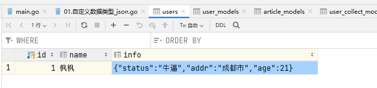

## 一、`Gorm`对于结构体对象中字段的处理

如果字段为基本数据类型，`Gorm` 预先为基本数据类型实现了 `Scanner` 和 `Valuer` 接口。因此基本数据类型可以通过`Gorm` 在数据库中存储和读出。

但如果字段为自定义数据类型(`struct`)，用户必须手动为其实现 `Scanner` 和 `Valuer` 接口，否则`gorm`不会将其存储到数据库中

## 二、存储结构体实例

```go
type Info struct {
  Status string `json:"status"`
  Addr   string `json:"addr"`
  Age    int    `json:"age"`
}

// Scan 从数据库中读取出来（注意: 类对象为指针类型）
func (i *Info) Scan(value interface{}) error {
  bytes, ok := value.([]byte)
  if !ok {
    return errors.New(fmt.Sprint("Failed to unmarshal JSONB value:", value))
  }

  info := Info{}
  err := json.Unmarshal(bytes, &info)
  *i = info
  return err
}

// Value 存入数据库（注意: 类对象为数值类型）
func (i Info) Value() (driver.Value, error) {
  return json.Marshal(i)
}

type User struct {
  ID   uint
  Name string
  Info Info `gorm:"type:string"`
}
```

```sgo
func CreateTable(db *gorm.DB) {
	db.AutoMigrate(&User{})
}
```

## 三、添加和查询

### 3.1 添加

```go
func InsertData(db *gorm.DB) {
    db.Create(&User{
        Name: "枫枫",
        Info: Info{
            Status: "牛逼",
            Addr:   "成都市",
            Age:    21,
        },
    })
}
```



### 3.2 查询

```go
func QueryData(db *gorm.DB) {
	var user User
	db.Take(&user)
	fmt.Println(user)
}
```

查询结果：

```sh
{1 枫枫 {牛逼 成都市 21}}
```

