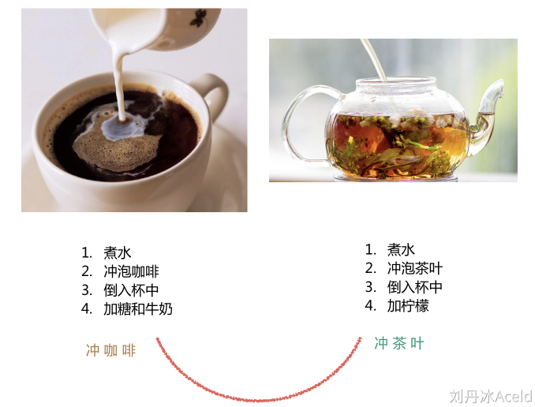
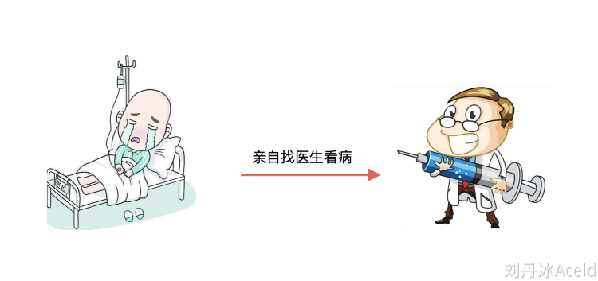
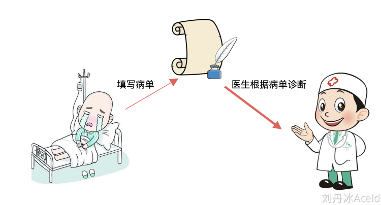
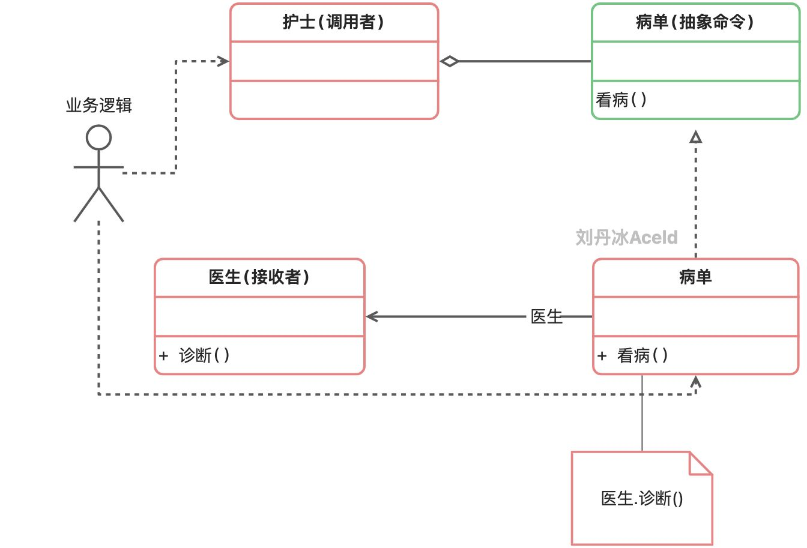
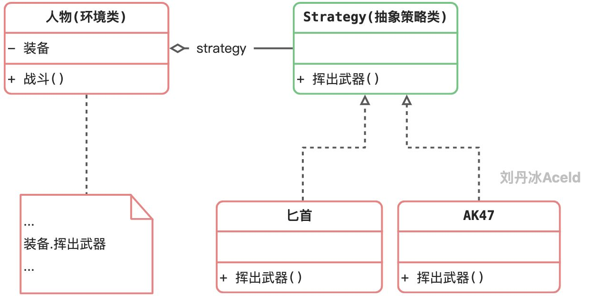
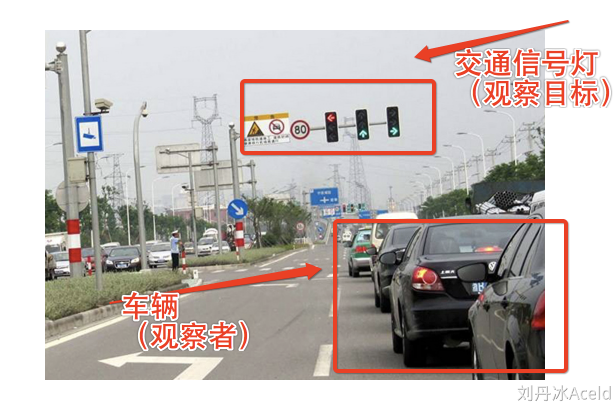
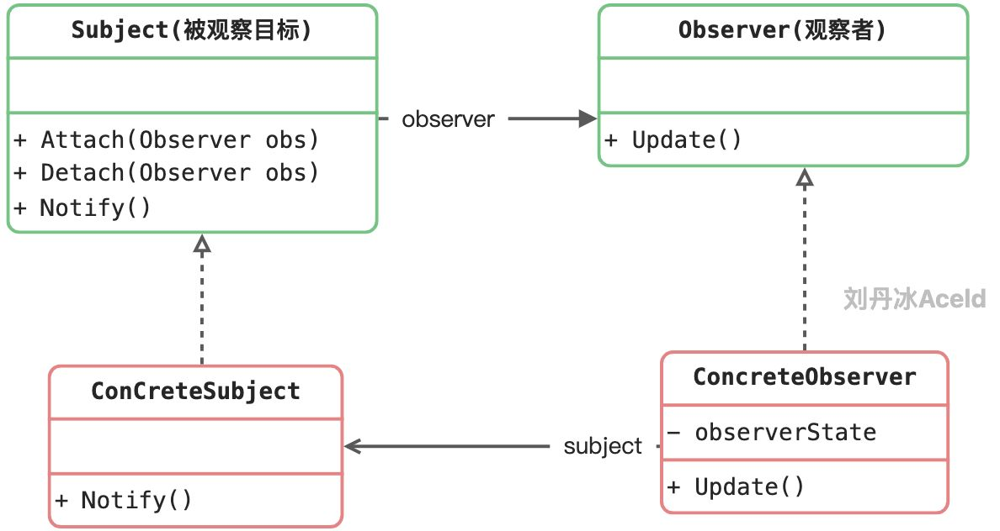
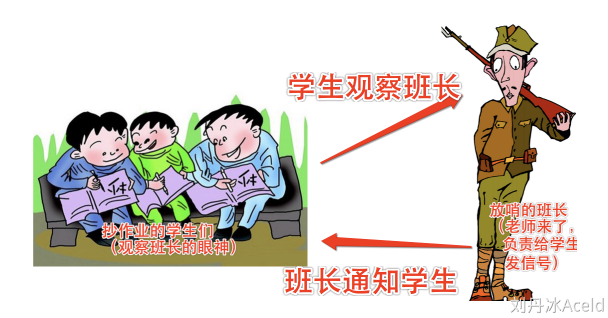
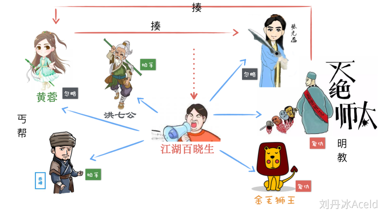

# 一、 模板方法模式

### 1. 模板方法模式中的角色和职责

**AbstractClass（抽象类）：**在抽象类中定义了一系列基本操作(PrimitiveOperations)，这些基本操作可以是具体的，也可以是抽象的，每一个基本操作对应算法的一个步骤，在其子类中可以重定义或实现这些步骤。同时，在抽象类中实现了一个模板方法(Template Method)，用于定义一个算法的框架，模板方法不仅可以调用在抽象类中实现的基本方法，也可以调用在抽象类的子类中实现的基本方法，还可以调用其他对象中的方法。

**ConcreteClass（具体子类）：**它是抽象类的子类，用于实现在父类中声明的抽象基本操作以完成子类特定算法的步骤，也可以覆盖在父类中已经实现的具体基本操作。

### 2. 模板方法模式案例



上图的案例类图如下：


实现代码如下：

```go
package main

import "fmt"

//抽象类，制作饮料,包裹一个模板的全部实现步骤
type Beverage interface {
	BoilWater() //煮开水
	Brew()      //冲泡
	PourInCup() //倒入杯中
	AddThings() //添加酌料

	WantAddThings() bool //是否加入酌料Hook
}

//封装一套流程模板，让具体的制作流程继承且实现
type template struct {
	b Beverage
}

//封装的固定模板
func (t *template) MakeBeverage() {
	if t == nil {
		return
	}

	t.b.BoilWater()
	t.b.Brew()
	t.b.PourInCup()

	//子类可以重写该方法来决定是否执行下面动作
	if t.b.WantAddThings() == true {
		t.b.AddThings()
	}
}


//具体的模板子类 制作咖啡
type MakeCaffee struct {
	template  //继承模板
}

func NewMakeCaffee() *MakeCaffee {
	makeCaffe := new(MakeCaffee)
	//b 为Beverage，是MakeCaffee的接口，这里需要给接口赋值，指向具体的子类对象
	//来触发b全部接口方法的多态特性。
	makeCaffe.b = makeCaffe
	return makeCaffe
}

func (mc *MakeCaffee) BoilWater() {
	fmt.Println("将水煮到100摄氏度")
}

func (mc *MakeCaffee) Brew() {
	fmt.Println("用水冲咖啡豆")
}

func (mc *MakeCaffee) PourInCup() {
	fmt.Println("将充好的咖啡倒入陶瓷杯中")
}

func (mc *MakeCaffee) AddThings() {
	fmt.Println("添加牛奶和糖")
}

func (mc *MakeCaffee) WantAddThings() bool {
	return true //启动Hook条件
}

//具体的模板子类 制作茶
type MakeTea struct {
	template  //继承模板
}

func NewMakeTea() *MakeTea {
	makeTea := new(MakeTea)
	//b 为Beverage，是MakeTea，这里需要给接口赋值，指向具体的子类对象
	//来触发b全部接口方法的多态特性。
	makeTea.b = makeTea
	return makeTea
}

func (mt *MakeTea) BoilWater() {
	fmt.Println("将水煮到80摄氏度")
}

func (mt *MakeTea) Brew() {
	fmt.Println("用水冲茶叶")
}

func (mt *MakeTea) PourInCup() {
	fmt.Println("将充好的咖啡倒入茶壶中")
}

func (mt *MakeTea) AddThings() {
	fmt.Println("添加柠檬")
}

func (mt *MakeTea) WantAddThings() bool {
	return false //关闭Hook条件
}

func main() {
	//1. 制作一杯咖啡
	makeCoffee := NewMakeCaffee()
	makeCoffee.MakeBeverage() //调用固定模板方法

	fmt.Println("------------")

	//2. 制作茶
	makeTea := NewMakeTea()
	makeTea.MakeBeverage()
}
```

运行结果如下：

```go
将水煮到100摄氏度
用水冲咖啡豆
将充好的咖啡倒入陶瓷杯中
添加牛奶和糖
------------
将水煮到80摄氏度
用水冲茶叶
将充好的咖啡倒入茶壶中
```

### 3. 模板方法的优缺点

优点：

(1) 在父类中形式化地定义一个算法，而由它的子类来实现细节的处理，在子类实现详细的处理算法时并不会改变算法中步骤的执行次序。

(2) 模板方法模式是一种代码复用技术，它在类库设计中尤为重要，它提取了类库中的公共行为，将公共行为放在父类中，而通过其子类来实现不同的行为，它鼓励我们恰当使用继承来实现代码复用。

(3) 可实现一种反向控制结构，通过子类覆盖父类的钩子方法来决定某一特定步骤是否需要执行。

(4) 在模板方法模式中可以通过子类来覆盖父类的基本方法，不同的子类可以提供基本方法的不同实现，更换和增加新的子类很方便，符合单一职责原则和开闭原则。


缺点：

需要为每一个基本方法的不同实现提供一个子类，如果父类中可变的基本方法太多，将会导致类的个数增加，系统更加庞大，设计也更加抽象。

### 4. 适用场景

(1)具有统一的操作步骤或操作过程;

(2) 具有不同的操作细节;

(3) 存在多个具有同样操作步骤的应用场景，但某些具体的操作细节却各不相同;

在抽象类中统一操作步骤，并规定好接口；让子类实现接口。这样可以把各个具体的子类和操作步骤解耦合。


## 二、命令模式

​	将一个请求封装为一个对象，从而让我们可用不同的请求对客户进行参数化；对请求排队或者记录请求日志，以及支持可撤销的操作。命令模式是一种对象行为型模式，其别名为动作(Action)模式或事务(Transaction)模式。

​	命令模式可以将请求发送者和接收者完全解耦，发送者与接收者之间没有直接引用关系，发送请求的对象只需要知道如何发送请求，而不必知道如何完成请求。

​	

下面来看一种场景，如果去医院看病，病人作为业务方用户，直接找医生看病，这样的场景如下：



那么实现这个模块依赖流程的代码如下：

```go
package main

import "fmt"

type Doctor struct {}

func (d *Doctor) treatEye() {
	fmt.Println("医生治疗眼睛")
}

func (d *Doctor) treatNose() {
	fmt.Println("医生治疗鼻子")
}


//病人
func main() {
	doctor := new(Doctor)
	doctor.treatEye()
	doctor.treatNose()
}
```

结果如下：

```go
医生治疗眼睛
医生治疗鼻子
```

这样Doctor作为核心的消息接受者和计算模块，将和业务模块高耦合，每个业务方都需要直接面向Doctor依赖和编程。

那么可以通过下述方式，新增一个订单模块，将业务方和核心医生模块进行解耦和隔离。



病人可以先填写病单，并不会直接和医生进行交互和耦合，医生只对接订单的接口，实现的代码方式如下：

```go
package main

import "fmt"

type Doctor struct {}

func (d *Doctor) treatEye() {
	fmt.Println("医生治疗眼睛")
}

func (d *Doctor) treatNose() {
	fmt.Println("医生治疗鼻子")
}

//治疗眼睛的病单
type CommandTreatEye struct {
	doctor *Doctor
}

func (cmd *CommandTreatEye) Treat() {
	cmd.doctor.treatEye()
}

//治疗鼻子的病单
type CommandTreatNose struct {
	doctor *Doctor
}

func (cmd *CommandTreatNose) Treat() {
	cmd.doctor.treatNose()
}


//病人
func main() {
	//依赖病单，通过填写病单，让医生看病
	//治疗眼睛的病单
	doctor := new(Doctor)
	cmdEye := CommandTreatEye{doctor}
	cmdEye.Treat() //通过病单来让医生看病

	cmdNose := CommandTreatNose{doctor}
	cmdNose.Treat() //通过病单来让医生看病
}
```

结果如下：

```go
医生治疗眼睛
医生治疗鼻子
```

这样就通过病单将医生（核心计算）和病人（业务）解耦，但是随着病单种类的繁多，病人（业务）依然需要了解各个订单的业务，所以应该将病单抽象出来变成一个interface，然后再新增一个管理病单集合的模块，以这个按理来讲就是一名医护人员。


### 1. 命令模式中的角色和职责

命令模式的标准的类图如下：


**Command（抽象命令类）：**抽象命令类一般是一个抽象类或接口，在其中声明了用于执行请求的execute()等方法，通过这些方法可以调用请求接收者的相关操作。

**ConcreteCommand（具体命令类）：**具体命令类是抽象命令类的子类，实现了在抽象命令类中声明的方法，它对应具体的接收者对象，将接收者对象的动作绑定其中。在实现execute()方法时，将调用接收者对象的相关操作(Action)。

**Invoker（调用者）：**调用者即请求发送者，它通过命令对象来执行请求。一个调用者并不需要在设计时确定其接收者，因此它只与抽象命令类之间存在关联关系。在程序运行时可以将一个具体命令对象注入其中，再调用具体命令对象的execute()方法，从而实现间接调用请求接收者的相关操作。

**Receiver（接收者）：**接收者执行与请求相关的操作，它具体实现对请求的业务处理。


### 2. 命令模式中的的代码实现

结合本章的例子，可以得到类图如下：



代码实现如下：

```go
package main

import "fmt"

//医生-命令接收者
type Doctor struct {}

func (d *Doctor) treatEye() {
	fmt.Println("医生治疗眼睛")
}

func (d *Doctor) treatNose() {
	fmt.Println("医生治疗鼻子")
}


//抽象的命令
type Command interface {
	Treat()
}

//治疗眼睛的病单
type CommandTreatEye struct {
	doctor *Doctor
}

func (cmd *CommandTreatEye) Treat() {
	cmd.doctor.treatEye()
}

//治疗鼻子的病单
type CommandTreatNose struct {
	doctor *Doctor
}

func (cmd *CommandTreatNose) Treat() {
	cmd.doctor.treatNose()
}


//护士-调用命令者
type Nurse struct {
	CmdList []Command //收集的命令集合
}

//发送病单，发送命令的方法
func (n *Nurse) Notify() {
	if n.CmdList == nil {
		return
	}

	for _, cmd := range n.CmdList {
		cmd.Treat()	//执行病单绑定的命令(这里会调用病单已经绑定的医生的诊断方法)
	}
}

//病人
func main() {
	//依赖病单，通过填写病单，让医生看病
	doctor := new(Doctor)
	//治疗眼睛的病单
	cmdEye := CommandTreatEye{doctor}
	//治疗鼻子的病单
	cmdNose := CommandTreatNose{doctor}

	//护士
	nurse := new(Nurse)
	//收集管理病单
	nurse.CmdList = append(nurse.CmdList, &cmdEye)
	nurse.CmdList = append(nurse.CmdList, &cmdNose)

	//执行病单指令
	nurse.Notify()
}
```

运行结果：

```go
医生治疗眼睛
医生治疗鼻子
```


```
练习：
	联想路边撸串烧烤场景， 有烤羊肉，烧鸡翅命令，有烤串师傅，和服务员MM。根据命令模式，设计烤串场景。
```

```go
package main

import "fmt"

type Cooker struct {}

func (c *Cooker) MakeChicken() {
	fmt.Println("烤串师傅烤了鸡肉串儿")
}

func (c *Cooker) MakeChuaner() {
	fmt.Println("烤串师傅烤了羊肉串儿")
}

//抽象的命令
type Command interface {
	Make()
}


type CommandCookChicken struct {
	cooker *Cooker
}

func (cmd *CommandCookChicken) Make() {
	cmd.cooker.MakeChicken()
}

type CommandCookChuaner struct {
	cooker *Cooker
}

func (cmd *CommandCookChuaner) Make() {
	cmd.cooker.MakeChuaner()
}

type WaiterMM struct {
	CmdList []Command //收集的命令集合
}

func (w *WaiterMM) Notify() {
	if w.CmdList == nil {
		return
	}

	for _, cmd := range w.CmdList {
		cmd.Make()
	}
}


func main() {
	cooker := new(Cooker)
	cmdChicken := CommandCookChicken{cooker}
	cmdChuaner := CommandCookChuaner{cooker}

	mm := new(WaiterMM)
	mm.CmdList = append(mm.CmdList, &cmdChicken)
	mm.CmdList = append(mm.CmdList, &cmdChuaner)

	mm.Notify()
}
```

### 3. 命令模式的优缺点

优点：

(1) 降低系统的耦合度。由于请求者与接收者之间不存在直接引用，因此请求者与接收者之间实现完全解耦，相同的请求者可以对应不同的接收者，同样，相同的接收者也可以供不同的请求者使用，两者之间具有良好的独立性。

(2) 新的命令可以很容易地加入到系统中。由于增加新的具体命令类不会影响到其他类，因此增加新的具体命令类很容易，无须修改原有系统源代码，甚至客户类代码，满足“开闭原则”的要求。

(3) 可以比较容易地设计一个命令队列或宏命令（组合命令）。

缺点：

使用命令模式可能会导致某些系统有过多的具体命令类。因为针对每一个对请求接收者的调用操作都需要设计一个具体命令类，因此在某些系统中可能需要提供大量的具体命令类，这将影响命令模式的使用。

### 4. 适用场景

(1) 系统需要将请求调用者和请求接收者解耦，使得调用者和接收者不直接交互。请求调用者无须知道接收者的存在，也无须知道接收者是谁，接收者也无须关心何时被调用。

(2) 系统需要在不同的时间指定请求、将请求排队和执行请求。一个命令对象和请求的初始调用者可以有不同的生命期，换言之，最初的请求发出者可能已经不在了，而命令对象本身仍然是活动的，可以通过该命令对象去调用请求接收者，而无须关心请求调用者的存在性，可以通过请求日志文件等机制来具体实现。

(3) 系统需要将一组操作组合在一起形成宏命令。


## 三、策略模式

### 1. 策略模式中的角色和职责

策略模式的标准类图如下：


**Context（环境类）**：环境类是使用算法的角色，它在解决某个问题（即实现某个方法）时可以采用多种策略。在环境类中维持一个对抽象策略类的引用实例，用于定义所采用的策略。

**Strategy（抽象策略类）**：它为所支持的算法声明了抽象方法，是所有策略类的父类，它可以是抽象类或具体类，也可以是接口。环境类通过抽象策略类中声明的方法在运行时调用具体策略类中实现的算法。

**ConcreteStrategy（具体策略类）**：它实现了在抽象策略类中声明的算法，在运行时，具体策略类将覆盖在环境类中定义的抽象策略类对象，使用一种具体的算法实现某个业务处理。

### 2. 策略模式案例



代码实现如下：

```go
package main

import "fmt"

//武器策略(抽象的策略)
type WeaponStrategy interface {
	UseWeapon()  //使用武器
}


//具体的策略
type Ak47 struct {}

func (ak *Ak47) UseWeapon() {
	fmt.Println("使用Ak47 去战斗")
}

//具体的策略
type Knife struct {}

func (k *Knife) UseWeapon() {
	fmt.Println("使用匕首 去战斗")
}

//环境类
type Hero struct {
	strategy WeaponStrategy //拥有一个抽象的策略
}

//设置一个策略
func (h *Hero) SetWeaponStrategy(s WeaponStrategy) {
	h.strategy = s
}

func (h *Hero) Fight() {
	h.strategy.UseWeapon() //调用策略
}

func main() {
	hero := Hero{}
	//更换策略1
	hero.SetWeaponStrategy(new(Ak47))
	hero.Fight()

	hero.SetWeaponStrategy(new(Knife))
	hero.Fight()
}
```

运行结果如下：

```go
使用Ak47 去战斗
使用匕首 去战斗
```


```
练习：
	商场促销有策略A（0.8折）策略B（消费满200，返现100），用策略模式模拟场景
```

```go
package main

import "fmt"

/*
	练习：
	商场促销有策略A（0.8折）策略B（消费满200，返现100），用策略模式模拟场景
 */

//销售策略
type SellStrategy interface {
	//根据原价得到售卖价
	GetPrice(price float64)	 float64
}

type StrategyA struct {}

func (sa *StrategyA) GetPrice(price float64) float64 {
	fmt.Println("执行策略A, 所有商品打八折")
	return price * 0.8;
}

type StrategyB struct {}

func (sb *StrategyB) GetPrice(price float64) float64 {
	fmt.Println("执行策略B, 所有商品满200 减100")

	if price >= 200 {
		price -= 100
	}

	return price;
}

//环境类
type Goods struct {
	Price float64
	Strategy SellStrategy
}

func (g *Goods) SetStrategy(s SellStrategy) {
	g.Strategy = s
}

func (g *Goods) SellPrice() float64 {
	fmt.Println("原价值 ", g.Price , " .")
	return g.Strategy.GetPrice(g.Price)
}

func main() {
	nike := Goods{
		Price: 200.0,
	}
	//上午 ，商场执行策略A
	nike.SetStrategy(new(StrategyA))
	fmt.Println("上午nike鞋卖", nike.SellPrice())

	//下午， 商场执行策略B
	nike.SetStrategy(new(StrategyB))
	fmt.Println("下午nike鞋卖", nike.SellPrice())
}
```

结果:

```go
原价值  200  .
执行策略A, 所有商品打八折
上午nike鞋卖 160
原价值  200  .
执行策略B, 所有商品满200 减100
下午nike鞋卖 100
```

### 3. 策略模式的优缺点

优点：

(1) 策略模式提供了对“开闭原则”的完美支持，用户可以在不修改原有系统的基础上选择算法或行为，也可以灵活地增加新的算法或行为。

(2) 使用策略模式可以避免多重条件选择语句。多重条件选择语句不易维护，它把采取哪一种算法或行为的逻辑与算法或行为本身的实现逻辑混合在一起，将它们全部硬编码(Hard Coding)在一个庞大的多重条件选择语句中，比直接继承环境类的办法还要原始和落后。

(3) 策略模式提供了一种算法的复用机制。由于将算法单独提取出来封装在策略类中，因此不同的环境类可以方便地复用这些策略类。

缺点：

(1) 客户端必须知道所有的策略类，并自行决定使用哪一个策略类。这就意味着客户端必须理解这些算法的区别，以便适时选择恰当的算法。换言之，策略模式只适用于客户端知道所有的算法或行为的情况。

(2) 策略模式将造成系统产生很多具体策略类，任何细小的变化都将导致系统要增加一个新的具体策略类。

### 4. 适用场景

准备一组算法，并将每一个算法封装起来，使得它们可以互换。

## 四、观察者模式



如上图，随着交通信号灯的变化，汽车的行为也将随之而变化，一盏交通信号灯可以指挥多辆汽车。

观察者模式是用于建立一种对象与对象之间的依赖关系，一个对象发生改变时将自动通知其他对象，其他对象将相应作出反应。在观察者模式中，发生改变的对象称为观察目标，而被通知的对象称为观察者，一个观察目标可以对应多个观察者，而且这些观察者之间可以没有任何相互联系，可以根据需要增加和删除观察者，使得系统更易于扩展。

### 1. 观察者模式中的角色和职责



**Subject（被观察者或目标，抽象主题）：**被观察的对象。当需要被观察的状态发生变化时，需要通知队列中所有观察者对象。Subject需要维持（添加，删除，通知）一个观察者对象的队列列表。

**ConcreteSubject（具体被观察者或目标，具体主题）：**被观察者的具体实现。包含一些基本的属性状态及其他操作。

**Observer（观察者）：**接口或抽象类。当Subject的状态发生变化时，Observer对象将通过一个callback函数得到通知。

**ConcreteObserver（具体观察者）：**观察者的具体实现。得到通知后将完成一些具体的业务逻辑处理。

### 2. 观察者模式案例



以上场景中学生作为观察者，班长作为通知者(被观察对象)，案例的类图如下：


代码实现如下：

```go
package main

import "fmt"

//--------- 抽象层 --------

//抽象的观察者
type Listener interface {
	OnTeacherComming()	 //观察者得到通知后要触发的动作
}

type Notifier interface {
	AddListener(listener Listener)
	RemoveListener(listener Listener)
	Notify()
}

//--------- 实现层 --------
//观察者学生
type StuZhang3 struct {
	Badthing string
}

func (s *StuZhang3) OnTeacherComming() {
	fmt.Println("张3 停止 ", s.Badthing)
}

func (s *StuZhang3) DoBadthing() {
	fmt.Println("张3 正在", s.Badthing)
}

type StuZhao4 struct {
	Badthing string
}

func (s *StuZhao4) OnTeacherComming() {
	fmt.Println("赵4 停止 ", s.Badthing)
}

func (s *StuZhao4) DoBadthing() {
	fmt.Println("赵4 正在", s.Badthing)
}

type StuWang5 struct {
	Badthing string
}

func (s *StuWang5) OnTeacherComming() {
	fmt.Println("王5 停止 ", s.Badthing)
}

func (s *StuWang5) DoBadthing() {
	fmt.Println("王5 正在", s.Badthing)
}


//通知者班长
type ClassMonitor struct {
	listenerList []Listener //需要通知的全部观察者集合
}

func (m *ClassMonitor) AddListener(listener Listener) {
	m.listenerList = append(m.listenerList, listener)
}

func (m *ClassMonitor) RemoveListener(listener Listener) {
	for index, l := range m.listenerList {
		//找到要删除的元素位置
		if listener == l {
			//将删除的点前后的元素链接起来
			m.listenerList = append(m.listenerList[:index], m.listenerList[index+1:]...)
			break
		}
	}
}

func (m* ClassMonitor) Notify() {
	for _, listener := range m.listenerList {
		//依次调用全部观察的具体动作
		listener.OnTeacherComming()
	}
}


func main() {
	s1 := &StuZhang3{
		Badthing: "抄作业",
	}
	s2 := &StuZhao4{
		Badthing: "玩王者荣耀",
	}
	s3 := &StuWang5{
		Badthing: "看赵四玩王者荣耀",
	}

	classMonitor := new(ClassMonitor)

	fmt.Println("上课了，但是老师没有来，学生们都在忙自己的事...")
	s1.DoBadthing()
	s2.DoBadthing()
	s3.DoBadthing()

	classMonitor.AddListener(s1)
	classMonitor.AddListener(s2)
	classMonitor.AddListener(s3)

	fmt.Println("这时候老师来了，班长给学生们使了一个眼神...")
	classMonitor.Notify()
}
```

运行结果如下：

```go
张3 正在 抄作业
赵4 正在 玩王者荣耀
王5 正在 看赵四玩王者荣耀
这时候老师来了，班长给学什么使了一个眼神...
张3 停止  抄作业
赵4 停止  玩王者荣耀
王5 停止  看赵四玩王者荣耀
```

### 3. 观察者模式武林群侠版

​	假设江湖有一名无事不知，无话不说的大嘴巴，“江湖百晓生”，任何江湖中发生的事件都会被百晓生知晓，且进行广播。

先江湖中有两个帮派，分别为：

​	丐帮：黄蓉、洪七公、乔峰。

​	明教：张无忌、灭绝师太、金毛狮王。

现在需要用观察者模式模拟如下场景：

（1）事件一：丐帮的黄蓉把明教的张无忌揍了，这次武林事件被百晓生知晓，并且进行广播。

​         主动打人方的帮派收到消息要拍手叫好。

​         被打的帮派收到消息应该报酬，如：灭绝师太得知消息进行报仇，将丐帮黄蓉揍了。触发事件二。

（2）事件二：明教的灭绝师太把丐帮的黄蓉揍了，这次武林事件被百姓生知晓，并且进行广播。

   ......

   ......



实现的代码如下：

```go
package main

import "fmt"

/*
               百晓生
	[丐帮]               [明教]
    洪七公               张无忌
    黄蓉					韦一笑
    乔峰				    金毛狮王
*/

const (
	PGaiBang string = "丐帮"
	PMingJiao string = "明教"
)


//-------- 抽象层 -------
type Listener interface {
	//当同伴被揍了该怎么办
	OnFriendBeFight(event *Event)
	GetName() string
	GetParty() string
	Title() string
}

type Notifier interface {
	//添加观察者
	AddListener(listener Listener)
	//删除观察者
	RemoveListener(listener Listener)
	//通知广播
	Notify(event *Event)
}

type Event struct {
	Noti Notifier //被知晓的通知者
	One Listener  //事件主动发出者
	Another Listener //时间被动接收者
	Msg string		//具体消息
}


//-------- 实现层 -------
//英雄(Listener)
type Hero struct {
	Name string
	Party string
}

func (hero *Hero) Fight(another Listener, baixiao Notifier) {
	msg := fmt.Sprintf("%s 将 %s 揍了...", hero.Title(), another.Title(),)

	//生成事件
	event := new(Event)
	event.Noti = baixiao
	event.One = hero
	event.Another = another
	event.Msg = msg

	baixiao.Notify(event)
}

func (hero *Hero) Title() string {
	return fmt.Sprintf("[%s]:%s", hero.Party, hero.Name)
}

func (hero *Hero) OnFriendBeFight(event *Event) {
	//判断是否为当事人
	if hero.Name == event.One.GetName() || hero.Name == event.Another.GetName() {
		return
	}

	//本帮派同伴将其他门派揍了，要拍手叫好!
	if hero.Party == event.One.GetParty() {
		fmt.Println(hero.Title(), "得知消息，拍手叫好！！！")
		return
	}

	//本帮派同伴被其他门派揍了，要主动报仇反击!
	if hero.Party == event.Another.GetParty() {
		fmt.Println(hero.Title(), "得知消息，发起报仇反击！！！")
		hero.Fight(event.One, event.Noti)
		return
	}
}

func (hero *Hero) GetName() string {
	return hero.Name
}

func (hero *Hero) GetParty() string {
	return hero.Party
}


//百晓生(Nofifier)
type BaiXiao struct {
	heroList []Listener
}

//添加观察者
func (b *BaiXiao) AddListener(listener Listener) {
	b.heroList = append(b.heroList, listener)
}

//删除观察者
func (b *BaiXiao) RemoveListener(listener Listener) {
	for index, l := range b.heroList {
		//找到要删除的元素位置
		if listener == l {
			//将删除的点前后的元素链接起来
			b.heroList = append(b.heroList[:index], b.heroList[index+1:]...)
			break
		}
	}
}

//通知广播
func (b *BaiXiao) Notify(event *Event) {
	fmt.Println("【世界消息】 百晓生广播消息: ", event.Msg)
	for _, listener := range b.heroList {
		//依次调用全部观察的具体动作
		listener.OnFriendBeFight(event)
	}
}

func main() {
	hero1 := Hero{
		"黄蓉",
		PGaiBang,
	}

	hero2 := Hero{
		"洪七公",
		PGaiBang,
	}

	hero3 := Hero{
		"乔峰",
		PGaiBang,
	}

	hero4 := Hero{
		"张无忌",
		PMingJiao,
	}

	hero5 := Hero{
		"韦一笑",
		PMingJiao,
	}

	hero6 := Hero{
		"金毛狮王",
		PMingJiao,
	}

	baixiao := BaiXiao{}

	baixiao.AddListener(&hero1)
	baixiao.AddListener(&hero2)
	baixiao.AddListener(&hero3)
	baixiao.AddListener(&hero4)
	baixiao.AddListener(&hero5)
	baixiao.AddListener(&hero6)

	fmt.Println("武林一片平静.....")
	hero1.Fight(&hero5, &baixiao)
}
```

当我们运行的时候，发现触发了观察者模式的无限循环。

```go
武林一片平静.....
【世界消息】 百晓生广播消息:  [丐帮]:黄蓉 将 [明教]:韦一笑 揍了...
[丐帮]:洪七公 得知消息，拍手叫好！！！
[丐帮]:乔峰 得知消息，拍手叫好！！！
[明教]:张无忌 得知消息，发起报仇反击！！！
【世界消息】 百晓生广播消息:  [明教]:张无忌 将 [丐帮]:黄蓉 揍了...
[丐帮]:洪七公 得知消息，发起报仇反击！！！
【世界消息】 百晓生广播消息:  [丐帮]:洪七公 将 [明教]:张无忌 揍了...
[丐帮]:黄蓉 得知消息，拍手叫好！！！
[丐帮]:乔峰 得知消息，拍手叫好！！！
[明教]:韦一笑 得知消息，发起报仇反击！！！
【世界消息】 百晓生广播消息:  [明教]:韦一笑 将 [丐帮]:洪七公 揍了...
[丐帮]:黄蓉 得知消息，发起报仇反击！！！
【世界消息】 百晓生广播消息:  [丐帮]:黄蓉 将 [明教]:韦一笑 揍了...
[丐帮]:洪七公 得知消息，拍手叫好！！！
[丐帮]:乔峰 得知消息，拍手叫好！！！
[明教]:张无忌 得知消息，发起报仇反击！！！
【世界消息】 百晓生广播消息:  [明教]:张无忌 将 [丐帮]:黄蓉 揍了...
[丐帮]:洪七公 得知消息，发起报仇反击！！！
【世界消息】 百晓生广播消息:  [丐帮]:洪七公 将 [明教]:张无忌 揍了...
[丐帮]:黄蓉 得知消息，拍手叫好！！！
[丐帮]:乔峰 得知消息，拍手叫好！！！
[明教]:韦一笑 得知消息，发起报仇反击！！！
【世界消息】 百晓生广播消息:  [明教]:韦一笑 将 [丐帮]:洪七公 揍了...
[丐帮]:黄蓉 得知消息，发起报仇反击！！！
【世界消息】 百晓生广播消息:  [丐帮]:黄蓉 将 [明教]:韦一笑 揍了...
[丐帮]:洪七公 得知消息，拍手叫好！！！
[丐帮]:乔峰 得知消息，拍手叫好！！！
[明教]:张无忌 得知消息，发起报仇反击！！！
【世界消息】 百晓生广播消息:  [明教]:张无忌 将 [丐帮]:黄蓉 揍了...
[丐帮]:洪七公 得知消息，发起报仇反击！！！
【世界消息】 百晓生广播消息:  [丐帮]:洪七公 将 [明教]:张无忌 揍了...
[丐帮]:黄蓉 得知消息，拍手叫好！！！
[丐帮]:乔峰 得知消息，拍手叫好！！！
[明教]:韦一笑 得知消息，发起报仇反击！！！
【世界消息】 百晓生广播消息:  [明教]:韦一笑 将 [丐帮]:洪七公 揍了...
[丐帮]:黄蓉 得知消息，发起报仇反击！！！
【世界消息】 百晓生广播消息:  [丐帮]:黄蓉 将 [明教]:韦一笑 揍了...
...
...
```

### 4. 观察者模式的优缺点

优点：

(1) 观察者模式可以实现表示层和数据逻辑层的分离，定义了稳定的消息更新传递机制，并抽象了更新接口，使得可以有各种各样不同的表示层充当具体观察者角色。

(2) 观察者模式在观察目标和观察者之间建立一个抽象的耦合。观察目标只需要维持一个抽象观察者的集合，无须了解其具体观察者。由于观察目标和观察者没有紧密地耦合在一起，因此它们可以属于不同的抽象化层次。

(3) 观察者模式支持广播通信，观察目标会向所有已注册的观察者对象发送通知，简化了一对多系统设计的难度。

(4) 观察者模式满足“开闭原则”的要求，增加新的具体观察者无须修改原有系统代码，在具体观察者与观察目标之间不存在关联关系的情况下，增加新的观察目标也很方便。

缺点：

(1) 如果一个观察目标对象有很多直接和间接观察者，将所有的观察者都通知到会花费很多时间。

(2) 如果在观察者和观察目标之间存在循环依赖，观察目标会触发它们之间进行循环调用，可能导致系统崩溃。

(3) 观察者模式没有相应的机制让观察者知道所观察的目标对象是怎么发生变化的，而仅仅只是知道观察目标发生了变化。

### 5. 适用场景

(1) 一个抽象模型有两个方面，其中一个方面依赖于另一个方面，将这两个方面封装在独立的对象中使它们可以各自独立地改变和复用。

(2) 一个对象的改变将导致一个或多个其他对象也发生改变，而并不知道具体有多少对象将发生改变，也不知道这些对象是谁。

(3) 需要在系统中创建一个触发链，A对象的行为将影响B对象，B对象的行为将影响C对象……，可以使用观察者模式创建一种链式触发机制。
