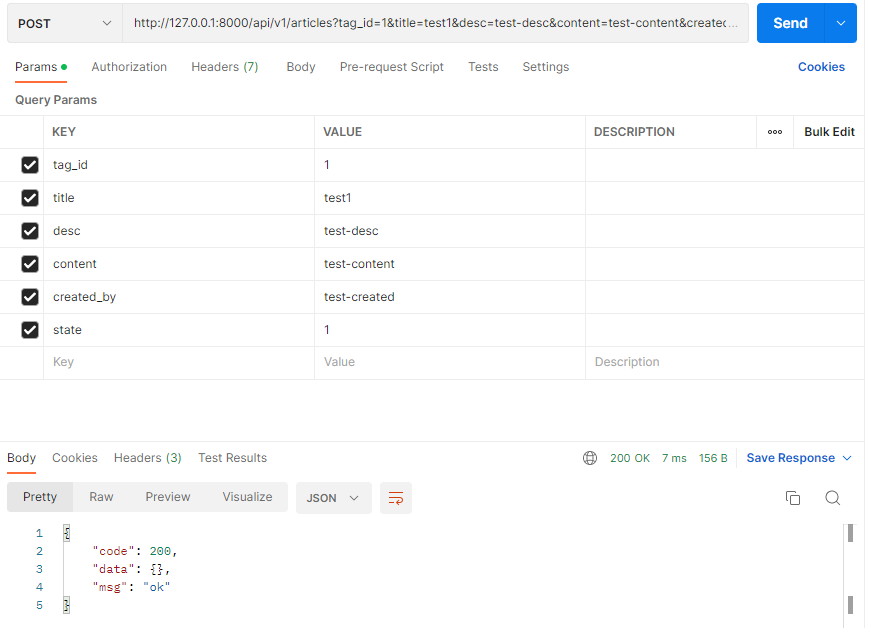
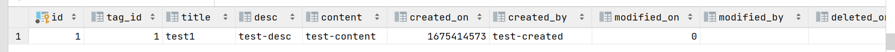
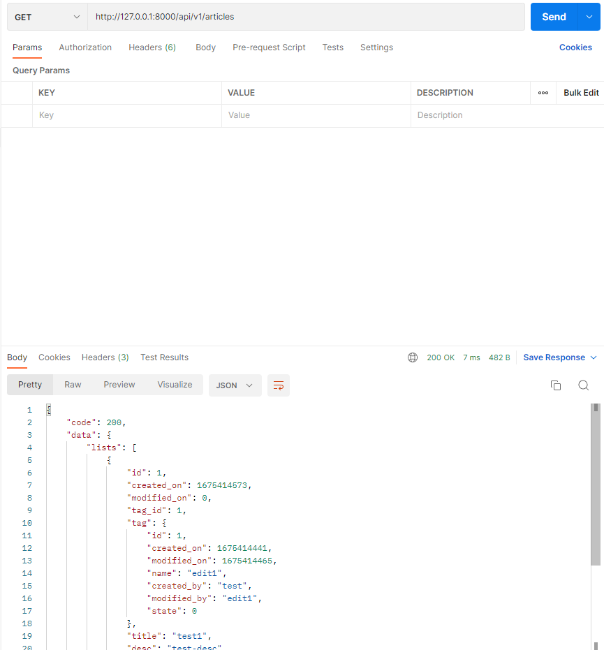
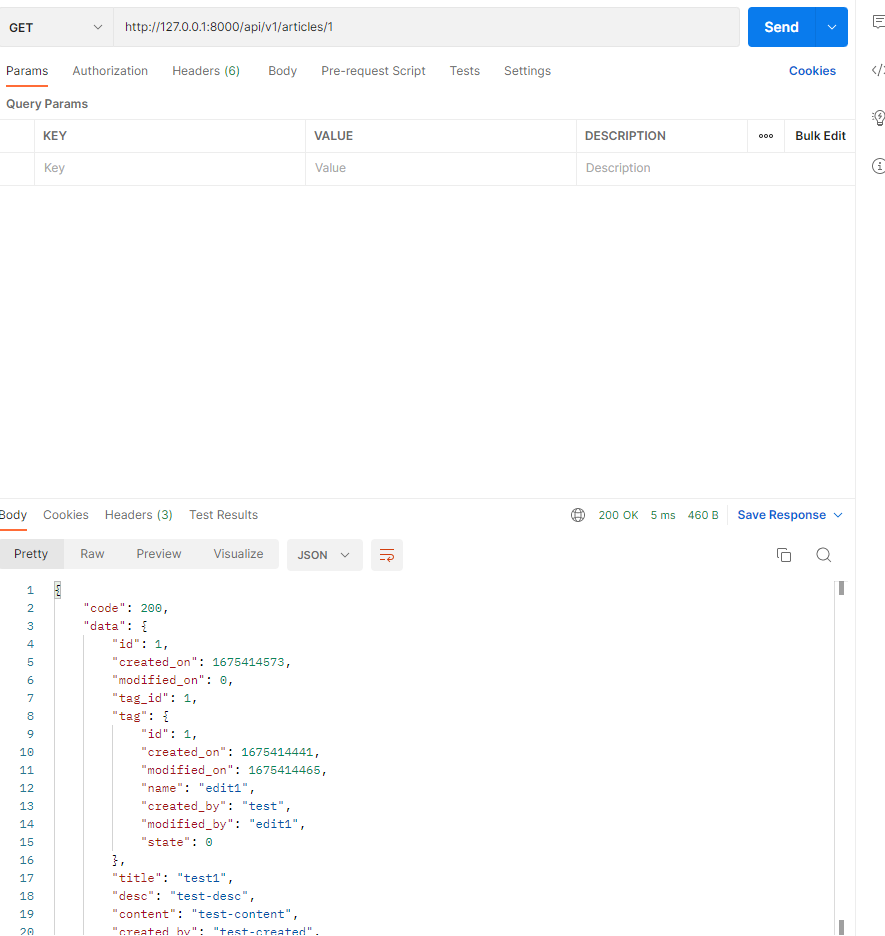
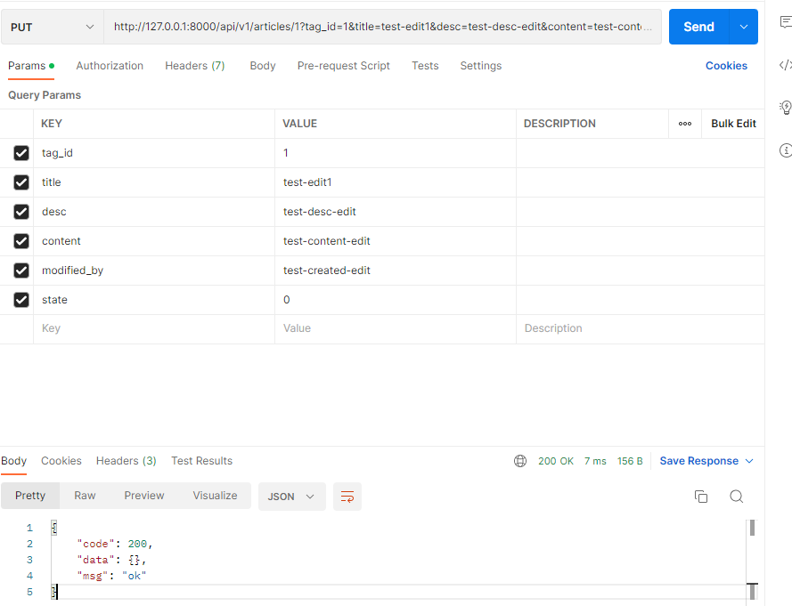
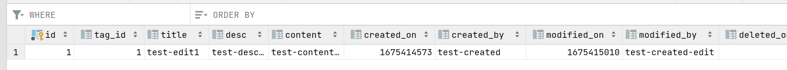
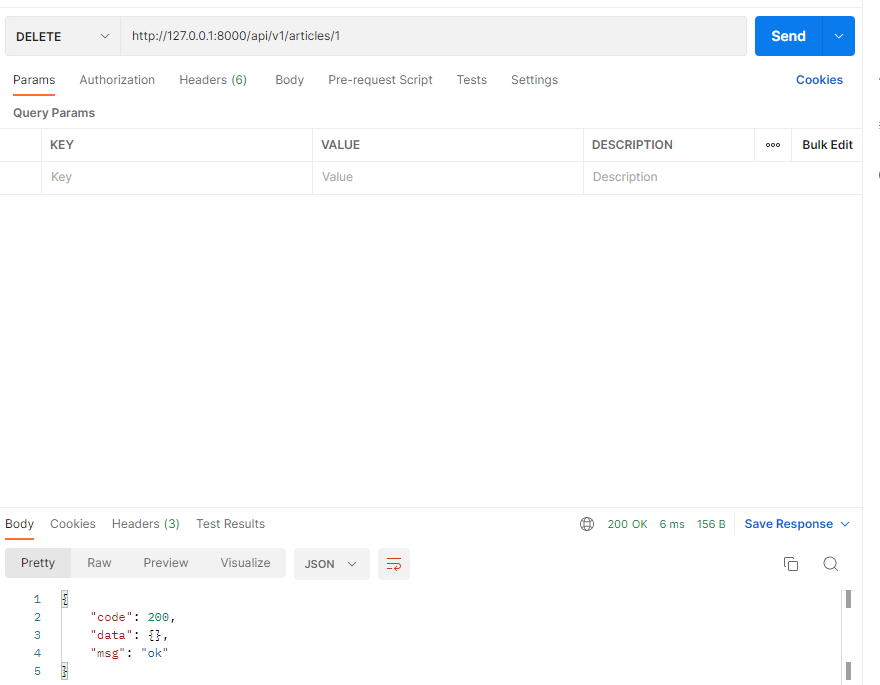
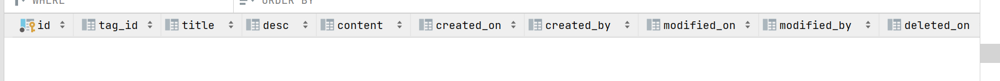

## 一、编写路由逻辑

在`routers`的 v1 版本下，新建`article.go`文件，写入内容：

```go
package v1

import (
    "github.com/gin-gonic/gin"
)

//获取单个文章
func GetArticle(c *gin.Context) {
}

//获取多个文章
func GetArticles(c *gin.Context) {
}

//新增文章
func AddArticle(c *gin.Context) {
}

//修改文章
func EditArticle(c *gin.Context) {
}

//删除文章
func DeleteArticle(c *gin.Context) {
}
```

## 二、注册路由

### 2.1 接口定义

```
获取文章列表：GET(“/articles”)
获取指定文章：POST(“/articles/:id”)
新建文章：POST(“/articles”)
更新指定文章：PUT(“/articles/:id”)
删除指定文章：DELETE(“/articles/:id”)
```

我们打开`routers`下的`router.go`文件，为`/api/v1`组添加新的文章类路由：

```go
package routers

import (
    "github.com/gin-gonic/gin"

    "github.com/EDDYCJY/go-gin-example/routers/api/v1"
    "github.com/EDDYCJY/go-gin-example/pkg/setting"
)

func InitRouter() *gin.Engine {
    ...
    apiv1 := r.Group("/api/v1")
    {
        ...
        //获取文章列表
        apiv1.GET("/articles", v1.GetArticles)
        //获取指定文章
        apiv1.GET("/articles/:id", v1.GetArticle)
        //新建文章
        apiv1.POST("/articles", v1.AddArticle)
        //更新指定文章
        apiv1.PUT("/articles/:id", v1.EditArticle)
        //删除指定文章
        apiv1.DELETE("/articles/:id", v1.DeleteArticle)
    }

    return r
}
```

## 三、`tag_article`数据库的对象模型

创建`models`目录下的`article.go`，写入文件内容：

```go
package models

import (
	"github.com/jinzhu/gorm"
	"time"
)

type Article struct {
	Model

	TagID int `json:"tag_id" gorm:"index"`  //Tag类对象的主键
	Tag   Tag `json:"tag"`					//Tag类对象

	Title      string `json:"title"`
	Desc       string `json:"desc"`
	Content    string `json:"content"`
	CreatedBy  string `json:"created_by"`
	ModifiedBy string `json:"modified_by"`
	State      int    `json:"state"`
}

func (article *Article) BeforeCreate(scope *gorm.Scope) error {
	scope.SetColumn("CreatedOn", time.Now().Unix())

	return nil
}

func (article *Article) BeforeUpdate(scope *gorm.Scope) error {
	scope.SetColumn("ModifiedOn", time.Now().Unix())

	return nil
}
```

我们创建了一个`Article struct {}`，与`Tag`不同的是，`Article`多了几项，如下：

1. `gorm:index`，用于声明这个字段为索引，如果你使用了自动迁移功能则会有所影响，在不使用则无影响
2. `Tag`字段，实际是一个嵌套的`struct`，它利用`TagID`与`Tag`模型相互关联，在执行查询的时候，能够达到`Article`、`Tag`关联查询的功能
3. `time.Now().Unix()` 返回当前的时间戳

## 四、文章类的四种操作接口 -- modules

打开`models`目录下的`article.go`，修改文件内容：

```go
// 查询指定id的文章是否存在于数据库
func ExistArticleByID(id int) bool {
    var article Article
    db.Select("id").Where("id = ?", id).First(&article)

    if article.ID > 0 {
        return true
    }

    return false
}

// 查询maps指定的文章在数据库中的存在数量
func GetArticleTotal(maps interface {}) (count int){
    db.Model(&Article{}).Where(maps).Count(&count)

    return
}

// 从数据库中查询maps指定的文章
func GetArticles(pageNum int, pageSize int, maps interface {}) (articles []Article) {
    db.Preload("Tag").Where(maps).Offset(pageNum).Limit(pageSize).Find(&articles)

    return
}

// 查询指定id的文章
func GetArticle(id int) (article Article) {
    db.Where("id = ?", id).First(&article)
    db.Model(&article).Related(&article.Tag)

    return
}

// 修改指定id的文章
func EditArticle(id int, data interface {}) bool {
    db.Model(&Article{}).Where("id = ?", id).Updates(data)

    return true
}

// 添加新的文章
func AddArticle(data map[string]interface {}) bool {
    db.Create(&Article {
        TagID : data["tag_id"].(int),
        Title : data["title"].(string),
        Desc : data["desc"].(string),
        Content : data["content"].(string),
        CreatedBy : data["created_by"].(string),
        State : data["state"].(int),
    })

    return true
}

// 删除指定id的文章
func DeleteArticle(id int) bool {
    db.Where("id = ?", id).Delete(Article{})

    return true
}
```

### 4.1 `Article`是如何关联到`Tag`

```go
func GetArticle(id int) (article Article) {
    db.Where("id = ?", id).First(&article)
    db.Model(&article).Related(&article.Tag)

    return
}
```

能够达到关联，首先是`gorm`本身做了大量的约定俗成

- `Article`有一个结构体成员是**`TagID`，就是外键**。`gorm`会通过**类名+ID** 的方式去找到这**两个类之间的关联关系**
- `Article`有一个结构体成员是`Tag`，就是我们**嵌套在`Article`里的`Tag`结构体**，我们可以**通过`Related`进行关联查询**

### 4.2 `Preload`是什么东西，为什么查询可以得出每一项的关联`Tag`

```go
func GetArticles(pageNum int, pageSize int, maps interface {}) (articles []Article) {
    db.Preload("Tag").Where(maps).Offset(pageNum).Limit(pageSize).Find(&articles)

    return
}
```

`Preload`就是一个预加载器，它会执行两条 SQL，分别是`SELECT * FROM blog_articles;`和`SELECT * FROM blog_tag WHERE id IN (1,2,3,4);`，那么**在查询出结构后，`gorm`内部处理对应的映射逻辑，将其填充到`Article`的`Tag`中**，**否则查询的结果中将不包含嵌套结构体`Tag`的任何信息。**


## 五、文章类的四种操作接口 --路由

打开`routers`目录下 v1 版本的`article.go`文件，修改文件内容：

```go
package v1

import (
    "net/http"
    "log"

    "github.com/gin-gonic/gin"
    "github.com/astaxie/beego/validation"
    "github.com/unknwon/com"

    "github.com/EDDYCJY/go-gin-example/models"
    "github.com/EDDYCJY/go-gin-example/pkg/e"
    "github.com/EDDYCJY/go-gin-example/pkg/setting"
    "github.com/EDDYCJY/go-gin-example/pkg/util"
)

//从数据库获取单个文章（根据url中的文章id）
func GetArticle(c *gin.Context) {
    id := com.StrTo(c.Param("id")).MustInt()

    valid := validation.Validation{}
    valid.Min(id, 1, "id").Message("ID必须大于0")

    code := e.INVALID_PARAMS
    var data interface {}
    if ! valid.HasErrors() {
        if models.ExistArticleByID(id) {
            data = models.GetArticle(id)
            code = e.SUCCESS
        } else {
            code = e.ERROR_NOT_EXIST_ARTICLE
        }
    } else {
        for _, err := range valid.Errors {
            log.Printf("err.key: %s, err.message: %s", err.Key, err.Message)
        }
    }

    c.JSON(http.StatusOK, gin.H{
        "code" : code,
        "msg" : e.GetMsg(code),
        "data" : data,
    })
}

//获取多个文章（根据url中指定的state和tag_id）
func GetArticles(c *gin.Context) {
    data := make(map[string]interface{})
    maps := make(map[string]interface{})
    valid := validation.Validation{}

    var state int = -1
    if arg := c.Query("state"); arg != "" {
        state = com.StrTo(arg).MustInt()
        maps["state"] = state

        valid.Range(state, 0, 1, "state").Message("状态只允许0或1")
    }

    var tagId int = -1
    if arg := c.Query("tag_id"); arg != "" {
        tagId = com.StrTo(arg).MustInt()
        maps["tag_id"] = tagId

        valid.Min(tagId, 1, "tag_id").Message("标签ID必须大于0")
    }

    code := e.INVALID_PARAMS
    if ! valid.HasErrors() {
        code = e.SUCCESS

        data["lists"] = models.GetArticles(util.GetPage(c), setting.PageSize, maps)
        data["total"] = models.GetArticleTotal(maps)

    } else {
        for _, err := range valid.Errors {
            log.Printf("err.key: %s, err.message: %s", err.Key, err.Message)
        }
    }

    c.JSON(http.StatusOK, gin.H{
        "code" : code,
        "msg" : e.GetMsg(code),
        "data" : data,
    })
}

//新增文章
func AddArticle(c *gin.Context) {
    tagId := com.StrTo(c.Query("tag_id")).MustInt()
    title := c.Query("title")
    desc := c.Query("desc")
    content := c.Query("content")
    createdBy := c.Query("created_by")
    state := com.StrTo(c.DefaultQuery("state", "0")).MustInt()

    valid := validation.Validation{}
    valid.Min(tagId, 1, "tag_id").Message("标签ID必须大于0")
    valid.Required(title, "title").Message("标题不能为空")
    valid.Required(desc, "desc").Message("简述不能为空")
    valid.Required(content, "content").Message("内容不能为空")
    valid.Required(createdBy, "created_by").Message("创建人不能为空")
    valid.Range(state, 0, 1, "state").Message("状态只允许0或1")

    code := e.INVALID_PARAMS
    if ! valid.HasErrors() {
        if models.ExistTagByID(tagId) {   // 必须保证要引用的tag标签是存在的
            data := make(map[string]interface {})
            data["tag_id"] = tagId
            data["title"] = title
            data["desc"] = desc
            data["content"] = content
            data["created_by"] = createdBy
            data["state"] = state

            models.AddArticle(data)
            code = e.SUCCESS
        } else {
            code = e.ERROR_NOT_EXIST_TAG
        }
    } else {
        for _, err := range valid.Errors {
            log.Printf("err.key: %s, err.message: %s", err.Key, err.Message)
        }
    }

    c.JSON(http.StatusOK, gin.H{
        "code" : code,
        "msg" : e.GetMsg(code),
        "data" : make(map[string]interface{}),
    })
}

//修改文章
func EditArticle(c *gin.Context) {
    valid := validation.Validation{}

    id := com.StrTo(c.Param("id")).MustInt()
    tagId := com.StrTo(c.Query("tag_id")).MustInt()
    title := c.Query("title")
    desc := c.Query("desc")
    content := c.Query("content")
    modifiedBy := c.Query("modified_by")

    var state int = -1
    if arg := c.Query("state"); arg != "" {
        state = com.StrTo(arg).MustInt()
        valid.Range(state, 0, 1, "state").Message("状态只允许0或1")
    }

    valid.Min(id, 1, "id").Message("ID必须大于0")
    valid.MaxSize(title, 100, "title").Message("标题最长为100字符")
    valid.MaxSize(desc, 255, "desc").Message("简述最长为255字符")
    valid.MaxSize(content, 65535, "content").Message("内容最长为65535字符")
    valid.Required(modifiedBy, "modified_by").Message("修改人不能为空")
    valid.MaxSize(modifiedBy, 100, "modified_by").Message("修改人最长为100字符")

    code := e.INVALID_PARAMS
    if ! valid.HasErrors() {
        if models.ExistArticleByID(id) {   //保证要修改的文章是存在的
            if models.ExistTagByID(tagId) {		//保证要使用的tag标签是存在的
                data := make(map[string]interface {})
                if tagId > 0 {
                    data["tag_id"] = tagId
                }
                if title != "" {
                    data["title"] = title
                }
                if desc != "" {
                    data["desc"] = desc
                }
                if content != "" {
                    data["content"] = content
                }

                data["modified_by"] = modifiedBy

                models.EditArticle(id, data)
                code = e.SUCCESS
            } else {
                code = e.ERROR_NOT_EXIST_TAG
            }
        } else {
            code = e.ERROR_NOT_EXIST_ARTICLE
        }
    } else {
        for _, err := range valid.Errors {
            log.Printf("err.key: %s, err.message: %s", err.Key, err.Message)
        }
    }

    c.JSON(http.StatusOK, gin.H{
        "code" : code,
        "msg" : e.GetMsg(code),
        "data" : make(map[string]string),
    })
}

//删除文章
func DeleteArticle(c *gin.Context) {
    id := com.StrTo(c.Param("id")).MustInt()

    valid := validation.Validation{}
    valid.Min(id, 1, "id").Message("ID必须大于0")

    code := e.INVALID_PARAMS
    if ! valid.HasErrors() {
        if models.ExistArticleByID(id) {   //保证要删除的文章是存在的
            models.DeleteArticle(id)
            code = e.SUCCESS
        } else {
            code = e.ERROR_NOT_EXIST_ARTICLE
        }
    } else {
        for _, err := range valid.Errors {
            log.Printf("err.key: %s, err.message: %s", err.Key, err.Message)
        }
    }

    c.JSON(http.StatusOK, gin.H{
        "code" : code,
        "msg" : e.GetMsg(code),
        "data" : make(map[string]string),
    })
}
```

## 六、验证功能

使用`Postman`检验接口是否正常，在这里大家可以选用合适的参数传递方式，此处为了方便展示我选用了 GET/Param 传参的方式，而后期会改为 POST。

### 6.1 插入新文章

POST：(**必须保证指定的`tag`标签存在**)

```
http://127.0.0.1:8000/api/v1/articles?tag_id=1&title=test1&desc=test-desc&content=test-content&created_by=test-created&state=1
```



数据库结果：



### 6.2 获取文章列表

GET:  (**不指定就是返回全部已有文章**)

```
http://127.0.0.1:8000/api/v1/articles
```




### 6.3 获取单文章

GET:   (**可变参数params，这里是1**)

```
http://127.0.0.1:8000/api/v1/articles/1
```



### 6.4 修改文章

PUT:

```
http://127.0.0.1:8000/api/v1/articles/1?tag_id=1&title=test-edit1&desc=test-desc-edit&content=test-content-edit&modified_by=test-created-edit&state=0
```





### 6.5 删除文章

DELETE：

```
http://127.0.0.1:8000/api/v1/articles/1
```



