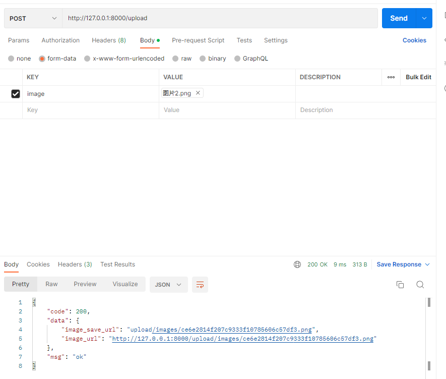
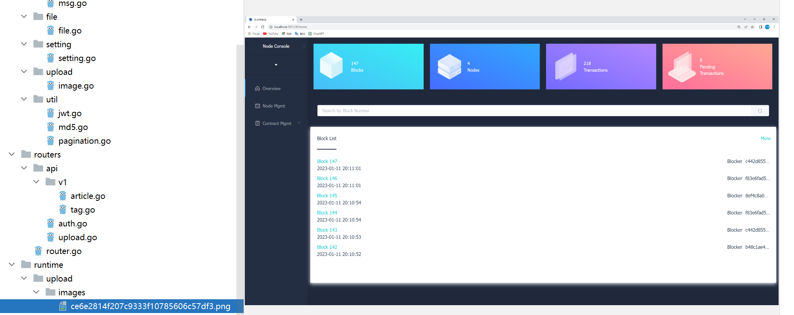
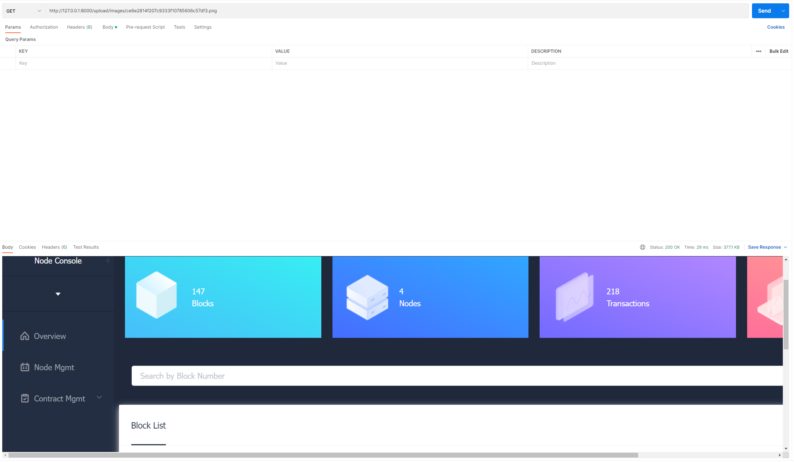

## 一、优化配置结构

### 1.1 讲解

在先前章节中，采用了直接读取 KEY 的方式去存储配置项，而本次需求中，需要增加图片的配置项，总体就有些冗余了

我们采用以下解决方法：

- 映射结构体：使用 MapTo 来设置配置参数
- 配置统管：所有的配置项统管到 setting 中

#### 1.1.1 映射结构体（示例）

在 go-ini 中可以采用 MapTo 的方式来映射结构体，例如：

```go
type Server struct {
    RunMode string
    HttpPort int
    ReadTimeout time.Duration
    WriteTimeout time.Duration
}

var ServerSetting = &Server{}

func main() {
    Cfg, err := ini.Load("conf/app.ini")
    if err != nil {
        log.Fatalf("Fail to parse 'conf/app.ini': %v", err)
    }

    err = Cfg.Section("server").MapTo(ServerSetting)
    if err != nil {
        log.Fatalf("Cfg.MapTo ServerSetting err: %v", err)
    }
}
```

我们可以查看MapTo的源码实现：

```go
// MapTo maps section to given struct.
func (s *Section) MapTo(v interface{}) error {
    typ := reflect.TypeOf(v)
    val := reflect.ValueOf(v)
    if typ.Kind() == reflect.Ptr {
        typ = typ.Elem()
        val = val.Elem()
    } else {
        return errors.New("cannot map to non-pointer struct")
    }

    return s.mapTo(val, false)
}
```

在 MapTo 中 `typ.Kind() == reflect.Ptr` 约束了必须使用指针，否则会返回 `cannot map to non-pointer struct` 的错误。这个是表面原因

更往内探究，可以认为是 `field.Set` 的原因，当执行 `val := reflect.ValueOf(v)` ，函数通过传递 `v` 拷贝创建了 `val`，但是 `val` 的改变并不能更改原始的 `v`，要想 `val` 的更改能作用到 `v`，则必须传递 `v` 的地址

### 1.2 落实

#### 1.2.1 修改配置文件

打开 conf/app.ini 将配置文件修改为大驼峰命名，另外我们增加了 5 个配置项用于上传图片的功能，4 个文件日志方面的配置项

```ini
[app]
PageSize = 10
JwtSecret = 233

RuntimeRootPath = runtime/

ImagePrefixUrl = http://127.0.0.1:8000
ImageSavePath = upload/images/
# MB
ImageMaxSize = 5
ImageAllowExts = .jpg,.jpeg,.png

LogSavePath = logs/
LogSaveName = log
LogFileExt = log
TimeFormat = 20060102

[server]
#debug or release
RunMode = debug
HttpPort = 8000
ReadTimeout = 60
WriteTimeout = 60

[database]
Type = mysql
User = root
Password = rootroot
Host = 127.0.0.1:3306
Name = blog
TablePrefix = blog_
```

#### 1.2.2 优化配置读取及设置初始化顺序

##### 第一步

打开 pkg/setting/setting.go 文件，修改如下：

```go
package setting

import (
    "log"
    "time"

    "github.com/go-ini/ini"
)

type App struct {
    JwtSecret string
    PageSize int
    RuntimeRootPath string

    ImagePrefixUrl string
    ImageSavePath string
    ImageMaxSize int
    ImageAllowExts []string

    LogSavePath string
    LogSaveName string
    LogFileExt string
    TimeFormat string
}

var AppSetting = &App{}   // 大写，作为全局配置对象

type Server struct {
    RunMode string
    HttpPort int
    ReadTimeout time.Duration
    WriteTimeout time.Duration
}

var ServerSetting = &Server{}	// 大写，作为全局配置对象

type Database struct {
    Type string
    User string
    Password string
    Host string
    Name string
    TablePrefix string
}

var DatabaseSetting = &Database{}	// 大写，作为全局配置对象

func Setup() {
    Cfg, err := ini.Load("conf/app.ini")
    if err != nil {
        log.Fatalf("Fail to parse 'conf/app.ini': %v", err)
    }

    err = Cfg.Section("app").MapTo(AppSetting)
    if err != nil {
        log.Fatalf("Cfg.MapTo AppSetting err: %v", err)
    }

    AppSetting.ImageMaxSize = AppSetting.ImageMaxSize * 1024 * 1024  // 特殊项再赋值

    err = Cfg.Section("server").MapTo(ServerSetting)
    if err != nil {
        log.Fatalf("Cfg.MapTo ServerSetting err: %v", err)
    }

    ServerSetting.ReadTimeout = ServerSetting.ReadTimeout * time.Second  // 特殊项再赋值
    ServerSetting.WriteTimeout = ServerSetting.WriteTimeout * time.Second  // 特殊项再赋值

    err = Cfg.Section("database").MapTo(DatabaseSetting)
    if err != nil {
        log.Fatalf("Cfg.MapTo DatabaseSetting err: %v", err)
    }
}
```

在这里，我们做了如下几件事：

- 编写与配置项保持一致的结构体（App、Server、Database）
- 使用 MapTo 将配置项映射到结构体上
- 对一些需特殊设置的配置项进行再赋值

**其他需要去做的事：**

- 将 [models.go](https://github.com/EDDYCJY/go-gin-example/blob/a338ddec103c9506b4c7ed16d9f5386040d99b4b/models/models.go#L23)、[setting.go](https://github.com/EDDYCJY/go-gin-example/blob/a338ddec103c9506b4c7ed16d9f5386040d99b4b/pkg/setting/setting.go#L23)、[pkg/logging/log.go](https://github.com/EDDYCJY/go-gin-example/blob/a338ddec103c9506b4c7ed16d9f5386040d99b4b/pkg/logging/log.go#L32-L37) 的 init 函数修改为 Setup 方法
- 将 [models/models.go](https://github.com/EDDYCJY/go-gin-example/blob/a338ddec103c9506b4c7ed16d9f5386040d99b4b/models/models.go#L23-L39) 独立读取的 DB 配置项删除，改为统一读取 setting.DatabaseSetting
- 将 [pkg/logging/file](https://github.com/EDDYCJY/go-gin-example/blob/a338ddec103c9506b4c7ed16d9f5386040d99b4b/pkg/logging/file.go#L10-L15) 独立的 LOG 配置项删除，改为统一读取 setting.AppSetting

##### 第二步

在这一步我们要设置初始化的流程，打开 main.go 文件，修改内容：

```go
func main() {

	setting.Setup() //读取app.ini
	models.Setup()  //读取app.ini

	// 获取http server配置信息 -- endless包提供热启动 --- endless包要求linux环境
	endless.DefaultReadTimeOut = setting.ServerSetting.ReadTimeout
	endless.DefaultWriteTimeOut = setting.ServerSetting.WriteTimeout
	endless.DefaultMaxHeaderBytes = 1 << 20
	endPoint := fmt.Sprintf(":%d", setting.ServerSetting.HttpPort)

	//  创建gin路由服务器
	server := endless.NewServer(endPoint, routers.InitRouter())
	server.BeforeBegin = func(add string) {
		log.Printf("Actual pid is %d", syscall.Getpid())
	}

	err := server.ListenAndServe()
	if err != nil {
		log.Printf("Server err: %v", err)
	}
}
```

如果不使用`endless`包，`main.go`可以按下面进行修改：

```go
package main

import (
	"fmt"
	"github.com/EDDYCJY/go-gin-example/models"
	"github.com/EDDYCJY/go-gin-example/pkg/setting"
	"github.com/EDDYCJY/go-gin-example/routers"
	"net/http"
)

func main() {

	setting.Setup()
	models.Setup()

	router := routers.InitRouter() //返回一个gin路由器

	s := &http.Server{
		Addr:           fmt.Sprintf(":%d", setting.ServerSetting.HttpPort),
		Handler:        router,
		ReadTimeout:    setting.ServerSetting.ReadTimeout,
		WriteTimeout:   setting.ServerSetting.WriteTimeout,
		MaxHeaderBytes: 1 << 20,
	}

	s.ListenAndServe()
}
```


##### 验证

在这里为止，针对本需求的配置优化就完毕了，你需要执行 `go run main.go` 验证一下你的功能是否正常，如果出错，往往是有的地方配置对象存在问题，需要进行修改。


## 二、上传图片文件

### 2.1 封装文件操作API

在 pkg 目录下新建 file/file.go ，写入文件内容如下：

```go
package file

import (
    "os"
    "path"
    "mime/multipart"
    "io/ioutil"
)

func GetSize(f multipart.File) (int, error) {
    content, err := ioutil.ReadAll(f)

    return len(content), err
}

func GetExt(fileName string) string {
    return path.Ext(fileName)
}

func CheckNotExist(src string) bool {
    _, err := os.Stat(src)

    return os.IsNotExist(err)
}

func CheckPermission(src string) bool {
    _, err := os.Stat(src)

    return os.IsPermission(err)
}

func IsNotExistMkDir(src string) error {
    if notExist := CheckNotExist(src); notExist == true {
        if err := MkDir(src); err != nil {
            return err
        }
    }

    return nil
}

func MkDir(src string) error {
    err := os.MkdirAll(src, os.ModePerm)
    if err != nil {
        return err
    }

    return nil
}

func Open(name string, flag int, perm os.FileMode) (*os.File, error) {
    f, err := os.OpenFile(name, flag, perm)
    if err != nil {
        return nil, err
    }

    return f, nil
}
```

在这里我们一共封装了 7 个 方法

- GetSize：获取文件大小
- GetExt：获取文件后缀
- CheckNotExist：检查文件是否存在
- CheckPermission：检查文件权限
- IsNotExistMkDir：如果不存在则新建文件夹
- MkDir：新建文件夹
- Open：打开文件

### 2.2 实现上传图片接口

#### 2.2.1 MD5加密图片名

一般不会直接将上传的图片名暴露出来，因此我们对图片名进行 MD5 来达到这个效果

在 util 目录下新建 md5.go，写入文件内容：

```go
package util

import (
    "crypto/md5"
    "encoding/hex"
)

func EncodeMD5(value string) string {
    m := md5.New()
    m.Write([]byte(value))

    return hex.EncodeToString(m.Sum(nil))
}
```

#### 2.2.2 图片文件操作API

在先前我们已经把底层方法给封装好了，实质这一步为封装 image 的处理逻辑

在 pkg 目录下新建 upload/image.go 文件，写入文件内容：

```go
package upload

import (
	"fmt"
	"github.com/EDDYCJY/go-gin-example/pkg/file"
	"github.com/EDDYCJY/go-gin-example/pkg/setting"
	"github.com/EDDYCJY/go-gin-example/pkg/util"
	"log"
	"mime/multipart"
	"os"
	"path"
	"strings"
)

func GetImageFullUrl(name string) string {
	return setting.AppSetting.ImagePrefixUrl + "/" + GetImagePath() + name
}

func GetImageName(name string) string {
	ext := path.Ext(name)
	fileName := strings.TrimSuffix(name, ext)
	fileName = util.EncodeMD5(fileName)

	return fileName + ext
}

func GetImagePath() string {
	return setting.AppSetting.ImageSavePath
}

func GetImageFullPath() string {
	return setting.AppSetting.RuntimeRootPath + GetImagePath()
}

func CheckImageExt(fileName string) bool { // 检查图片文件的后缀是否符合要求
	ext := file.GetExt(fileName)
	for _, allowExt := range setting.AppSetting.ImageAllowExts {
		if strings.ToUpper(allowExt) == strings.ToUpper(ext) {
			return true
		}
	}

	return false
}

func CheckImageSize(f multipart.File) bool { // 检查图片文件的大小是否符合要求
	size, err := file.GetSize(f)
	if err != nil {
		log.Println(err)
		return false
	}

	return size <= setting.AppSetting.ImageMaxSize
}

func CheckImage(src string) error { // 检查图片文件
	dir, err := os.Getwd() //获取当前文件夹的根目录
	if err != nil {
		return fmt.Errorf("os.Getwd err: %v", err)
	}

	err = file.IsNotExistMkDir(dir + "/" + src) // 问图片文件创建目录
	if err != nil {
		return fmt.Errorf("file.IsNotExistMkDir err: %v", err)
	}

	perm := file.CheckPermission(src) //检查用户对指定文件路径是否有权限
	if perm == true {
		return fmt.Errorf("file.CheckPermission Permission denied src: %s", src)
	}

	return nil
}
```

在这里我们实现了 7 个方法，如下：

- GetImageFullUrl：获取图片完整访问 URL
- GetImageName：获取图片名称
- GetImagePath：获取图片路径
- GetImageFullPath：获取图片完整路径
- CheckImageExt：检查图片后缀
- CheckImageSize：检查图片大小
- CheckImage：检查图片

这里基本是对底层代码的二次封装，为了更灵活的处理一些图片特有的逻辑，并且方便修改，不直接对外暴露下层

#### 2.2.3 上传图片文件的API

这一步将编写上传图片的业务逻辑，在 routers/api 目录下 新建 upload.go 文件，写入文件内容:

```go
package api

import (
	"github.com/EDDYCJY/go-gin-example/pkg/e"
	"github.com/EDDYCJY/go-gin-example/pkg/upload"
	"github.com/gin-gonic/gin"
	"net/http"
)

func UploadImage(c *gin.Context) {
	code := e.SUCCESS
	data := make(map[string]string)

	file, image, err := c.Request.FormFile("image") // 获取用户上传的图片文件
	if err != nil {
		code = e.ERROR
		c.JSON(http.StatusOK, gin.H{
			"code": code,
			"msg":  e.GetMsg(code),
			"data": data,
		})
	}

	if image == nil {
		code = e.INVALID_PARAMS
	} else {
		imageName := upload.GetImageName(image.Filename) // MD5加密后的图片名
		fullPath := upload.GetImageFullPath()
		savePath := upload.GetImagePath()

		src := fullPath + imageName
		if !upload.CheckImageExt(imageName) || !upload.CheckImageSize(file) { // 检查图片文件后缀和大小
			code = e.ERROR_UPLOAD_CHECK_IMAGE_FORMAT
		} else {
			err := upload.CheckImage(fullPath) // 为图片文件创建目录并检查用户权限
			if err != nil {
				code = e.ERROR_UPLOAD_CHECK_IMAGE_FAIL
			} else if err := c.SaveUploadedFile(image, src); err != nil { // 将获取的图片文件保存到指定目录
				code = e.ERROR_UPLOAD_SAVE_IMAGE_FAIL
			} else {
				data["image_url"] = upload.GetImageFullUrl(imageName)
				data["image_save_url"] = savePath + imageName
			}
		}
	}

	c.JSON(http.StatusOK, gin.H{
		"code": code,
		"msg":  e.GetMsg(code),
		"data": data,
	})
}
```

所涉及的错误码（需在 pkg/e/code.go、msg.go 添加）：

`pkg/e/code.go`

```go
ERROR_UPLOAD_SAVE_IMAGE_FAIL = 30001
ERROR_UPLOAD_CHECK_IMAGE_FAIL = 30002
ERROR_UPLOAD_CHECK_IMAGE_FORMAT = 30003
```

`msg.go `

```go
ERROR_UPLOAD_SAVE_IMAGE_FAIL:    "保存图片失败",
ERROR_UPLOAD_CHECK_IMAGE_FAIL:   "检查图片失败",
ERROR_UPLOAD_CHECK_IMAGE_FORMAT: "校验图片错误，图片格式或大小有问题",
```

在这一大段的业务逻辑中，我们做了如下事情：

- c.Request.FormFile：获取上传的图片（返回提供的表单键的第一个文件）
- CheckImageExt、CheckImageSize 检查图片大小，检查图片后缀
- CheckImage：检查上传图片所需（权限、文件夹）
- SaveUploadedFile：保存图片

#### 2.2.4 添加路由

打开 routers/router.go 文件，增加路由 `r.POST("/upload", api.UploadImage)` ，如：

```go
func InitRouter() *gin.Engine {
    r := gin.New()
    ...
    r.GET("/auth", api.GetAuth)
    r.GET("/swagger/*any", ginSwagger.WrapHandler(swaggerFiles.Handler))
    r.POST("/upload", api.UploadImage)   // New

    apiv1 := r.Group("/api/v1")
    apiv1.Use(jwt.JWT())
    {
        ...
    }

    return r
}
```

#### 2.2.5 验证

最后我们请求一下上传图片的接口，测试所编写的功能



在这里我们一共返回了 2 个参数，一个是完整的访问 URL，另一个为保存路径



### 2.3 实现 http.FileServer

在完成了上一小节后，我们还需要让前端能够访问到图片，一般是如下：

- CDN
- http.FileSystem

在公司的话，CDN 或自建分布式文件系统居多，也不需要过多关注。而在实践里的话肯定是本地搭建了，Go 本身对此就有很好的支持，而 Gin 更是再封装了一层，只需要在路由增加一行代码即可

#### 2.3.1 r.StaticFS

打开 routers/router.go 文件，增加路由 `r.StaticFS("/upload/images", http.Dir(upload.GetImageFullPath()))`，如：

```go
func InitRouter() *gin.Engine {
    ...
    r.StaticFS("/upload/images", http.Dir(upload.GetImageFullPath()))  // New   对应GET请求

    r.GET("/auth", api.GetAuth)
    r.GET("/swagger/*any", ginSwagger.WrapHandler(swaggerFiles.Handler))
    r.POST("/upload", api.UploadImage)
    ...
}
```

#### 2.3.2 它做了什么

**当GET请求访问 url : $HOST/upload/images 时，将会读取到 服务器 文件系统的$GOPATH/src/github.com/EDDYCJY/go-gin-example/runtime/upload/images 下的文件**

而这行代码又做了什么事呢，我们来看看方法原型

```go
// StaticFS works just like `Static()` but a custom `http.FileSystem` can be used instead.
// Gin by default user: gin.Dir()
func (group *RouterGroup) StaticFS(relativePath string, fs http.FileSystem) IRoutes {
    if strings.Contains(relativePath, ":") || strings.Contains(relativePath, "*") {
        panic("URL parameters can not be used when serving a static folder")
    }
    handler := group.createStaticHandler(relativePath, fs)
    urlPattern := path.Join(relativePath, "/*filepath")  //从这里可以获知，用户需要在relativePath后指定文件名

    // Register GET and HEAD handlers
    group.GET(urlPattern, handler)    //从这里可以获知，用户需要通过GET请求来获取服务器提供的文件
    group.HEAD(urlPattern, handler)
    return group.returnObj()
}
```

首先在暴露的 URL 中禁止了 * 和 : 符号的使用，通过 `createStaticHandler` 创建了静态文件服务，实质最终调用的还是 `fileServer.ServeHTTP` 和一些处理逻辑了

```go
func (group *RouterGroup) createStaticHandler(relativePath string, fs http.FileSystem) HandlerFunc {
    absolutePath := group.calculateAbsolutePath(relativePath)
    fileServer := http.StripPrefix(absolutePath, http.FileServer(fs))
    _, nolisting := fs.(*onlyfilesFS)
    return func(c *Context) {
        if nolisting {
            c.Writer.WriteHeader(404)
        }
        fileServer.ServeHTTP(c.Writer, c.Request)
    }
}
```

#### 2.3.3 http.StripPrefix

我们可以留意下 `fileServer := http.StripPrefix(absolutePath, http.FileServer(fs))` 这段语句，在静态文件服务中很常见，它有什么作用呢？

```
http.StripPrefix` 主要作用是从请求 URL 的路径中删除给定的前缀，最终返回一个 `Handler
```

通常 http.FileServer 要与 http.StripPrefix 相结合使用，否则当你运行：

```go
http.Handle("/upload/images", http.FileServer(http.Dir("upload/images")))
```

会无法正确的访问到文件目录，因为 `/upload/images` 也包含在了 URL 路径中，必须使用：

```go
http.Handle("/upload/images", http.StripPrefix("upload/images", http.FileServer(http.Dir("upload/images"))))
```

#### 2.3.4 /*filepath

到下面可以看到 `urlPattern := path.Join(relativePath, "/*filepath")`，`/*filepath` 你是谁，你在这里有什么用，你是 Gin 的产物吗?

通过语义可得知是路由的处理逻辑，而 **Gin 的路由是基于 httprouter 的**，通过查阅文档可得到以下信息

```
Pattern: /src/*filepath

 /src/                     match
 /src/somefile.go          match
 /src/subdir/somefile.go   match
```

**`*filepath` 将匹配所有文件路径**，并且 `*filepath` 必须在 Pattern 的最后

### 2.4 验证

重新执行 `go run main.go` ，去访问刚刚在 upload 接口得到的图片地址，检查 http.FileSystem 是否正常

