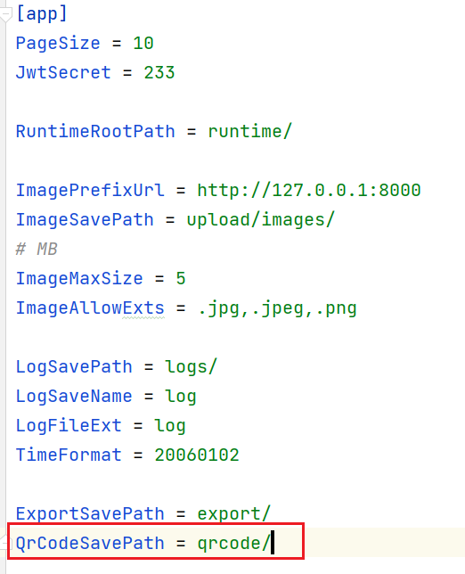
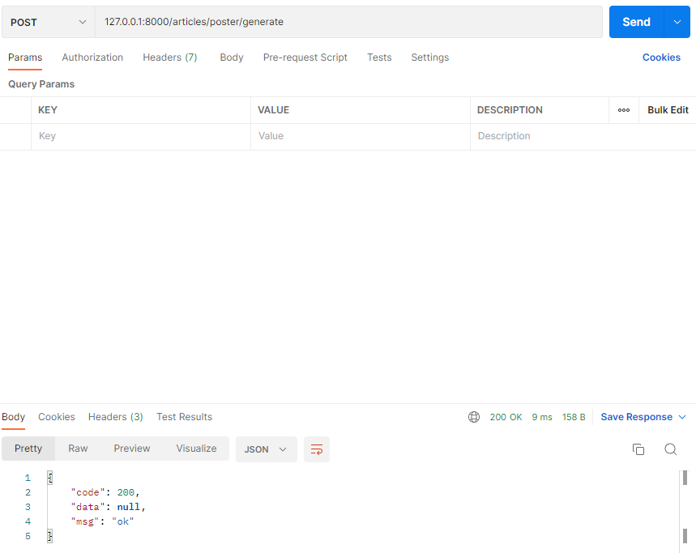
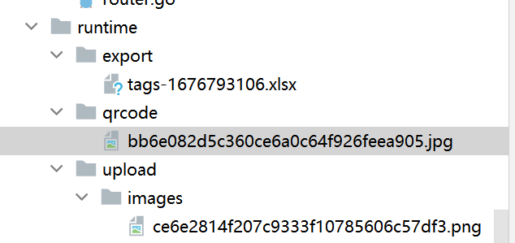
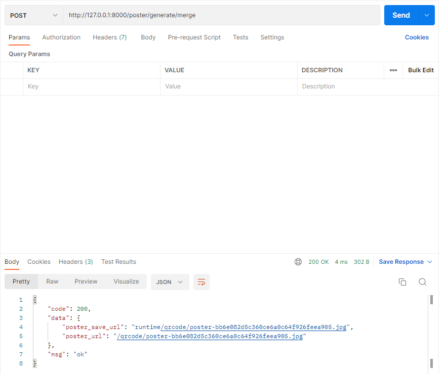
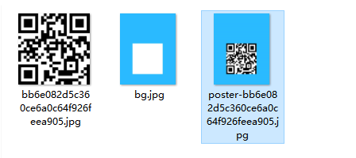
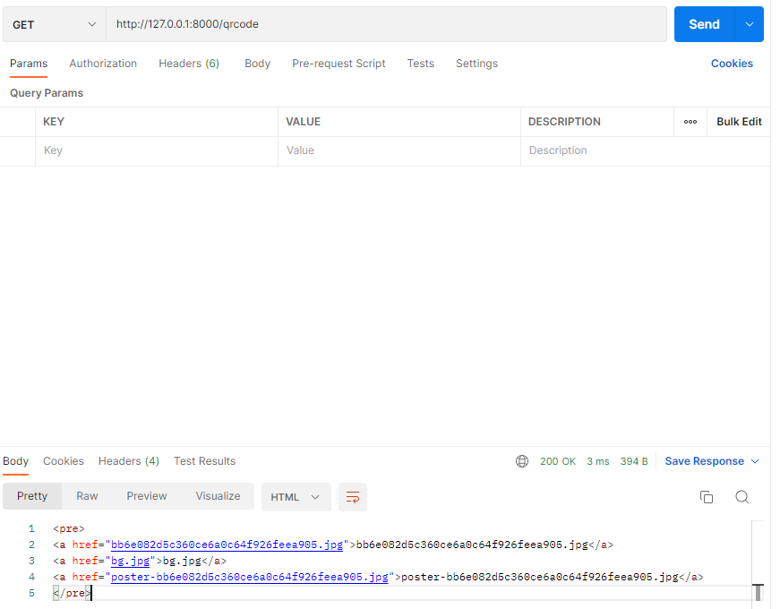

## 一、生成二维码

### 1.1 配置文件

首先，你需要在 App 配置项中增加二维码及其海报的存储路径，我们约定配置项名称为 `QrCodeSavePath`，值为 `qrcode/`




### 1.2 生成二维码

1. 安装包

```
go get -u github.com/boombuler/barcode
```

2. 工具包

考虑生成二维码这一动作贴合工具包的定义，且有公用的可能性，新建 `pkg/qrcode/qrcode.go` 文件，写入内容：

```go
func (q *QrCode) Encode(path string) (string, string, error) {
	name := GetQrCodeFileName(q.URL) + q.GetQrCodeExt() // 保存在本地的二维码文件名
	src := path + name
	if file.CheckNotExist(src) == true { // 如果文件不存在，则创建二维码文件
		code, err := qr.Encode(q.URL, q.Level, q.Mode) // 根据给定的文本内容，错误等级，编码方式给出条形码
		if err != nil {
			return "", "", err
		}

		code, err = barcode.Scale(code, q.Width, q.Height) // 返回给定宽度和高度的二维码
		if err != nil {
			return "", "", err
		}

		f, err := file.MustOpen(name, path) // 打开文件，若不存在则创建文件路径
		if err != nil {
			return "", "", err
		}
		defer f.Close()

		err = jpeg.Encode(f, code, nil) // 在指定目录下生成指定文件名的条形码图片
		if err != nil {
			return "", "", err
		}
	}

	return name, path, nil
}
```

这里主要聚焦 `func (q *QrCode) Encode` 方法，做了如下事情：

- 获取二维码生成路径
- 创建二维码
- 缩放二维码到指定大小
- 新建存放二维码图片的文件
- 将图像（二维码）以 JPEG 4：2：0 基线格式写入文件

另外在 `jpeg.Encode(f, code, nil)` 中，第三个参数可设置其**图像质量**，**默认值为 75**

```go
// DefaultQuality is the default quality encoding parameter.
const DefaultQuality = 75

// Options are the encoding parameters.
// Quality ranges from 1 to 100 inclusive, higher is better.
type Options struct {
    Quality int
}
```

### 1.3 路由方法

1. 第一步

​	在 `routers/api/v1/article.go` 新增 `GenerateArticlePoster` 方法用于接口开发

2. 第二步

​	在 `routers/router.go` 中新增 `r.POST("/poster/generate", v1.GenerateArticlePoster)` 路由

3. 第三步

​	修改 `GenerateArticlePoster` 方法，编写对应的生成逻辑，如下：

```go
const (
    QRCODE_URL = "https://baidu.com"
)

func GenerateArticlePoster(c *gin.Context) {
	appG := app.Gin{c}
	qrc := qrcode.NewQrCode(QRCODE_URL, 300, 300, qr.M, qr.Auto) // 返回二维码对象
	path := qrcode.GetQrCodeFullPath()
	_, _, err := qrc.Encode(path) // 产生QR二维码，存储到指定路径
	if err != nil {
		appG.Response(http.StatusOK, e.ERROR, nil)
		return
	}

	appG.Response(http.StatusOK, e.SUCCESS, nil)
}
```

### 1.4 结果验证



生成二维码：




## 二、生成海报

### 2.1 本节目标

在这一节，将**实现二维码图片与背景图合并成新的一张图**，可用于常见的宣传海报等业务场景

**背景图**


将背景图另存为 `runtime/qrcode/bg.jpg`（实际应用，可存在 `OSS` 或其他地方）

### 2.2 services方法

打开 service/article_service 目录，新建 article_poster.go 文件，写入内容：

```go
type ArticlePoster struct {
	PosterName string
	*Article
	Qr *qrcode.QrCode
}

func NewArticlePoster(posterName string, article *Article, qr *qrcode.QrCode) *ArticlePoster {
	return &ArticlePoster{
		PosterName: posterName,
		Article:    article,
		Qr:         qr,
	}
}

func GetPosterFlag() string {
	return "poster"
}

// 如果图片文件不存在返回false，存在则返回true
func (a *ArticlePoster) CheckMergedImageFile(path string) bool {
	if file.CheckNotExist(path+a.PosterName) == true {
		return false
	}
	return true
}

// 打开图片文件
func (a *ArticlePoster) OpenMergedImage(path string) (*os.File, error) {
	f, err := file.MustOpen(a.PosterName, path)
	if err != nil {
		return nil, err
	}
	return f, nil
}

type ArticlePosterBg struct {
	Name string
	*ArticlePoster
	*Rect
	*Pt
}

type Rect struct {
	Name string
	X0   int
	Y0   int
	X1   int
	Y1   int
}

type Pt struct {
	X int
	Y int
}

func NewArticlePosterBg(name string, ap *ArticlePoster, rect *Rect, pt *Pt) *ArticlePosterBg {
	return &ArticlePosterBg{
		Name:          name,
		ArticlePoster: ap,
		Rect:          rect,
		Pt:            pt,
	}
}

func (a *ArticlePosterBg) Generate() (string, string, error) {
	fullPath := qrcode.GetQrCodeFullPath()
	fileName, path, err := a.Qr.Encode(fullPath) // 在指定路径生成二维码图片。如果存在则直接返回文件名和路径
	if err != nil {
		return "", "", err
	}

	if !a.CheckMergedImageFile(path) { // 被合并后的图片文件不存在
		mergedF, err := a.OpenMergedImage(path) // 创建合并图片文件
		if err != nil {
			return "", "", err
		}
		defer mergedF.Close()

		bgF, err := file.MustOpen(a.Name, path) // 打开背景图片文件
		if err != nil {
			return "", "", err
		}
		defer bgF.Close()

		qrF, err := file.MustOpen(fileName, path) // 打开二维码图片文件
		if err != nil {
			return "", "", err
		}
		defer qrF.Close()

		bgImage, err := jpeg.Decode(bgF) // 读取背景图jpeg文件生成image结构体
		if err != nil {
			return "", "", err
		}
		qrImage, err := jpeg.Decode(qrF) // 读取二维码jpeg文件生成image结构体
		if err != nil {
			return "", "", err
		}

		jpg := image.NewRGBA(image.Rect(a.Rect.X0, a.Rect.Y0, a.Rect.X1, a.Rect.Y1)) // 返回具有给定边界的新RGBA图像

		draw.Draw(jpg, jpg.Bounds(), bgImage, bgImage.Bounds().Min, draw.Over)   // 添加背景图
		draw.Draw(jpg, jpg.Bounds(), qrImage, qrImage.Bounds().Min.Sub(image.Pt(a.Pt.X, a.Pt.Y)), draw.Over)// 添加二维码

		jpeg.Encode(mergedF, jpg, nil) // 重新生成JPEG图片(合并后的)
	}

	return fileName, path, nil
}
```

这里重点留意 `func (a *ArticlePosterBg) Generate()` 方法，做了如下事情：

- 获取二维码存储路径
- 生成二维码图像
- 检查合并后图像（指的是存放合并后的海报）是否存在
- 若不存在，则生成待合并的图像 mergedF
- 打开事先存放的背景图 bgF
- 打开生成的二维码图像 qrF
- 解码 bgF 和 qrF 返回 image.Image
- 创建一个新的 RGBA 图像
- 在 RGBA 图像上绘制 背景图（bgF）
- 在已绘制背景图的 RGBA 图像上，在指定 Point 上绘制二维码图像（qrF）
- 将绘制好的 RGBA 图像以 JPEG 4：2：0 基线格式写入合并后的图像文件（mergedF）

### 2.3 路由方法

打开 `routers/api/v1/article.go` 文件，修改 `GenerateArticlePoster` 方法，编写最终的业务逻辑（含生成二维码及合并海报），如下：

```go
func GenerateArticlePoster(c *gin.Context) {
    appG := app.Gin{c}
    article := &article_service.Article{}
    qr := qrcode.NewQrCode(QRCODE_URL, 300, 300, qr.M, qr.Auto) // 目前写死 gin 系列路径，可自行增加业务逻辑
    posterName := article_service.GetPosterFlag() + "-" + qrcode.GetQrCodeFileName(qr.URL) + qr.GetQrCodeExt()
    articlePoster := article_service.NewArticlePoster(posterName, article, qr)
    articlePosterBgService := article_service.NewArticlePosterBg(
        "bg.jpg",
        articlePoster,
        &article_service.Rect{
            X0: 0,
            Y0: 0,
            X1: 550,
            Y1: 700,
        },
        &article_service.Pt{
            X: 125,
            Y: 298,
        },
    )

    _, filePath, err := articlePosterBgService.Generate()
    if err != nil {
        appG.Response(http.StatusOK, e.ERROR_GEN_ARTICLE_POSTER_FAIL, nil)
        return
    }

    appG.Response(http.StatusOK, e.SUCCESS, map[string]string{
        "poster_url":      qrcode.GetQrCodeFullUrl(posterName),
        "poster_save_url": filePath + posterName,
    })
}
```

1. 第一步

​	在 `routers/api/v1/article.go` 新增 `GenerateArticlePosterMerged` 方法用于接口开发

2. 第二步

​	在 `routers/router.go` 中新增 `r.POST("/poster/generate/merge", v1.GenerateArticlePosterMerged)` 路由

3. 第三步

​	修改 `GenerateArticlePosterMerged` 方法，编写对应的生成逻辑，如下：

```go
func GenerateArticlePosterMerged(c *gin.Context) {
	appG := app.Gin{c}
	article := &article_service.Article{}
	qr := qrcode.NewQrCode(QRCODE_URL, 300, 300, qr.M, qr.Auto) // 目前写死 gin 系列路径，可自行增加业务逻辑
	posterName := article_service.GetPosterFlag() + "-" + qrcode.GetQrCodeFileName(qr.URL) + qr.GetQrCodeExt()
	articlePoster := article_service.NewArticlePoster(posterName, article, qr)
	articlePosterBgService := article_service.NewArticlePosterBg(
		"bg.jpg",
		articlePoster,
		&article_service.Rect{
			X0: 0,
			Y0: 0,
			X1: 550,
			Y1: 700,
		},
		&article_service.Pt{
			X: 125,
			Y: 298,
		},
	)

	_, filePath, err := articlePosterBgService.Generate() // 生成合并图片
	if err != nil {
		appG.Response(http.StatusOK, e.ERROR_GEN_ARTICLE_POSTER_FAIL, nil)
		return
	}

	appG.Response(http.StatusOK, e.SUCCESS, map[string]string{
		"poster_url":      qrcode.GetQrCodeFullUrl(posterName),
		"poster_save_url": filePath + posterName,
	})
}
```

### 2.4  增加`StaticFS`文件服务

在 routers/router.go 文件，增加如下代码:

```go
r.StaticFS("/qrcode", http.Dir(qrcode.GetQrCodeFullPath()))
```

### 2.5 结果验证

1. 生成图片



​		合并图片：



2. 获取图片

