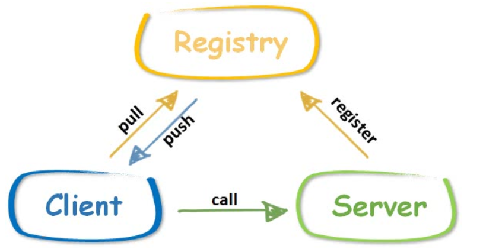

## 一、注册中心

​	注册中心的位置如上图所示。注册中心的好处在于，客户端和服务端都只需要感知注册中心的存在，而无需感知对方的存在。更具体一些：

1. 服务端启动后，向注册中心发送注册消息，注册中心得知该服务已经启动，处于可用状态。一般来说，服务端还需要定期向注册中心发送心跳，证明自己还活着。
2. 客户端向注册中心询问，当前哪个服务是可用的，注册中心将可用的服务列表返回客户端。
3. 客户端根据注册中心得到的服务列表，选择其中一个发起调用。

​	如果**没有注册中心，客户端就需要硬编码服务端的地址，而且没有机制保证服务端是否处于可用状态**。当然注册中心的功能还有很多，比如配置的动态同步、通知机制等。**比较常用的注册中心有 [etcd](https://github.com/etcd-io/etcd)、[zookeeper](https://github.com/apache/zookeeper)、[consul](https://github.com/hashicorp/consul)**，一般比较出名的微服务或者 RPC 框架，这些主流的注册中心都是支持的。

​	主流的注册中心 etcd、zookeeper 等功能强大，与这类注册中心的对接代码量是比较大的，需要实现的接口很多。GeeRPC 选择自己实现一个简单的支持心跳保活的注册中心。