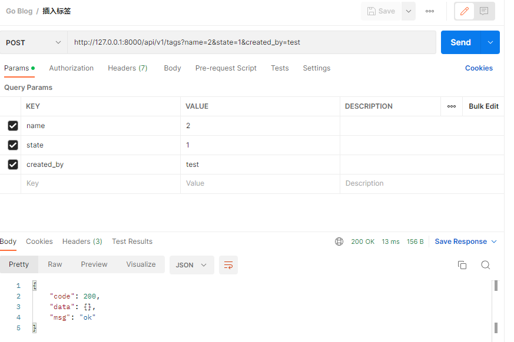
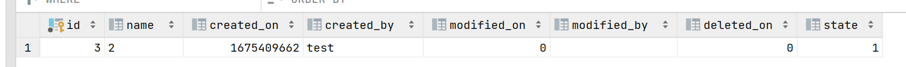
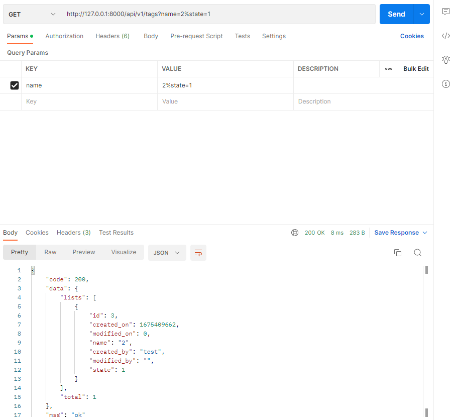
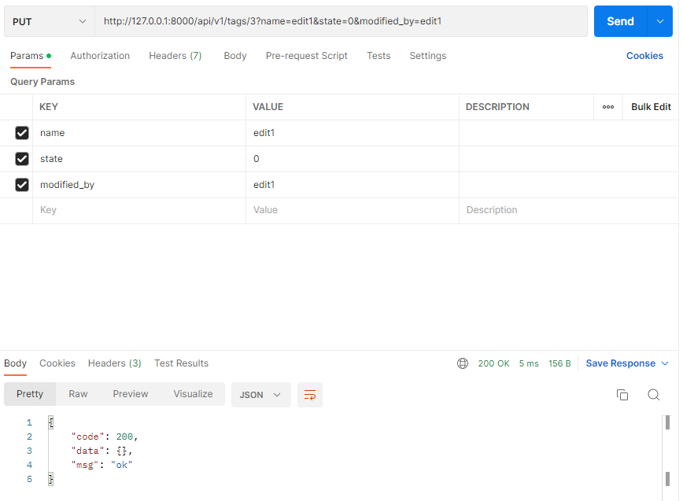
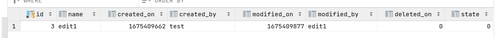
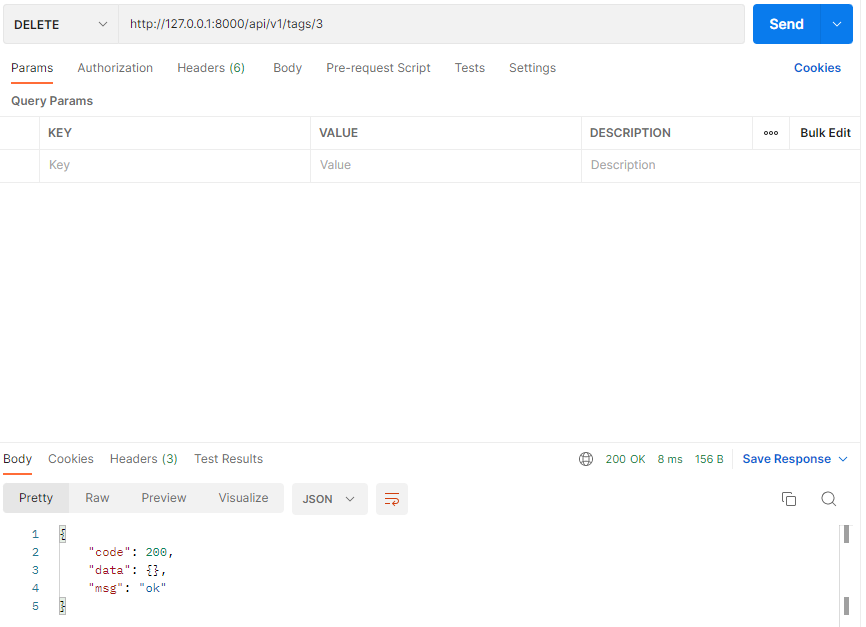
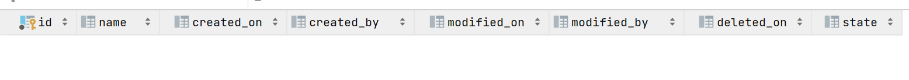

## 一、编写路由空壳

开始编写路由文件逻辑，在`routers`下新建`api`目录，我们当前是第一个 API 大版本，因此在`api`下新建`v1`目录，再新建`tag.go`文件，写入内容：

```go
package v1

import (
    "github.com/gin-gonic/gin"
)

//获取多个文章标签
func GetTags(c *gin.Context) {
}

//新增文章标签
func AddTag(c *gin.Context) {
}

//修改文章标签
func EditTag(c *gin.Context) {
}

//删除文章标签
func DeleteTag(c *gin.Context) {
}
```

## 二、注册路由

### 2.1 接口定义

```go
获取标签列表：GET(“/tags”)
新建标签：POST(“/tags”)
更新指定标签：PUT(“/tags/:id”)
删除指定标签：DELETE(“/tags/:id”)
```

我们打开`routers`下的`router.go`文件，修改文件内容为：

```go
package routers

import (
    "github.com/gin-gonic/gin"

    "gin-blog/routers/api/v1"
    "gin-blog/pkg/setting"
)

func InitRouter() *gin.Engine {
    r := gin.New()

    r.Use(gin.Logger())

    r.Use(gin.Recovery())

    gin.SetMode(setting.RunMode)

    apiv1 := r.Group("/api/v1")
    {
        //获取标签列表
        apiv1.GET("/tags", v1.GetTags)
        //新建标签
        apiv1.POST("/tags", v1.AddTag)
        //更新指定标签
        apiv1.PUT("/tags/:id", v1.EditTag)
        //删除指定标签
        apiv1.DELETE("/tags/:id", v1.DeleteTag)
    }

    return r
}
```

当前目录结构：

```
gin-blog/
├── conf
│   └── app.ini
├── main.go
├── middleware
├── models
│   └── models.go
├── pkg
│   ├── e
│   │   ├── code.go
│   │   └── msg.go
│   ├── setting
│   │   └── setting.go
│   └── util
│       └── pagination.go
├── routers
│   ├── api
│   │   └── v1
│   │       └── tag.go
│   └── router.go
├── runtime
```

### 2.2 检验路由是否注册成功

回到命令行，执行`go run main.go`，检查路由规则是否注册成功。

```
$ go run main.go
[GIN-debug] [WARNING] Running in "debug" mode. Switch to "release" mode in production.
 - using env:   export GIN_MODE=release
 - using code:  gin.SetMode(gin.ReleaseMode)

[GIN-debug] GET    /api/v1/tags              --> gin-blog/routers/api/v1.GetTags (3 handlers)
[GIN-debug] POST   /api/v1/tags              --> gin-blog/routers/api/v1.AddTag (3 handlers)
[GIN-debug] PUT    /api/v1/tags/:id          --> gin-blog/routers/api/v1.EditTag (3 handlers)
[GIN-debug] DELETE /api/v1/tags/:id          --> gin-blog/routers/api/v1.DeleteTag (3 handlers)
```

运行成功，那么我们愉快的**开始编写我们的接口**吧！

## 三、编写标签查询的逻辑

### 3.1 编写标签查询的 models 逻辑

创建`models`目录下的`tag.go`，写入文件内容：

```go
package models

type Tag struct { // 无论是在查询还是插入时，Tag类的对象都会直接在blog_tag表中完成映射(前缀blog_是自行指定的)
    Model

    Name string `json:"name"`
    CreatedBy string `json:"created_by"`
    ModifiedBy string `json:"modified_by"`
    State int `json:"state"`
}

// 返回从pageNum开始的pageSize条tag数据  (根据maps指定的内容在数据库中查询)
func GetTags(pageNum int, pageSize int, maps interface{}) (tags []Tag) {
	db.Where(maps).Offset(pageNum).Limit(pageSize).Find(&tags)

	return
}

// 返回tag数据的总数量  (根据maps指定的内容在数据库中查询)
func GetTagTotal(maps interface{}) (count int) {
	db.Model(&Tag{}).Where(maps).Count(&count)

	return
}
```

1. 我们创建了一个`Tag struct{}`，用于`Gorm`的使用。并给予了附属属性`json`，这样子在`c.JSON`的时候就会自动转换格式，非常的便利
2. 可能会有的初学者看到`return`，而后面没有跟着变量，会不理解；其实你可以看到在函数末端，我们已经显示声明了返回值，这个变量在函数体内也可以直接使用，因为他在一开始就被声明了
3. 有人会疑惑`db`是哪里来的；因为在同个`models`包下，因此`db *gorm.DB`是可以直接使用的

### 3.2 编写标签查询的路由逻辑

打开`routers`目录下 v1 版本的`tag.go`，第一我们先编写**获取标签列表的接口**

修改文件内容：

```go
package v1

import (
    "net/http"

    "github.com/gin-gonic/gin"
    "github.com/Unknwon/com"

    "gin-blog/pkg/e"
    "gin-blog/models"
    "gin-blog/pkg/util"
    "gin-blog/pkg/setting"
)

//获取url中给定的文章标签
func GetTags(c *gin.Context) {
	name := c.Query("name")   // 获取name标签

	maps := make(map[string]interface{}) // 存储要进行SQL查询的标签集合
	data := make(map[string]interface{})

	if name != "" {
		maps["name"] = name
	}

	var state int = -1
	if arg := c.Query("state"); arg != "" {   // 获取state标签
		state = com.StrTo(arg).MustInt()
		maps["state"] = state
	}

	code := e.SUCCESS

	data["lists"] = models.GetTags(util.GetPage(c), setting.PageSize, maps) //从数据库获取指定的tag集合
	data["total"] = models.GetTagTotal(maps)                                //获取指定的tag的数量

	c.JSON(http.StatusOK, gin.H{
		"code": code,
		"msg":  e.GetMsg(code),
		"data": data,
	})
}

//新增文章标签
func AddTag(c *gin.Context) {
}

//修改文章标签
func EditTag(c *gin.Context) {
}

//删除文章标签
func DeleteTag(c *gin.Context) {
}
```

1. `c.Query`可用于获取`?name=test&state=1`这类 URL 参数，而`c.DefaultQuery`则支持设置一个默认值
2. `code`变量使用了`e`模块的错误编码，这正是先前规划好的错误码，方便排错和识别记录
3. `util.GetPage`保证了各接口的`page`处理是一致的
4. `c *gin.Context`是`Gin`很重要的组成部分，可以理解为上下文，它允许我们在中间件之间传递变量、管理流、验证请求的 `JSON` 和呈现 `JSON` 响应

在本机向`http://127.0.0.1:8000/api/v1/tags`发送`GET`请求，正确的返回值为`{"code":200,"data":{"lists":[],"total":0},"msg":"ok"}`，若存在问题请结合 gin 结果进行排错。

在获取标签列表接口中，我们可以根据`name`、`state`、`page`来筛选查询条件，分页的步长可通过`app.ini`进行配置，以`lists`、`total`的组合返回达到分页效果。

## 四、编写新增标签的逻辑

### 4.1 编写新增标签的 models 逻辑

接下来我们编写**新增标签**的接口

打开`models`目录下的`tag.go`，修改文件（增加 2 个方法）：

```go
...
func ExistTagByName(name string) bool {
    var tag Tag
    db.Select("id").Where("name = ?", name).First(&tag)   //根据name标签在数据库中查询对应标签项(是否已经存在)
    if tag.ID > 0 {
        return true
    }

    return false
}

func AddTag(name string, state int, createdBy string) bool{  //插入一条新的标签项
    db.Create(&Tag {
        Name : name,
        State : state,
        CreatedBy : createdBy,
    })

    return true
}
...
```

### 4.2 编写新增标签的路由逻辑

首先我们要拉取`validation`的依赖包，因为我们会使用到表单验证：

```
go get -u github.com/astaxie/beego/validation
```

打开`routers`目录下的`tag.go`，修改文件（变动 `AddTag` 方法）：

```go
// 新增文章标签
func AddTag(c *gin.Context) {
	name := c.Query("name")   //从url获取新数据的 name 标签
	state := com.StrTo(c.DefaultQuery("state", "0")).MustInt()  //从url获取新数据的state标签
	createdBy := c.Query("created_by")  //从url获取新数据的created_by标签

	valid := validation.Validation{}
	valid.Required(name, "name").Message("名称不能为空")
	valid.MaxSize(name, 100, "name").Message("名称最长为100字符")
	valid.Required(createdBy, "created_by").Message("创建人不能为空")
	valid.MaxSize(createdBy, 100, "created_by").Message("创建人最长为100字符")
	valid.Range(state, 0, 1, "state").Message("状态只允许0或1")

	code := e.INVALID_PARAMS
	if !valid.HasErrors() { // 验证通过，即没有错误，valid.HasErrors()会返回false
		if !models.ExistTagByName(name) {  //必须保证新插入的数据的name在数据库中没有重复项
			code = e.SUCCESS
			flag := models.AddTag(name, state, createdBy)
			fmt.Println(flag)
		} else {
			code = e.ERROR_EXIST_TAG
		}
	}

	c.JSON(http.StatusOK, gin.H{
		"code": code,
		"msg":  e.GetMsg(code),
		"data": make(map[string]string),
	})
}
```

用`Postman`用 POST 访问`http://127.0.0.1:8000/api/v1/tags?name=1&state=1&created_by=test`，查看`code`是否返回`200`及`blog_tag`表中是否有值，有值则正确。

## 五、编写 models 的 Hook 函数

但是这个时候会发现，明明通过`AddTag()`新增了标签，但`created_on`居然没有值，那做修改标签的时候`modified_on`会不会也存在这个问题？

为了解决这个问题，我们需要打开`models`目录下的`tag.go`文件，修改文件内容（修改包引用和增加 2 个方法）：

```go
package models

import (
    "time"

    "github.com/jinzhu/gorm"
)

...

// 其实就是为Tag类对象添加两个方法，这两个方法将会在实际向数据库插入或更新数据之前被调用

func (tag *Tag) BeforeCreate(scope *gorm.Scope) error {  //数据项被创建之前被调用
    scope.SetColumn("CreatedOn", time.Now().Unix())

    return nil
}

func (tag *Tag) BeforeUpdate(scope *gorm.Scope) error {  //数据项被更新之前被调用
    scope.SetColumn("ModifiedOn", time.Now().Unix())

    return nil
}
```

此刻，重启服务，再在用`Postman`用 POST 访问`http://127.0.0.1:8000/api/v1/tags?name=2&state=1&created_by=test`，发现`created_on`已经有值了！

**在这几段代码中，涉及到知识点：**

这属于`gorm`的`Callbacks`，可以将回调方法定义为模型结构的指针，**在创建、更新、查询、删除时将被调用**，如果任何**回调返回错误，`gorm` 将停止未来操作并回滚所有更改**。

`gorm`所支持的回调方法：

- 创建：BeforeSave、BeforeCreate、AfterCreate、AfterSave
- 更新：BeforeSave、BeforeUpdate、AfterUpdate、AfterSave
- 删除：BeforeDelete、AfterDelete
- 查询：AfterFind

## 六、编写编辑标签的逻辑

### 6.1 编写编辑标签的 models 逻辑

```go
// 查询指定id的tag标签项是否已经存在与数据库中
func ExistTagByID(id int) bool {
    var tag Tag
    db.Select("id").Where("id = ?", id).First(&tag)
    if tag.ID > 0 {
        return true
    }

    return false
}

// 重新编辑数据库中已有的tag标签项
func EditTag(id int, data interface {}) bool {
    db.Model(&Tag{}).Where("id = ?", id).Updates(data)  //updates的参数可以是结构体，也可以是map

    return true
}
```

### 6.2 编写编辑标签的路由逻辑

```go
//修改文章标签
func EditTag(c *gin.Context) {
    id := com.StrTo(c.Param("id")).MustInt()  //c.Param("id")用于获取url中的动态参数params
    name := c.Query("name")
    modifiedBy := c.Query("modified_by")

    valid := validation.Validation{}

    var state int = -1
    if arg := c.Query("state"); arg != "" {
        state = com.StrTo(arg).MustInt()
        valid.Range(state, 0, 1, "state").Message("状态只允许0或1")
    }

    valid.Required(id, "id").Message("ID不能为空")
    valid.Required(modifiedBy, "modified_by").Message("修改人不能为空")
    valid.MaxSize(modifiedBy, 100, "modified_by").Message("修改人最长为100字符")
    valid.MaxSize(name, 100, "name").Message("名称最长为100字符")

    code := e.INVALID_PARAMS
    if ! valid.HasErrors() {
        code = e.SUCCESS
        if models.ExistTagByID(id) {  //必须确保指定id的tag标签项已经存在
            data := make(map[string]interface{})
            data["modified_by"] = modifiedBy    //存储更新后的modified_by
            if name != "" {
                data["name"] = name   //存储更新后的name
            }
            if state != -1 {
                data["state"] = state  //存储更新后的state
            }

            models.EditTag(id, data)
        } else {
            code = e.ERROR_NOT_EXIST_TAG
        }
    }

    c.JSON(http.StatusOK, gin.H{
        "code" : code,
        "msg" : e.GetMsg(code),
        "data" : make(map[string]string),
    })
}
```

PUT 访问 http://127.0.0.1:8000/api/v1/tags/1?name=edit1&state=0&modified_by=edit1 ，查看 code 是否返回 200


## 七、编写删除标签的逻辑

### 7.1 编写删除标签的 models 逻辑

```go
func DeleteTag(id int) bool {
    db.Where("id = ?", id).Delete(&Tag{})

    return true
}
```

### 7.2 编写删除标签的路由逻辑

```go
//删除文章标签
func DeleteTag(c *gin.Context) {
    id := com.StrTo(c.Param("id")).MustInt()  //获取动态参数 id

    valid := validation.Validation{}
    valid.Min(id, 1, "id").Message("ID必须大于0")

    code := e.INVALID_PARAMS
    if ! valid.HasErrors() {
        code = e.SUCCESS
        if models.ExistTagByID(id) {  //必须确保指定id的tag标签项已经存在
            models.DeleteTag(id)
        } else {
            code = e.ERROR_NOT_EXIST_TAG
        }
    }

    c.JSON(http.StatusOK, gin.H{
        "code" : code,
        "msg" : e.GetMsg(code),
        "data" : make(map[string]string),
    })
}
```

DELETE 访问 http://127.0.0.1:8000/api/v1/tags/1 ，查看 code 是否返回 200


## 八、效果展示

### 8.1 插入数据

使用POST访问：

```
http://127.0.0.1:8000/api/v1/tags?name=2&state=1&created_by=test
```



数据库情况：



### 8.2 查询数据

使用GET访问：

```
http://127.0.0.1:8000/api/v1/tags?name=2%state=1
```



### 8.3 编辑(修改)数据

使用PUT访问：

```
http://127.0.0.1:8000/api/v1/tags/3?name=edit1&state=0&modified_by=edit1
```



数据库情况：



### 8.4 删除数据

使用DELETE访问：

```
http://127.0.0.1:8000/api/v1/tags/3
```



数据库情况：

