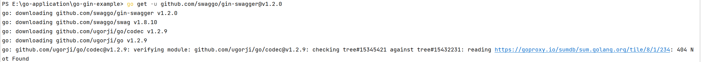
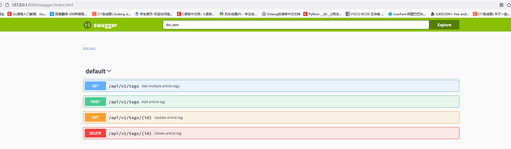

## 一、本文目标

一个好的 `API's`，必然离不开一个好的`API`文档，如果要开发纯手写 `API` 文档，不存在的（很难持续维护），因此我们要自动生成接口文档。


## 二、安装 `swag`

```
go get -u github.com/swaggo/swag/cmd/swag@v1.6.5
```

执行上述命令后，swag项目包将会被下载到`$GOPATH\pkg\mod\github.com\swaggo\swag@v1.6.5`中，此时我们执行以下命令：

```
go install ./cmd/swag
```

完成后，在`$GOPAT`的`bin`目录下就会生成一个可执行文件：`swag.exe`


## 三、安装 `gin-swagger`

```
$ go get -u github.com/swaggo/gin-swagger@v1.2.0 
$ go get -u github.com/swaggo/files
$ go get -u github.com/alecthomas/template
```

若拉取过程出现一下问题：（包哈希校验失败）



可以通过以下命令，暂时关闭go依赖包的数据库校验：

```
go env -w GOSUMDB=off
```


## 四、使用`gin-swagger`

### 4.1 编写 API 注释

`Swagger` 中需要**按照指定的格式将相应的注释或注解编写到方法上**，再利用生成器自动生成说明文件（**只会为路由方法生成说明文件**）

`gin-swagger` 给出的范例：

```go
// @Summary Add a new pet to the store     --->   api的名称
// @Description get string by ID           --->   api的详细描述
// @Accept  json                           
// @Produce  json						   
// @Param   some_id     path    int     true        "Some ID"    -->  参数名  path或者是query  参数类型  是否必须
// @Success 200 {string} string    "ok"           --->  成功返回时的返回参数格式(支持自定义类型)
// @Failure 400 {object} web.APIError "We need ID!!"    --> 返回失败时的返回参数格式
// @Failure 404 {object} web.APIError "Can not find ID"
// @Router /testapi/get-string-by-int/{some_id} [get]   --->  api的路由地址和请求方式
```

我们可以参照 `Swagger` 的注解规范和范例去编写：

1.  添加标签的路由方法

```go
// @Summary 新增文章标签
// @Produce  json
// @Param name query string true "Name"
// @Param state query int false "State"
// @Param created_by query int false "CreatedBy"
// @Success 200 {string} json "{"code":200,"data":{},"msg":"ok"}"
// @Router /api/v1/tags [post]
func AddTag(c *gin.Context) {   
```

2. 修改标签的路由方法

```go
// @Summary 修改文章标签
// @Produce  json
// @Param id path int true "ID"
// @Param name query string true "ID"
// @Param state query int false "State"
// @Param modified_by query string true "ModifiedBy"
// @Success 200 {string} json "{"code":200,"data":{},"msg":"ok"}"
// @Router /api/v1/tags/{id} [put]
func EditTag(c *gin.Context) {
```

### 4.2 为`swagger`文档提供路由

生成的`swagger`文档将以`html`的形式进行显示，因此我们必须为此`html`文档添加一个访问路由：

```go
package routers

import (
    ...

    _ "github.com/EDDYCJY/go-gin-example/docs"    // 用户必须手动引入此包，docs包也是必须由用户手动生成

    ...
)

// InitRouter initialize routing information
func InitRouter() *gin.Engine {
    ...
    r.GET("/swagger/*any", ginSwagger.WrapHandler(swaggerFiles.Handler))   //添加路由
    ...
    apiv1 := r.Group("/api/v1")
    apiv1.Use(jwt.JWT())
    {
        ...
    }

    return r
}
```

### 4.3 手动生成所需的`docs`包

在上一步中，我们需要手动引入一个包：`"github.com/EDDYCJY/go-gin-example/docs"` ，这个包需要我们自己手动来生成。

我们进入到`gin-blog`的项目根目录中，执行初始化命令：

```
swag init
```

运行结果：

```
2023/02/04 18:55:45 Generate swagger docs....
2023/02/04 18:55:45 Generate general API Info, search dir:./
2023/02/04 18:55:45 create docs.go at  docs/docs.go
2023/02/04 18:55:45 create swagger.json at  docs/swagger.json
2023/02/04 18:55:45 create swagger.yaml at  docs/swagger.yaml
```

完毕后会在项目根目录下生成`docs`:

```
docs/
├── docs.go
└── swagger
    ├── swagger.json
    └── swagger.yaml
```

**需要注意：如果编写的swagger注释和函数实际的参数不符，swag init 命令将会执行出错。**


### 4.4 验证

访问一下 `http://127.0.0.1:8000/swagger/index.html`， 查看 `API` 文档生成是否正确

