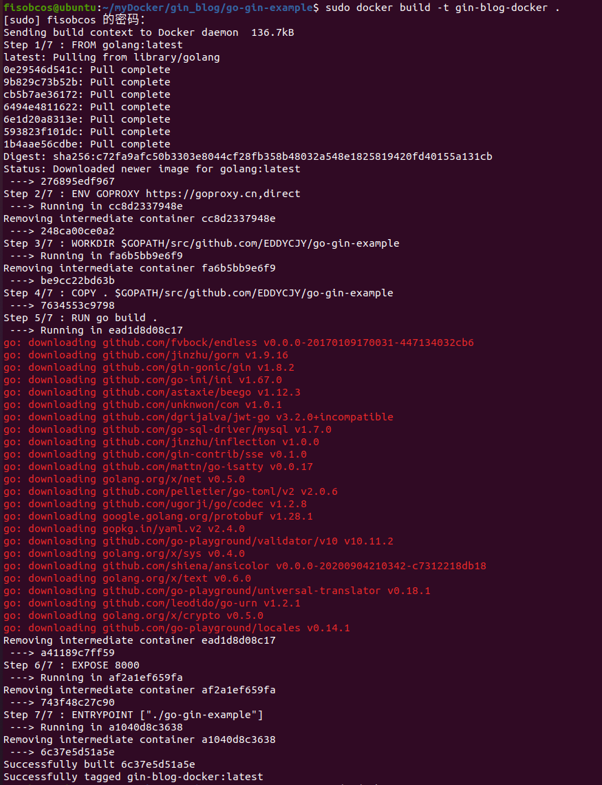
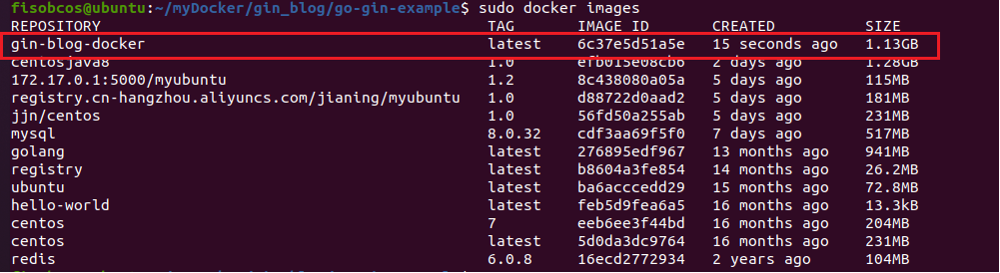
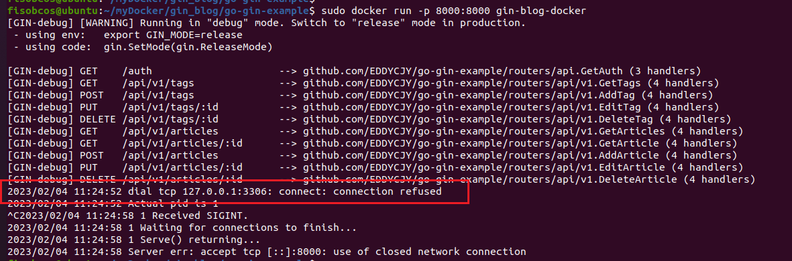
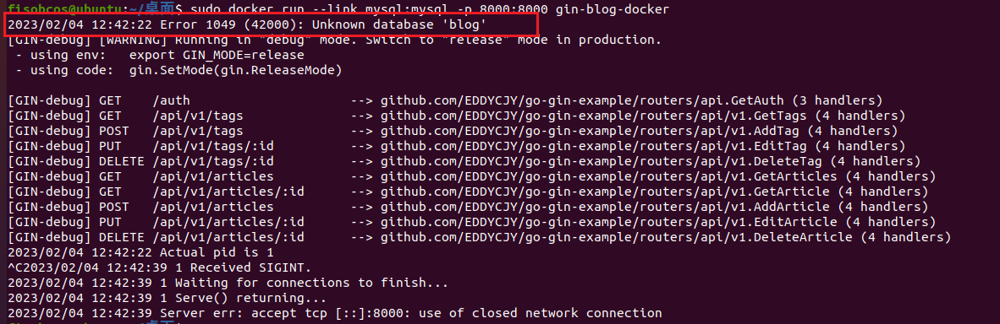
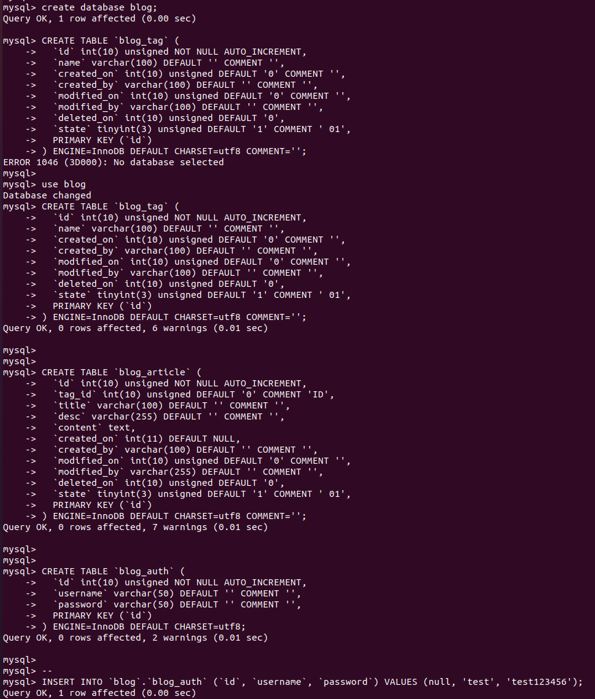
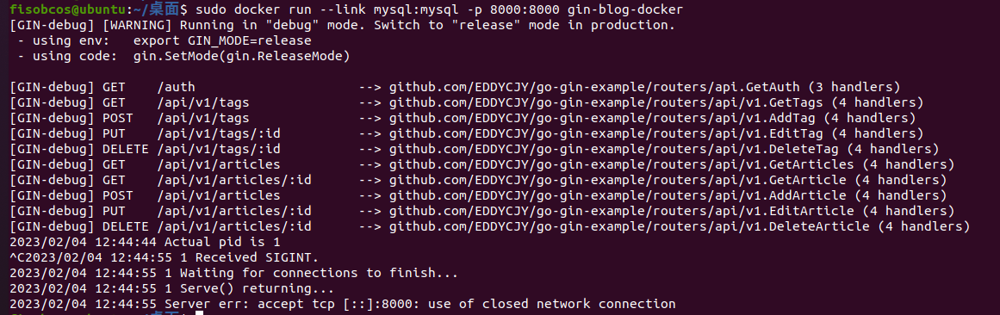

## 一、编写`Dockerfile`

在 `go-gin-example` 项目根目录创建 Dockerfile 文件，写入内容:

```dockerfile
FROM golang:latest

ENV GOPROXY https://goproxy.cn,direct    # 设置GOPROXY环境变量
WORKDIR $GOPATH/src/github.com/EDDYCJY/go-gin-example
COPY . $GOPATH/src/github.com/EDDYCJY/go-gin-example   # 拷贝项目根目录所有文件到容器
RUN go build .   #生成go-gin-example可执行文件

EXPOSE 8000
ENTRYPOINT ["./go-gin-example"]   #运行可执行文件
```

## 二、构建镜像

在`go-gin-example` 的项目根目录下**执行** `docker build -t gin-blog-docker .`   （注意：最后有一个 `.`）

该命令作用是创建/构建镜像，`-t` 指定名称为 `gin-blog-docker`，`.` 构建内容为当前上下文目录



### 2.1 验证镜像

查看所有的镜像，确定刚刚构建的 `gin-blog-docker` 镜像是否存在



## 三、创建并运行一个新容器

根据创建新创建的镜像文件实例化一个容器：

```
docker run -p 8000:8000 gin-blog-docker
```



仔细看看控制台的输出了一条错误 `dial tcp 127.0.0.1:3306: connect: connection refused`

这是因为我们并未在容器内安装`mysql`，下面我们将解决这一问题。

## 四、`Mysql`容器

### 4.1 拉取镜像

从 `Docker` 的公共仓库 `Dockerhub` 下载 `MySQL` 镜像（国内建议配个镜像）：

```
docker pull mysql
```

### 4.2 创建并运行一个新容器

运行 `Mysql` 容器，并设置执行成功后返回容器 ID

```
docker run --name mysql -p 3306:3306 -e MYSQL_ROOT_PASSWORD=2486 -d mysql   

8c86ac986da4922492934b6fe074254c9165b8ee3e184d29865921b0fef29e64
```

**问题：此处必须使用3306作为外部映射端口，原因不详**。如果3306已经被宿主机的mysql服务占用，必须先关闭宿主机的mysql服务。

```shell
sudo netstat -tanlp | grep 3306  ## 查看使用3306的进程

sudo kill xxx   ##杀死对应进程
```

## 五、`Golang` + `Mysql`

### 5.1 删除原项目镜像

因为init配置文件数据库相关项存在问题，因此我们需要进行修改，由于没有挂载数据卷，所以我们需要删除原有容器和镜像，更改init后生成新的镜像和容器。

删除原本的有问题的镜像，`-f` 是强制删除及其关联状态

若不执行 `-f`，你需要执行 `docker ps -a` 查到所关联的容器，将其 `rm` 解除两者依赖关系

```
docker rmi -f gin-blog-docker
```

### 5.2 修改配置文件

将项目的配置文件 `conf/app.ini`，内容修改为:

```ini
#debug or release
RUN_MODE = debug

[app]
PAGE_SIZE = 10
JWT_SECRET = 23347$040412

[server]
HTTP_PORT = 8000
READ_TIMEOUT = 60
WRITE_TIMEOUT = 60

[database]
TYPE = mysql
USER = root
PASSWORD = 2486

HOST = mysql:3306    #需要注意，不是通过IP，而是容器名进行访问
NAME = blog
TABLE_PREFIX = blog_
```

### 5.3 重新构建镜像

重复先前的步骤，回到 `gin-blog` 的项目根目录下**执行** `docker build -t gin-blog-docker .`

### 5.4 创建并运行一个新容器

#### 5.4.1 关联

我们需要**将 `Golang` 容器和 `Mysql` 容器关联起来**，那么我们需要怎么做呢？


增加命令 `--link mysql:mysql` 让 `Golang` 容器与 `Mysql` 容器互联；通过 `--link`，**可以在容器内直接使用其关联的容器别名进行访问**，而**不通过 IP**，但是`--link`只能解决单机容器间的关联，在分布式多机的情况下，需要通过别的方式进行连接

#### 5.4.2 运行

执行命令 `docker run --link mysql:mysql -p 8000:8000 gin-blog-docker`

#### 5.4.3 结果



错误提示我们，对应的mysql容器中不存在`blog`数据库，因此我们还需要手动添加：



完成表创建后，重新连接，不会有任何错误：




## 六、`Mysql` 挂载数据卷

倘若不做任何干涉，在每次启动一个 `Mysql` 容器时，数据库都是空的。另外容器删除之后，数据就丢失了（还有各类意外情况），非常糟糕！

因此**使用镜像进行实例化容器时，我们必须使用数据卷在宿主机对`mysql`容器进行挂载。**

```
docker run --name mysql -p 3306:3306 -e MYSQL_ROOT_PASSWORD=2486 -v /data/docker-mysql:/var/lib/mysql -d mysql
54611dbcd62eca33fb320f3f624c7941f15697d998f40b24ee535a1acf93ae72
```

创建成功，检查目录 `/data/docker-mysql`，下面多了不少数据库文件


**完成数据卷挂载之后，只要宿主机数据不被删除，且每次实例化容器都使用相同的宿主机目录，就可以保证每一个被启动的`mysql`容器都继承一样的`mysql`数据。**