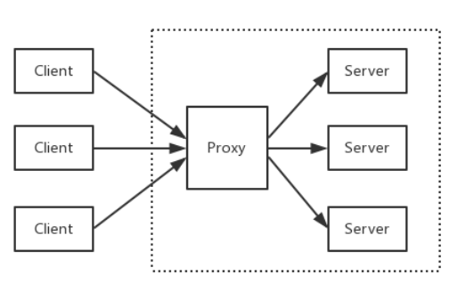
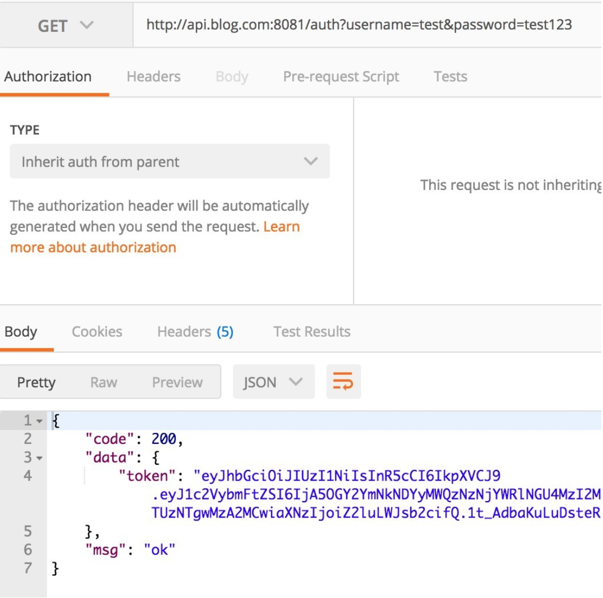
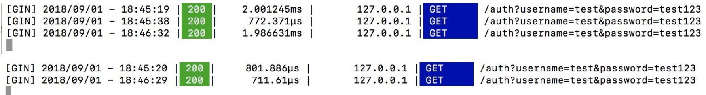

## 一、任务目标

​	使用 Nginx 来完成对 [go-gin-example](https://github.com/EDDYCJY/go-gin-example) 的部署，会实现反向代理和简单负载均衡的功能。

## 二、`Nginx`常用命令与配置

### 2.1 常用命令

- nginx：启动 Nginx
- nginx -s stop：立刻停止 Nginx 服务
- nginx -s reload：重新加载配置文件
- nginx -s quit：平滑停止 Nginx 服务
- nginx -t：测试配置文件是否正确
- nginx -v：显示 Nginx 版本信息
- nginx -V：显示 Nginx 版本信息、编译器和配置参数的信息

### 2.2 涉及配置

#### 2.2.1 查看配置文件位置

如果需要对 nginx.conf 进行配置，但是不知道对应的配置文件是哪个，可执行 `nginx -t` 看一下

```
$ nginx -t
nginx: the configuration file /usr/local/etc/nginx/nginx.conf syntax is ok
nginx: configuration file /usr/local/etc/nginx/nginx.conf test is successful
```

显然，该例中的配置文件在 `/usr/local/etc/nginx/` 目录下，并且测试通过

#### 2.2.2 `proxy_pass`

配置**反向代理的路径**。需要注意的是**如果 proxy_pass 的 url 最后为/，则表示绝对路径**。否则（不含变量下）表示相对路径，所有的路径都会被代理过去

#### 2.2.3 `upstream`

配置**负载均衡**，upstream 默认是以轮询的方式进行负载，另外还支持**四种模式**，分别是：

（1）weight：权重，指定轮询的概率，weight 与访问概率成正比

（2）ip_hash：按照访问 IP 的 hash 结果值分配

（3）fair：按后端服务器响应时间进行分配，响应时间越短优先级别越高

（4）url_hash：按照访问 URL 的 hash 结果值分配

## 三、实现反向代理

​	反向代理是指以代理服务器来接受网络上的连接请求，然后将请求转发给内部网络上的服务器，并将从服务器上得到的结果返回给请求连接的客户端，此时代理服务器对外就表现为一个反向代理服务器。



### 3.1 配置 `hosts`

由于需要**用本机作为演示**，因此先把映射配上去，**打开 `/etc/hosts`**，增加内容：

```go
127.0.0.1       api.blog.com
```

### 3.2 配置 `nginx.conf`

**打开 nginx 的配置文件 nginx.conf**（我的是 /usr/local/etc/nginx/nginx.conf），我们做了如下事情：

增加 server 片段的内容，**设置 server_name 为 api.blog.com 并且监听 8081 端口**，将**所有http请求转发(proxy_pass)到 `http://127.0.0.1:8000/`(绝对路径)** 下

```nginx
events {
    worker_connections  1024;
}


http {
    include       mime.types;
    default_type  application/octet-stream;

    sendfile        on;
    keepalive_timeout  65;

    server {
        listen       8081;
        server_name  api.blog.com;

        location / {
            proxy_pass http://127.0.0.1:8000/;
        }
    }
}
```

### 3.3 验证

#### 3.3.1 重启 nginx

```shell
$ nginx -t
nginx: the configuration file /usr/local/etc/nginx/nginx.conf syntax is ok
nginx: configuration file /usr/local/etc/nginx/nginx.conf test is successful
$ nginx -s reload
```

#### 3.3.2 访问接口



## 四、实现负载均衡

负载均衡，英文名称为 Load Balance（常称 LB），其意思就是分摊到多个操作单元上进行执行（来自百科）

你能从运维口中经常听见，XXX 负载怎么突然那么高。 那么它到底是什么呢？

其背后一般有多台 server，系统会根据配置的策略（例如 Nginx 有提供四种选择）来进行动态调整，尽可能的达到各节点均衡，从而提高系统整体的吞吐量和快速响应

### 4.1 如何演示

前提条件是**需要提供多个后端服务，那么势必需要多个 go-gin-example**，为了演示我们可以启动多个端口，达到模拟的效果

为了便于演示，分别在启动前将 conf/app.ini 的应用端口修改为 8001 和 8002（也可以做成传入参数的模式），达到启动 2 个监听 8001 和 8002 的后端服务

### 4.2 配置 `nginx.conf`

​	回到 nginx.conf 的老地方，增加负载均衡所需的配置。**新增 upstream 节点，设置其对应的 2 个后端服务**，**最后修改 proxy_pass 指向**，格式为 http:// + upstream 的节点名称（这里就是指api.blog.com）

```nginx
http {
    include       mime.types;
    default_type  application/octet-stream;

    sendfile        on;
    keepalive_timeout  65;

    upstream api.blog.com {
        server 127.0.0.1:8001;
        server 127.0.0.1:8002;
    }

    server {
        listen       8081;
        server_name  api.blog.com;

        location / {
            proxy_pass http://api.blog.com/;
        }
    }
}
```

### 4.3 重启 `nginx`

```sh
$ nginx -t
nginx: the configuration file /usr/local/etc/nginx/nginx.conf syntax is ok
nginx: configuration file /usr/local/etc/nginx/nginx.conf test is successful
$ nginx -s reload
```

### 4.4 验证

重复访问 `http://api.blog.com:8081/auth?username={USER_NAME}}&password={PASSWORD}`，多访问几次便于查看效果

**目前 Nginx 没有进行特殊配置，那么它是轮询策略**，而 go-gin-example 默认开着 debug 模式，看看请求 log 就明白了

