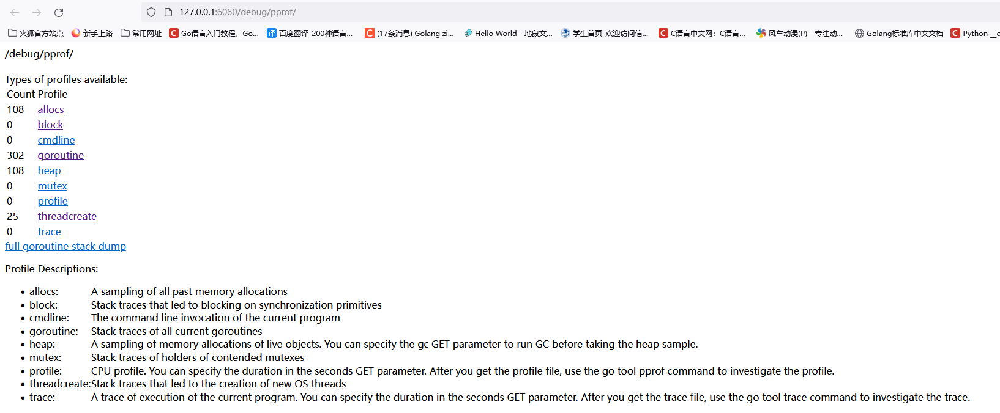
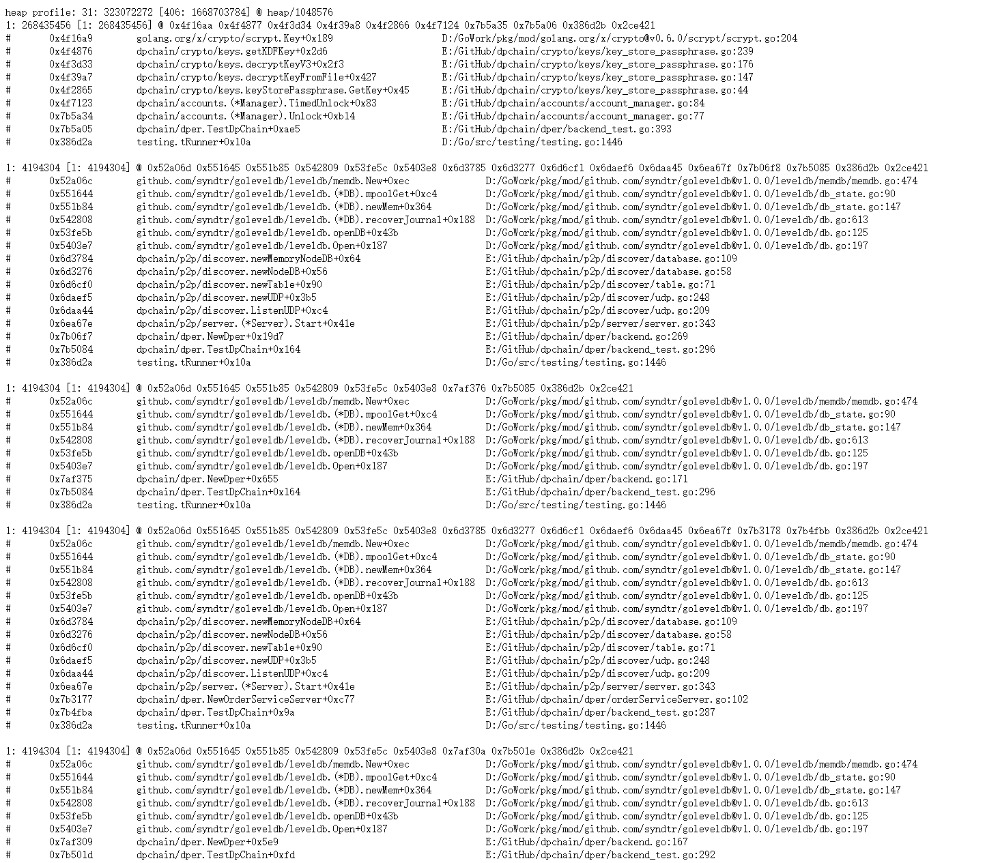
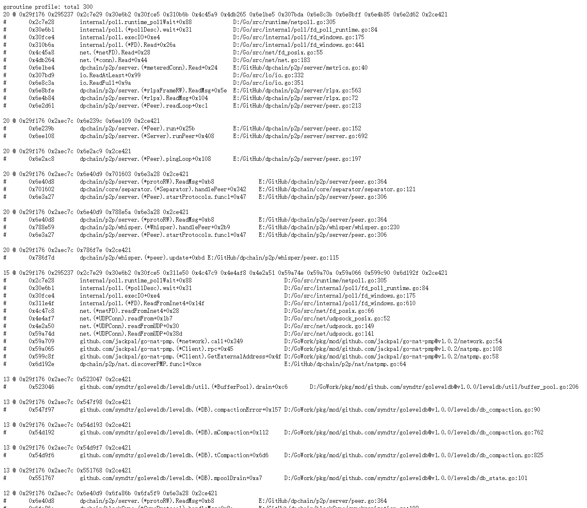
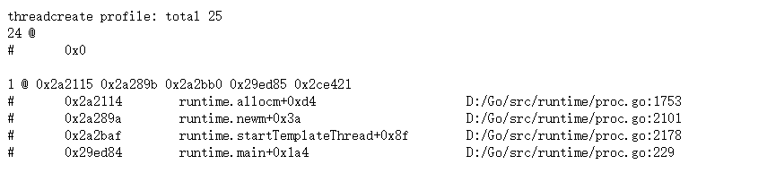

## 一、`PProf`可以做什么

- `CPU Profiling`：**`CPU` 分析**，按照一定的频率采集所监听的应用程序 `CPU`（含寄存器）的使用情况，可**确定应用程序在主动消耗 CPU 周期时花费时间的位置**
- `Memory Profiling`：**内存分析**，在应用程序进行堆分配时记录堆栈跟踪，用于**监视当前和历史内存使用情况**，以及检查内存泄漏
- `Block Profiling`：**阻塞分析**，记录 `goroutine` 阻塞等待同步（包括定时器通道）的位置
- `Mutex Profiling`：**互斥锁分析**，报告互斥锁的竞争情况

## 二、如何使用

### 2.1 在需要分析的程序的最后添加`http`监听服务

​	在`main()`函数或者`TestXxx()`测试函数的最后添加`http`监听服务，同时在`import`导入包时，匿名引入`"net/http/pprof"`

```go
import (
	………………
    _ "net/http/pprof"
    ………………
)

// main()函数中
func main(){
    …………………………

	 http.ListenAndServe("0.0.0.0:6060", nil)  // 指定pprof展示端口
    
    …………………………

}

// 测试函数中
func TestXxx(t *testing.T){
    ………………………………………………
     http.ListenAndServe("0.0.0.0:6060", nil)   
    ………………………………………………
}
```

### 2.2 运行程序

### 2.3 查看分析结果

#### 2.3.1 通过 Web 界面

查看当前总览：访问 `http://127.0.0.1:6060/debug/pprof/`




1.




2.




3. 



#### 2.3.2 通过交互式终端使用

1. 查看 cpu 占用情况

```
go tool pprof http://localhost:6060/debug/pprof/profile?seconds=10    
```


1. 查看内存占用情况

```
go tool pprof http://localhost:6060/debug/pprof/heap
```

