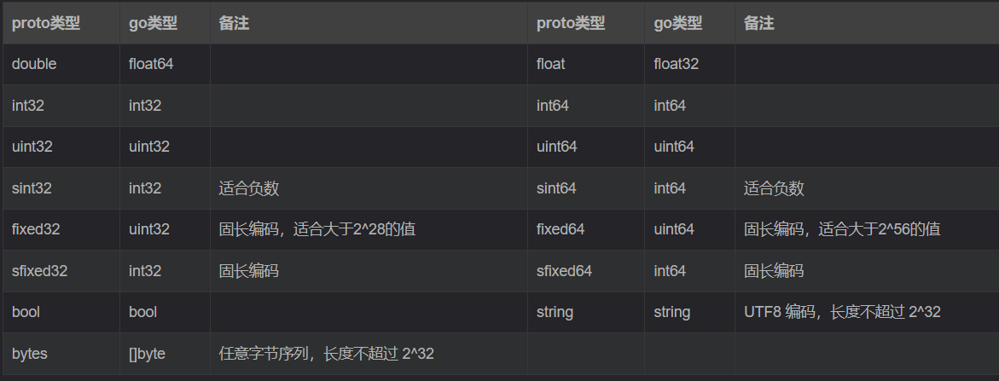

## 一、`protobuff`的介绍

​	Protobuf是Protocol  Buffers的简称，它是Google公司开发的一种数据描述语言，并于2008年对外开源。Protobuf刚开源时的定位类似于XML、JSON等数据描述语言，通过附带工具生成代码并实现将**结构化数据序列化的功能**。但是我们更关注的是Protobuf作为接口规范的描述语言，可以作为设计安全的跨语言PRC接口的基础工具。

**总结：**

```
Protocol Buffers 是一种与语言、平台无关，可扩展的序列化结构化数据的方法，常用于通信协议，数据存储等等。相较于 JSON、XML，它更小、更快、更简单，因此也更受开发人员的青眯
```

## 二、`protobuff`的下载与配置

### 2.1 下载

```
https://github.com/protocolbuffers/protobuf/releases
```

### 2.2 为`protobuf`配置环境变量

将protobuf的bin目录加载到Path环境变量中


### 2.3 安装go专属的`protoc`生成器

```
go install google.golang.org/protobuf/cmd/protoc-gen-go@latest
```

安装成功后将在`GOPATH/bin`路径下生成`protobuf`的编译器插件 `protoc-gen-go.exe` 。执行protoc命令时会调用这个插件，**此插件可以将编写的`.proto`源文件编译为go源文件**


## 三、`protobuff`的使用

### 3.1 如何使用`protobuff`

1. 定义一种源文件类型 `.proto` , 使用这种源文件按照特定格式存放我们的消息

2. 使用**对应语言的`protoc`编译**器(go语言就是`protoc-gen-go.exe`)，它可以**将 `.proto` 类型的源文件编译转化为对应语言的源文件(比如说转化为 .go文件)**

### 3.2 使用案例

#### 3.2.1 安装`IDE`插件

​	首先需要在`IDE`中安装相应的`protocal buffers`插件，这样`IDE`就能识别`.proto`文件的语法格式

#### 3.2.2 编写`proto`文件

```protobuf
//指定当前proto语法版本(V2 or V3)
syntax = "proto3";

//指定生成后的go packet的存放目录
//路径格式为: "path:name","path"就是存放路径目录文件(如果没有会自行创建该目录),"name"为go文件所属包名
option go_package = "./service";  //在当前目录下的service目录中创建go文件

//指定go文件所属包名
package service;

//要转换的消息实体
message User{
  string username = 1;
  int32 age = 2;
}
```

#### 3.2.3 使用`protoc`编译器

​	使用`protoc`编译器将`proto`文件重新编译为go源文件

```shell
protoc --go_out=.  .\pb.proto  //--go_out=. 不能存在任何空格
```

​	--go_out=./ 与 option go_package 共同指定编译后生成的go文件存放的位置：首先切换到路径go_out指定的目录，以此为基础切换到option go_package指定路径下创建对应目录和go源文件

#### 3.2.4 使用编译后的go源文件

​	使用新产生的go文件转化后的User消息

```go
package main
import (
	"fmt"
	"google.golang.org/protobuf/proto"
	"pbMyself/service"
)
func main() {
	//新的go文件中的消息结构体
	user := &service.User{
		Username: "Tom",
		Age:      18,
	}
	//进行序列化
	marshal, err := proto.Marshal(user)
	if err != nil {
		panic(err)
	}
	//进行反序列化
	newUser := new(service.User)
	err = proto.Unmarshal(marshal, newUser)
	if err != nil {
		panic(err)
	}
	fmt.Println(newUser)
}
```

### 3.3 `proto`文件语法说明

#### 3.3.1 `Message`消息

```protobuf
message User{
  string username = 1;
  int32 age = 2;
}
```

- `message`关键字：用来定义一种类型的消息

- 字段规则

  ​		protobuffer中字段规则包括以下三种：

  - required：**实例中**必须包含的字段(在protobuffer3中,字段的默认类型即为required)

  - optional：**实例中**可以选择性包含的字段，若实例没有指定，则为默认值，若没有设置该字段的默认值，其值是该类型的默认值。如string默认值为""，bool默认值为false,整数默认值为0。

  - repeated: 可以有多个值的字段，这类变量类似于vector，可以存储此类型的多个值，**在go中表现为切片类型**

- 变量标识号

​		在`proto`数据结构中，**每一个变量都有唯一的数字标识**(例如：`string username = 1`, `int32 age = 2`)。这些标识符的作用是在二进制格式中识别各个字段的，**一旦开始使用就不可再改变。**

​	此处需要注意的是1-15之内的标号在存储的时候只占一个字节，而大于15到162047之间的需要占两个字符，所以我们尽量为频繁使用的字段分配1-15内的标识号。另外19000-19999之内的标识号已经被预留，不可用。最大标识号为2^29-1。

- 标量类型(Scalar)



**标量类型如果没有被赋值，则不会被序列化**，**反序列化解析时，会赋予默认值**。

- strings：空字符串
- bytes：空序列
- bools：false
- 数值类型：0

#### 3.3.2 嵌套`Message`消息

​	可以在其他消息类型中定义/使用消息类型，在下面的例子中，**Person类型消息就定义在了`PersonInfo`类型消息内**:

```protobuf
//嵌套消息
message PersonInfo{
  message Person{
    string name = 1;
    int32 height = 2;
    repeated int32 weight = 3;
  }
  repeated Person info = 1;  //Person类型
}
```

如果想要**在`PersonInfo`之外使用Person这个消息类**型，需要**以`PersonInfo.Person`的形式使用它**：

```protobuf
message PersonMessage{
  PersonInfo.Person info = 1;
}
```

当然，也可以将message嵌套任意多层。


#### 3.3.3 `Service`服务

​	message消息要想在RPC中使用，就必须用在RPC服务接口上，RPC服务接口的定义方式如下：

```protobuf
message SearchRequest {   // 作为请求参数

}

message SearchResponse {  // 作为响应参数

}
//RPC服务接口
service SearchService {
  //rpc关键字  服务函数名  (请求参数) returns关键字 (响应参数)
  rpc Search(SearchRequest) returns (SearchResponse);
}
```

通过关键字`service`定义了一个RPC服务`SearchService`，该接口内的`Search()`方法接收一个`SearchRequest`再返回一个`SearchResponse`。