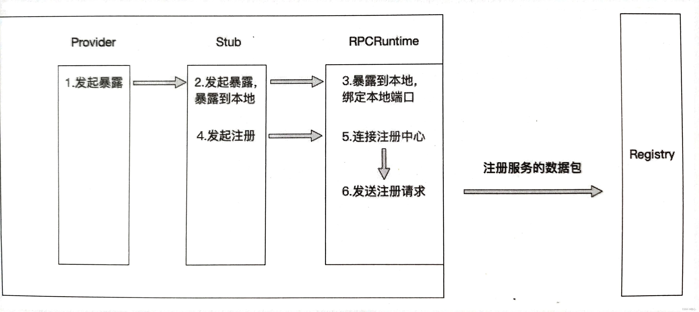
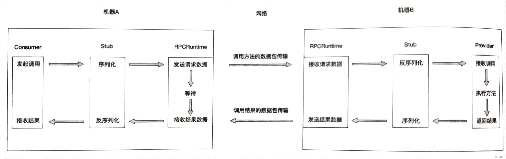

## 一、`RPC`是什么

​	RPC（Remote Procedure  Call）叫作远程过程调用，它是利用网络从远程计算机上请求服务，可以理解为把程序的一部分放在其他远程计算机上执行。通过网络通信将调用请求发送至远程计算机后，利用远程计算机的系统资源执行这部分程序，最终返回远程计算机上的执行结果。

## 二、 `RPC`的核心组成部分

​	`RPC`主要设计五个部分：

- **`user`**（服务调用方）
- **`user-stub`**（调用方的本地存根）
- **`RPCRuntime`**（`RPC`通信者）
- **`server-stub`**（服务端的本地存根）
- **`server`**（服务端）

**服务调用方、调用方的本地存根及其一个`RPC`通信包的实例存在于调用者的机器上**；而**服务提供方、服务提供方的存根及另一个RPC通信包的实例存在于被调用的机器上**。

### 2.1  服务调用方（Consumer）

​	服务调用方也叫服务消费者，它的职责之一是提供需要调用的**接口的全限定名和方法**，调用方法的**参数给调用端的本地存根**；职责之二是从调用方的**本地存根中接收执行结果**。

### 2.2 服务提供方（Provider）

​	服务提供方就是服务端，它的职责就是**提供服务，执行接口实现的方法逻辑**，也就是为服务提供方的本地存根提供方法的具体实现。

### 2.3 本地存根（stub）

在远程调用中，对于Consumer发起的函数调用，Provider如何精准的直到自己应该执行哪个函数呢？

这就需要stub了。**Stub的存在就是为了让远程调用像本地调用一样直接进行函数调用，无须关系地址空间隔离、函数不匹配等问题。**

Stub的职责就是**进行类型和参数转化**。

本地存根分为**服务调用方的本地存根**和**服务提供方的本地存根**。

服务调用方的本地存根和服务消费者都属于Consumer端，它们存在于同一台机器上，服务调用方的本地存根会接收Consumer的函数调用，本地存根会解析函数调用的函数名、参数等信息，整理并且组装这些数据，然后将这些数据安装定义好的协议进行序列化，打包成可传输的消息，交给`RPCRuntime`（`RPC`通信者）。服务调用方的本地存根除了会处理服务消费者提供的方法、参数、方法参数类型等数据，还会处理服务提供方返回的结果，它会将`RPCRuntime`返回的数据反序列化成服务调用方所需要的数据结果并传递给服务消费方。

**从服务消费方的角度来看，Stub隐藏了远程调用的实现细节，就像是远程服务的一个代理对象，可以让服务消费方感觉调用远程服务方法就像调用本地方法一样。**

服务提供方的本地存根与服务提供方都属于Provider端，它们一起存在于同一台机器上。当Provider端的`RPCRuntime`收到请求包后，交由服务提供方的本地存根进行参数等数据的转化。服务提供方的本地存根会重新转换客户端传递的数据，以便在Provider端的机器上找到对应的函数，传递正确的参数数据，最终正确地执行真实函数的调用。等函数执行完成后，服务提供方会将执行结果返回给服务提供方的本地存根，由本地存根再将结果数据序列化、打包，最后交给`RPCRuntime`。**服务提供方的本地存根与服务调用方的本地存根一样都是充当了翻译员的角色。**

### 2.4 `RPC`通信者（`RPCRuntime`）

​	`RPCRuntime`**负责数据包的重传，数据包的确认、数据包路由和加密**等。

​	在`Consumer`端和`Provider`端都会有一个`RPCRuntime`实例，负责双方之间的通信，可靠地将存根船渡地数据包传输到另一端。

## 三、`RPC`调用过程

​	RPC调用过程可以分为四个阶段，分别是服务暴露过程、服务发现过程、服务引用过程和方法调用过程。

### 3.1 服务暴露的过程

服务暴露又称服务导出，服务导出的叫法相对于服务暴露更加形象一些。**服务暴露发生在Provider端。**

**根据服务是否暴露到远程可以分为两种，一种是服务只暴露到本地，另一种则是暴露到远程。**

- **服务只暴露在本地**：在一台机器上，**一个应用服务可以认为是机器上的一个进程**，当该进程启动后，如果不进行服务暴露，那么该进程不会绑定一个端口用于监听和接收Consumer端的连接和请求，反之，该进程会监听本地的端口。**绑定并且监听本地端口的动作则是由前面提到的RPCRuntime完成的**。比如一个Dubbo服务，默认的协议端口是20880，当进程启动后，应用服务进程会监听20880端口。**当应用进程准备好所有应该暴露的服务并且完成端口的绑定和监听后，服务暴露到本地的过程也随之结束**。

- **暴露到远程**：其中的远程其实是指有一个统一的管理中心来管理所有应用服务的地址和服务信息，这个统一的管理中心就是**注册中心(Registry)**。**应用服务暴露到远程的第一步也是在本地绑定端口，过程与暴露到本地一模一样，但是当本地端口绑定完成后，还需要将Provider端的应用服务信息注册到注册中心**。

**Provider端的应用服务信息包括Provider端的地址、端口、应用服务需要暴露的接口定义信息等**。Provider 端除了会在应用服务启动的时候将服务信息注册到注册中心，还会与注册中心**保持心跳保活,如果Provider端某个节点异常下线**，注册中心在一段时间的保活检查后，就会**将该节点的信息从注册中心中移除，防止Consumer端把请求发送到该下线的节点上**。因为业务迭代迅速，服务端的服务变动及上下线很频繁，通过注册中心管理服务的地址信息可以让客户端动态地感知服务变动，并且**客户端不需要再显式地配置服务端地址，只要配置注册中心地址即可，而注册中心集群一般不会变动**。注册中心的内容会在后续更新介绍。

### 3.2 服务发现的过程

**服务发现的过程发生在(Consumer)端**，服务发现的过程也就是寻址的过程，Consumer端如果要发起RPC调用，则需要先知道自己想要调用的应用服务有哪些服务提供者，也就是需要知道这些服务提供者的地址和端口。

**服务发现的方式有两种，分别是直连式和注册中心式，对应的是Provider端的两种服务暴露方式**。

- **直连式**：服务消费者可以根据服务暴露的地址和端口直接连接远程服务，但是每次服务提供者的地址和端口变更后，服务消费者都需要随之变更配置的地址和端口。这种方式不建议在生产环境中使用，更多被用来做服务测试。而且直连式不适合服务治理。**如果Provider端的应用服务仅仅暴露在本地，则Consumer端只能通过直连式来做服务发现**。

- **注册中心式**：服务消费者通过注册中心进行服务发现。也就是**服务提供者的地址和端口从注册中心获取**。当服务提供者变化时，注册中心能够通知服务消费者有关服务提供者的变化。如果Provider端采用暴露到远程的方式暴露服务，则Consumer端可以选择直连式和注册中心式进行服务发现。

### 3.3 服务引用的过程

​	**服务引用的过程发生在服务发现之后**，当Consumer端通过服务发现获取所有服务提供者的地址后，通过负载均衡策略选择其中一个服务提供者的节点进行服务引用。**服务引用的过程就是与某一个服务节点建立连接，以及在Consumer端创建接口的代理的过程。其中建立连接也就是两端的RPCRuntime 建立连接的过程。**

### 3.4 方法调用的过程

​	当服务引用完成后，Consumer端与Provider端已经建立了连接，可以进行方法的调用。

(1)服务消费者以本地调用方式(即以接口的方式)调用服务，它会将需要调用的方法、参数类型、参数传递给服务消费方的本地存根。

(2)服务消费方的本地存根收到调用后，负责将方法、参数等数据组装成能够进行网络传输的消息体(将消息体对象序列化为二进制数据)，并将该消息体传输给RPC通信者。

(3)Consumer 端的RPC通信者通过sockets 将消息发送到Provider端，由Provider端的RPC通信者接收。Provider端将收到的消息传递给服务提供方的本地存根。

(4)服务提供方的本地存根收到消息后将消息对象反序列化。

(5)服务提供方的本地存根根据反序列化的结果解析出服务调用的方法、参数类型、参数等信息，并调用服务提供方的服务。

(6)服务提供方执行对应的方法后，将执行结果返回给服务提供方的本地存根。

(7)服务提供方的本地存根将返回结果序列化，并且打包成可传输的消息体，传递给Provider端的RPC通信者。

(8) Provider端的RPC通信者通过sockets将消息发送到Consumer端，由Consumer端的RPC通信者接收。Consumer端将收到的消息传递给服务消费方的本地存根。

(9)服务消费方的本地存根收到消息后将消息对象反序列化。反序列化出来的是方法执行的结果，并将结果传递给服务消费者。

(10)服务消费者得到最终执行结果。

**服务暴露、服务发现、服务引用和方法调用这四个阶段组成了整个RPC的执行过程。**