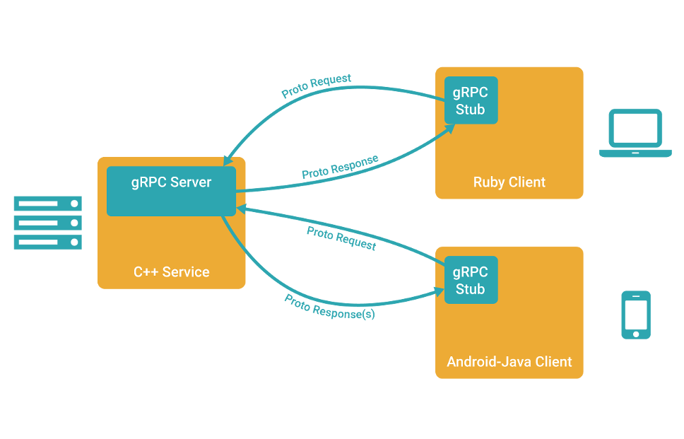
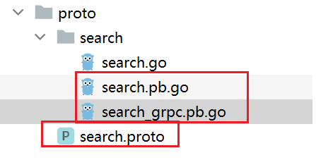
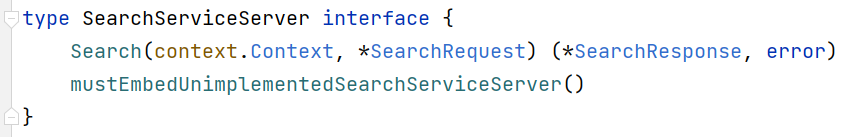
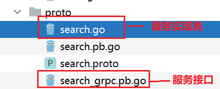
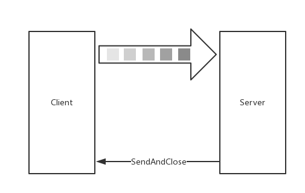
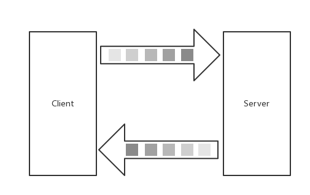

## 一、`grpc`是什么

​	在 `gRPC` 里客户端应用可以像调用本地对象一样直接调用另一台不同的机器上服务端应用的方法，使得您能够更容易地创建分布式应用和服务。与许多 `RPC` 系统类似，**`gRPC` 也是基于以下理念：定义一个服务，指定其能够被远程调用的方法（包含参数和返回类型）。在服务端实现这个接口，并运行一个 `gRPC` 服务器来处理客户端调用。在客户端拥有一个存根能够调用像服务端一样的方法。**



**`grpc`的运作流程：**

1、客户端（gRPC Sub）调用 A 方法，发起 RPC 调用

2、对请求信息使用 Protobuf 进行对象序列化压缩（IDL）

3、服务端（gRPC Server）接收到请求后，解码请求体，进行业务逻辑处理并返回

4、对响应结果使用 Protobuf 进行对象序列化压缩（IDL）

5、客户端接受到服务端响应，解码请求体。回调被调用的 A 方法，唤醒正在等待响应（阻塞）的客户端调用并返回响应结果


官方网站: https://grpc.io/

底层协议: 

- `HTTP2`:https://github.com/grpc/grpc/blob/master/doc/PROTOCOL-HTTP2.md
- `GRPC-WEB`:https://github.com/grpc/grpc/blob/master/doc/PROTOCOL-WEB.md

### 1.1 `grpc`与其他`rpc`框架的比较

| \        | 跨语言 | 多 IDL | 服务治理 | 注册中心 | 服务管理 |
| -------- | ------ | ------ | -------- | -------- | -------- |
| `gRPC`   | √      | ×      | ×        | ×        | ×        |
| `Thrift` | √      | ×      | ×        | ×        | ×        |
| `Rpcx`   | ×      | √      | √        | √        | √        |
| `Dubbo`  | ×      | √      | √        | √        | √        |


## 二、`gRPC`使用示例

### 2.1 下载`grpc`插件

```go
go install google.golang.org/grpc/cmd/protoc-gen-go-grpc@latest
```

这样，`protoc-gen-go-grpc.exe`可执行程序会被下载到 `GOPATH/bin` 目录下。

### 2.2 使用`grpc`插件

编写一个用于测试的 `proto` 文件 ( `search.proto`  ):

```protobuf
syntax = "proto3";

option go_package = "./search";

package proto;

service SearchService {
  rpc Search(SearchRequest) returns (SearchResponse) {}
}

message SearchRequest {
  string request = 1;
}

message SearchResponse {
  string response = 1;
}
```

**使用`protoc-gen-go-grpc.exe`生成`rpc service`相关go文件**，对应的指令是（--go-grpc_out=.）

**同时也要调用`protoc-gen-go.exe`生成message相关go文件**，对应的指令是（--go_out=.）

```shell
protoc --go_out=.  --go-grpc_out=.  .\search.proto
```

注：**`protoc-gen-go.exe`生成message的相关go文件**，用`--go_out=.`来指定生成go源文件路径，**`protoc-gen-go-grpc.exe`生成service相关go文件**，用`--go-grpc_out=.`来指定go源文件路径。


在下述的文件中，`service`目录和其下的两个go源文件即是由上述命令生成的。其中：`search.pb.go`是message的生成go文件；`search_grpc.pb.go`是service生成的go文件。



**`search_grpc_pb.go`提供了rpc服务接口如下：**



### 2.3 生成`go`源文件的解析

#### 2.3.1 `rpc`服务端

下面给出 `rpc服务端` 代码：

```go
package main

import (
	"github.com/go-grpc-example/proto/search"
	"log"
	"net"

	"google.golang.org/grpc"
)

const PORT = "9001"

func main() {
	server := grpc.NewServer()	//生成rpc服务端对象
	serviceObject := new(search.SearchService) //实例化一个对象，该对象实现了SearchServiceServer接口
	search.RegisterSearchServiceServer(server, serviceObject) //为rpc服务端对象注册服务(也就是将上述对象的方法作为回调函数)
	lis, err := net.Listen("tcp", ":"+PORT)
	if err != nil {
		log.Fatalf("net.Listen err: %v", err)
	}

	server.Serve(lis) //rpc服务端对象进行服务暴露(监听对应tcp地址)
}
```

注意：

- 第10行我们new了一个service.SearchService类的对象ServiceObject，它实现了**SearchServiceServer接口**(需要我们手动进行实现)，这个接口就是我们在 search.proto 给出的  SearchService 通过 protoc-gen-go-grpc.exe 工具生成的。
- 11行就是为我们生成的rpcService绑定这个ServiceObject对象，此对象中被实现的接口方法会作为回调函数在rpc服务端被远程调用时启动。

#### 2.3.2 `rpc`服务接口实现

下面给出`service.ServiceProduct类`的实现：

```go
package search

import (
	"context"
)
// 实现服务器的grpc接口(SearchServiceServer接口)
type SearchService struct{}
// 接口规定的方法
func (s *SearchService) Search(ctx context.Context, r *SearchRequest) (*SearchResponse, error) {
	return &SearchResponse{Response: r.GetRequest() + " Server"}, nil
}
// 接口规定的方法
func (s *SearchService) mustEmbedUnimplementedSearchServiceServer() {
}
// 用户自定义的方法
func (s *SearchService) GetResult(reqID uint32) uint32 {
	return (reqID + 100)
}
```

**注意：`rpc`服务接口的实现类必须和`rpc`接口位于同一个包中**



#### 2.3.3 `rpc`客户端实现

最后给出`rpc客户端`的实现：

```go
package main

import (
	"context"
	"github.com/go-grpc-example/proto/search"
	"google.golang.org/grpc/credentials/insecure"
	"log"

	"google.golang.org/grpc"
)

const PORT = "9001"

func main() {
	conn, err := grpc.Dial(":"+PORT, grpc.WithTransportCredentials(insecure.NewCredentials())) //客户端连接服务器
	if err != nil {
		log.Fatalf("grpc.Dial err: %v", err)
	}
	defer conn.Close()

	client := search.NewSearchServiceClient(conn)  //根据conn socket实例化一个rpc客户端对象
	resp, err := client.Search(context.Background(), &search.SearchRequest{
		Request: "gRPC",
	})   //rpc客户端向rpc服务端发送ProductRequest请求，然后获取ProductResponse。整个过程就是在本地调用Service方法
	if err != nil {
		log.Fatalf("client.Search err: %v", err)
	}

	log.Printf("resp: %s", resp.GetResponse())   //显示ProductResponse回应结果
}

```

## 三、`grpc`的流式传输

### 3.1流式`rpc`的介绍与分类

gRPC Streaming 是基于 HTTP/2 的，其工作流程如下：


本章节将介绍 gRPC 的流式，分为三种类型：

- `Server-side streaming RPC`：服务器端流式 `RPC`
- `Client-side streaming RPC`：客户端流式 `RPC`
- `Bidirectional streaming RPC`：双向流式 `RPC`

### 3.2 为什么使用流式`grpc`

流式为什么要存在呢，是 `Simple RPC` 有什么问题吗？通过模拟业务场景，可得知在使用 `Simple RPC` 时，有如下问题：

- 数据包过大造成的瞬时压力
- 接收数据包时，需要所有数据包都接受成功且正确后，才能够回调响应，进行业务处理（无法客户端边发送，服务端边处理）

**比如以下的模拟场景**：

​	每天早上 6 点，都有一批百万级别的数据集要同从 A 同步到 B，在同步的时候，会做一系列操作（归档、数据分析、画像、日志等）。这一次性涉及的数据量确实大

​	在同步完成后，也有人马上会去查阅数据，为了新的一天筹备。也符合实时性。

​	两者相较下，这个场景下更适合使用 `Streaming RPC`.

**总结来说，流式`rpc`适用于以下场景：**

- **大规模数据包**
- **实时场景**

### 3.3 实践——目录结构

```shell
$ tree go-grpc-example
go-grpc-example
├── client
│   ├── simple_client
│   │   └── client.go
│   └── stream_client
│       └── client.go
├── proto
│   ├── search.proto
│   └── stream.proto
└── server
    ├── simple_server
    │   └── server.go
    └── stream_server
        └── server.go
```

### 3.4 实践——`IDL`(`proto`文件)

在 `proto` 文件夹下的 `stream.proto` 文件中，写入如下内容：

```protobuf
syntax = "proto3";

option go_package = "./stream";

package stream;

service StreamService {
    rpc List(StreamRequest) returns (stream StreamResponse) {};   // 返回值为stream类型

    rpc Record(stream StreamRequest) returns (StreamResponse) {};  // 请求值为stream类型

    rpc Route(stream StreamRequest) returns (stream StreamResponse) {};  // 请求、返回值均为stream类型
}


message StreamPoint {
  string name = 1;
  int32 value = 2;
}

message StreamRequest {
  StreamPoint pt = 1;
}

message StreamResponse {
  StreamPoint pt = 1;
}
```

注意**关键字 stream**，声明其为一个流方法。这里共涉及三个方法，对应关系为

- List：用于服务器端流式 `RPC`
- Record：用于客户端流式 `RPC`
- Route：用于双向流式 `RPC`

### 3.5 实践——基础模板 + 空定义

写代码前，建议先将 `gRPC Server `与 `grpc Client` 的基础模板和接口给空定义出来。

#### 3.5.1 服务类

```go
package stream

type StreamService struct {
}

func (s *StreamService) List(r *StreamRequest, stream StreamService_ListServer) error {
	return nil
}
func (s *StreamService) Record(stream StreamService_RecordServer) error {
	return nil
}
func (s *StreamService) Route(stream StreamService_RouteServer) error {
	return nil
}
func (s *StreamService) mustEmbedUnimplementedStreamServiceServer() {

}
```

#### 3.5.2 `Server`

```go
package main

import (
	"github.com/go-grpc-example/proto/stream"
	"google.golang.org/grpc"
	"log"
	"net"
)

const (
	PORT = "9002"
)

func main() {
	server := grpc.NewServer()
	stream.RegisterStreamServiceServer(server, &stream.StreamService{})

	lis, err := net.Listen("tcp", ":"+PORT)
	if err != nil {
		log.Fatalf("net.Listen err: %v", err)
	}

	server.Serve(lis)
}
```

#### 3.5.3 `Client`

```go
package main

import (
	"github.com/go-grpc-example/proto/stream"
	"google.golang.org/grpc"
	"google.golang.org/grpc/credentials/insecure"
	"log"
)

const (
	PORT = "9002"
)

func main() {
	conn, err := grpc.Dial(":"+PORT, grpc.WithTransportCredentials(insecure.NewCredentials()))
	if err != nil {
		log.Fatalf("grpc.Dial err: %v", err)
	}

	defer conn.Close()

	client := stream.NewStreamServiceClient(conn)

	err = printLists(client, &stream.StreamRequest{Pt: &stream.StreamPoint{Name: "gRPC Stream Client: List", Value: 2018}})
	if err != nil {
		log.Fatalf("printLists.err: %v", err)
	}

	err = printRecord(client, &stream.StreamRequest{Pt: &stream.StreamPoint{Name: "gRPC Stream Client: Record", Value: 2018}})
	if err != nil {
		log.Fatalf("printRecord.err: %v", err)
	}

	err = printRoute(client, &stream.StreamRequest{Pt: &stream.StreamPoint{Name: "gRPC Stream Client: Route", Value: 2018}})
	if err != nil {
		log.Fatalf("printRoute.err: %v", err)
	}
}

func printLists(client stream.StreamServiceClient, r *stream.StreamRequest) error {
	return nil
}

func printRecord(client stream.StreamServiceClient, r *stream.StreamRequest) error {
	return nil
}

func printRoute(client stream.StreamServiceClient, r *stream.StreamRequest) error {
	return nil
}

```

### 3.6 实践——`Server-side streaming RPC`：服务器端流式 `RPC`

服务器端流式 RPC，显然是单向流，并代指 **Server 为 Stream 而 Client 为普通 RPC 请求**

简单来讲就是**客户端发起一次普通的 RPC 请求**，**服务端通过流式响应多次发送数据集，客户端 Recv 接收数据集**。大致如图：


#### 3.6.1 服务类

```go
func (s *StreamService) List(r *pb.StreamRequest, stream pb.StreamService_ListServer) error {
   for n := 0; n <= 6; n++ {
		err := stream.Send(&StreamResponse{
			Pt: &StreamPoint{
				Name:  r.Pt.Name,
				Value: r.Pt.Value + int32(n),
			},
		})
		if err != nil {
			return err
		}
	}

	return nil
}
```

留意 `stream.Send` 方法。它看上去能发送 N 次？有没有**大小限制**？

```go
type StreamService_ListServer interface {
    Send(*StreamResponse) error
    grpc.ServerStream
}

func (x *streamServiceListServer) Send(m *StreamResponse) error {
    return x.ServerStream.SendMsg(m)
}
```

通过阅读源码，可得知是 protoc 在生成时，根据定义生成了各式各样符合标准的接口方法。最终再统一调度内部的 `SendMsg` 方法，该方法涉及以下过程:

- 消息体（对象）序列化
- 压缩序列化后的消息体
- 对正在传输的消息体增加 5 个字节的 header
- 判断压缩+序列化后的消息体**总字节长度是否大于预设的 maxSendMessageSize（预设值为 `math.MaxInt32`）**，若超出则提示错误
- 写入给流的数据集

#### 3.6.2 Client

```go
func printLists(client pb.StreamServiceClient, r *pb.StreamRequest) error {
    stream, err := client.List(context.Background(), r)   // 发送请求的同时形成stream流对象
    if err != nil {
        return err
    }

    for {
        resp, err := stream.Recv()  // 利用流对象接收服务端回复
        if err == io.EOF {
            break
        }
        if err != nil {
            return err
        }

        log.Printf("resp: pj.name: %s, pt.value: %d", resp.Pt.Name, resp.Pt.Value)
    }

    return nil
}
```

在 Client，主要留意 **`stream.Recv()` 方法**。**什么情况下 `io.EOF` ？什么情况下存在错误信息呢?**

```go
type StreamService_ListClient interface {
    Recv() (*StreamResponse, error)
    grpc.ClientStream
}

func (x *streamServiceListClient) Recv() (*StreamResponse, error) {
    m := new(StreamResponse)
    if err := x.ClientStream.RecvMsg(m); err != nil {
        return nil, err
    }
    return m, nil
}
```

RecvMsg 会从流中读取完整的 gRPC 消息体，另外通过阅读源码可得知：

（1）RecvMsg 是**阻塞等待的**

（2）RecvMsg 当**流成功/结束（调用了 Close）时，会返回 `io.EOF`**

（3）RecvMsg 当**流出现任何错误时，流会被中止，错误信息会包含 RPC 错误码**。而在 RecvMsg 中可能出现如下错误：

- io.EOF
- io.ErrUnexpectedEOF
- transport.ConnectionError
- google.golang.org/grpc/codes

同时需要注意，**默认的 `MaxReceiveMessageSize` 值为 1024 *1024 * 4**，建议不要超出

#### 3.6.3 验证

运行 stream_server/server.go：

```
$ go run server.go
```

运行 stream_client/client.go：

```
$ go run client.go
2018/09/24 16:18:25 resp: pj.name: gRPC Stream Client: List, pt.value: 2018
2018/09/24 16:18:25 resp: pj.name: gRPC Stream Client: List, pt.value: 2019
2018/09/24 16:18:25 resp: pj.name: gRPC Stream Client: List, pt.value: 2020
2018/09/24 16:18:25 resp: pj.name: gRPC Stream Client: List, pt.value: 2021
2018/09/24 16:18:25 resp: pj.name: gRPC Stream Client: List, pt.value: 2022
2018/09/24 16:18:25 resp: pj.name: gRPC Stream Client: List, pt.value: 2023
2018/09/24 16:18:25 resp: pj.name: gRPC Stream Client: List, pt.value: 2024
```

### 3.7 实践——`Client-side streaming RPC`：客户端流式 `RPC`

客户端流式 RPC，单向流，**客户端**通过流式发起**多次** RPC 请求给服务端，**服务端**发起**一次**响应给客户端，大致如图：



#### 3.7.1 服务类

```go
func (s *StreamService) Record(stream pb.StreamService_RecordServer) error {
    for {
        r, err := stream.Recv()
        if err == io.EOF {
            return stream.SendAndClose(&StreamResponse{Pt: &StreamPoint{Name: "gRPC Stream Server: Record", Value: 1}})
        }
        if err != nil {
            return err
        }

        log.Printf("stream.Recv pt.name: %s, pt.value: %d", r.Pt.Name, r.Pt.Value)
    }

    return nil
}
```

多了一个从未见过的方法 **`stream.SendAndClose`**，它是做什么用的呢？

在这段程序中，我们对每一个 Recv 都进行了处理，当发现 **`io.EOF` (流关闭) 后，将最终的响应结果发送给客户端，同时关闭正在另外一侧等待的 Recv**

#### 3.7.2 Client

```go
func printRecord(client pb.StreamServiceClient, r *pb.StreamRequest) error {
    stream, err := client.Record(context.Background())
    if err != nil {
        return err
    }

    for n := 0; n < 6; n++ {
        err := stream.Send(r)
        if err != nil {
            return err
        }
    }

    resp, err := stream.CloseAndRecv()
    if err != nil {
        return err
    }

    log.Printf("resp: pj.name: %s, pt.value: %d", resp.Pt.Name, resp.Pt.Value)

    return nil
}
```

`stream.CloseAndRecv` 和 `stream.SendAndClose` 是配套使用的流方法，其功能一致。

#### 3.7.3 验证

重启 stream_server/server.go，再次运行 stream_client/client.go：

**stream_client：**

```
$ go run client.go
2018/09/24 16:23:03 resp: pj.name: gRPC Stream Server: Record, pt.value: 1
```

**stream_server：**

```
$ go run server.go
2018/09/24 16:23:03 stream.Recv pt.name: gRPC Stream Client: Record, pt.value: 2018
2018/09/24 16:23:03 stream.Recv pt.name: gRPC Stream Client: Record, pt.value: 2018
2018/09/24 16:23:03 stream.Recv pt.name: gRPC Stream Client: Record, pt.value: 2018
2018/09/24 16:23:03 stream.Recv pt.name: gRPC Stream Client: Record, pt.value: 2018
2018/09/24 16:23:03 stream.Recv pt.name: gRPC Stream Client: Record, pt.value: 2018
2018/09/24 16:23:03 stream.Recv pt.name: gRPC Stream Client: Record, pt.value: 2018
```

### 3.8 实践——`Bidirectional streaming RPC`：双向流式 `RPC`

双向流式 RPC，顾名思义是双向流。由客户端以流式的方式发起请求，服务端同样以流式的方式响应请求

**首个请求一定是 Client 发起**，但**具体交互方式（谁先谁后、一次发多少、响应多少、什么时候关闭）根据程序编写的方式来确定**（可以结合协程）

假设该双向流是**按顺序发送**的话，大致如图：



还是要强调，双向流变化很大，因程序编写的不同而不同。**双向流图示无法适用不同的场景**

#### 3.8.1 Server

```go
func (s *StreamService) Route(stream pb.StreamService_RouteServer) error {
   n := 0
	for {
		err := stream.Send(&StreamResponse{ // 发送一次
			Pt: &StreamPoint{
				Name:  "gPRC Stream Client: Route",
				Value: int32(n),
			},
		})
		if err != nil {
			return err
		}

		r, err := stream.Recv() // 接收一次
		if err == io.EOF {      // 会因为客户端的退出而终止
			return nil
		}
		if err != nil {
			return err
		}

		n++

		log.Printf("stream.Recv pt.name: %s, pt.value: %d", r.Pt.Name, r.Pt.Value)
	}

	return nil
}
```

#### 3.8.2 Client

```go
func printRoute(client pb.StreamServiceClient, r *pb.StreamRequest) error {
    stream, err := client.Route(context.Background())
    if err != nil {
        return err
    }

    for n := 0; n <= 6; n++ {
        err = stream.Send(r)   // 发送一次
        if err != nil {
            return err
        }

        resp, err := stream.Recv()  // 接收一次
        if err == io.EOF {
            break
        }
        if err != nil {
            return err
        }

        log.Printf("resp: pj.name: %s, pt.value: %d", resp.Pt.Name, resp.Pt.Value)
    }

    stream.CloseSend()

    return nil
}
```

#### 3.8.3 验证

重启 stream_server/server.go，再次运行 stream_client/client.go：

**stream_server**

```
$ go run server.go
2018/09/24 16:29:43 stream.Recv pt.name: gRPC Stream Client: Route, pt.value: 2018
2018/09/24 16:29:43 stream.Recv pt.name: gRPC Stream Client: Route, pt.value: 2018
2018/09/24 16:29:43 stream.Recv pt.name: gRPC Stream Client: Route, pt.value: 2018
2018/09/24 16:29:43 stream.Recv pt.name: gRPC Stream Client: Route, pt.value: 2018
2018/09/24 16:29:43 stream.Recv pt.name: gRPC Stream Client: Route, pt.value: 2018
2018/09/24 16:29:43 stream.Recv pt.name: gRPC Stream Client: Route, pt.value: 2018
```

**stream_client**

```
$ go run client.go
2018/09/24 16:29:43 resp: pj.name: gPRC Stream Client: Route, pt.value: 0
2018/09/24 16:29:43 resp: pj.name: gPRC Stream Client: Route, pt.value: 1
2018/09/24 16:29:43 resp: pj.name: gPRC Stream Client: Route, pt.value: 2
2018/09/24 16:29:43 resp: pj.name: gPRC Stream Client: Route, pt.value: 3
2018/09/24 16:29:43 resp: pj.name: gPRC Stream Client: Route, pt.value: 4
2018/09/24 16:29:43 resp: pj.name: gPRC Stream Client: Route, pt.value: 5
2018/09/24 16:29:43 resp: pj.name: gPRC Stream Client: Route, pt.value: 6
```