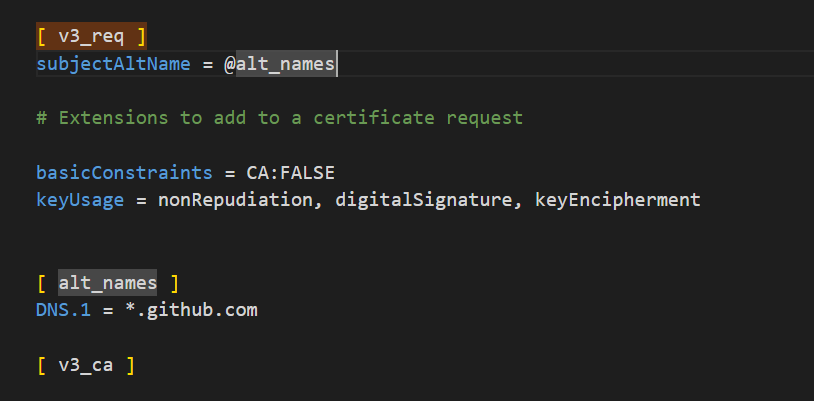

## 一、为什么需要`TLS`

在前面的章节里，我们介绍了 `gRPC` 的四种 `API` 使用方式。

此时存在一个安全问题，先前的例子中 `gRPC Client/Server` 都是**明文传输的**，会不会有被窃听的风险呢？

从结论上来讲，是有的。**在明文通讯的情况下，你的请求就是裸奔的，有可能被第三方恶意篡改或者伪造为“非法”的数据**


客户端与服务端之间的`rpc`调用，我们可以通过加入证书的方式，实现调用的安全性。

`grpc`使用的证书来自于`TLS`协议，关于`TLS`协议相关内容请阅读：`SSL/TLS/HTTPS`详解。


## 二、生成`TLS`证书

### 2.1 安装`openssl`

- `windows`下安装`openssl`

  - windows版本：http://slproweb.com/products/Win32OpenSSL.html


  - 配置PATH环境变量 (`openSSL`的bin目录)

  

  - 检查`openssl`版本

  ```shell
  openssl version  可以查看版本
  ```

- `linux`下安装`openssl`
  - 待补充

### 2.2 生成私钥文件`.key`

```shell
## 需要手动输入密码
openssl genrsa -des3 -out ca.key 2048   ## 生成ca.key私钥文件
```

### 2.3 创建证书请求`.csr`

```shell
openssl req -new -key ca.key -out ca.csr  ## 生成ca.csr证书请求文件
```

### 2.4 生成证书文件`.crt`

```shell
openssl x509 -req -days 365 -in ca.csr -signkey ca.key -out ca.crt   ## 生成ca.crt证书文件
```

### 2.5 拷贝一份`openssl.cnf`配置文件

- 可以通过以下命令查看`openssl.cnf`文件的路径：

```shell
openssl version -d
```


- 将`openssl.cnf`文件拷贝到项目`/conf`目录下：


- 取消`copy_extensions = copy`的注释


- 取消`req_extensions = v3_req`的注释


- 找到`[ v3_req ]`,添加 `subjectAltName = @alt_names`

- 添加新的标签 [ alt_names ] 和标签字段

```ini
[ alt_names ]

DNS.1 = *.github.com   // 此处用于指定客户端可以用证书访问到的服务器的域名, *起到通配符作用
```



### 2.7 生成证书私钥`server.key`

```shell
openssl genpkey -algorithm RSA -out server.key
```

### 2.8 通过私钥`server.key`生成证书请求文件`server.csr`

```shell
openssl req -new -nodes -key server.key -out server.csr -days 3650 -config ./openssl.cnf -extensions v3_req
```

### 2.9 生成SAN证书`server.pem`

​	SAN（Subject Alternative Name）本质上是 `pem`文件，它是 `SSL` 标准 `x509` 中定义的一个扩展。使用了 `SAN` 字段的 `SSL` 证书，可以**扩展此证书支持的域名**，使得一个证书可以支持多个不同域名的解析。

```shell
openssl x509 -req -days 365 -in server.csr -out server.pem -CA ca.crt -CAkey ca.key -CAcreateserial -extfile ./openssl.cnf -extensions v3_req
```

​	**`go1.17` 之后的版本规定证书文件必须为`SAN`证书**

### 2.9 名词总结

- **`key`：** 服务器上的私钥文件，用于对发送给客户端数据的加密，以及对从客户端接收到数据的解密。
- **`csr`：** 证书签名请求文件，用于提交给证书颁发机构（CA）对证书签名。
- **`crt`：** 由证书颁发机构（CA）签名后的证书，或者是开发者自签名的证书，包含证书持有人的信息，持有人的公钥，以及签署者的签名等信息。
- **`pem`：** 是基于`Base64`编码的证书格式，扩展名包括`PEM`、`CRT`和`CER`。


### 2.10 生成完毕

生成证书结束后，将证书相关文件放到 `conf/ `下，目录结构：

```
$ tree /f
go-grpc-example
│
├─client
│  ├─simple_client
│  │      client.go
│  │
│  └─stream_client
│          client.go
│
├─conf
│      ca.crt
│      ca.csr
│      ca.key
│      openssl.cnf
│      server.csr
│      server.key
│      server.pem
│
├─proto
│  │  search.proto
│  │  stream.proto
│  │
│  ├─search
│  │      search.go
│  │      search.pb.go
│  │      search_grpc.pb.go
│  │
│  └─stream
│          stream.go
│          stream.pb.go
│          stream_grpc.pb.go
│
└─server
    ├─simple_server
    │      server.go
    │
    └─stream_server
            server.go
```

## 三、`TLS Server`

修改`go-grpc-example\server\stream_server\server.go`：

```go
…………

func main(){
    
    c, err := credentials.NewServerTLSFromFile("./conf/server.pem", "./conf/server.key")
	if err != nil {
		log.Fatalf("credentials.NewServerTLSFromFile err: %v", err)
	}

	server := grpc.NewServer(grpc.Creds(c))
    
    ……………………
}
```

- `credentials.NewServerTLSFromFile`：根据服务端输入的证书文件和密钥构造 `TLS` 凭证

```go
func NewServerTLSFromFile(certFile, keyFile string) (TransportCredentials, error) {
    cert, err := tls.LoadX509KeyPair(certFile, keyFile)
    if err != nil {
        return nil, err
    }
    return NewTLS(&tls.Config{Certificates: []tls.Certificate{cert}}), nil
}
```

- `grpc.Creds()`：返回一个 `ServerOption`，用于设置服务器连接的凭据。用于 `grpc.NewServer(opt ...ServerOption)` 为 `gRPC Server `设置连接选项

```go
func Creds(c credentials.TransportCredentials) ServerOption {
    return func(o *options) {
        o.creds = c
    }
}
```

## 四、`TLS Client`

修改`go-grpc-example\client\stream_client\client.go`：

```go
……………………

func main() {
    c, err := credentials.NewClientTLSFromFile("./conf/server.pem", "www.github.com")
	if err != nil {
		log.Fatalf("credentials.NewClientTLSFromFile err: %v", err)
	}

	conn, err := grpc.Dial(":"+PORT, grpc.WithTransportCredentials(c))
	if err != nil {
		log.Fatalf("grpc.Dial err: %v", err)
	}
    …………………………
}
```

- `credentials.NewClientTLSFromFile()`：根据客户端输入的证书文件和密钥构造 `TLS` 凭证。`serverNameOverride` 为服务名称

```go
func NewClientTLSFromFile(certFile, serverNameOverride string) (TransportCredentials, error) {
    b, err := ioutil.ReadFile(certFile)
    if err != nil {
        return nil, err
    }
    cp := x509.NewCertPool()
    if !cp.AppendCertsFromPEM(b) {
        return nil, fmt.Errorf("credentials: failed to append certificates")
    }
    return NewTLS(&tls.Config{ServerName: serverNameOverride, RootCAs: cp}), nil
}
```

- `grpc.WithTransportCredentials()`：返回一个配置连接的 `DialOption` 选项。用于 `grpc.Dial(target string, opts ...DialOption)` 设置连接选项

```go
func WithTransportCredentials(creds credentials.TransportCredentials) DialOption {
    return newFuncDialOption(func(o *dialOptions) {
        o.copts.TransportCredentials = creds
    })
}
```

## 五、验证

### 5.1 `Client`

```
2023/02/24 19:08:55 resp: pj.name: gRPC Stream Client: List, pt.value: 2018
2023/02/24 19:08:55 resp: pj.name: gRPC Stream Client: List, pt.value: 2019
2023/02/24 19:08:55 resp: pj.name: gRPC Stream Client: List, pt.value: 2020
2023/02/24 19:08:55 resp: pj.name: gRPC Stream Client: List, pt.value: 2021
2023/02/24 19:08:55 resp: pj.name: gRPC Stream Client: List, pt.value: 2022
2023/02/24 19:08:55 resp: pj.name: gRPC Stream Client: List, pt.value: 2023
2023/02/24 19:08:55 resp: pj.name: gRPC Stream Client: List, pt.value: 2024
2023/02/24 19:08:55 resp: pj.name: gRPC Stream Server: Record, pt.value: 1 
2023/02/24 19:08:55 resp: pj.name: gPRC Stream Client: Route, pt.value: 0  
2023/02/24 19:08:55 resp: pj.name: gPRC Stream Client: Route, pt.value: 1  
2023/02/24 19:08:55 resp: pj.name: gPRC Stream Client: Route, pt.value: 2  
2023/02/24 19:08:55 resp: pj.name: gPRC Stream Client: Route, pt.value: 3  
………………………………………………………………………………………………………………………………………………………………………………………………
```

### 5.2 `Server`

```
2023/02/24 19:07:42 stream.Recv pt.name: gRPC Stream Client: Record, pt.value: 2018
2023/02/24 19:07:42 stream.Recv pt.name: gRPC Stream Client: Record, pt.value: 2018
2023/02/24 19:07:42 stream.Recv pt.name: gRPC Stream Client: Record, pt.value: 2018
2023/02/24 19:07:42 stream.Recv pt.name: gRPC Stream Client: Record, pt.value: 2018
2023/02/24 19:07:42 stream.Recv pt.name: gRPC Stream Client: Record, pt.value: 2018
2023/02/24 19:07:42 stream.Recv pt.name: gRPC Stream Client: Record, pt.value: 2018
2023/02/24 19:07:42 stream.Recv pt.name: gRPC Stream Client: Route, pt.value: 2018 
2023/02/24 19:07:42 stream.Recv pt.name: gRPC Stream Client: Route, pt.value: 2018 
2023/02/24 19:07:42 stream.Recv pt.name: gRPC Stream Client: Route, pt.value: 2018 
………………………………………………………………………………………………………………………………………………………………………………………………………………………………
```

