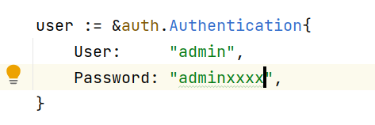
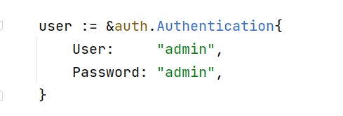

## 一、服务端添加用户名密码的校验

```go
func main() {

	var authInterceptor grpc.UnaryServerInterceptor // 定义一个拦截器用来做token验证
	authInterceptor = func(
		ctx context.Context,
		req interface{},
		info *grpc.UnaryServerInfo,
		handler grpc.UnaryHandler,
	) (resp interface{}, err error) {
		err = Auth(ctx) // 拦截普通方法请求，验证 Token
		if err != nil { // 验证失败，直接退出
			return
		}
		return handler(ctx, req) // 如果验证成功，则继续处理请求
	}

	server := grpc.NewServer(grpc.UnaryInterceptor(authInterceptor))
	serviceObject := new(search.SearchService)
	search.RegisterSearchServiceServer(server, serviceObject)

	lis, err := net.Listen("tcp", ":"+PORT)
	if err != nil {
		log.Fatalf("net.Listen err: %v", err)
	}

	server.Serve(lis)
}

func Auth(ctx context.Context) error {
	md, ok := metadata.FromIncomingContext(ctx)
	if !ok {
		return fmt.Errorf("missing credentials")
	}
	var user string
	var password string

	if val, ok := md["user"]; ok {
		user = val[0]
	}
	if val, ok := md["password"]; ok {
		password = val[0]
	}

	if user != "admin" || password != "admin" {
		return status.Errorf(codes.Unauthenticated, "token不合法")
	}
	return nil
}

```

**注意：使用拦截器做`token`认证，必须是普通`rpc`通信方式，而不能是流模式。**


## 二、客户端实现

### 2.1 实现`PerRPCCredentials`接口

客户端需要实现下面的 `PerRPCCredentials` 接口。

```go
type PerRPCCredentials interface {
	// GetRequestMetadata gets the current request metadata, refreshing
	// tokens if required. This should be called by the transport layer on
	// each request, and the data should be populated in headers or other
	// context. If a status code is returned, it will be used as the status
	// for the RPC. uri is the URI of the entry point for the request.
	// When supported by the underlying implementation, ctx can be used for
	// timeout and cancellation. Additionally, RequestInfo data will be
	// available via ctx to this call.
	// TODO(zhaoq): Define the set of the qualified keys instead of leaving
	// it as an arbitrary string.
	GetRequestMetadata(ctx context.Context, uri ...string) (map[string]string, error)
	// RequireTransportSecurity indicates whether the credentials requires
	// transport security.
	RequireTransportSecurity() bool
}
```

`GetRequestMetadata` 方法返回认证需要的必要信息，`RequireTransportSecurity` 方法表示是否启用安全链接，在生产环境中，一般都是启用的，但为了测试方便，暂时这里不启用了。

**具体实现：**

```go
type Authentication struct {
    User     string
    Password string
}

func (a *Authentication) GetRequestMetadata(context.Context, ...string) (
    map[string]string, error,
) {
    return map[string]string{"user": a.User, "password": a.Password}, nil
}

func (a *Authentication) RequireTransportSecurity() bool {
    return false
}
```

### 2.2 客户端代码

```go
func main() {

	user := &auth.Authentication{
		User:     "admin",
		Password: "admin",
	}

	conn, err := grpc.Dial(":"+PORT, grpc.WithTransportCredentials(insecure.NewCredentials()), grpc.WithPerRPCCredentials(user))
	if err != nil {
		log.Fatalf("grpc.Dial err: %v", err)
	}
	defer conn.Close()

	client := search.NewSearchServiceClient(conn)
	resp, err := client.Search(context.Background(), &search.SearchRequest{
		Request: "gRPC",
	})
	if err != nil {
		log.Fatalf("client.Search err: %v", err)
	}

	log.Printf("resp: %s", resp.GetResponse())
}
```

## 三、验证

### 3.1 情况一：客户端用户名密码不匹配



```go
2023/02/24 21:48:51 client.Search err: rpc error: code = Unauthenticated desc = token不合法
```

### 3.2 情况二：客户端用户名密码匹配



```go
2023/02/24 21:49:38 resp: gRPC Server
```

