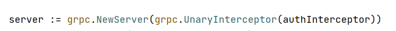

## 一、`grpc`拦截器的介绍

​	拦截器（interceptor）在每个 `RPC` 方法的前或后做某些事情。

​	在 `gRPC` 中，大类可分为两种 `RPC` 方法，与拦截器的对应关系是：

- **普通方法：一元拦截器（`grpc.UnaryInterceptor`）**
- **流方法：流拦截器（`grpc.StreamInterceptor`）**

### 1.1 一元拦截器 `grpc.UnaryInterceptor`

```go
func UnaryInterceptor(i UnaryServerInterceptor) ServerOption {
    return func(o *options) {
        if o.unaryInt != nil {
            panic("The unary server interceptor was already set and may not be reset.")
        }
        o.unaryInt = i
    }
}
```

通过查看上述源码可得知，要完成一个拦截器需要**实现 `UnaryServerInterceptor` 方法**。

```go
type UnaryServerInterceptor func(ctx context.Context, req interface{}, info *UnaryServerInfo, handler UnaryHandler) (resp interface{}, err error)
```

形参如下：

- `ctx context.Context`：请求上下文
- `req interface{}`：`RPC` 方法的请求参数
- `info *UnaryServerInfo`：`RPC` 方法的所有信息
- `handler UnaryHandler`：`RPC` 方法本身

### 1.2 流拦截器 `grpc.StreamInterceptor`

 ```go
 func StreamInterceptor(i StreamServerInterceptor) ServerOption
 ```

同样的，完成一个流拦截器必须**实现`StreamServerInterceptor`方法**

```go
type StreamServerInterceptor func(srv interface{}, ss ServerStream, info *StreamServerInfo, handler StreamHandler) error
```

### 1.3 为一个拦截器设置多种拦截功能

​	`grpc`本身的功能只支持为一个拦截器设置一个拦截方法，如下：



​	一个一元拦截器`grpc.UnaryInterceptor`仅支持设置一个拦截方法`authInterceptor`。但是通常来说我们可能需要一个拦截器完成多种任务，比如一次性完成：身份验证、日志记录、消息、验证、重试或监视等一系列功能。

​	为了达成这样的效果，我们可以使用开源项目 [go-grpc-middleware](https://github.com/grpc-ecosystem/go-grpc-middleware) 解决这个问题，如下：

```go
import "github.com/grpc-ecosystem/go-grpc-middleware"

myServer := grpc.NewServer(
    grpc.StreamInterceptor(grpc_middleware.ChainStreamServer(   // 一个流拦截器一次性完成了多个功能
        grpc_ctxtags.StreamServerInterceptor(),
        grpc_opentracing.StreamServerInterceptor(),
        grpc_prometheus.StreamServerInterceptor,
        grpc_zap.StreamServerInterceptor(zapLogger),
        grpc_auth.StreamServerInterceptor(myAuthFunction),
        grpc_recovery.StreamServerInterceptor(),
    )),
    grpc.UnaryInterceptor(grpc_middleware.ChainUnaryServer(   // 一个一元拦截器一次性完成了多个功能
        grpc_ctxtags.UnaryServerInterceptor(),
        grpc_opentracing.UnaryServerInterceptor(),
        grpc_prometheus.UnaryServerInterceptor,
        grpc_zap.UnaryServerInterceptor(zapLogger),
        grpc_auth.UnaryServerInterceptor(myAuthFunction),
        grpc_recovery.UnaryServerInterceptor(),
    )),
)
```

## 二、实践

导入[go-grpc-middleware](https://github.com/grpc-ecosystem/go-grpc-middleware) 包：

```
go get github.com/grpc-ecosystem/go-grpc-middleware
```

开始编写 `gRPC interceptor` 的代码，我们会将为一个一元拦截器实现以下拦截功能：

- `logging`：`RPC` 方法的入参出参的日志输出
- `recover`：`RPC` 方法的异常保护和日志输出

### 2.1 `logging`

```go
func LoggingInterceptor(ctx context.Context, req interface{}, info *grpc.UnaryServerInfo, handler grpc.UnaryHandler) (interface{}, error) {
    log.Printf("gRPC method: %s, %v", info.FullMethod, req)
    resp, err := handler(ctx, req)
    log.Printf("gRPC method: %s, %v", info.FullMethod, resp)
    return resp, err
}
```

### 2.2 `recover`

```go
func RecoveryInterceptor(ctx context.Context, req interface{}, info *grpc.UnaryServerInfo, handler grpc.UnaryHandler) (resp interface{}, err error) {
    defer func() {
        if e := recover(); e != nil {
            debug.PrintStack()
            err = status.Errorf(codes.Internal, "Panic err: %v", e)
        }
    }()

    return handler(ctx, req)
}
```

### 2.3 `server`

```go
package main

import (
	"context"
	"fmt"
	"github.com/go-grpc-example/proto/search"
	grpc_middleware "github.com/grpc-ecosystem/go-grpc-middleware"
	"google.golang.org/grpc/codes"
	"google.golang.org/grpc/metadata"
	"google.golang.org/grpc/status"
	"log"
	"net"
	"runtime/debug"

	"google.golang.org/grpc"
)

const PORT = "9001"

func main() {

	server := grpc.NewServer(grpc.UnaryInterceptor(grpc_middleware.ChainUnaryServer(authInterceptor, LoggingInterceptor, RecoveryInterceptor)))
	serviceObject := new(search.SearchService)
	search.RegisterSearchServiceServer(server, serviceObject)

	lis, err := net.Listen("tcp", ":"+PORT)
	if err != nil {
		log.Fatalf("net.Listen err: %v", err)
	}

	server.Serve(lis)
}

func authInterceptor(ctx context.Context, req interface{}, info *grpc.UnaryServerInfo, handler grpc.UnaryHandler) (resp interface{}, err error) {
	err = Auth(ctx) // 拦截普通方法请求，验证 Token
	if err != nil { // 验证失败，直接退出
		return
	}
	return handler(ctx, req) // 如果验证成功，则继续处理请求
}

func Auth(ctx context.Context) error {
	md, ok := metadata.FromIncomingContext(ctx)
	if !ok {
		return fmt.Errorf("missing credentials")
	}
	var user string
	var password string

	if val, ok := md["user"]; ok {
		user = val[0]
	}
	if val, ok := md["password"]; ok {
		password = val[0]
	}

	if user != "admin" || password != "admin" {
		return status.Errorf(codes.Unauthenticated, "token不合法")
	}
	return nil
}

func LoggingInterceptor(ctx context.Context, req interface{}, info *grpc.UnaryServerInfo, handler grpc.UnaryHandler) (interface{}, error) {
	log.Printf("gRPC method: %s, %v", info.FullMethod, req)
	resp, err := handler(ctx, req)
	log.Printf("gRPC method: %s, %v", info.FullMethod, resp)
	return resp, err
}

func RecoveryInterceptor(ctx context.Context, req interface{}, info *grpc.UnaryServerInfo, handler grpc.UnaryHandler) (resp interface{}, err error) {
	defer func() {
		if e := recover(); e != nil {
			debug.PrintStack()
			err = status.Errorf(codes.Internal, "Panic err: %v", e)
		}
	}()

	return handler(ctx, req)
}
```

### 2.4 验证

- **服务端**（正常）

```
2023/02/25 12:35:31 gRPC method: /proto.SearchService/Search, request:"gRPC"
2023/02/25 12:35:31 gRPC method: /proto.SearchService/Search, response:"gRPC Server"
```

- **客户端**（正常）

```
2023/02/25 12:39:21 resp: gRPC Server
```

- **服务端（人为制造panic错误）**

 ```
 服务端会报错，但是不会退出，可以继续为客户端提供RPC服务
 ```

- **客户端(人为制造panic错误)**

​	获得服务端的错误提示

```
2023/02/25 12:42:49 client.Search err: rpc error: code = Internal desc = Panic err: Man-made error
```

