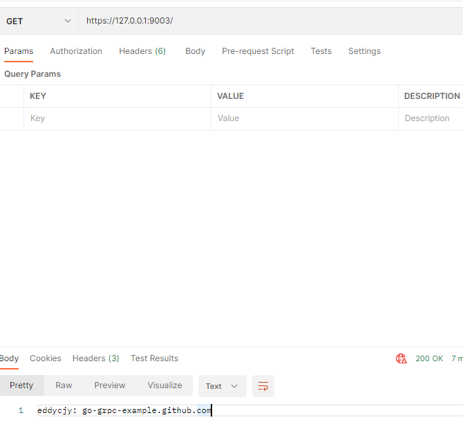

## 一、需求

- 接口需要提供给其他业务组访问，但是 `RPC` 协议不同无法内调，对方问能否走 HTTP 接口，怎么办？
- 微信（公众号、小程序）等第三方回调接口只支持 HTTP 接口，怎么办

## 二、可能性分析

​	关键一点，**`gRPC` 的协议是基于 `HTTP/2` 的，因此应用程序能够在单个 `TCP` 端口上提供 `HTTP/1.1` 和 `gRPC` 接口服务（两种不同的流量）**

​	实现的流程可以参考以下代码，通过检测消息头的相关`key-value`来判定是`grpc`还是`https`

```go
if r.ProtoMajor == 2 && strings.Contains(r.Header.Get("Content-Type"), "application/grpc") {
    server.ServeHTTP(w, r)   // 提供grpc服务器
} else {
    mux.ServeHTTP(w, r)   // 提供https服务
}
```

简单总结步骤是：

1. 检测请求协议是否为 `HTTP/2`
2. 判断 `Content-Type` 是否为 `application/grpc`（`gRPC` 的默认标识位）
3. 根据协议的不同转发到不同的服务处理

## 三、同时提供`https`和`rpc`服务

### 3.1 封装`TLS`服务

​	`grpc`和`https`都需要使用`TLS`服务，因此这里对其进行封装：

- 在`pkg/gtls/server.go`目录下提供服务器的`TLS`注册服务：

```go
package gtls

import (
	"crypto/tls"
	"crypto/x509"
	"errors"
	"google.golang.org/grpc/credentials"
	"io/ioutil"
)
type Server struct {
	CaFile   string // CA根证书路径
	CertFile string // 服务器证书(公钥)
	KeyFile  string // 服务器私钥
}
// 双向认证
func (t *Server) GetCredentialsByCA() (credentials.TransportCredentials, error) {
	cert, err := tls.LoadX509KeyPair(t.CertFile, t.KeyFile)
	if err != nil {
		return nil, err
	}
	certPool := x509.NewCertPool()
	ca, err := ioutil.ReadFile(t.CaFile)
	if err != nil {
		return nil, err
	}
	if ok := certPool.AppendCertsFromPEM(ca); !ok {
		return nil, errors.New("certPool.AppendCertsFromPEM err")
	}
	c := credentials.NewTLS(&tls.Config{
		Certificates: []tls.Certificate{cert},
		ClientAuth:   tls.RequireAndVerifyClientCert,
		ClientCAs:    certPool,
	})
	return c, err
}
// 单向认证
func (t *Server) GetTLSCredentials() (credentials.TransportCredentials, error) {
	c, err := credentials.NewServerTLSFromFile(t.CertFile, t.KeyFile)
	if err != nil {
		return nil, err
	}
	return c, err
}
```

- 在`pkg/gtls/client.go`目录下提供客户端的`TLS`注册服务：

```go
package gtls

import (
	"crypto/tls"
	"crypto/x509"
	"google.golang.org/grpc/credentials"
	"io/ioutil"
)
type Client struct {
	ServerName string // rpc服务域名
	CaFile     string // CA根证书路径
	CertFile   string // 客户端证书(公钥)
	KeyFile    string // 客户端私钥
}
// 双向认证
func (t *Client) GetCredentialsByCA() (credentials.TransportCredentials, error) {
	cert, err := tls.LoadX509KeyPair(t.CertFile, t.KeyFile)
	if err != nil {
		return nil, err
	}
	certPool := x509.NewCertPool()
	ca, err := ioutil.ReadFile(t.CaFile)
	if err != nil {
		return nil, err
	}
	if ok := certPool.AppendCertsFromPEM(ca); !ok {
		return nil, err
	}
	c := credentials.NewTLS(&tls.Config{
		Certificates: []tls.Certificate{cert},
		ServerName:   t.ServerName,
		RootCAs:      certPool,
	})
	return c, err
}
// 单向认证
func (t *Client) GetTLSCredentials() (credentials.TransportCredentials, error) {
	c, err := credentials.NewClientTLSFromFile(t.CertFile, t.ServerName)
	if err != nil {
		return nil, err
	}
	return c, err
}
```

### 3.2 目录结构

```
go-grpc-example
│
├─client
│  ├─auth
│  │      auth.go
│  │
│  ├─simple_client
│  │      client.go
│  │
│  ├─simple_http_client
│  │      client.go
│  │
│  └─stream_client
│          client.go
│
├─conf
│      ca.crt
│      ca.csr
│      ca.key
│      client.csr
│      client.key
│      client.pem
│      openssl.cnf
│      server.csr
│      server.key
│      server.pem
│
├─pkg
│  └─gtls
│          client.go
│          server.go
│
├─proto
│  │  search.proto
│  │  stream.proto
│  │
│  ├─search
│  │      search.go
│  │      search.pb.go
│  │      search_grpc.pb.go
│  │
│  └─stream
│          stream.go
│          stream.pb.go
│          stream_grpc.pb.go
│
└─server
    ├─simple_http_server
    │      server.go
    │
    ├─simple_server
    │      server.go
    │
    └─stream_server
            server.go
```

### 3.3 Server

在 simple_http_server 目录下新建 server.go，写入文件内容：

```go
package main

import (
	"github.com/go-grpc-example/pkg/gtls"
	"github.com/go-grpc-example/proto/search"
	"google.golang.org/grpc"
	"log"
	"net/http"
	"strings"
)

const PORT = "9003"

func main() {
	certFile := "./conf/server.pem"
	keyFile := "./conf/server.key"
	tlsServer := gtls.Server{
		CertFile: certFile,
		KeyFile:  keyFile,
	}
	c, err := tlsServer.GetTLSCredentials()
	if err != nil {
		log.Fatalf("tlsServer.GetTLSCredentials err: %v", err)
	}
	mux := GetHTTPServeMux()

	server := grpc.NewServer(grpc.Creds(c))
	search.RegisterSearchServiceServer(server, &search.SearchService{})

	http.ListenAndServeTLS(":"+PORT,
		certFile,
		keyFile,
		http.HandlerFunc(func(w http.ResponseWriter, r *http.Request) {
			if r.ProtoMajor == 2 && strings.Contains(r.Header.Get("Content-Type"), "application/grpc") {
				server.ServeHTTP(w, r)
			} else {
				mux.ServeHTTP(w, r)
			}
			return
		}),
	)
}
func GetHTTPServeMux() *http.ServeMux {
	mux := http.NewServeMux()
	mux.HandleFunc("/", func(w http.ResponseWriter, r *http.Request) {
		w.Write([]byte("eddycjy: go-grpc-example.github.com"))
	})
	return mux
}
```


### 3.4 Client

在 simple_http_server 目录下新建 client.go，写入文件内容：

```go
package main

import (
	"context"
	"github.com/go-grpc-example/pkg/gtls"
	"github.com/go-grpc-example/proto/search"
	"google.golang.org/grpc"
	"log"
)

const PORT = "9003"

func main() {
	tlsClient := gtls.Client{
		ServerName: "go-grpc-example.github.com",
		CertFile:   "./conf/server.pem",
	}
	c, err := tlsClient.GetTLSCredentials()
	if err != nil {
		log.Fatalf("tlsClient.GetTLSCredentials err: %v", err)
	}
	conn, err := grpc.Dial(":"+PORT, grpc.WithTransportCredentials(c))
	if err != nil {
		log.Fatalf("grpc.Dial err: %v", err)
	}
	defer conn.Close()

	client := search.NewSearchServiceClient(conn)
	resp, err := client.Search(context.Background(), &search.SearchRequest{
		Request: "gRPC",
	})
	if err != nil {
		log.Fatalf("client.Search err: %v", err)
	}
	log.Printf("resp: %s", resp.GetResponse())
}
```

### 3.5 验证

#### 3.5.1 `grpc Client`

```go
2023/02/25 13:25:36 resp: gRPC Server
```

#### 3.5.2 `https Client`

```
eddycjy: go-grpc-example.github.com
```

