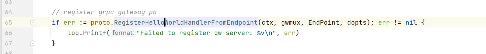
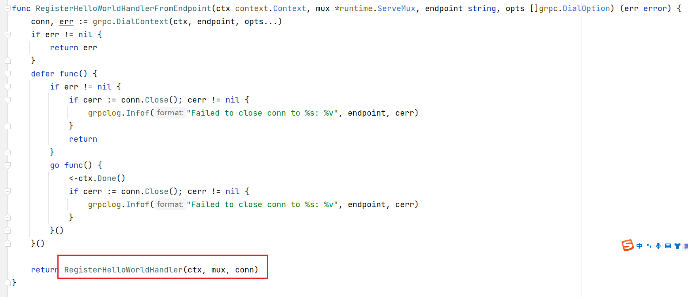
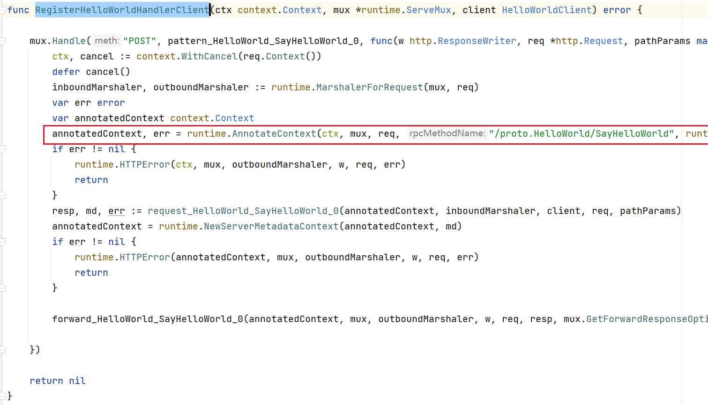
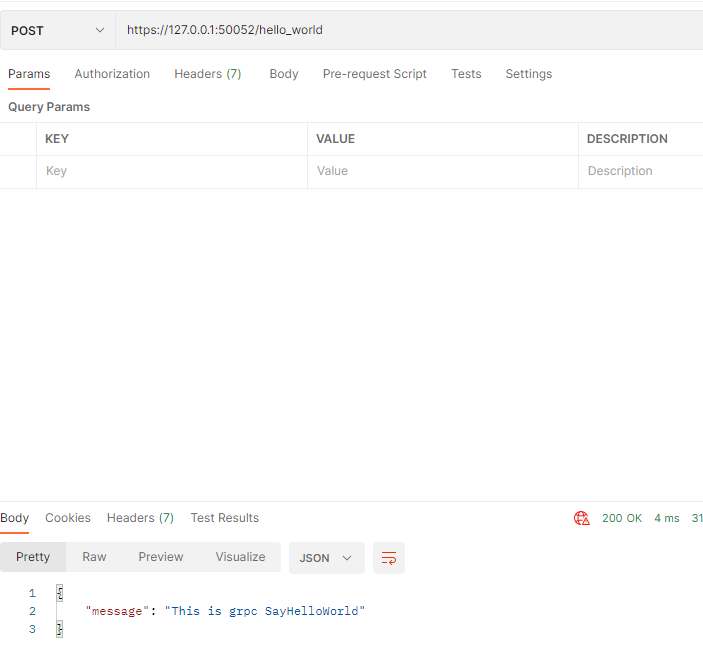

## 一、`Grpc-gateway`是什么

​	[grpc-gateway](https://github.com/grpc-ecosystem/grpc-gateway)是`protoc`的一个插件。它读取`gRPC`服务定义，并生成一个反向代理服务器，**将`RESTful JSON API`转换为`gRPC`**。此服务器是根据`gRPC`定义中的自定义选项生成的。

### 1.1 `Grpc-gateway`的使用场景

​	假定我们有一个项目需求，希望用`Rpc`作为内部`API`的通讯，同时也想对外提供`Restful Api`，写两套又太繁琐不符合。此时就可以考虑使用`Grpc-gateway`。


### 1.2 安装

工具链依赖

- proto转go

```
go install google.golang.org/protobuf/cmd/protoc-gen-go@latest
```

- grpc

```
go install google.golang.org/grpc/cmd/protoc-gen-go-grpc@latest
```

- grpc-gateway

```
go install github.com/grpc-ecosystem/grpc-gateway/v2/protoc-gen-grpc-gateway@latest
```

- 对客户端提供服务的API依赖

```
go install github.com/grpc-ecosystem/grpc-gateway/v2/protoc-gen-openapiv2@latest
```

此时我们查看`GOPATH`目录，可以看到多出了以下4个可执行文件：


## 二、初始化工作

### 2.1 初始化目录

目录结构为：

```
grpc-gateway-example/
├── cert
├── client
├── cmd
├── pkg
├── proto
│   ├── google
│   │   └── api
└── server
```

- `cert`：证书凭证
- `client`：客户端
- `cmd`：命令行
- `pkg`：第三方公共模块
- `proto`：`protobuf`的一些相关文件（含`.proto`、`pb.go`、`.pb.gw.go`)，`google/api`中用于存放`annotations.proto`、`http.proto`
- `server`：服务端

### 2.2 制作证书

​	在`cert`目录下完成证书的制作，具体略，见  `04.grpc+TLS单向认证`

### 2.3 `proto`文件的编写与编译

​	首先需要将`grpc-gateway-example`项目目录下的`proto`文件夹添加到`GOland`的`Protocal buffer`中的`Import Path`下。（**这样做的目的是为了保证用户自定义的`proto`文件在使用`google/api`中用于存放`annotations.proto`、`http.proto`能够找的到**）


#### 2.3.1  `google/api`下的两个`proto`文件

`	google`官方提供的两个`api`描述文件，主要是针对`grpc-gateway`的`http`转换提供支持，定义了`Protocol Buffer`所扩展的`HTTP Option`

- **`annotations.proto`文件**

​	该文件添加到`google/api`目录下。

```protobuf
// Copyright (c) 2015, Google Inc.
//
// Licensed under the Apache License, Version 2.0 (the "License");
// you may not use this file except in compliance with the License.
// You may obtain a copy of the License at
//
//     http://www.apache.org/licenses/LICENSE-2.0
//
// Unless required by applicable law or agreed to in writing, software
// distributed under the License is distributed on an "AS IS" BASIS,
// WITHOUT WARRANTIES OR CONDITIONS OF ANY KIND, either express or implied.
// See the License for the specific language governing permissions and
// limitations under the License.

syntax = "proto3";

package google.api;

import "google/api/http.proto";
import "google/protobuf/descriptor.proto";

option java_multiple_files = true;
option java_outer_classname = "AnnotationsProto";
option java_package = "com.google.api";

extend google.protobuf.MethodOptions {
  // See `HttpRule`.
  HttpRule http = 72295728;
}
```

- **`http.proto`文件：**

```protobuf
/ Copyright 2016 Google Inc.
//
// Licensed under the Apache License, Version 2.0 (the "License");
// you may not use this file except in compliance with the License.
// You may obtain a copy of the License at
//
//     http://www.apache.org/licenses/LICENSE-2.0
//
// Unless required by applicable law or agreed to in writing, software
// distributed under the License is distributed on an "AS IS" BASIS,
// WITHOUT WARRANTIES OR CONDITIONS OF ANY KIND, either express or implied.
// See the License for the specific language governing permissions and
// limitations under the License.

syntax = "proto3";

package google.api;

option cc_enable_arenas = true;
option java_multiple_files = true;
option java_outer_classname = "HttpProto";
option java_package = "com.google.api";


// Defines the HTTP configuration for a service. It contains a list of
// [HttpRule][google.api.HttpRule], each specifying the mapping of an RPC method
// to one or more HTTP REST API methods.
message Http {
  // A list of HTTP rules for configuring the HTTP REST API methods.
  repeated HttpRule rules = 1;
}

// Use CustomHttpPattern to specify any HTTP method that is not included in the
// `pattern` field, such as HEAD, or "*" to leave the HTTP method unspecified for
// a given URL path rule. The wild-card rule is useful for services that provide
// content to Web (HTML) clients.
message HttpRule {
  // Selects methods to which this rule applies.
  //
  // Refer to [selector][google.api.DocumentationRule.selector] for syntax details.
  string selector = 1;

  // Determines the URL pattern is matched by this rules. This pattern can be
  // used with any of the {get|put|post|delete|patch} methods. A custom method
  // can be defined using the 'custom' field.
  oneof pattern {
    // Used for listing and getting information about resources.
    string get = 2;

    // Used for updating a resource.
    string put = 3;

    // Used for creating a resource.
    string post = 4;

    // Used for deleting a resource.
    string delete = 5;

    // Used for updating a resource.
    string patch = 6;

    // Custom pattern is used for defining custom verbs.
    CustomHttpPattern custom = 8;
  }

  // The name of the request field whose value is mapped to the HTTP body, or
  // `*` for mapping all fields not captured by the path pattern to the HTTP
  // body. NOTE: the referred field must not be a repeated field.
  string body = 7;

  // Additional HTTP bindings for the selector. Nested bindings must
  // not contain an `additional_bindings` field themselves (that is,
  // the nesting may only be one level deep).
  repeated HttpRule additional_bindings = 11;
}

// A custom pattern is used for defining custom HTTP verb.
message CustomHttpPattern {
  // The name of this custom HTTP verb.
  string kind = 1;

  // The path matched by this custom verb.
  string path = 2;
}
```

#### 2.3.2 自定义的`hello.proto`

这一小节将编写`Demo`的`.proto`文件，我们在`proto`目录下新建`hello.proto`文件，写入文件内容：

```protobuf
syntax = "proto3";
package proto;
option go_package ="./";   // 指定编译后的go文件的保存路径为当前目录
import "google/api/annotations.proto";

service HelloWorld {
    rpc SayHelloWorld(HelloWorldRequest) returns (HelloWorldResponse) {
        option (google.api.http) = {
            post: "/hello_world"
            body: "*"
        };
    }
}
message HelloWorldRequest {
    string referer = 1;
}
message HelloWorldResponse {
    string message = 1;
}
```

在`hello.proto`文件中，引用了`google/api/annotations.proto`，达到支持`HTTP Option`的效果

- 定义了一个`service`RPC服务`HelloWorld`，在其内部定义了一个`HTTP Option`的**`POST`方法**，**`HTTP`响应路径为`/hello_world`**
- 定义`message`类型`HelloWorldRequest`、`HelloWorldResponse`，用于响应请求和返回结果

### 2.4 编译

```shell
protoc --go_out=.  --go-grpc_out=.  .\google\api\*.proto
protoc --go_out=.  --go-grpc_out=.  .\hello.proto    ## 针对grpc的支持
protoc --grpc-gateway_out=logtostderr=true:.  .\hello.proto   ## 针对grpc-gateway的支持
```

#### 2.4.1 问题一

运行第一条指令进行编译时，我们会遇到以下错误：

```
PS C:\Users\hp-pc\GolandProjects\grpc-gateway-example\proto> protoc --go_out=.  --go-grpc_out=.  .\google\api\*.proto
protoc-gen-go: unable to determine Go import path for "google/api/http.proto"

Please specify either:
        • a "go_package" option in the .proto source file, or
        • a "M" argument on the command line.

See https://developers.google.com/protocol-buffers/docs/reference/go-generated#package for more information.

--go_out: protoc-gen-go: Plugin failed with status code 1.

```

原因是没有指定编译后的go源文件的存放路径，我们需要在`annotations.proto`和`http.proto`中手动添加以下内容：

```protobuf
option go_package ="./";  // 指定生成的go文件存放到当前目录下
```

#### 2.4.2 问题二

​	编译后的go文件可能会出现爆红，因为缺少某些依赖。可以通过指令`go mod tidy`来下载相关依赖

#### 2.4.3 问题三

​	编译后的go文件的`package`包名可能是`__`，需要手动进行修改，比如这里需要将所有包名改为`package proto`

#### 2.4.4 完成编译后的`proto`目录


## 三、命令行模块

### 3.1 介绍

这一小节我们编写命令行模块，为什么要独立出来呢，是为了将`cmd`和`server`两者解耦，避免混淆在一起。

我们采用 [Cobra](https://github.com/spf13/cobra) 来完成这项功能，`Cobra`既是创建强大的现代CLI应用程序的库，也是生成应用程序和命令文件的程序。提供了以下功能：

- 简易的子命令行模式
- 完全兼容posix的命令行模式(包括短和长版本)
- 嵌套的子命令
- 全局、本地和级联`flags`
- 使用`Cobra`很容易的生成应用程序和命令，使用`cobra create appname`和`cobra add cmdname`
- 智能提示
- 自动生成commands和flags的帮助信息
- 自动生成详细的help信息`-h`，`--help`等等
- 自动生成的bash自动完成功能
- 为应用程序自动生成手册
- 命令别名
- 定义您自己的帮助、用法等的灵活性。
- 可选与[viper](https://github.com/spf13/viper)紧密集成的apps

### 3.2 如何使用

#### 3.2.1 使用`cmd`完成`server`模块命令行参数的获取

1. 在`server`模块下 新建`server.go`文件，写入**测试**内容：

```go
package server

import (
    "log"
)

var (
    ServerPort string
    CertName string
    CertPemPath string
    CertKeyPath string
)

func Serve() (err error){
    log.Println(ServerPort)

    log.Println(CertName)

    log.Println(CertPemPath)

    log.Println(CertKeyPath)

    return nil
}
```

2. 在`cmd`模块下 新建`root.go`文件，写入内容：

```go
package cmd

import (
    "fmt"
    "os"
    "github.com/spf13/cobra"
)

var rootCmd = &cobra.Command{  //定义根命令行对象，跟命令行对象之下可以有多个子命令行对象(可以输入不同的命令行参数进行选择)
    Use:   "grpc",   // 跟命令行对象的名称
    Short: "Run the gRPC hello-world server",  //使用help命令输出中显示的简短描述
}

func Execute() {
    if err := rootCmd.Execute(); err != nil {   // 执行根命令行对象
        fmt.Println(err)
        os.Exit(-1)
    }
}
```

3. 在`cmd`模块下新建`server.go`文件，写入内容：

```go
var serverCmd = &cobra.Command{   // 用于server模块的子命令行对象
    Use:   "server",    // 名称
    Short: "Run the gRPC hello-world server",
    Run: func(cmd *cobra.Command, args []string) {
        defer func() {
            if err := recover(); err != nil {
                log.Println("Recover error : %v", err)
            }
        }()

        server.Serve()
    },
}

func init() {   // init函数，获取命令行参数，导入到server模块对应变量中
    serverCmd.Flags().StringVarP(&server.ServerPort, "port", "p", "50052", "server port")
    serverCmd.Flags().StringVarP(&server.ServerPemPath, "cert-pem", "", "./cert/server.pem", "cert pem path")
    serverCmd.Flags().StringVarP(&server.ServerKeyPath, "cert-key", "", "./cert/server.key", "cert key path")
    serverCmd.Flags().StringVarP(&server.ServerCertName, "cert-name", "", "www.github.com", "server's hostname")
    rootCmd.AddCommand(serverCmd)   // 将serverCmd作为rootCmd的子命令行对象
}
```

4. 我们在`grpc-hello-world/`目录下，新建文件`main.go`，写入内容：

```go
package main

import (
    "grpc-hello-world/cmd"
)

func main() {
    cmd.Execute()   // 运行rootCmd根命令行对象
}
```

#### 3.2.2 使用`cmd`完成`client`模块命令行参数的获取

1. 在`client`模块下 新建`client.go`文件，写入**测试**内容：

```go
package client

import "log"

var (
	ServerPort  string
	CertName    string
	CertPemPath string
	CertKeyPath string
)

func Client() (err error) {
	log.Println(ServerPort)

	log.Println(CertName)

	log.Println(CertPemPath)

	log.Println(CertKeyPath)

	return nil
}
```

2. 在`cmd`模块下新建`client.go`文件，写入内容：

```go
package cmd

import (
	"github.com/grpc-gateway-example/client"
	"github.com/spf13/cobra"
	"log"
)

var clientCmd = &cobra.Command{
	Use:   "client",
	Short: "Run the gRPC hello-world client",
	Run: func(cmd *cobra.Command, args []string) {
		defer func() {
			if err := recover(); err != nil {
				log.Println("Recover error : %v", err)
			}
		}()

		client.Client()
	},
}

func init() {   // 为了在显示测试的时候有所区分，对默认值进行了修改
	clientCmd.Flags().StringVarP(&client.ServerPort, "port", "p", "50052~~~", "server port")
	clientCmd.Flags().StringVarP(&client.CertPemPath, "cert-pem", "", "./certs/server.pem~~~", "cert pem path")
	clientCmd.Flags().StringVarP(&client.CertKeyPath, "cert-key", "", "./certs/server.key~~~", "cert key path")
	clientCmd.Flags().StringVarP(&client.CertName, "cert-name", "", "grpc server name~~~", "server's hostname")
	rootCmd.AddCommand(clientCmd)
}
```

#### 3.2.3 测试

- 回到`grpc-hello-world/`目录下执行`go run main.go`  **(不选用任何子命令行对象，就会运行根命令行对象)**

```shell
Run the gRPC hello-world server

Usage:
  grpc [command]

Available Commands:
  client      Run the gRPC hello-world client
  completion  Generate the autocompletion script for the specified shell
  help        Help about any command
  server      Run the gRPC hello-world server

Flags:
  -h, --help   help for grpc

Use "grpc [command] --help" for more information about a command.
```


**`arg[1]`是子命令行的名称，在本例子中可以指定`server`或者`client`，选用对应的子命令行**

- 再执行`go run main.go server`，查看输出是否为（此时应为默认值）：

```shell
2023/02/26 12:24:20 50052
2023/02/26 12:24:20 grpc server name
2023/02/26 12:24:20 ./certs/server.pem
```

- 再执行`go run main.go client`:

```shell
2023/02/26 12:28:24 50052~~~
2023/02/26 12:28:24 grpc server name~~~
2023/02/26 12:28:24 ./certs/server.pem~~~
2023/02/26 12:28:24 ./certs/server.key~~~
```

- 执行`go run main.go server --port=8000 --cert-pem=test-pem --cert-key=test-key --cert-name=test-name`，检验命令行参数是否正确：

```shell
2023/02/26 12:48:20 8000
2023/02/26 12:48:20 test-name
2023/02/26 12:48:20 test-pem
2023/02/26 12:48:20 test-key
```

## 四、服务端模块

### 5.1 编写`hello.go` --- 实现`HelloWorldServer`服务接口 （用户需要修改）

在`server`目录下新建文件`hello.go`，写入文件内容：

```go
package server

import (
	"context"
	"github.com/grpc-gateway-example/proto"
)

type helloService struct{}

func NewHelloService() *helloService {
	return &helloService{}
}

func (h helloService) SayHelloWorld(ctx context.Context, r *proto.HelloWorldRequest) (*proto.HelloWorldResponse, error) {
	return &proto.HelloWorldResponse{
		Message: "This is grpc SayHelloWorld",
	}, nil
}

func (h helloService) mustEmbedUnimplementedHelloWorldServer() {
}
```

我们创建了`helloService`及其方法`SayHelloWorld`，对应`.proto`的`rpc SayHelloWorld`，这个方法需要有2个参数：`ctx context.Context`用于接受上下文参数、`r *proto.HelloWorldRequest`用于接受`protobuf`的`Request`参数（对应`.proto`的`message HelloWorldRequest`）

### 5.2 编写`server.go`

#### 5.2.1 基于`grpc`和`http`的路由区分服务  (用户不需要修改)

​	在`pkg`下新建`util`目录，新建`grpc.go`文件，写入内容：

```go
package utils

import (
	"google.golang.org/grpc"
	"net/http"
	"strings"
)

func GrpcHandlerFunc(grpcServer *grpc.Server, otherHandler http.Handler) http.Handler {
	if otherHandler == nil {
		return http.HandlerFunc(func(w http.ResponseWriter, r *http.Request) {
			grpcServer.ServeHTTP(w, r)
		})
	}
	return http.HandlerFunc(func(w http.ResponseWriter, r *http.Request) {
		if r.ProtoMajor == 2 && strings.Contains(r.Header.Get("Content-Type"), "application/grpc") {
			grpcServer.ServeHTTP(w, r)
		} else {
			otherHandler.ServeHTTP(w, r)
		}
	})
}
```

`GrpcHandlerFunc`函数是用**于判断请求是来源于`Rpc`客户端还是`Restful Api`的请求**，根据不同的请求注册不同的`ServeHTTP`服务；`r.ProtoMajor == 2`也代表着请求必须基于`HTTP/2`

#### 5.2.2 封装`tls`服务用于`https`  （用户不需要修改）

```go
package utils

import (
	"crypto/tls"
	"golang.org/x/net/http2"
	"io/ioutil"
	"log"
)

func GetTLSConfig(serverPemPath, serverKeyPath string) *tls.Config {
	var certKeyPair *tls.Certificate
	cert, _ := ioutil.ReadFile(serverPemPath)
	key, _ := ioutil.ReadFile(serverKeyPath)

	pair, err := tls.X509KeyPair(cert, key)
	if err != nil {
		log.Println("TLS KeyPair err: %v\n", err)
	}

	certKeyPair = &pair

	return &tls.Config{
		Certificates: []tls.Certificate{*certKeyPair},
		NextProtos:   []string{http2.NextProtoTLS},
	}
}
```

#### 5.2.3 重新修改`server`目录下的`server.go`文件 （用户不需要修改）

```go
package server

import (
	"context"
	"crypto/tls"
	"github.com/grpc-ecosystem/grpc-gateway/v2/runtime"
	"github.com/grpc-gateway-example/pkg/utils"
	"github.com/grpc-gateway-example/proto"
	"google.golang.org/grpc"
	"google.golang.org/grpc/credentials"
	"log"
	"net"
	"net/http"
)

var (
	ServerPort     string
	ServerCertName string
	ServerPemPath  string
	ServerKeyPath  string
	EndPoint       string
)

func Serve() (err error) {
	EndPoint = ":" + ServerPort
	conn, err := net.Listen("tcp", EndPoint)
	if err != nil {
		log.Printf("TCP Listen err:%v\n", err)
	}

	tlsConfig := utils.GetTLSConfig(ServerPemPath, ServerKeyPath)
	srv := createInternalServer(conn, tlsConfig)

	log.Printf("gRPC and https listen on: %s\n", ServerPort)

	if err = srv.Serve(tls.NewListener(conn, tlsConfig)); err != nil {
		log.Printf("ListenAndServe: %v\n", err)
	}

	return err
}

func createInternalServer(conn net.Listener, tlsConfig *tls.Config) *http.Server {
	var opts []grpc.ServerOption

	creds, err := credentials.NewServerTLSFromFile(ServerPemPath, ServerKeyPath) // 根据服务端证书和私钥构造服务端的TLS证书凭证
	if err != nil {
		log.Printf("Failed to create server TLS credentials %v", err)
	}

	opts = append(opts, grpc.Creds(creds))
	grpcServer := grpc.NewServer(opts...) // 创建一个需要TLS验证的grpc服务器

	proto.RegisterHelloWorldServer(grpcServer, NewHelloService()) // 为grpc服务器注册服务

	ctx := context.Background()
	dcreds, err := credentials.NewClientTLSFromFile(ServerPemPath, ServerCertName) // 根据服务端证书和服务域名构造客户端的TLS证书凭证
	if err != nil {
		log.Printf("Failed to create client TLS credentials %v", err)
	}
	dopts := []grpc.DialOption{grpc.WithTransportCredentials(dcreds)}
	gwmux := runtime.NewServeMux()

	// register grpc-gateway pb
	if err := proto.RegisterHelloWorldHandlerFromEndpoint(ctx, gwmux, EndPoint, dopts); err != nil {
		log.Printf("Failed to register gw server: %v\n", err)
	}

	// http服务
	mux := http.NewServeMux()
	mux.Handle("/", gwmux)

	return &http.Server{
		Addr:      EndPoint,
		Handler:   utils.GrpcHandlerFunc(grpcServer, mux),
		TLSConfig: tlsConfig,
	}
}
```

## 五、验证功能

### 6.1 编写测试客户端

​	在`grpc-hello-world/`下新建目录`client`，新建`client.go`文件，新增内容：

```go
package main

import (
	"context"
	"github.com/grpc-gateway-example/proto"
	"google.golang.org/grpc"
	"google.golang.org/grpc/credentials"
	"log"
)

func main() {
    // 需要指定服务端的证书和证书域名
	creds, err := credentials.NewClientTLSFromFile("./cert/server.pem", "www.github.com")
	if err != nil {
		log.Println("Failed to create TLS credentials %v", err)
	}
	conn, err := grpc.Dial(":50052", grpc.WithTransportCredentials(creds))  // 创建grpc连接
	defer conn.Close()

	if err != nil {
		log.Println(err)
	}

	c := proto.NewHelloWorldClient(conn)  // 根据grpc连接创建grpc服务
	context := context.Background()
	body := &proto.HelloWorldRequest{
		Referer: "Grpc",
	}

    r, err := c.SayHelloWorld(context, body)   // 调用服务端的HelloWorld服务的SayHelloWorld()方法
	if err != nil {
		log.Println(err)
	}

	log.Println(r.Message)
}
```

注：由于客户端只是展示测试用，就简单的来了，原本它理应归类到`cobra`的管控下，配置管理等等都应可控化

### 6.2 启动服务端

回到`grpc-hello-world/`目录下，启动服务端`go run main.go server`，成功则仅返回

```shell
2023/02/26 14:18:19 gRPC and https listen on: 50052
```

### 6.3 执行测试客户端

回到`client`目录下，启动客户端`go run client.go`，成功则返回 (**远程调用了`HelloWorld`服务的`SayHelloWorld()`方法**)

```shell
2023/02/26 14:18:36 This is grpc SayHelloWorld
```

### 6.4 执行测试`Restful Api`

为了执行本测试，我们**需要知道当前`rpc`服务提供的`Restful api`具体是什么：使用的是`POST`还是`GET` ？ 接口的`url`是什么？**

为了解答这一问题，我们需要来到`server`模块的`server.go`中，下面这段代码为我们的`grpc-gateway`注册了服务：



查看此函数`RegisterHelloWorldHandlerFromEndpoint()`，发现其底层调用了`RegisterHelloWorldHandler()`：



继续往下查询，最终发现调用的底层函数是：`RegisterHelloWorldHandlerClient()`:



通过查看此函数，我们可以知道，**`grpc-gateway`将原本的`grpc`服务注册为了`POST`请求，请求的`url`就是注册`rpc`服务的名称(下划线命名格式)**，具体可以看下面这段代码：

```go
annotatedContext, err = runtime.AnnotateContext(ctx, mux, req, "/proto.HelloWorld/SayHelloWorld", runtime.WithHTTPPathPattern("/hello_world"))
```

**这与我们在`.proto`中定义服务时设置的`option`完全一致**：

```protobuf
service HelloWorld {
  rpc SayHelloWorld(HelloWorldRequest) returns (HelloWorldResponse) {
    option (google.api.http) = {
      post: "/hello_world"     // post方法，url路径为/hello_world
      body: "*"
    };
  }
}
```

因此，**当用户以`POST`方法访问`https://127.0.0.1:50052/hello_world`时，程序会自动调用`HelloWorld`服务的`SayHelloWorld`方法。并且将响应值以`json`的方式进行返回。**



## 六、最终目录结构

```shell
grpc-gateway-example/
│
├─cert
│      ca.crt
│      ca.csr
│      ca.key
│      openssl.cnf
│      server.csr
│      server.key
│      server.pem
│
├─client
│      client.go
│
├─cmd
│      root.go
│      server.go
│
├─pkg
│  └─utils
│          grpc.go
│          tls.go
│
├─proto
│  │  annotations.pb.go
│  │  hello.pb.go
│  │  hello.pb.gw.go
│  │  hello.proto
│  │  hello_grpc.pb.go
│  │  http.pb.go
│  │
│  └─google
│      └─api
│              annotations.proto
│              http.proto
│
└─server
        hello.go
        server.go
```

