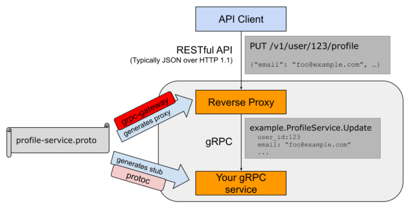
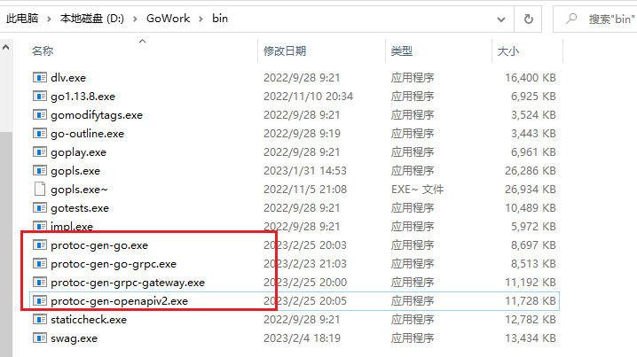
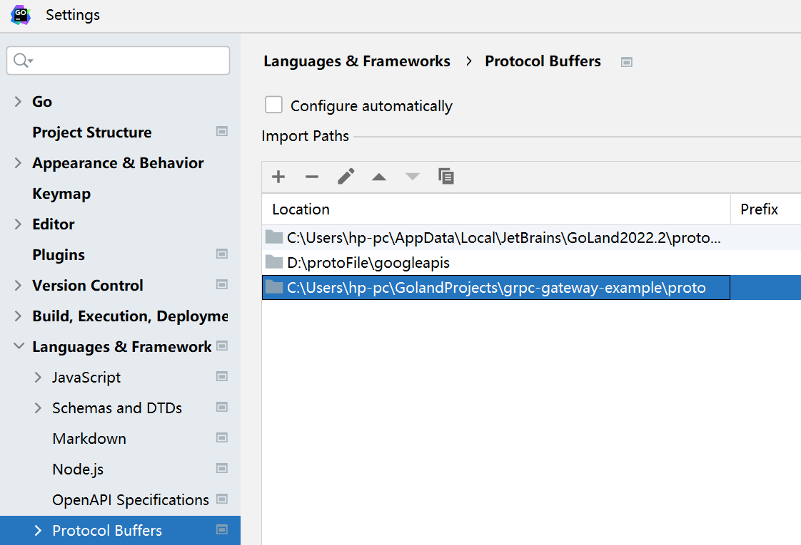
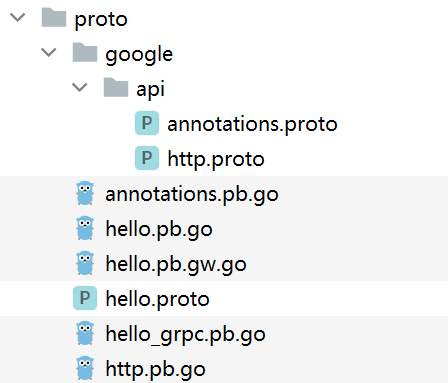

## 一、`Grpc-gateway`是什么

​	[grpc-gateway](https://github.com/grpc-ecosystem/grpc-gateway)是`protoc`的一个插件。它读取`gRPC`服务定义，并生成一个反向代理服务器，**将`RESTful JSON API`转换为`gRPC`**。此服务器是根据`gRPC`定义中的自定义选项生成的。

### 1.1 `Grpc-gateway`的使用场景

​	假定我们有一个项目需求，希望用`Rpc`作为内部`API`的通讯，同时也想对外提供`Restful Api`，写两套又太繁琐不符合。此时就可以考虑使用`Grpc-gateway`。



### 1.2 安装

工具链依赖

- proto转go

```
go install google.golang.org/protobuf/cmd/protoc-gen-go@latest
```

- grpc

```
go install google.golang.org/grpc/cmd/protoc-gen-go-grpc@latest
```

- grpc-gateway

```
go install github.com/grpc-ecosystem/grpc-gateway/v2/protoc-gen-grpc-gateway@latest
```

- 对客户端提供服务的API依赖

```
go install github.com/grpc-ecosystem/grpc-gateway/v2/protoc-gen-openapiv2@latest
```

此时我们查看`GOPATH`目录，可以看到多出了以下4个可执行文件：



## 二、初始化工作

### 2.1 初始化目录

目录结构为：

```
grpc-gateway-example/
├── cert
├── client
├── cmd
├── pkg
├── proto
│   ├── google
│   │   └── api
└── server
```

- `cert`：证书凭证
- `client`：客户端
- `cmd`：命令行
- `pkg`：第三方公共模块
- `proto`：`protobuf`的一些相关文件（含`.proto`、`pb.go`、`.pb.gw.go`)，`google/api`中用于存放`annotations.proto`、`http.proto`
- `server`：服务端

### 2.2 制作证书

​	在`cert`目录下完成证书的制作，具体略，见  `04.grpc+TLS单向认证`

### 2.3 `proto`文件的编写与编译

​	首先需要将`grpc-gateway-example`项目目录下的`proto`文件夹添加到`GOland`的`Protocal buffer`中的`Import Path`下。（**这样做的目的是为了保证用户自定义的`proto`文件在使用`google/api`中用于存放`annotations.proto`、`http.proto`能够找的到**）



#### 2.3.1  `google/api`下的两个`proto`文件

`	google`官方提供的两个`api`描述文件，主要是针对`grpc-gateway`的`http`转换提供支持，定义了`Protocol Buffer`所扩展的`HTTP Option`

- **`annotations.proto`文件**

​	该文件添加到`google/api`目录下。

```protobuf
// Copyright (c) 2015, Google Inc.
//
// Licensed under the Apache License, Version 2.0 (the "License");
// you may not use this file except in compliance with the License.
// You may obtain a copy of the License at
//
//     http://www.apache.org/licenses/LICENSE-2.0
//
// Unless required by applicable law or agreed to in writing, software
// distributed under the License is distributed on an "AS IS" BASIS,
// WITHOUT WARRANTIES OR CONDITIONS OF ANY KIND, either express or implied.
// See the License for the specific language governing permissions and
// limitations under the License.

syntax = "proto3";

package google.api;

import "google/api/http.proto";
import "google/protobuf/descriptor.proto";

option java_multiple_files = true;
option java_outer_classname = "AnnotationsProto";
option java_package = "com.google.api";

extend google.protobuf.MethodOptions {
  // See `HttpRule`.
  HttpRule http = 72295728;
}
```

- **`http.proto`文件：**

```protobuf
/ Copyright 2016 Google Inc.
//
// Licensed under the Apache License, Version 2.0 (the "License");
// you may not use this file except in compliance with the License.
// You may obtain a copy of the License at
//
//     http://www.apache.org/licenses/LICENSE-2.0
//
// Unless required by applicable law or agreed to in writing, software
// distributed under the License is distributed on an "AS IS" BASIS,
// WITHOUT WARRANTIES OR CONDITIONS OF ANY KIND, either express or implied.
// See the License for the specific language governing permissions and
// limitations under the License.

syntax = "proto3";

package google.api;

option cc_enable_arenas = true;
option java_multiple_files = true;
option java_outer_classname = "HttpProto";
option java_package = "com.google.api";


// Defines the HTTP configuration for a service. It contains a list of
// [HttpRule][google.api.HttpRule], each specifying the mapping of an RPC method
// to one or more HTTP REST API methods.
message Http {
  // A list of HTTP rules for configuring the HTTP REST API methods.
  repeated HttpRule rules = 1;
}

// Use CustomHttpPattern to specify any HTTP method that is not included in the
// `pattern` field, such as HEAD, or "*" to leave the HTTP method unspecified for
// a given URL path rule. The wild-card rule is useful for services that provide
// content to Web (HTML) clients.
message HttpRule {
  // Selects methods to which this rule applies.
  //
  // Refer to [selector][google.api.DocumentationRule.selector] for syntax details.
  string selector = 1;

  // Determines the URL pattern is matched by this rules. This pattern can be
  // used with any of the {get|put|post|delete|patch} methods. A custom method
  // can be defined using the 'custom' field.
  oneof pattern {
    // Used for listing and getting information about resources.
    string get = 2;

    // Used for updating a resource.
    string put = 3;

    // Used for creating a resource.
    string post = 4;

    // Used for deleting a resource.
    string delete = 5;

    // Used for updating a resource.
    string patch = 6;

    // Custom pattern is used for defining custom verbs.
    CustomHttpPattern custom = 8;
  }

  // The name of the request field whose value is mapped to the HTTP body, or
  // `*` for mapping all fields not captured by the path pattern to the HTTP
  // body. NOTE: the referred field must not be a repeated field.
  string body = 7;

  // Additional HTTP bindings for the selector. Nested bindings must
  // not contain an `additional_bindings` field themselves (that is,
  // the nesting may only be one level deep).
  repeated HttpRule additional_bindings = 11;
}

// A custom pattern is used for defining custom HTTP verb.
message CustomHttpPattern {
  // The name of this custom HTTP verb.
  string kind = 1;

  // The path matched by this custom verb.
  string path = 2;
}
```

#### 2.3.2 自定义的`hello.proto`

这一小节将编写`Demo`的`.proto`文件，我们在`proto`目录下新建`hello.proto`文件，写入文件内容：

```protobuf
syntax = "proto3";
package proto;
option go_package ="./";   // 指定编译后的go文件的保存路径为当前目录
import "google/api/annotations.proto";

service HelloWorld {
    rpc SayHelloWorld(HelloWorldRequest) returns (HelloWorldResponse) {
        option (google.api.http) = {
            post: "/hello_world"
            body: "*"
        };
    }
}
message HelloWorldRequest {
    string referer = 1;
}
message HelloWorldResponse {
    string message = 1;
}
```

在`hello.proto`文件中，引用了`google/api/annotations.proto`，达到支持`HTTP Option`的效果

- 定义了一个`service`RPC服务`HelloWorld`，在其内部定义了一个`HTTP Option`的**`POST`方法**，**`HTTP`响应路径为`/hello_world`**
- 定义`message`类型`HelloWorldRequest`、`HelloWorldResponse`，用于响应请求和返回结果

### 2.4 编译

```shell
protoc --go_out=.  --go-grpc_out=.  .\google\api\*.proto
protoc --go_out=.  --go-grpc_out=.  .\hello.proto    ## 针对grpc的支持
protoc --grpc-gateway_out=logtostderr=true:.  .\hello.proto   ## 针对grpc-gateway的支持
```

#### 2.4.1 问题一

运行第一条指令进行编译时，我们会遇到以下错误：

```
PS C:\Users\hp-pc\GolandProjects\grpc-gateway-example\proto> protoc --go_out=.  --go-grpc_out=.  .\google\api\*.proto
protoc-gen-go: unable to determine Go import path for "google/api/http.proto"

Please specify either:
        • a "go_package" option in the .proto source file, or
        • a "M" argument on the command line.

See https://developers.google.com/protocol-buffers/docs/reference/go-generated#package for more information.

--go_out: protoc-gen-go: Plugin failed with status code 1.

```

原因是没有指定编译后的go源文件的存放路径，我们需要在`annotations.proto`和`http.proto`中手动添加以下内容：

```protobuf
option go_package ="./";  // 指定生成的go文件存放到当前目录下
```

#### 2.4.2 问题二

​	编译后的go文件可能会出现爆红，因为缺少某些依赖。可以通过指令`go mod tidy`来下载相关依赖

#### 2.4.3 完成编译后的`proto`目录


