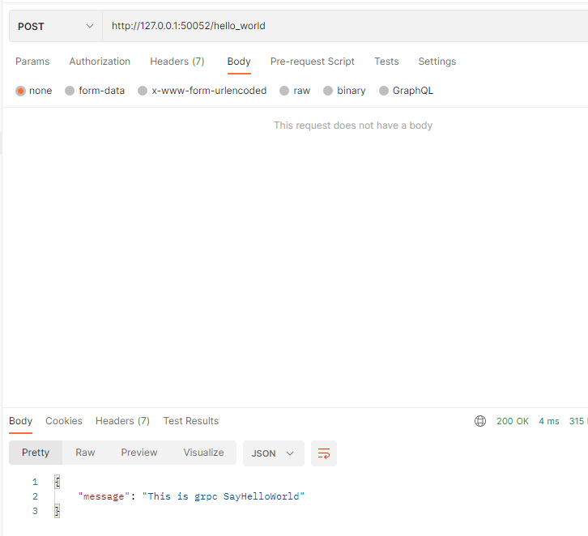

## 一、本章介绍

​	有的时候，我们可能不想要使用`TLS`和证书进行验证，在 2018 年 6 月，代表 “`h2c`” 标志的 `golang.org/x/net/http2/h2c` 标准库正式合并进来，自此我们就可以使用官方标准库（`h2c`），这个标准库实现了 HTTP/2 的未加密模式，因此我们就可以利用该标准库在同个端口上既提供 HTTP/1.1 又提供 HTTP/2 的功能了。

## 二、项目代码修改

### 2.1 修改基于`grpc`和`http`的路由区分服务  

修改`grpc-gateway-example\pkg\utils\grpc.go`

**修改前（Before）：**

```go
func GrpcHandlerFunc(grpcServer *grpc.Server, otherHandler http.Handler) http.Handler {
	if otherHandler == nil {
		return http.HandlerFunc(func(w http.ResponseWriter, r *http.Request) {
			grpcServer.ServeHTTP(w, r)
		})
	}
	return http.HandlerFunc(func(w http.ResponseWriter, r *http.Request) {
		if r.ProtoMajor == 2 && strings.Contains(r.Header.Get("Content-Type"), "application/grpc") {
			grpcServer.ServeHTTP(w, r)
		} else {
			otherHandler.ServeHTTP(w, r)
		}
	})
}
```

**修改后（After）：**

```go
func GrpcHandlerFunc(grpcServer *grpc.Server, otherHandler http.Handler) http.Handler {
	if otherHandler == nil {
		return http.HandlerFunc(func(w http.ResponseWriter, r *http.Request) {
			grpcServer.ServeHTTP(w, r)
		})
	}
	return h2c.NewHandler(http.HandlerFunc(func(w http.ResponseWriter, r *http.Request) {
		if r.ProtoMajor == 2 && strings.Contains(r.Header.Get("Content-Type"), "application/grpc") {
			grpcServer.ServeHTTP(w, r)
		} else {
			otherHandler.ServeHTTP(w, r)
		}
	}), &http2.Server{})
}
```

关键之处在于调用了 `h2c.NewHandler` 方法进行了特殊处理，`h2c.NewHandler` 会返回一个 `http.handler`，主要的内部逻辑是**拦截了所有 `h2c` 流量，然后根据不同的请求流量类型将其劫持并重定向到相应的 `Hander` 中去处理**。

### 2.2 修改服务端代码

不再使用`Server`方法，改用下面的`ServeWithoutTLS`方法：

```go
func ServeWithoutTLS() (err error) {
	EndPoint = ":" + ServerPort
	server := grpc.NewServer() // 没有添加TLS证书认证

	proto.RegisterHelloWorldServer(server, NewHelloService())

	mux := http.NewServeMux()
	gwmux := runtime.NewServeMux()
	dopts := []grpc.DialOption{grpc.WithInsecure()}

	err = proto.RegisterHelloWorldHandlerFromEndpoint(context.Background(), gwmux, EndPoint, dopts)
	if err != nil {
		log.Printf("Failed to register gw server: %v\n", err)
	}

	mux.Handle("/", gwmux)
	http.ListenAndServe(EndPoint, utils.GrpcHandlerFunc(server, mux))

	return
}
```

### 2.3 修改命令行模块代码

修改`grpc-gateway-example\cmd\server.go`文件代码：

```go
var serverCmd = &cobra.Command{
	Use:   "server",
	Short: "Run the gRPC hello-world server",
	Run: func(cmd *cobra.Command, args []string) {
		defer func() {
			if err := recover(); err != nil {
				log.Println("Recover error : %v", err)
			}
		}()
		//server.Serve()
        server.ServeWithoutTLS()      // 执行ServeWithoutTLS()方法
	},
}
```

### 2.4 修改客户端代码

```go
func main() {
	//creds, err := credentials.NewClientTLSFromFile("./cert/server.pem", "www.github.com")
	//if err != nil {
	//	log.Println("Failed to create TLS credentials %v", err)
	//}
	//conn, err := grpc.Dial(":50052", grpc.WithTransportCredentials(creds))
	conn, err := grpc.Dial(":50052", grpc.WithInsecure())   // 客户端不再使用证书进行TLS验证
	defer conn.Close()

	if err != nil {
		log.Println(err)
	}

	c := proto.NewHelloWorldClient(conn)
	context := context.Background()
	body := &proto.HelloWorldRequest{
		Referer: "Grpc",
	}

	r, err := c.SayHelloWorld(context, body)
	if err != nil {
		log.Println(err)
	}

	log.Println(r.Message)
}
```

## 三、验证

### 3.1 `Restful API`

**使用的是`http`协议，而非`https`协议**



### 3.2 `grpc`调用

客户端运行结果：

```shell
2023/02/26 16:09:18 This is grpc SayHelloWorld
```

