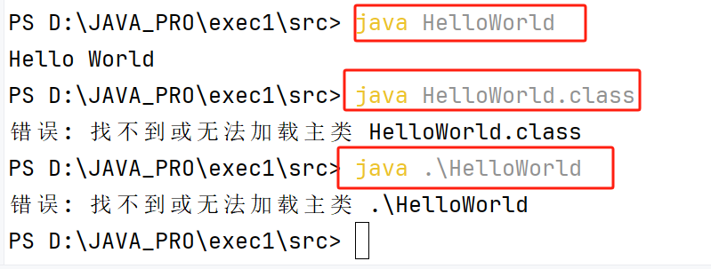

# 一、第一个 Java 程序

下面看一个简单的 Java 程序，它将输出字符串 *Hello World*

类名需要和文件名一致，比如说：类 `HelloWorld` 就必须存储在 `HelloWorld.java` 中。

```java
public class HelloWorld {
    public static void main(String[] args) {
        System.out.println("Hello World");
    }
}
```


1. 在命令行窗口输入 `javac HelloWorld.java`  按下回车键**编译代码（编译生成一个HelloWorld.class）**。如果代码没有错误，cmd 命令提示符会进入下一行（假设环境变量都设置好了）。
2. 再键输入 `java HelloWorld` 按下回车键就可以**运行程序**了

> 注意事项：Win 环境下，通过 java HelloWorld 运行程序，而不是 java .\HelloWorld 或者 java HelloWorld.class



如果遇到编码问题，我们可以使用 -encoding 选项设置 **utf-8** 来编译：

```shell
javac -encoding UTF-8 HelloWorld.java 
java HelloWorld 
```

# 二、基本语法

编写 Java 程序时，应注意以下几点：

- **大小写敏感**：Java 是大小写敏感的，这就意味着标识符 Hello 与 hello 是不同的。
- **类名**：对于所有的类来说，**类名的首字母应该大写**。如果类名由若干单词组成，那么**每个单词的首字母应该大写**，例如 **MyFirstJavaClass** 。
- **方法名**：所有的**方法名都应该以小写字母开头**。如果方法名含有若干单词，则**后面的每个单词首字母大写**。
- **源文件名**：**源文件名必须和类名相同**。当保存文件的时候，你应该使用类名作为文件名保存（切记 Java 是大小写敏感的），文件名的后缀为 **.java**。（如果文件名和类名不相同则会导致编译错误）。
- **主方法入口**：所有的 Java 程序由 **public static void main(String[] args)** 方法开始执行。

## 2.1 Java 标识符

Java 所有的组成部分都需要名字。**类名**、**变量名**以及**方法名**都被称为**标识符**。

关于 Java 标识符，有以下几点需要注意：

- 所有的标识符都应该以字母（A-Z 或者 a-z）,美元符（$）、或者下划线（_）**开始**
- **首字符之后**可以是字母（A-Z 或者 a-z）,美元符（$）、下划线（_）或数字的任何字符组合
- **关键字**不能用作标识符
- 标识符是**大小写敏感**的
- 合法标识符举例：age、$salary、_value、__1_value
- 非法标识符举例：123abc、-salary

## 2.2 Java 修饰符

像其他语言一样，Java可以使用修饰符来**修饰类中方法和属性**。主要有两类修饰符：

- **访问控制**修饰符 : default, public , protected, private
- **非访问控制**修饰符 : final, abstract, static, synchronized 

在后面的章节中我们会深入讨论 Java 修饰符。

## 2.3 Java 变量

Java 中主要有如下几种类型的变量

- 局部变量
- 类变量（静态变量）
- 成员变量（非静态变量）

## 2.4 Java 源程序与编译型运行区别

如下图所示：


## 2.5 Java 的文档注释

除了常见的单行注释 `//` 和多行注释 `/*  */`，Java 中还有一种文档注释：

文档注释以 `/**` 开始，以 `*/` 结束，通常**出现在类、方法、字段等的声明前面**，用于**生成代码文档**，这种注释可以**被工具提取**并生成 **API 文档**，如 JavaDoc。

```java
/**
 * 这是一个文档注释示例
 * 它通常包含有关类、方法或字段的详细信息
 */
public class MyClass {
    // 类的成员和方法
}
```

文档注释的格式通常包含一些特定的标签，如 **`@param` 用于描述方法参数**，**`@return` 用于描述返回值**，**`@throws` 用于描述可能抛出的异常**等等，这些标签有助于生成清晰的API文档，以便其他开发者能够更好地理解和使用你的代码。