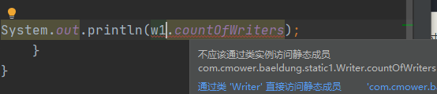
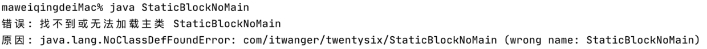

static 关键字的作用可以用一句话来描述：‘**方便在没有创建对象的情况下进行调用**，包括变量和方法’。也就是说，只要类被加载了，就可以通过类名进行访问。

# 一、静态变量

如果在声明变量的时候使用了 static 关键字，那么这个变量就被称为静态变量。静态变量只在类加载的时候获取一次内存空间，这使得静态变量很节省内存空间。

来看下面这串代码。

```java
public class Counter {
    int count = 0;

    Counter() {
        count++;
        System.out.println(count);
    }

    public static void main(String args[]) {
        Counter c1 = new Counter();
        Counter c2 = new Counter();
        Counter c3 = new Counter();
    }
}
```

我们创建一个成员变量 count，并且在构造函数中让它自增。因为**成员变量会在创建对象的时候获取内存**，因此**每一个对象都会有一个 count 的副本**， **count 的值并不会随着对象的增多而递增**。

```
1
1
1
```

如果 count 是静态的,来看下面这段代码。

```java
public class StaticCounter {
    static int count = 0;

    StaticCounter() {
        count++;
        System.out.println(count);
    }

    public static void main(String args[]) {
        StaticCounter c1 = new StaticCounter();
        StaticCounter c2 = new StaticCounter();
        StaticCounter c3 = new StaticCounter();
    }
}
```

来看一下输出结果。

```
1
2
3
```

由于静态变量只会获取一次内存空间，所以任何对象对它的修改都会得到保留，所以每创建一个对象，count 的值就会加 1，所以最终的结果是 3

另外，需要注意的是，由于静态变量属于一个类，所以不要通过对象引用来访问，而应该直接通过类名来访问，否则编译器会发出警告。



# 二、静态方法

- 静态方法属于这个类而不是这个类的对象；
- 调用静态方法的时候不需要创建这个类的对象；
- 静态方法可以访问静态变量。
- 静态方法不能访问非静态变量和调用非静态方法。

**为什么 main 方法是静态的啊？**

如果 main 方法不是静态的，就意味着 Java 虚拟机在执行的时候需要先创建一个对象才能调用 main 方法，而 main 方法作为程序的入口，创建一个额外的对象显得非常多余。

**java.lang.Math 类**的几乎所有方法都是静态的，可以直接通过类名来调用，不需要创建类的对象。

# 三、静态代码块

```java
public class StaticBlock {
    static {
        System.out.println("静态代码块");
    }

    public static void main(String[] args) {
        System.out.println("main 方法");
    }
}
```

静态代码块通常用来初始化一些静态变量，它会**优先于 `main()` 方法执行**。

既然静态代码块先于 `main()` 方法执行，那没有 `main()` 方法的 Java 类能执行成功吗？

Java 1.6 是可以的，但 Java 7 开始就无法执行了。

```java
public class StaticBlockNoMain {
    static {
        System.out.println("静态代码块，没有 main");
    }
}
```

在命令行中执行 `java StaticBlockNoMain` 的时候，会抛出 NoClassDefFoundError 的错误。



来看下面这个例子。

```java
public class StaticBlockDemo {
    public static List<String> writes = new ArrayList<>();

    static {
        writes.add("沉默王二");
        writes.add("沉默王三");
        writes.add("沉默王四");

        System.out.println("第一块");
    }

    static {
        writes.add("沉默王五");
        writes.add("沉默王六");

        System.out.println("第二块");
    }
}
```

writes 是一个静态的 ArrayList，所以不太可能在声明的时候完成初始化，因此需要在静态代码块中完成初始化。

**静态代码块在初始集合的时候，真的非常有用**。在实际的项目开发中，**通常使用静态代码块来加载配置文件到内存当中**。

# 四、静态内部类

```java
public class Singleton {
    private Singleton() {}

    private static class SingletonHolder {
        public static final Singleton instance = new Singleton();
    }

    public static Singleton getInstance() {
        return SingletonHolder.instance;
    }
}
```

这段代码在以后创建单例的时候还会见到。

第一次加载 Singleton 类时并不会初始化 instance，**只有第一次调用 `getInstance()` 方法时 Java 虚拟机才开始加载 SingletonHolder 并初始化 instance**，这样不仅能确保线程安全，也能保证 Singleton 类的唯一性。

需要注意的是。第一，静态内部类不能访问外部类的所有成员变量；第二，静态内部类可以访问外部类的所有静态变量，包括私有静态变量。第三，**外部类不能声明为 static**。