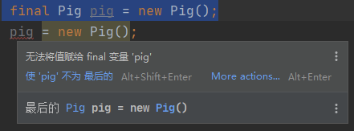
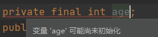
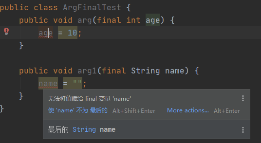
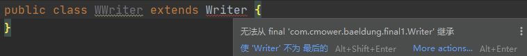

# 一、final 变量

被 final 修饰的变量无法重新赋值。换句话说，final 变量一旦初始化，就无法更改。

```
final int age = 18;
```

我们创建一个测试类，并声明一个 final 修饰的 Pig 对象。

```java
public class Pig {
   private String name;

    public String getName() {
        return name;
    }

    public void setName(String name) {
        this.name = name;
    }
}
```

```
final Pig pig = new Pig();
```

如果尝试将 pig 重新赋值的话，编译器同样会生气。



但我们**仍然可以去修改 pig 对象的 name**。

```java
final Pig pig = new Pig();
pig.setName("特立独行");
System.out.println(pig.getName()); // 特立独行
```

另外，final 修饰的成员变量必须有一个默认值，否则编译器将会提醒没有初始化。



**final 和 static 一起修饰的成员变量叫做常量**，**常量名必须全部大写**。

```java
public class Pig {
   private final int age = 1;
   public static final double PRICE = 36.5;
}
```

有时候，我们还会**用 final 关键字来修饰参数**，它意味着**参数在方法体内不能被再修改**。

```java
public class ArgFinalTest {
    public void arg(final int age) {
    }

    public void arg1(final String name) {
    }
}
```

如果尝试去修改它的话，编译器会提示以下错误。



# 二、final 方法

被 final 修饰的方法不能被重写。如果我们在设计一个类的时候，认为某些方法不应该被重写，就应该把它设计成 final 的。


一个类是 final 的，和一个类不是 final，但它所有的方法都是 final 的，考虑一下，它们之间有什么区别？

前者不能被[继承](https://javabetter.cn/oo/extends-bigsai.html)，也就是说方法无法被重写；后者呢，可以被继承，然后追加一些非 final 的方法。

# 三、final 类

如果一个类使用了 final 关键字修饰，那么它就无法被继承.....

任何尝试从 final 类继承的行为将会引发编译错误

```java
public final class Writer {
    private String name;

    public String getName() {
        return name;
    }

    public void setName(String name) {
        this.name = name;
    }
}
```

尝试去继承它，编译器会提示以下错误，Writer 类是 final 的，无法继承。



不过，类是 final 的，并不意味着该类的对象是不可变的。

```java
Writer writer = new Writer();
writer.setName("沉默王二");
System.out.println(writer.getName()); // 沉默王二
```

Writer 的 name 字段的默认值是 null，但可以通过 settter 方法将其更改为沉默王二。也就是说，如果一个类只是 final 的，那么它并不是不可变的全部条件。