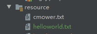

# 一、抽象类

在面向对象的概念中，所有的对象都是通过类来描绘的，但是反过来，并**不是所有的类都是用来描绘对象的**，如果**一个类中没有包含足够的信息来描绘一个具体的对象，这样的类就是抽象类**。

抽象类除了**不能实例化对象**之外，类的其它功能依然存在，**成员变量、成员方法和构造方法的访问方式和普通类一样**。

> 虽然抽象类不能直接实例化，但其构造器仍然会被子类调用（隐式或显式）以初始化从抽象类继承的成员变量。因此，在设计抽象类时，正确初始化成员变量是很重要的。

由于抽象类不能实例化对象，所以抽象类**必须被继承，才能被使用**。也是因为这个原因，通常在设计阶段决定要不要设计抽象类。

父类包含了子类集合的常见的方法，但是由于父类本身是抽象的，所以不能使用这些方法。

在 Java 中抽象类表示的是一种继承关系，**一个类只能继承一个抽象类**，而**一个类却可以实现多个接口**。

在 Java 语言中使用 abstract class 来定义抽象类。如下实例：

```java
/* 文件名 : Employee.java */
public abstract class Employee
{
   private String name;
   private String address;
   private int number;
   public Employee(String name, String address, int number)
   {
      System.out.println("Constructing an Employee");
      this.name = name;
      this.address = address;
      this.number = number;
   }
   public double computePay()
   {
     System.out.println("Inside Employee computePay");
     return 0.0;
   }
   public void mailCheck()
   {
      System.out.println("Mailing a check to " + this.name
       + " " + this.address);
   }
   public String toString()
   {
      return name + " " + address + " " + number;
   }
   public String getName()
   {
      return name;
   }
   public String getAddress()
   {
      return address;
   }
   public void setAddress(String newAddress)
   {
      address = newAddress;
   }
   public int getNumber()
   {
     return number;
   }
}
```

注意到该 Employee 类没有什么不同，尽管该类是抽象类，但是它仍然有 3 个成员变量，7 个成员方法和 1 个构造方法。 现在如果你尝试如下的例子：

```java
/* 文件名 : AbstractDemo.java */
public class AbstractDemo
{
   public static void main(String [] args)
   {
      /* 以下是不允许的，会引发错误 */
      Employee e = new Employee("George W.", "Houston, TX", 43);
 
      System.out.println("\n Call mailCheck using Employee reference--");
      e.mailCheck();
    }
}
```

当你尝试编译 `AbstractDemo` 类时，会产生如下错误：

```
Employee.java:46: Employee is abstract; cannot be instantiated
      Employee e = new Employee("George W.", "Houston, TX", 43);
                   ^
1 error
```

# 二、继承抽象类

我们可以通过以下方式继承 Employee 类的属性：

```java
/* 文件名 : Salary.java */
public class Salary extends Employee
{
   private double salary; //Annual salary
   public Salary(String name, String address, int number, double
      salary)
   {
       super(name, address, number);
       setSalary(salary);
   }
   public void mailCheck()
   {
       System.out.println("Within mailCheck of Salary class ");
       System.out.println("Mailing check to " + getName()
       + " with salary " + salary);
   }
   public double getSalary()
   {
       return salary;
   }
   public void setSalary(double newSalary)
   {
       if(newSalary >= 0.0)
       {
          salary = newSalary;
       }
   }
   public double computePay()
   {
      System.out.println("Computing salary pay for " + getName());
      return salary/52;
   }
}
```

尽管我们不能实例化一个 Employee 类的对象，但是如果我们实例化一个 Salary 类对象，该对象将从 Employee 类继承 7 个成员方法，且通过该方法可以设置或获取三个成员变量。

```java
/* 文件名 : AbstractDemo.java */
public class AbstractDemo
{
   public static void main(String [] args)
   {
      Salary s = new Salary("Mohd Mohtashim", "Ambehta, UP", 3, 3600.00);
      Employee e = new Salary("John Adams", "Boston, MA", 2, 2400.00);
 
      System.out.println("Call mailCheck using Salary reference --");
      s.mailCheck();
 
      System.out.println("\n Call mailCheck using Employee reference--");
      e.mailCheck();
    }
}
```

以上程序编译运行结果如下：

```
Constructing an Employee
Constructing an Employee
Call mailCheck using  Salary reference --
Within mailCheck of Salary class
Mailing check to Mohd Mohtashim with salary 3600.0

Call mailCheck using Employee reference--
Within mailCheck of Salary class
Mailing check to John Adams with salary 2400.
```

# 三、抽象方法

如果你想设计这样一个类，该类包含一个**特别的成员方法**，该**方法的具体实现由它的子类确定**，那么你可以**在父类中声明该方法为抽象方法**。

Abstract 关键字同样可以用来声明抽象方法，**抽象方法只包含一个方法名，而没有方法体。**

抽象方法没有定义，**方法名后面直接跟一个分号，而不是花括号。**

```java
public abstract class Employee
{
   private String name;
   private String address;
   private int number;
   
   public abstract double computePay();
   
   //其余代码
}
```

声明抽象方法会造成以下两个结果：

- 如果一个类包含抽象方法，那么该类必须是抽象类。
- 任何子类**必须重写**父类的**抽象方法**，**或者声明自身为抽象类**。

继承抽象方法的子类必须重写该方法。否则，该子类也必须声明为抽象类。最终，必须有子类实现该抽象方法，否则，从最初的父类到最终的子类都不能用来实例化对象。

如果Salary类继承了Employee类，那么它必须实现 `computePay()` 方法：

```java
/* 文件名 : Salary.java */
public class Salary extends Employee
{
   private double salary; // Annual salary
  
   public double computePay()
   {
      System.out.println("Computing salary pay for " + getName());
      return salary/52;
   }
 
   //其余代码
}
```

# 四、抽象类的应用场景

## 4.1 第一种场景

当我们**希望一些通用的功能被多个子类复用**的时候，就可以使用抽象类。比如说，AbstractPlayer 抽象类中有一个普通的方法 `sleep()`，表明所有运动员都需要休息，那么这个**方法就可以被子类复用**。

```java
abstract class AbstractPlayer {
    public void sleep() {
        System.out.println("运动员也要休息而不是挑战极限");
    }
}
```

子类 BasketballPlayer 继承了 AbstractPlayer 类：

```java
class BasketballPlayer extends AbstractPlayer {
}
```

也就拥有了 `sleep()` 方法。BasketballPlayer 的对象可以直接调用父类的 `sleep()` 方法：

```java
BasketballPlayer basketballPlayer = new BasketballPlayer();
basketballPlayer.sleep();
```

也拥有了 `sleep()` 方法，FootballPlayer 的对象也可以直接调用父类的 `sleep()` 方法：

```java
FootballPlayer footballPlayer = new FootballPlayer();
footballPlayer.sleep();
```

## 4.2 第二种场景

当我们需要**在抽象类中定义好 API**，然后在**子类中扩展实现**的时候就可以使用抽象类。比如说，AbstractPlayer 抽象类中**定义了一个抽象方法 `play()`，表明所有运动员都可以从事某项运动**，但**需要对应子类去扩展实现**，表明篮球运动员打篮球，足球运动员踢足球。

```java
abstract class AbstractPlayer {
    abstract void play();
}
```

BasketballPlayer 继承了 AbstractPlayer 类，扩展实现了自己的 `play()` 方法。

```java
public class BasketballPlayer extends AbstractPlayer {
    @Override
    void play() {
        System.out.println("我是张伯伦，我篮球场上得过 100 分，");
    }
}
```

FootballPlayer 继承了 AbstractPlayer 类，扩展实现了自己的 `play()` 方法。

```java
public class FootballPlayer extends AbstractPlayer {
    @Override
    void play() {
        System.out.println("我是C罗，我能接住任意高度的头球");
    }
}
```

## 4.3 实例

为了进一步展示抽象类的特性，我们再来看一个具体的示例。

假设现在有一个文件，里面的内容非常简单，只有一个“Hello World”，现在需要有一个**读取器将内容从文件中读取出来**，最好能**按照大写的方式**，或者**小写的方式来读**。

这时候，最好定义一个抽象类 BaseFileReader：

```java
/**
 * 抽象类，定义了一个读取文件的基础框架，其中 mapFileLine 是一个抽象方法，具体实现需要由子类来完成
 */
abstract class BaseFileReader {
    protected Path filePath; // 定义一个 protected 的 Path 对象，表示读取的文件路径

    /**
     * 构造方法，传入读取的文件路径
     * @param filePath 读取的文件路径
     */
    protected BaseFileReader(Path filePath) {
        this.filePath = filePath;
    }

    /**
     * 读取文件的方法，返回一个字符串列表
     * @return 字符串列表，表示文件的内容
     * @throws IOException 如果文件读取出错，抛出该异常
     */
    public List<String> readFile() throws IOException {
        return Files.lines(filePath) // 使用 Files 类的 lines 方法，读取文件的每一行
                .map(this::mapFileLine) // 对每一行应用 mapFileLine 方法，将其转化为指定的格式
                .collect(Collectors.toList()); // 将处理后的每一行收集到一个字符串列表中，返回
    }

    /**
     * 抽象方法，子类需要实现该方法，将文件中的每一行转化为指定的格式
     * @param line 文件中的每一行
     * @return 转化后的字符串
     */
    protected abstract String mapFileLine(String line);
}
```

- filePath 为文件路径，使用 protected 修饰，表明该成员变量可以在需要时被子类访问到。
- `readFile()` 方法用来读取文件，方法体里面**调用了抽象方法 `mapFileLine()`**——需要**子类来扩展实现大小写的不同读取方式**。

BaseFileReader 类设计的就非常合理，并且易于扩展，子类只需要专注于具体的大小写实现方式就可以了。

小写的方式：

```java
class LowercaseFileReader extends BaseFileReader {
    protected LowercaseFileReader(Path filePath) {
        super(filePath);
    }

    @Override
    protected String mapFileLine(String line) {
        return line.toLowerCase();
    }
}
```

大写的方式：

```java
class UppercaseFileReader extends BaseFileReader {
    protected UppercaseFileReader(Path filePath) {
        super(filePath);
    }

    @Override
    protected String mapFileLine(String line) {
        return line.toUpperCase();
    }
}
```

从文件里面一行一行读取内容的代码被子类复用了。与此同时，子类只需要专注于自己该做的工作，LowercaseFileReader 以小写的方式读取文件内容，UppercaseFileReader 以大写的方式读取文件内容。

来看一下测试类 FileReaderTest：

```java
public class FileReaderTest {
    public static void main(String[] args) throws URISyntaxException, IOException {
        URL location = FileReaderTest.class.getClassLoader().getResource("helloworld.txt");
        Path path = Paths.get(location.toURI());
        BaseFileReader lowercaseFileReader = new LowercaseFileReader(path);
        BaseFileReader uppercaseFileReader = new UppercaseFileReader(path);
        System.out.println(lowercaseFileReader.readFile());
        System.out.println(uppercaseFileReader.readFile());
    }
}
```

在项目的 resource 目录下建一个文本文件，名字叫 helloworld.txt，里面的内容就是“Hello World”。文件的具体位置如下图所示



在 resource 目录下的文件可以通过 `ClassLoader.getResource()` 的方式获取到 URI 路径，然后就可以取到文本内容了。

输出结果如下所示：

```
[hello world]
[HELLO WORLD]
```
