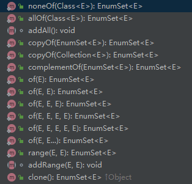
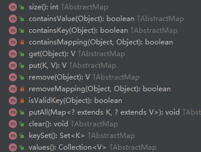

# 一、Java 枚举( `enum` )

Java 枚举是一个特殊的类，一般表示一组常量，比如一年的 4 个季节，一年的 12 个月份，一个星期的 7 天，方向有东南西北等。

Java 枚举类**使用 `enum` 关键字来定义**，各个常量使用逗号 , 来分割。

例如定义一个颜色的枚举类。

```java
enum Color 
{ 
    RED, GREEN, BLUE; 
} 
```

以上枚举类 Color 颜色常量有 RED, GREEN, BLUE，分别表示红色，绿色，蓝色。

```java
enum Color 
{ 
    RED, GREEN, BLUE; 
} 
  
public class Test 
{ 
    // 执行输出结果
    public static void main(String[] args) 
    { 
        Color c1 = Color.RED; 
        System.out.println(c1); 
    } 
}
```

执行以上代码输出结果为：

```
RED
```

## 1.1 剖析枚举类

新建一个枚举 PlayerType

```java
public enum PlayerType {
    TENNIS,
    FOOTBALL,
    BASKETBALL
}
```

看一下反编译后的字节码

```java
public final class PlayerType extends Enum
{

    public static PlayerType[] values()
    {
        return (PlayerType[])$VALUES.clone();
    }

    public static PlayerType valueOf(String name)
    {
        return (PlayerType)Enum.valueOf(com/cmower/baeldung/enum1/PlayerType, name);
    }

    private PlayerType(String s, int i)
    {
        super(s, i);
    }

    public static final PlayerType TENNIS;
    public static final PlayerType FOOTBALL;
    public static final PlayerType BASKETBALL;
    private static final PlayerType $VALUES[];

    static 
    {
        TENNIS = new PlayerType("TENNIS", 0);
        FOOTBALL = new PlayerType("FOOTBALL", 1);
        BASKETBALL = new PlayerType("BASKETBALL", 2);
        $VALUES = (new PlayerType[] {
            TENNIS, FOOTBALL, BASKETBALL
        });
    }
}
```

Java 编译器帮我们做了很多隐式的工作:

- 要继承 Enum 类；
- 要写构造方法；
- 要声明静态变量和数组；
- 要用 static 块来初始化静态变量和数组；
- 要提供静态方法，比如说 `values()` 和 `valueOf(String name)`。

## 1.2 内部类中使用枚举

枚举类也可以声明在内部类中：

```java
public class Test 
{ 
    enum Color 
    { 
        RED, GREEN, BLUE; 
    } 
  
    // 执行输出结果
    public static void main(String[] args) 
    { 
        Color c1 = Color.RED; 
        System.out.println(c1); 
    } 
}
```

**每个枚举值都是通过 Class 在内部实现的**，且所有的枚举值都是 `public static final` 的。

以上的**枚举类 Color 转化在内部类实现：**

```java
class Color
{
     public static final Color RED = new Color();
     public static final Color BLUE = new Color();
     public static final Color GREEN = new Color();
}
```

## 1.3 值 == 判断

由于**枚举是 final 的**，所以可以**确保在 Java 虚拟机中仅有一个常量对象**，基于这个原因，我们**可以使用“==”运算符来比较两个枚举是否相等**

那为什么不使用 `equals()` 方法判断呢？

```java
if(player.getType().equals(Player.PlayerType.BASKETBALL)){};
```

原因：

“==”运算符比较的时候，**如果两个对象都为 null，并不会发生 `NullPointerException`**，而 `equals()` 方法则会。

另外， “==”运算符会在编译时进行检查，如果**两侧的类型不匹配，会提示错误**，而 `equals()` 方法则不会。


## 1.4 迭代枚举元素

可以使用 for 语句来迭代枚举元素：

```java
enum Color 
{ 
    RED, GREEN, BLUE; 
} 
public class MyClass { 
  public static void main(String[] args) { 
    for (Color myVar : Color.values()) {
      System.out.println(myVar);
    }
  } 
}
```

执行以上代码输出结果为：

```
RED
GREEN
BLUE
```

## 1.5 在 switch 中使用枚举类

枚举类常应用于 switch 语句中：

```java
enum Color 
{ 
    RED, GREEN, BLUE; 
} 
public class MyClass {
  public static void main(String[] args) {
    Color myVar = Color.BLUE;

    switch(myVar) {
      case RED:
        System.out.println("红色");
        break;
      case GREEN:
         System.out.println("绿色");
        break;
      case BLUE:
        System.out.println("蓝色");
        break;
    }
  }
}
```

执行以上代码输出结果为：

```
蓝色
```

## 1.6 `values()`, `ordinal()` 和 `valueOf()` 方法

`enum` 定义的枚举类默认继承了 `java.lang.Enum` 类，并实现了 `java.lang.Serializable` 和 `java.lang.Comparable` 两个接口。

`values()`, `ordinal()` 和 `valueOf()` 方法位于 `java.lang.Enum` 类中：

- `values()` 返回**枚举类中所有的值**。
- `ordinal()` 方法可以**找到每个枚举常量的索引**，就像数组索引一样。
- `valueOf()` 方法返回**指定字符串值的枚举常量**。

```java
enum Color 
{ 
    RED, GREEN, BLUE; 
} 
  
public class Test 
{ 
    public static void main(String[] args) 
    { 
        // 调用 values() 
        Color[] arr = Color.values(); 
  
        // 迭代枚举
        for (Color col : arr) 
        { 
            // 查看索引
            System.out.println(col + " at index " + col.ordinal()); 
        } 
  
        // 使用 valueOf() 返回枚举常量，不存在的会报错 IllegalArgumentException 
        System.out.println(Color.valueOf("RED")); 
        // System.out.println(Color.valueOf("WHITE")); 
    } 
}
```

执行以上代码输出结果为：

```
RED at index 0
GREEN at index 1
BLUE at index 2
RED
```

## 1.7 枚举类成员

枚举跟普通类一样**可以拥有自己的变量、方法和构造函数**，**构造函数只能使用 private 访问修饰符**，所以**外部无法调用**。

```java
enum Color 
{ 
    RED, GREEN, BLUE; 
  
    // 构造函数
    private Color() 
    { 
        System.out.println("Constructor called for : " + this.toString()); 
    } 
  
    public void colorInfo() 
    { 
        System.out.println("Universal Color"); 
    } 
} 
  
public class Test 
{     
    // 输出
    public static void main(String[] args) 
    { 
        Color c1 = Color.RED; 
        System.out.println(c1); 
        c1.colorInfo(); 
    } 
}
```

执行以上代码输出结果为：

**从结果上可以看出，创建一个枚举类的时候，会将所有的成员都创建一次**

```
Constructor called for : RED
Constructor called for : GREEN
Constructor called for : BLUE
RED
Universal Color
```

枚举**既可以包含具体方法，也可以包含抽象方法**。 如果**枚举类具有抽象方法，则枚举类的每个实例都必须实现它。**

以下是一个完整的示例，展示如何使用带有抽象方法的枚举类：

```java
enum Operation {
    ADD {
        @Override
        public int apply(int a, int b) {
            return a + b;
        }
    },
    SUBTRACT {
        @Override
        public int apply(int a, int b) {
            return a - b;
        }
    },
    MULTIPLY {
        @Override
        public int apply(int a, int b) {
            return a * b;
        }
    },
    DIVIDE {
        @Override
        public int apply(int a, int b) {
            if (b == 0) {
                throw new ArithmeticException("Cannot divide by zero");
            }
            return a / b;
        }
    };

    // 抽象方法
    public abstract int apply(int a, int b);
}

public class Main {
    public static void main(String[] args) {
        int a = 10;
        int b = 5;

        for (Operation op : Operation.values()) {
            System.out.println(op + ": " + op.apply(a, b));
        }
    }
}
```

### 1.7.1 工作原理

- 枚举类中的每个常量实际上是一个匿名内部类的实例。
- 每个常量都会实现枚举类中定义的抽象方法。
- 当调用某个枚举常量的方法时，实际执行的是该常量对应的实现。

### 1.7.2 优点

- 灵活性：**每个枚举常量可以有自己的行为**，而不需要外部的 if-else 或 switch-case 逻辑。

> 在 Java 中，每个枚举常量都可以拥有自己独有的方法实现，这是通过为每个枚举常量定义类体（即匿名内部类）来实现的。
>
> ```java
> enum Operation {
>     ADD("+") {
>         @Override
>         public double apply(double a, double b) {
>             return a + b;
>         }
>         
>         // 额外的方法
>         public void printSymbol() {
>             System.out.println("Addition Symbol: " + symbol);
>         }
>     },
>     SUBTRACT("-") {
>         @Override
>         public double apply(double a, double b) {
>             return a - b;
>         }
> 
>         // 额外的方法
>         public void printSymbol() {
>             System.out.println("Subtraction Symbol: " + symbol);
>         }
>     };
> 
>     private String symbol;
> 
>     // 构造函数
>     Operation(String symbol) {
>         this.symbol = symbol;
>     }
> 
>     // 抽象方法
>     public abstract double apply(double a, double b);
> 
>     // 可以在枚举类中定义非抽象方法供枚举常量使用
>     public void displaySymbol() {
>         System.out.println("Operation symbol is " + symbol);
>     }
> }
> 
> public class Main {
>     public static void main(String[] args) {
>         double a = 10;
>         double b = 5;
> 
>         for (Operation op : Operation.values()) {
>             System.out.println("Result of applying " + op.name() + ": " + op.apply(a, b));
>             op.displaySymbol(); // 调用枚举类中的非抽象方法
>             
>             // 调用每个枚举常量特有的方法
>             if (op instanceof Operation.ADD) {
>                 ((Operation.ADD) op).printSymbol();
>             } else if (op instanceof Operation.SUBTRACT) {
>                 ((Operation.SUBTRACT) op).printSymbol();
>             }
>         }
>     }
> }
> ```

- 可读性：将行为直接封装在枚举常量中，代码更清晰、更容易维护。
- 类型安全：枚举类型是类型安全的，避免了使用字符串或其他类型的潜在错误。

### 1.7.3 注意事项

- 匿名内部类开销：
  - **每个枚举常量实际上是匿名内部类的实例**，这会增加一些内存开销。
  - 如果枚举常量较多且实现复杂，可能会导致类加载时间增加。
- 避免过度使用：
  - 如果枚举的行为逻辑非常简单，可以考虑使用其他方式（如 switch-case 或策略模式）来替代。

### 1.7.4 扩展：结合接口使用

如果需要更复杂的逻辑，可以让枚举类实现某个接口，而不是直接定义抽象方法。这样可以将行为与枚举分离，进一步提高代码的灵活性。

```java
interface Operator {
    int apply(int a, int b);
}

enum Operation implements Operator {
    ADD {
        @Override
        public int apply(int a, int b) {
            return a + b;
        }
    },
    SUBTRACT {
        @Override
        public int apply(int a, int b) {
            return a - b;
        }
    };

    // 可以添加更多枚举常量和实现
}

public class Main {
    public static void main(String[] args) {
        Operator op = Operation.ADD;
        System.out.println(op.apply(10, 5)); // 输出：15
    }
}
```

# 二、EnumSet

EnumSet 是一个专门针对枚举类型的 [Set 接口](https://javabetter.cn/collection/gailan.html)（后面会讲）的实现类，它是处理枚举类型数据的一把利器，非常高效。

因为 EnumSet 是一个**抽象类**，所以**创建 EnumSet 时不能使用 new 关键字**。不过，EnumSet 提供了很多有用的**静态工厂方法**。



看下面这个例子，我们使用 `noneOf()` 静态工厂方法创建了一个空的 PlayerType 类型的 EnumSet；使用 `allOf()` 静态工厂方法创建了一个包含所有 PlayerType 类型的 EnumSet。

```java
public class EnumSetTest {
    public enum PlayerType {
        TENNIS,
        FOOTBALL,
        BASKETBALL
    }

    public static void main(String[] args) {
        EnumSet<PlayerType> enumSetNone = EnumSet.noneOf(PlayerType.class);
        System.out.println(enumSetNone);

        EnumSet<PlayerType> enumSetAll = EnumSet.allOf(PlayerType.class);
        System.out.println(enumSetAll);
    }
}
```

看一下输出结果。

```
[]
[TENNIS, FOOTBALL, BASKETBALL]
```

有了 EnumSet 后，就可以使用 Set 的一些方法了

# 三、EnumMap

除了 EnumSet，还有 EnumMap，是一个专门针对枚举类型的 Map 接口的实现类，它可以**将枚举常量作为键来使用**。EnumMap 的效率比 HashMap 还要高，可以直接**通过数组下标（枚举的 ordinal 值）访问到元素**。

和 EnumSet 不同，**EnumMap 不是一个抽象类**，所以**创建 EnumMap 时可以使用 new 关键字**。

```java
EnumMap<PlayerType, String> enumMap = new EnumMap<>(PlayerType.class);
```

有了 EnumMap 对象后就可以使用 Map 的一些方法了，见下图。



和 [HashMap](https://javabetter.cn/collection/hashmap.html)（后面会讲）的使用方法大致相同，来看下面的例子。

```java
EnumMap<PlayerType, String> enumMap = new EnumMap<>(PlayerType.class);
enumMap.put(PlayerType.BASKETBALL,"篮球运动员");
enumMap.put(PlayerType.FOOTBALL,"足球运动员");
enumMap.put(PlayerType.TENNIS,"网球运动员");
System.out.println(enumMap);

System.out.println(enumMap.get(PlayerType.BASKETBALL));
System.out.println(enumMap.containsKey(PlayerType.BASKETBALL));
System.out.println(enumMap.remove(PlayerType.BASKETBALL));
```

来看一下输出结果。

```java
{TENNIS=网球运动员, FOOTBALL=足球运动员, BASKETBALL=篮球运动员}
篮球运动员
true
篮球运动员
```

# 四、枚举快速实现单例模式

单例（Singleton）用来**保证一个类仅有一个对象**，并**提供一个访问它的全局访问点，在一个进程中**。因为这个类只有一个对象，所以就不能再使用 `new` 关键字来创建新的对象了。

“Java 标准库有一些类就是单例，比如说 Runtime 这个类。”

```
Runtime runtime = Runtime.getRuntime();
```

“Runtime 类可以用来获取 Java 程序运行时的环境。”

通常情况下，实现单例并非易事，来看下面这种写法。

```java
public class Singleton {  
    private volatile static Singleton singleton; 
    private Singleton (){}  
    public static Singleton getSingleton() {  
    if (singleton == null) {
        synchronized (Singleton.class) { 
        if (singleton == null) {  
            singleton = new Singleton(); 
        }  
        }  
    }  
    return singleton;  
    }  
}
```

要用到 [volatile](https://javabetter.cn/thread/volatile.html)、[synchronized](https://javabetter.cn/thread/synchronized-1.html) 关键字等等，但枚举的出现，让代码量减少到极致。

```java
public enum Singleton {  
    INSTANCE;  
  
    // 添加你需要的单例方法或字段  
    public void doSomething() {  
        System.out.println("Doing something...");  
    }  
}  
  
// 使用单例  
public class Main {  
    public static void main(String[] args) {  
        Singleton singleton = Singleton.INSTANCE;  
        singleton.doSomething();  
    }  
}
```

以下是`Enum`类能够实现单例模式的几个关键原因：

1. 实例的固定性
   - 枚举类型的实例在**类加载**时就已经固定，并且在**运行时不能被改变**。每个枚举常量在JVM中都是唯一的实例。
   - 枚举类型本质上是一个类，它继承了`java.lang.Enum`类，并且**所有的枚举常量在类加载时就已经被实例化。**
2. 线程安全
   - 枚举的实例创建是线程安全的，因为枚举的实例是在类加载时由JVM创建的，这个过程是线程安全的。
   - 这意味着你不需要额外的同步机制来保证单例的线程安全性。
3. 防止反序列化攻击
   - 枚举类型有一个特性，即它们天生可以防止通过反序列化创建新的实例。
   - 当你尝试反序列化一个枚举实例时，Java的序列化机制会确保返回的是枚举类中定义的常量之一，而不是一个新的实例。
4. 防止反射攻击
   - 通过反射机制创建枚举实例也是不可能的，因为枚举类型有一个内部机制来防止这种行为。
   - 当你尝试使用反射来创建枚举实例时，会抛出`IllegalArgumentException`异常。
5. 简洁性和可读性
   - 使用枚举来实现单例模式代码简洁且易于理解。
   - 枚举类提供了更好的类型安全性和可读性，因为你可以直接使用枚举常量而不是通过方法来获取实例。
