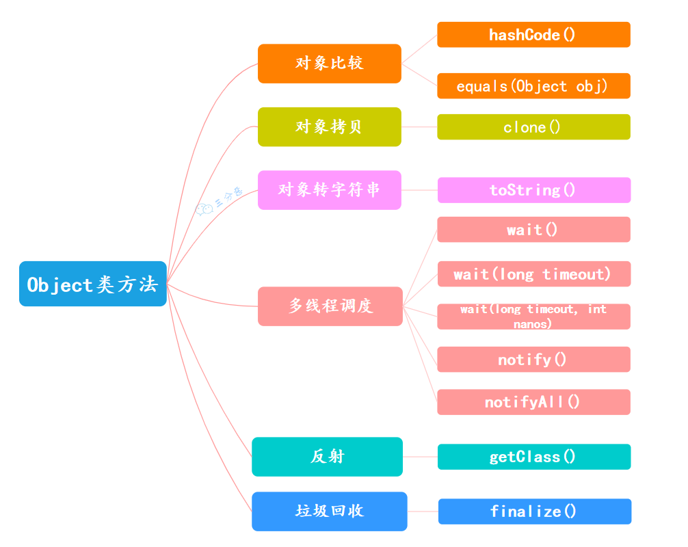

在 Java 中，经常提到一个词“万物皆对象”，其中的“万物”指的是 Java 中的所有类，而这些类都是 Object 类的子类。

Object 主要提供了 11 个方法，大致可以分为六类：

解释一下：

- 线程 1 先执行，它调用了 `lock.wait()` 方法，然后进入了等待状态。
- 线程 2 后执行，它调用了 `lock.notify()` 方法，然后线程 1 被唤醒了。

①、`public final void wait() throws InterruptedException`：调用该方法会导致当前线程等待，直到另一个线程调用此对象的`notify()`方法或`notifyAll()`方法。

②、`public final native void notify()`：唤醒在此对象监视器上等待的单个线程。如果有多个线程等待，选择一个线程被唤醒。

③、`public final native void notifyAll()`：唤醒在此对象监视器上等待的所有线程。

④、`public final native void wait(long timeout) throws InterruptedException`：等待 timeout 毫秒，如果在 timeout 毫秒内没有被唤醒，会自动唤醒。

⑥、`public final void wait(long timeout, int nanos) throws InterruptedException`：更加精确了，等待 timeout 毫秒和 nanos 纳秒，如果在 timeout 毫秒和 nanos 纳秒内没有被唤醒，会自动唤醒。