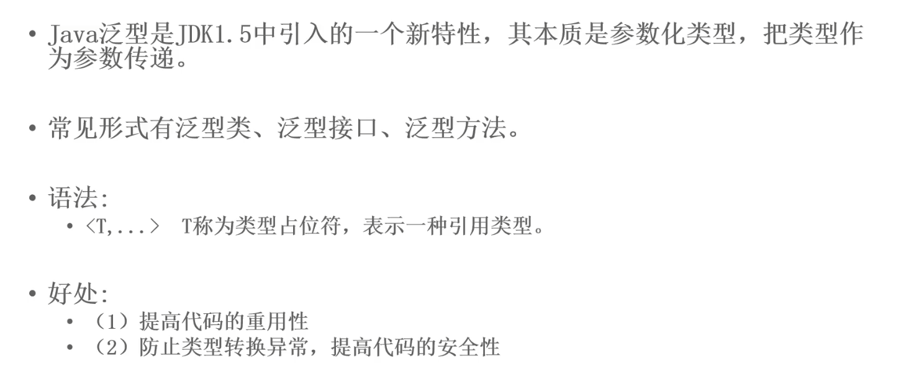
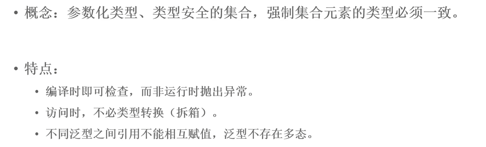

# 一、泛型介绍



# 二、泛型类

```java
// genericClass.java
/**
 * 泛型类
 * 语法：类名<T>
 * T 是类型占位符，表示一种引用类型。可以同时存在多个，之间用逗号,隔开
 * T 的具体类型，需要再实例化该类的时候才会被确定（相当于一个参数）
 */
public class genericClass<T> {
    // 1. 使用泛型创建变量
    T t;
    // T t = new T();  不能通过 T 直接构造对象，因为T的实际类型不确定，因此也无法确定其构造函数是私有的还是公有的
    // 2. 将泛型作为类方法的参数
    public void show(T t) {
        System.out.println(t);
    }
    // 3. 将泛型作为类方法的返回值
    public T getT() {
        return t;
    }
}
```

```java
// main.java
public class main {
    public static void main(String[] args) {
        // 泛型只能使用引用类型
        genericClass<String> gs = new genericClass<>();   // String 是泛型的具体类型
        gs.show("你好");
        gs.t = "Hello";
        System.out.println(gs.getT());

        genericClass<Integer> gi = new genericClass<>();
        gi.show(new Integer(100));
        gi.t = new Integer(1000);
        System.out.println(gi.getT());

        // 不同类型的泛型对象之间不能相互赋值
        //genericClass<Integer> gi2 = gs;
        // 相同类型的泛型对象之间可以相互赋值
        genericClass<Integer> gi3 = gi;
        gi3.show(new Integer(100));
        System.out.println(gi3.getT());
    }
}
```

运行结果：

```
Hello
100
1000
100
1000
```

# 三、泛型接口

```java
// genericInteface.java
/**
 * 泛型接口
 * 语法: 接口名 <T>
 */
public interface genericInteface<T> {
    T service(T t);
}
```

实现泛型接口：

```java
// genericInterfaceImpl.java
// 实现泛型接口的第一种方式：在进行实现的时候，就指定泛型的具体类型（这里是String）
public class genericInterfaceImpl implements genericInteface<String>{
     public String service(String s) {
         System.out.println(s);
        return s;
    }
}
```

```java
// genericInterfaceImpl2.java
// 实现泛型接口的第二种方法：实现接口的时候不具体指定泛型的类型，在实例化对象的时候再确定
public class genericInterfaceImpl2<T> implements genericInteface<T>{
    public T service(T t) {
        System.out.println(t);
        return t;
    }
}
```

使用：

```java
public class main {
    public static void main(String[] args) {
        // 1. 类实现接口的时候就指定了泛型接口的具体类型
        genericInterfaceImpl giImpl = new genericInterfaceImpl();
        giImpl.service("你好");
        // 2. 类实现接口的时候没有指定泛型接口的具体类型，需要再实例化对象的时候再指定
        genericInterfaceImpl2<String> giImpl2 = new genericInterfaceImpl2();
        giImpl2.service("你好");

        genericInterfaceImpl2<Integer> giImpl3 = new genericInterfaceImpl2<>();
        giImpl3.service(100);
    }
}
```

运行结果：

```
你好
你好
100
```

# 四、泛型方法

**泛型方法**可以完全代替**方法重载**，不需要一次性写多个重载方法。

```java
// genericMethod.java
/**
 * 泛型方法
 * 语法 <T> 返回值类型
 */
public class genericMethod {
    public <T> T show(T t) {
        System.out.println("泛型方法 " + t);
        return t;
    }
}
```

```java
// main.java
public class main {
    public static void main(String[] args) {
        // 泛型方法中，泛型的类型取决于传入参数的类型
        genericMethod gm = new genericMethod();
        gm.show("Hello");
        gm.show(new Integer(100));
    }
}
```

# 五、泛型集合



Java 集合框架中的各种集合都是可以通过泛型指定对象类型的。

## 5.1 集合不使用泛型

不使用泛型去指定具体类型，集合可以填充不同类型的对象。但是如果需要将对象通知转化为某一具体类型时，可能会出错。

```java
public class genericSet {
    public static void main(String[] args) {
        ArrayList list = new ArrayList();
        list.add("A");
        list.add("B");
        list.add(100);
        list.add(200);

        for (Object o : list) {
            String s = (String) o;   // Interger 类型不能转化为 String 类型
            System.out.println(s);
        }
    }
}
```

执行结果：

```
A
B
Exception in thread "main" java.lang.ClassCastException: java.lang.Integer cannot be cast to java.lang.String
	at generic.genericSet.main(genericSet.java:14)

进程已结束，退出代码为 1
```

## 5.2 使用泛型

```java
public class genericSet {
    public static void main(String[] args) {
        ArrayList<String> list = new ArrayList<>();
        list.add("A");
        list.add("B");
        //list.add(100);   // 语法检查不通过，只能向集合添加 String 对象
        for (String s : list) {    // 不在需要进行类型转化，直接就是 String 类型
            System.out.println(s);
        }
        // 使用迭代器的时候也可以直接指定泛型的具体类型
        Iterator<String> iterator = list.iterator();
        while(iterator.hasNext()) {
            System.out.println(iterator.next());
        }
    }
}
```

