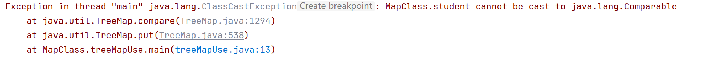

# 一、什么是集合

集合是指对象的容器，它定义了对多个对象同时进行操作的常用方法，可以实现类似数组的功能。

**和数组的区别：**


**位置**：`java.util.*`

# 二、`Collection` 集合体系


## 2.1 `Collection` 父接口

Collection 是最基本的集合接口，一个 Collection 代表一组 Object，即 Collection 的元素, Java不提供直接继承自Collection的类，只提供继承于的子接口(如List和set)。

Collection 接口存储**一组不唯一，无序的对象**。


**比较重要的一个方法**：`Iterator itrator()` 迭代器方法，返回在此 collection 的元素上进行迭代的迭代器。

### 2.1.1 使用 `collection` 接口：

**需要注意：`Collection` 类因为包含 `Set()`，因此并不能通过下标进行访问，只能通过：1.增强 for   2. Iterator 迭代器；这两种方式进行遍历。**

```java
import java.util.ArrayList;
import java.util.Collection;
import java.util.Iterator;

/**
 * collection接口的使用
 * 1. 添加元素
 * 2. 删除元素
 * 3. 查询/遍历
 * 4. 判断
 */
public class collectionUse {

    public static void main(String[] args) {
        Collection collection = new ArrayList();  
        // 1. 添加元素
        collection.add(1);
        collection.add(2);
        collection.add(3);

        System.out.println("集合长度 " + collection.size());
        System.out.println("集合元素 " + collection);
        // 2. 删除元素
        // 如果是自定义数据类型，必须重写 euqal 方法。因为这实际并不是同一个对象，而是具有相同成员变量值的不同对象
        collection.remove(new Integer(2));
        System.out.println("集合长度 " + collection.size());
        System.out.println("集合元素 " + collection);

        // 3. 遍历集合（没有下标，因此不能使用普通for循环）
        // 3.1 增强 for
        System.out.println("---------增强for--------------");
        for (Object o : collection) {
            System.out.println(o);
        }
        // 3.2 迭代器（专门用来遍历集合），Iterator 是一种接口，存在 hasNext()， next() ，remove() 三种方法
        System.out.println("---------迭代器--------------");
        Iterator iterator = collection.iterator();
        while (iterator.hasNext()) {
            Object o = iterator.next();
            System.out.println(o);
            iterator.remove();   // 从集合中删除当前遍历到的对象（在迭代器中不能使用Collection的remove方法进行删除）
            // collection.remove(o);   不允许，否则引发并发读写 collection 异常
        }

        System.out.println("集合长度 " + collection.size());
        System.out.println("集合元素 " + collection);
		// 4. 判断
        System.out.println(collection.isEmpty());

        collection.add("hello");
        collection.add("java");
        collection.add("SSM");

        System.out.println(collection.contains("hello"));
        System.out.println(collection.contains("SSM"));

        collection.clear();
    }
}
```

## 2.2 List 接口

List接口是一个有序的 Collection，使用此接口能够**精确的控制每个元素插入的位置**，能够**通过索引**(元素在List中位置，类似于数组的下标)来**访问List中的元素**，第一个元素的索引为 0，而且**允许有相同的元素**。

List 接口存储**一组不唯一，有序（插入顺序）的对象**。


因为有下标，因此可以基于下标直接使用 for 循环进行遍历。

除了有 `iterator()` 方法之外，`List` 还有一个**特殊的列表迭代器`listIterator()`**，返回值就是一个列表迭代器`ListIterator`，可以实现**正序/逆序**访问整个集合，其他功能如下：


### 2.2.1 使用 List 接口

```java
import java.util.*;

/**
 * List 接口的使用
 * 1. 插入元素
 * 2. 删除元素
 * 3. 遍历集合
 * 4. 判断
 */
public class listUse {
    public static void main(String[] args) {
        List list = new ArrayList();
        // 1. 插入元素
        list.add("A");
        list.add("B");
        list.add(0,"C");   // 可以根据下标指定插入的位置
        System.out.println("集合大小 "+ list.size());
        System.out.println("集合元素 "+ list);

        // 2. 删除元素
        list.remove(2);   // 根据下标删除元素
        list.remove(new String("C"));   // 根据对象删除元素
        System.out.println("集合大小 "+ list.size());
        System.out.println("集合元素 "+ list);

        list.add("Z");
        list.add("G");
        list.add("D");
        // 3. 遍历集合
        // 3.1 普通 for 循环
        System.out.println("----------普通 for 循环-----------");
        for (int i = 0; i < list.size(); i++) {
            System.out.println(list.get(i));
        }
        // 3.2 增强 for 循环
        System.out.println("----------增强 for 循环-----------");
        for (Object o : list) {
            System.out.println(o);
        }
        // 3.3 迭代器
        System.out.println("----------迭代器-----------");
        Iterator iterator = list.iterator();
        while (iterator.hasNext()) {
            System.out.println(iterator.next());
        }
        // 3.4 列表迭代器
        System.out.println("----------列表迭代器(正序)-----------");
        ListIterator listIterator = list.listIterator();
        while (listIterator.hasNext()) {
            System.out.println(listIterator.next());
        }
        System.out.println("----------列表迭代器(逆序)-----------");
        while (listIterator.hasPrevious()) {
            System.out.println(listIterator.previous());
        }

        // 4. 判断
        System.out.println("A 的下标: " + list.indexOf("A"));
        System.out.println(list.contains("A"));
        System.out.println(list.isEmpty());
        System.out.println(list.subList(0,2));   // 左闭右开

        // 5.排序（只能用于 List 接口，Set因为无序不能使用，Collection同理）
        Collections.sort(list);
        System.out.println(list);
    }
}

```

### 2.2.2 实现 `List` 接口的类


特别的，`Vector` 类在进行遍历的使用，需要通过 `elements()` 方法返回一个 `Enumration` 接口，其包含的方法如下：


使用方法与 `hasNext()` 和 `next()` 一样。

## 2.3 Set 接口


### 2.3.1 Set 接口的使用

```java
/**
 * Set 接口的使用
 * 特点：1.无序，没有下标  2.不可重复
 */
public class setUse {
    public static void main(String[] args) {
        Set<String> set = new HashSet<String>();
        // 1. 添加元素
        set.add("华为");
        set.add("小米");
        set.add("苹果");
        System.out.println("元素个数 " + set.size());
        System.out.println(set.toString());
        // 2. 删除元素
        set.remove("苹果");

        // 3.遍历
        // 3.1 增强 for
        System.out.println("-----------增强 for--------------");
        for (String str : set) {
            System.out.println(str);
        }
        // 3.2 迭代器
        System.out.println("-----------迭代器--------------");
        Iterator<String> iterator = set.iterator();
        while (iterator.hasNext()) {
            System.out.println(iterator.next());
        }
        // 4. 判断
        System.out.println(set.contains("华为"));
        System.out.println(set.isEmpty());
    }
}
```

### 2.3.2 实现 `Set` 接口的类


#### 2.3.2.1 `HashSet`

特别说明一下，`HashSet` 类元素的存储过程：

1. 计算元素的 `hashCode`，判断对应的 `bucket` 是否已经存在，如果不存在则说明元素尚未被存储。
2. 再执行 `equals` 方法，若 `equals` 返回 true，则认为是重复，否则形成链表。（默认情况下，equals() 方法会基于 this == obj 进行判断，也就是两个引用对象进行比较，必须是引用同一个对象才会返回 true。一般都需要进行**重写**）

一般情况下，对应自定义的存储在 Set 集合中的类，都需要**重写 `hashCode()` 和 `equals()` 方法**，**重写之后会影响 `Set` 的 `add()` 和 `remove()`。**

```java
public Class Person {
    public String name;
    public int age;
    ………………
    // @override   
    public int hashCode() {
        int n1 = this.name.hashCode();
        int n2 = this.age;
        
        return n1+n2;
    }
    // @override
    public boolean equals() {
        if (this == obj) {
            return true;
        }
        if (obj == null) {
            return false;
        }
        if (obj instanceof Person) {
            Person p = (Person)obj;
            if (this.name.equals(p.name)) && this.age == p.age) {
                return true;
            }
        }
        return false;
    }
    
} 


```

#### 2.3.2.2 `TreeSet`

自定义的类需要实现 `Comparable` 接口之后，才能存储在 `TreeSet` 中：

```java
public class Person implements Comparable<Person> {
    …………………………
    // @override  
    // 指定排序规则：先比较名字，名字相等则比较年龄
    // 如果返回值 == 0，表示两个对象重复
    public int compareTo(Person o) {
        int n1 = this.getName().compareTo(o.getName());
        int n2 = this.age-o.getAge();
        return n1==0?n2:n1;
    }
}
```

另一种方式：在创建集合的时候，同时指定比较规则

```java
public class Demo {
    public static void main(String[] args) {
        TreeSet<Person> person = new TreeSet<>(new Comparator<Person>() {
            // @Override
            public int compare(Person o1, Person o2) {
                int n1 = o1.getAge() - o2.getAge();
                int n2 = o1.getName().compareTo(o2.getName());
                return n1==0?n2:n1;
            }
        });
        
        ……………………
    }
}
```

treeSet 的使用案例：

```java
public class treeSetUse {
    public static void main(String[] args) {
        // 集合中的字符串: 1. 先根据字符串长度进行比较   2.长度相等时，再根据字符串原本的比较规则进行排序
        TreeSet<String> treeSet = new TreeSet<>(new Comparator<String>() {
            public int compare(String o1, String o2) {
                int n1 = o1.length() - o2.length();
                int n2 = o1.compareTo(o2);
                return n1 == 0 ? n2 : n1;
            }
        });
        treeSet.add("helloWorld");
        treeSet.add("beijing");
        treeSet.add("shanghai");
        treeSet.add("nanjing");
        treeSet.add("haerbin");
        treeSet.add("hangzhou");

        System.out.println(treeSet.toString());
    }
}
```

# 三、`Map` 集合体系


## 2.1 `Map` 父接口

```java
public class mapUse {
    public static void main(String[] args) {
        Map<String, String> map = new HashMap<String, String>();

        // 1.添加元素
        map.put("cn", "中国");
        map.put("uk", "英国");
        map.put("us", "美国");
        map.put("jp", "日本");

        System.out.println("元素个数:" + map.size());
        System.out.println(map.toString());

        // 2. 删除元素
        map.remove("jp");
        System.out.println(map.toString());

        // 3. 遍历
        // 3.1 使用 keySet
        System.out.println("-------------keySet--------------");
        Set<String> keySet = map.keySet();   // 获取 key 集合
        for (String key : keySet) {   // 遍历 key 集合，再根据 key 获取 value
            System.out.println(key + ":" + map.get(key));
        }
        // 3.2 使用 entrySet
        System.out.println("--------------entrySet--------------");
        Set<Map.Entry<String, String>> entrySet = map.entrySet();  // 直接获取 k-v 集合
        for (Map.Entry<String, String> entry : entrySet) {
            System.out.println(entry.getKey() + ":" + entry.getValue());
        }
        // 4.判断
        System.out.println(map.containsKey("cn"));
        System.out.println(map.containsValue("中国"));
    }
}

```

## 2.2 `HashMap` 类


向 `hashMap` 中添加键值对的时候，只对 `key` 是否重复进行判断，`key` 重复的判断过程也是需要经过 `hashCode()` 和 `equals()` 两个方法。因此对应**自定义的类做 key 的时候**，需要手动重写这两个方法。

## 2.3 `HashTable` 类（逐渐淘汰）


`Properties` 类使用还是比较频繁的

## 2.4 `TreeMap` 类


```java
public class treeMapUse {
    public static void main(String[] args) {
        TreeMap<student, String> treeMap = new TreeMap<student, String>();

        student s1 = new student("孙悟空",500);
        student s2 = new student("猪八戒", 400);
        student s3 = new student("沙悟净",300);

        treeMap.put(s1, "北京市");
        treeMap.put(s2, "上海市");
        treeMap.put(s3, "广州市");

        System.out.println("元素个数:" + treeMap.size());
        System.out.println(treeMap.toString());
    }
}
```

上述代码中，`TreeMap` 的 `key` 是自定义的 `student` 类，正常情况下是无法正常运行的，会出现以下错误：



要想解决这个问题，必须让 `student` 类实现 `Comparable` 接口，重写 `compareTo()` 方法

```java
// student.java
public class student implements Comparable<student> {
    private String name;
    private int age;

    public student(String name, int age) {
        this.name = name;
        this.age = age;
    }
    public String getName() {
        return name;
    }
    public void setName(String name) {
        this.name = name;
    }
    public int getAge() {
        return age;
    }
    public void setAge(int age) {
        this.age = age;
    }

    public String toString() {
        return name + " " + age;
    }

    @Override
    // 根据年龄进行排序
    public int compareTo(student o) {
        int n1 = this.getAge() - o.getAge();
        return n1;
    }
}
```

另一种方法是：在定义 `TreeMap` 的时候，同时指定比较规则：

```java
public class treeMapUse {
    public static void main(String[] args) {
//        TreeMap<student, String> treeMap = new TreeMap<student, String>();
        TreeMap<student, String> treeMap = new TreeMap<>(new Comparator<student>() {
            public int compare(student o1, student o2) {
                return o1.getAge()- o2.getAge();
            }
        });

        student s1 = new student("孙悟空",500);
        student s2 = new student("猪八戒", 400);
        student s3 = new student("沙悟净",300);

        treeMap.put(s1, "北京市");
        treeMap.put(s2, "上海市");
        treeMap.put(s3, "广州市");

        System.out.println("元素个数:" + treeMap.size());
        System.out.println(treeMap.toString());
    }
}
```

# 四、`Collections` 工具类


```java
public class collectionsUse {
    public static void main(String[] args) {
        ArrayList<Integer> list = new ArrayList<Integer>();
        list.add(20);
        list.add(15);
        list.add(300);
        list.add(5);
        list.add(10);

        // 1.排序
        System.out.println("排序前:" + list.toString());
        Collections.sort(list);
        // Collections.sort(list, Collections.reverseOrder());  自定义排序规则
        System.out.println("排序后:" + list.toString());

        // 2.二分查找
        int i = Collections.binarySearch(list, 20);

        // 3.拷贝(两个集合的长度需要相同)
        ArrayList<Integer> list2 = new ArrayList<Integer>();
        for (int j = 0; j < list.size(); j++) {
            list2.add(0);
        }
        Collections.copy(list2, list);
        System.out.println("copy list2:" + list2.toString());

        // 4.反转
        Collections.reverse(list);
        System.out.println("reverse list:" + list.toString());
    }
}
```

## 4.1 数组和集合的转换

注意：数组转集合后：

1. 转换前的数组必须是对象数组，不能是是基础数据类型数组

2. 转换后的集合是一个受限集合，不能增加或删除元素

```java
// list 转 数组
System.out.println("-------------list 转数组-----------------");
Integer[] arr = list.toArray(new Integer[list.size()]);
System.out.println("数组:" + Arrays.toString(arr));

// 数组 转 list(转换后的集合是一个受限集合，不能增加或删除元素)
System.out.println("-------------list 转集合-----------------");
String[] names = {"张三", "李四", "王五"};
List<String> listName = Arrays.asList(names);

System.out.println("listName集合:" + listName);

// int[] vals = {20, 15, 300, 5};  数组必须是对象数组，不能是基础数据类型数组
Integer[] vals = {20, 15, 300, 5}; // 对象数组
List<Integer> listVal = Arrays.asList(vals);
System.out.println("listVal集合:" + listVal);
```

