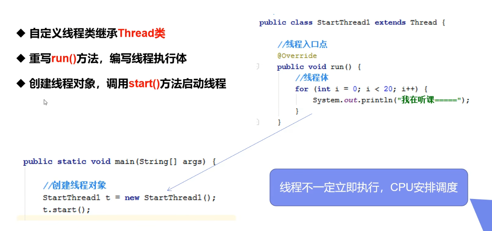
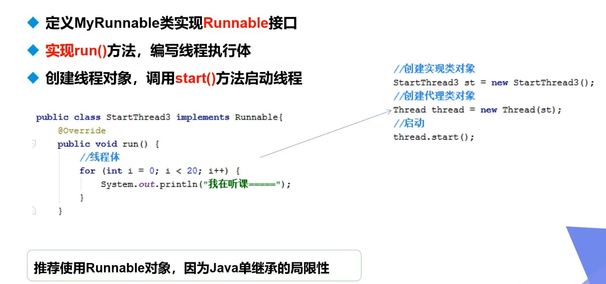
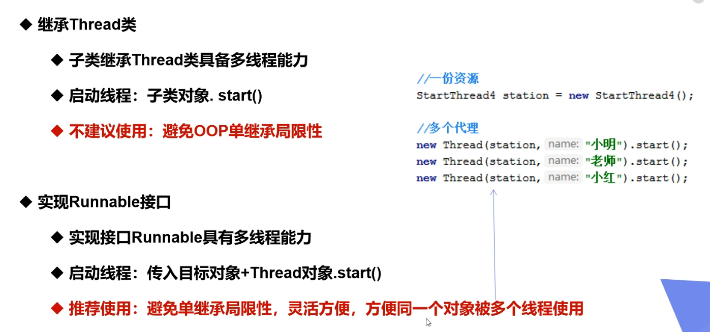
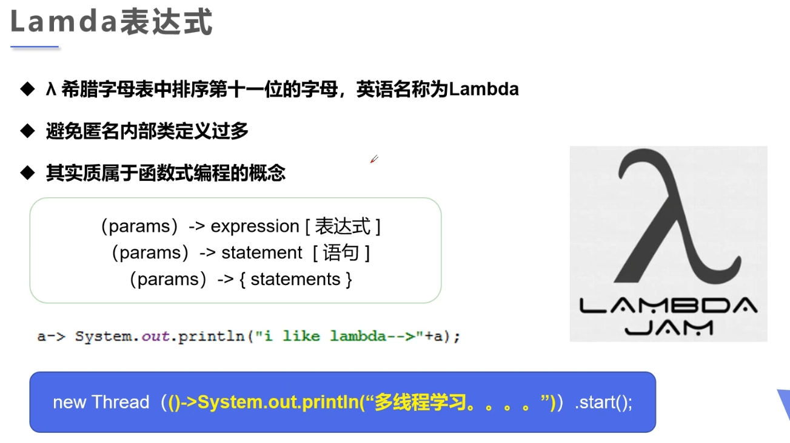
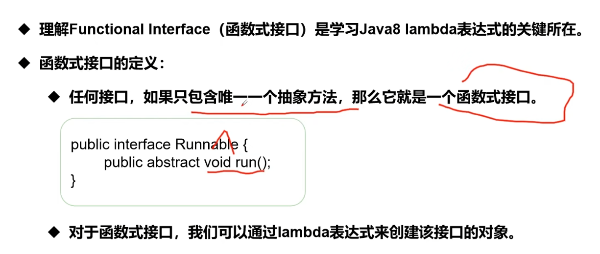
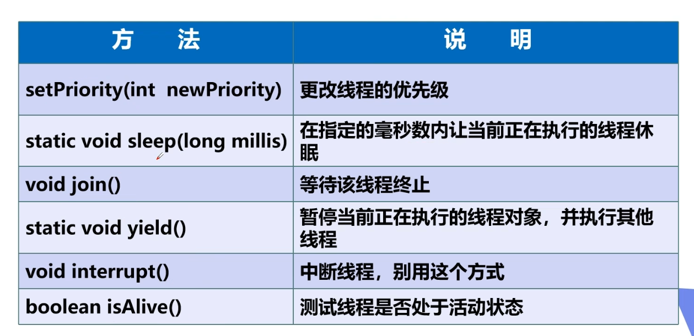
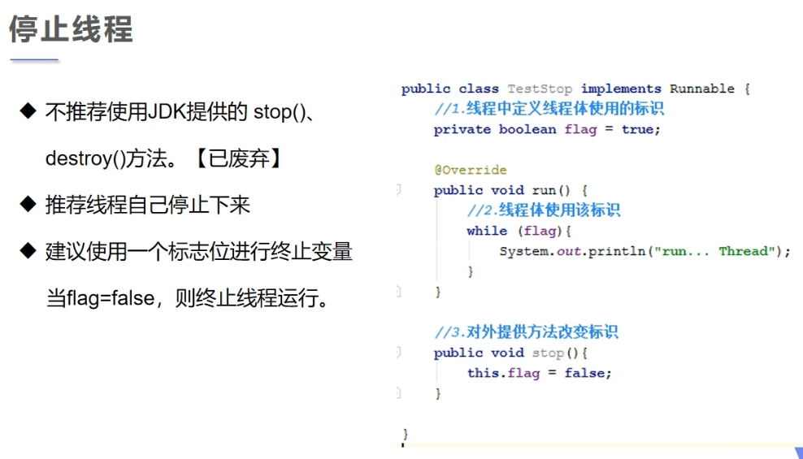
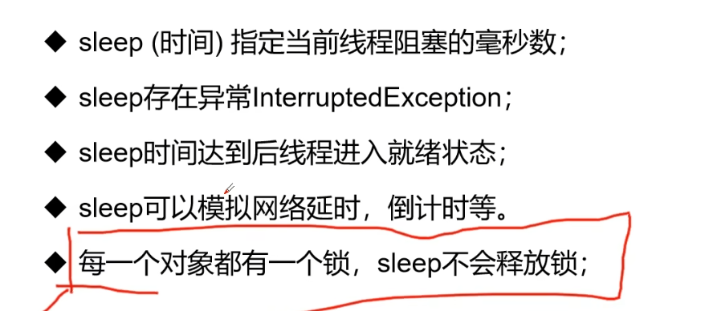

# 一、线程

## 1.1 线程状态


## 1.2 线程创建

创建线程有三种方式：


# 二、继承 `Thread` 类



```java
public class threadClass extends Thread{
    @Override
    public void run() {
        for (int i = 0; i < 100; i++) {
            System.out.println("子线程:" + Thread.currentThread().getName() + i);
        }
    }

    public static void main(String[] args) {
        threadClass ts = new threadClass();
        ts.setName("child_1");
        ts.start();

        for (int i = 0; i < 100; i++) {
            System.out.println("主线程: " + i);
        }
    }
}
```


# 三、实现 `Runnable` 接口





```java
public class runnableInterface implements Runnable{
    @Override
    public void run() {
        for (int i = 0; i < 100; i++) {
            System.out.println("子线程:" + Thread.currentThread().getName() + i);
        }        
    }

    public static void main(String[] args) {
        // 方式一:
        runnableInterface ri = new runnableInterface();
        Thread t1 = new Thread(ri);
        t1.start();
        
        // 方式二：
        // new Thread(ri).start();
        
        for (int i = 0; i < 100; i++) {
            System.out.println("主线程: " + i);
        }
    }
}
```

# 四、实现 `Callable` 接口

创建一个 `FutureTask` 异步任务：

```java
public class callableUse implements Callable<Boolean> {
    @Override
    public Boolean call() throws Exception {
        System.out.println("hello, i am running!");
        return true;
    }
    public static void main(String[] args)  {
        // 1. 创建一个新的异步任务
        FutureTask<Boolean> futureTask = new FutureTask<Boolean>(new callableUse());
        // 2.将该任务放入线程中执行
        new Thread(futureTask).start();
        // 3.等待获取任务的执行结果
        try {
            Boolean res =  futureTask.get();
            System.out.println(res);
        } catch (ExecutionException e) {
            e.printStackTrace();
        } catch (InterruptedException e) {
            e.printStackTrace();
        }
    }
}
```

# 五、线程创建总结

## 5.1 为什么要重写 run 方法

这是因为默认的`run()`方法不会做任何事情。

为了让线程执行一些实际的任务，我们需要提供自己的`run()`方法实现，这就需要重写`run()`方法。

```java
public class MyThread extends Thread {
  public void run() {
    System.out.println("MyThread running");
  }
}
```

在这个例子中，我们重写了`run()`方法，使其打印出一条消息。当我们创建并启动这个线程的实例时，它就会打印出这条消息。

## 5.2 run 方法和 start 方法有什么区别

- `run()`：封装线程执行的代码，**直接调用**相当于**调用普通方法**。
- `start()`：启动线程，然后**由 `JVM` 调用**此线程的 `run()` 方法。

## 5.3 通过继承 Thread 的方法和实现 Runnable 接口的方式创建多线程，哪个好

**实现 `Runable` 接口好**，原因有两个：

- **避免了 Java 单继承的局限性**，Java 不支持多重继承，因此如果我们的类已经继承了另一个类，就不能再继承 Thread 类了。
- 适合多个相同的程序代码去处理同一资源的情况，把线程、代码和数据有效的分离，更符合面向对象的设计思想。**Callable 接口**与 Runnable 非常相似，但**可以返回一个结果**。

# 六、静态代理模式

```java
package threadDemo;

/**
 * 代理模式的好处：
 * 代理对象可以做许多真实对象做不了的事情
 * 真实对象可以专注于自己的事情
 */

public class staticProxy {
    public static void main(String[] args) {
        You you = new You();   // 婚礼主体(真实对象)
        WeddingCompany wc = new WeddingCompany(you);   // 代理对象
        wc.happyMarry();
//        线程的创建也是使用了静态代理模式
//        runnableInterface ri = new runnableInterface();
//        Thread t1 = new Thread(ri);
//        t1.start();
    }
}

interface Marry {
    void happyMarry();
}

class You implements Marry {

    @Override
    public void happyMarry() {
        System.out.println("你结婚了，很高兴");
    }
}

class WeddingCompany implements Marry {
    private Marry target;   // 结婚公司的业务对象

    public WeddingCompany(Marry target) {
        this.target = target;
    }

    @Override
    public void happyMarry() {
        before();
        target.happyMarry();
        after();
    }

    private void after() {
        System.out.println("结婚之后，收取费用");
    }

    private void before() {
        System.out.println("结婚之前，布置婚礼");
    }
}
```

# 七、`Lamda` 表达式

`Lamda` 表达式只能针对于**包含唯一一个抽象方法的接口**。





## 7.1 `Lamda` 表达式的演进由来

我们有一个函数式接口，对其实现的方式演进过程为：

实现类 ---->  内部静态类 -----> 局部内部类 ----> 匿名内部类 ----> `lamda` 表达式

```java
package threadDemo;

// 1.定义一个函数式接口
interface ILike {
    void like(int i);
}
// 2.（独立）实现类
class Like implements ILike {
    public void like(int i) {
        System.out.println("i like lamda" + i);
    }
}

public class lamdaTest {
    // 3.内部静态类
    static class Like2 implements ILike {
        public void like(int i) {
            System.out.println("i like lamda" + i);
        }
    }
    public static void main(String[] args) {
        // 2.使用实现类
        ILike like = new Like();
        like.like(1);
        // 3.使用内部静态类
        ILike like2 = new Like2();
        like2.like(2);

        // 4. 局部内部类
        class Like3 implements ILike {
            public void like(int i) {
                System.out.println("i like lamda" + i);
            }
        }
        ILike like3 = new Like3();
        like3.like(3);

        // 5.匿名内部类
        ILike like4 = new ILike() {
            @Override
            public void like(int i) {
                System.out.println("i like lamda" + i);
            }
        };
        like4.like(4);

        // 6.lamda 表达式
        ILike like5 = (int i)-> {
            System.out.println("i like lamda" + i);
        };
        like5.like(5);
    }
}
```

# 八、线程方法



## 8.1 停止线程



## 8.2 线程休眠



需要注意的是，sleep 的时候**要对异常进行处理**。

```java
try {//sleep会发生异常要显示处理
    Thread.sleep(20);//暂停20毫秒
} catch (InterruptedException e) {
    e.printStackTrace();
}
```

## 8.3 join()

**等待这个线程执行完**才会轮到**后续线程**得到 `cpu` 的执行权（**强制实现一种同步关系**），使用这个也**要捕获异常**。

```java
//创建MyRunnable类
MyRunnable mr = new MyRunnable();
//创建Thread类的有参构造,并设置线程名
Thread t1 = new Thread(mr, "张飞");
Thread t2 = new Thread(mr, "貂蝉");
Thread t3 = new Thread(mr, "吕布");
//启动线程
t1.start();
try {
    t1.join(); //等待t1执行完才会轮到t2，t3抢
} catch (InterruptedException e) {
    e.printStackTrace();
}
t2.start();
t3.start();
```

来看一下执行后的结果：


## 8.4 `setDaemon()`

将此线程标记为**守护线程**，准确来说，就是服务其他的线程，像 Java 中的垃圾回收线程，就是典型的守护线程。

1.  后台线程，也称为[守护线程](https://so.csdn.net/so/search?q=守护线程&spm=1001.2101.3001.7020)，**是为用户线程提供公共服务的线程**，在没有用户线程可服务时会自动离开。
2.  守护线程的**优先级比较低**，用于为系统中其他对象和线程提供服务
3.  使用 **`setDaemon(true)` **将线程设置为后台线程；且在Daemon线程中产生的新线程也是Daemon的；
4.  [垃圾回收](https://so.csdn.net/so/search?q=垃圾回收&spm=1001.2101.3001.7020)线程是一个典型的守护线程，当我们的程序中不再有任何运行中的Thread，垃圾回收线程**会自动离开**。后台线程**是 `JVM` 级别的**，独立于控制终端并且周期性的执行某种任务或等待处理某些发生的事件。

```java
//创建MyRunnable类
MyRunnable mr = new MyRunnable();
//创建Thread类的有参构造,并设置线程名
Thread t1 = new Thread(mr, "张飞");
Thread t2 = new Thread(mr, "貂蝉");
Thread t3 = new Thread(mr, "吕布");

t1.setDaemon(true);
t2.setDaemon(true);

//启动线程
t1.start();
t2.start();
t3.start();
```

## 8.5 `yield()`

yield() 方法是一个静态方法，用于暗示**当前线程愿意放弃其当前的时间片**，**允许其他线程执行**。然而，它**只是向线程调度器提出建议**，**调度器可能会忽略这个建议**。具体行为取决于操作系统和 [JVM](https://javabetter.cn/jvm/what-is-jvm.html) 的线程调度策略。

```java
class YieldExample {
    public static void main(String[] args) {
        Thread thread1 = new Thread(YieldExample::printNumbers, "刘备");
        Thread thread2 = new Thread(YieldExample::printNumbers, "关羽");

        thread1.start();
        thread2.start();
    }

    private static void printNumbers() {
        for (int i = 1; i <= 5; i++) {
            System.out.println(Thread.currentThread().getName() + ": " + i);

            // 当 i 是偶数时，当前线程暂停执行
            if (i % 2 == 0) {
                System.out.println(Thread.currentThread().getName() + " 让出控制权...");
                Thread.yield();
            }
        }
    }
}
```

运行结果：


从这个结果可以看得出来，即便**有时候让出了控制权，其他线程也不一定会执行**。