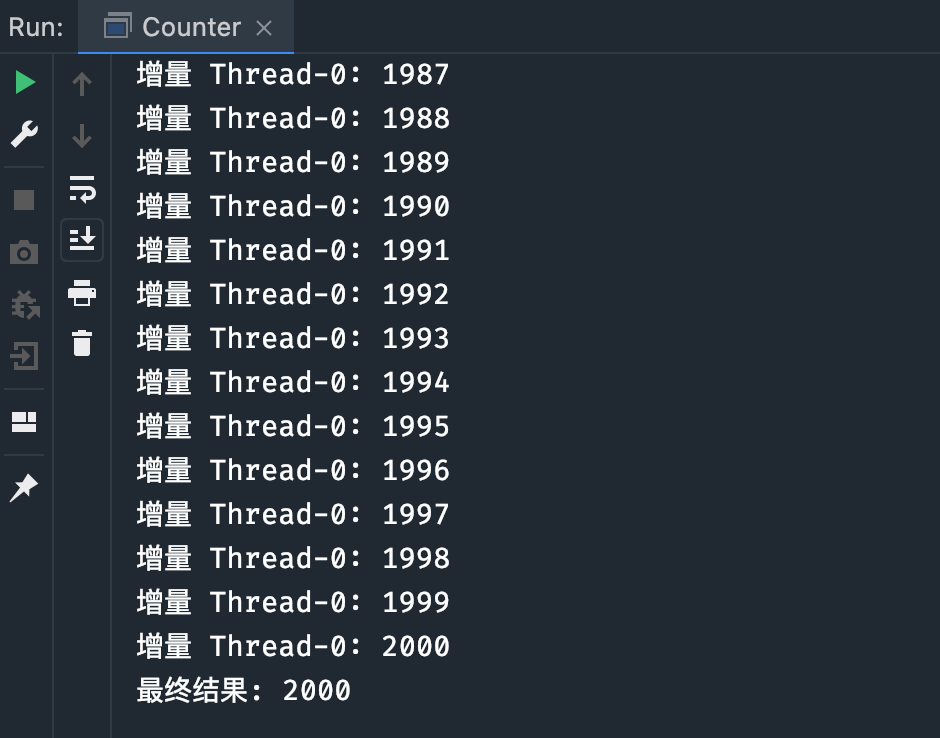

# 一、`synchronized` 锁的不足

前面我们介绍了**基于对象的原生锁**—— `synchronized`，实际上，Java 在`java.util.concurrent`**（ `JUC` ）包**下，还为我们提供了**更多的锁类和锁接口**（尤其是子包 locks 下），它们有更强大的功能或更牛逼的性能。

来看看 `synchronized` 的**不足之处**吧：

- 如果临界区是**只读操作，其实可以多线程一起执行**，但使用 synchronized 的话，**同一时间只能有一个线程执行**。
- synchronized **无法知道**线程**有没有成功获取到锁**。
- 使用 synchronized，如果**临界区**因为 IO 或者 sleep 方法等原因**阻塞了**，而**当前线程又没有释放锁**，就会导致**所有线程等待**。

# 二、锁的几种分类

Java 提供了种类丰富的锁，每种锁因其特性的不同，在适当的场景下能够展现出非常高的效率。我们可以通过特性将锁进行分组归类。


## 2.1 乐观锁 VS 悲观锁

乐观锁与悲观锁是一种广义上的概念，体现了看待线程同步的不同角度。

先说概念。对于同一个数据的并发操作，悲观锁认为自己在使用数据的时候一定有别的线程来修改数据，因此在获取数据的时候会先加锁，确保数据不会被别的线程修改。Java 中，**synchronized 关键字是最典型的悲观锁**。

而乐观锁认为自己在使用数据时不会有别的线程修改数据，所以不会加锁，只是在**更新数据的时候会去判断之前有没有别的线程更新了这个数据**。如果这个数据**没有被更新，当前线程将自己修改的数据写入**。如果数据**已经被其他线程更新，则根据不同的实现方式执行不同的操作（例如报错或者自动重试）**。

**乐观锁**在 Java 中是通过**无锁编程**来实现的，最常采用的是 **`CAS` 算法**，Java 原子类的递增操作就通过 **`CAS` 自旋**实现的。


根据上面的概念描述我们可以发现：

- 悲观锁适合写操作多的场景，先加锁可以保证写操作时数据正确。
- 乐观锁适合读操作多的场景，不加锁的特点能够使其读操作的性能大幅提升。

光说概念有些抽象，我们来看下乐观锁和悲观锁的调用方式：

```java
// --------- 悲观锁的调用方式 -------------------------
// 1. synchronized
public synchronized void testMethod() {
	// 操作同步资源
}
// 2. ReentrantLock
private ReentrantLock lock = new ReentrantLock(); 
// 需要保证多个线程使用的是同一个锁
public void modifyPublicResources() {
	lock.lock();
	// 操作同步资源
	lock.unlock();
}

// --------- 乐观锁的调用方式 -------------------------
private AtomicInteger atomicInteger = new AtomicInteger();  
// 需要保证多个线程使用的是同一个AtomicInteger
atomicInteger.incrementAndGet(); //执行自增1
```

CAS 是一种无锁算法，可以在不使用锁（没有线程被阻塞）的情况下实现多线程之间的变量同步。JUC 包中的**原子类**（后面会细讲，戳链接直达）就是**通过 CAS 实现的乐观锁**。

CAS 算法涉及到三个操作数：

- 需要读写的内存值 V。
- 进行比较的值 A。
- 要写入的新值 B。

当且**仅当 V 的值等于 A 时，CAS 通过原子方式用新值 B 来更新 V 的值**（“比较+更新”整体是一个原子操作），否则不会执行任何操作。**一般情况下，“更新”是一个不断重试的操作。**

## 2.2 自旋锁 VS 适应性自旋锁

**阻塞或唤醒一个 Java 线程需要操作系统切换 CPU 状态来完成**，这种状态转换需要耗费处理器时间。如果同步代码块中的内容过于简单，**状态转换消耗的时间有可能比用户代码执行的时间还要长。**

在许多场景中，同步资源的锁定时间很短，为了这一小段时间去切换线程，线程挂起和恢复线程花费的时间可能会让系统得不偿失。如果物理机器有多个处理器，能够让两个或以上的线程同时并行执行，我们就**可以让后面那个请求锁的线程不放弃 CPU 的执行时间，看看持有锁的线程是否会很快释放锁。**

为了让当前线程“稍等一下”，我们需要**让当前线程进行自旋**，如果**在自旋完成后前面锁定同步资源的线程已经释放了锁，那么当前线程就可以不用阻塞而是直接获取同步资源，从而避免切换线程的开销**。这就是自旋锁。


自旋锁本身是有缺点的，它不能代替阻塞。自旋等待虽然避免了线程切换的开销，但它要占用处理器时间。如果**锁被占用的时间很短，自旋等待的效果就会非常好**。反之，如果**锁被占用的时间很长，那么自旋的线程只会白白浪费处理器资源**。所以，自旋等待的时间必须要有一定的限度，如果自旋超过了限定次数（默认是 10 次，可以使用`-XX:PreBlockSpin` 来更改）没有成功获得锁，就应当挂起线程。

自旋锁的实现原理同样也是 CAS，**AtomicInteger 中调用 unsafe 进行自增操作的源码中的 do-while 循环就是一个自旋操作，如果修改数值失败则通过循环来执行自旋，直至修改成功。**


自旋锁在 `JDK1.4.2` 中引入，使用`-XX:+UseSpinning`来开启。**JDK 6 中变为默认开启，并且引入了自适应的自旋锁（适应性自旋锁）。**

**自适应意味着自旋的时间（次数）不再固定**，而是**由前一次在同一个锁上的自旋时间及锁的拥有者的状态来决定**。如果在**同一个锁对象**上，**自旋刚刚成功获得过锁，并且持有锁的线程正在运行中，那么虚拟机就会认为这次自旋也是很有可能再次成功的，进而它将允许自旋等待更长的时间**。如果对于某个锁，自旋很少成功获得过，那在以后尝试获取这个锁时将可能省略掉自旋过程，直接阻塞线程，避免浪费处理器资源。

## 2.2 无锁偏向锁轻量级锁重量级锁

这四种锁是专门针对 synchronized 的，我们在[synchronized 锁的到底是什么](https://javabetter.cn/thread/synchronized.html)一文中已经详细地介绍过，这里就不再赘述了。

## 2.3 可重入锁和非可重入锁

可重入锁又名递归锁，是指**同一个线程在外层方法获取锁的时候，再进入该线程的内层方法会自动获取锁**（前提：**锁的是同一个对象或者 class**），**不会因为之前已经获取过还没释放而阻塞**。Java 中 ReentrantLock（后面会细讲，戳链接直达）和 synchronized 都是可重入锁，可重入锁的一个优点就是可以一定程度避免死锁。下面用示例代码来进行分析：

```java
public class Widget {
    public synchronized void doSomething() {
        System.out.println("方法1执行...");
        doOthers();
    }

    public synchronized void doOthers() {
        System.out.println("方法2执行...");
    }
}
```

在上面的代码中，类中的两个方法**都是被内置锁 synchronized 修饰**的，`doSomething()`方法中调用了`doOthers()`方法。因为内置锁是可重入的，所以**同一个线程在调用`doOthers()`时可以直接获得当前对象的锁，进入`doOthers()`进行操作**。

如果是一个**不可重入锁**，那么当前线程在**调用`doOthers()`之前，需要将执行`doSomething()`时获取当前对象的锁释放掉**，实际上**该对象锁已经被当前线程所持有，且无法释放**。所以此时会**出现死锁**。

之前我们说过 `ReentrantLock` 和 `synchronized` 都是重入锁，那么我们通过重入锁 `ReentrantLock` 以及非可重入锁 `NonReentrantLock` 的源码来对比分析一下为什么非可重入锁在重复调用同步资源时会出现死锁。

1. **对于获取锁**

首先 **`ReentrantLock` 和 `NonReentrantLock` 都继承了父类 AQS** ，其父类 **AQS 中维护了一个同步状态 status 来计数重入次数**，status 初始值为 0。

当线程尝试获取锁时，**可重入锁**先尝试获取并更新 status 值，如果`status == 0`表示没有其他线程在执行同步代码，则把 status 置为 1，当前线程开始执行。**如果`status != 0`，则判断当前线程是否获取到了这个锁，如果是的话执行`status+1`**，且**当前线程可以再次获取锁**。而**非可重入锁**是直接获取并尝试更新当前 status 的值，如果 **`status != 0`的话会导致其获取锁失败，当前线程阻塞**。

2. **对于释放锁**

释放锁时，**可重入锁**同样会先获取当前 status 的值，在当前线程是持有锁的线程的前提下。**如果`status-1 == 0`，则表示当前线程所有重复获取锁的操作都已经执行完毕，然后该线程才会真正释放锁**。而**非可重入锁**则是在确定**当前线程是持有锁的线程之后，直接将 status 置为 0，将锁释放**。


## 2.4 公平锁与非公平锁

这里的“**公平**”，其实通俗意义来说就是“先来后到”，**也就是 FIFO**。如果对一个锁来说，**先对锁获取请求的线程一定会先被满足，后对锁获取请求的线程后被满足，那这个锁就是公平的**。反之，那就是不公平的。

一般情况下，**非公平锁能提升一定的效率。但是非公平锁可能会发生线程饥饿（有一些线程长时间得不到锁）的情况**。所以要根据实际的需求来选择非公平锁和公平锁。

`ReentrantLock` 支持非公平锁和公平锁两种。

## 2.5 读写锁和排它锁

我们前面讲到的 `synchronized` 和后面要讲的 `ReentrantLock` ，其实都是“**排它锁**”。也就是说，这些**锁在同一时刻只允许一个线程进行访问**。

而**读写锁可以在同一时刻允许多个读线程访问**。Java 提供了 ReentrantReadWriteLock 类作为读写锁的默认实现，**内部维护了两个锁：一个读锁，一个写锁**。通过分离读锁和写锁，使得在“读多写少”的环境下，大大地提高了性能。

> 注意，即使用读写锁，在写线程访问时，所有的读线程和其它写线程均被阻塞。

排它锁也叫独享锁，如果线程 T 对数据 A 加上排它锁后，则其他线程不能再对 A 加任何类型的锁。获得排它锁的线程既能读数据又能修改数据。

与之对应的，就是共享锁，指该锁可被多个线程所持有。如果线程 T 对数据 A 加上共享锁后，则其他线程只能对 A 再加共享锁，不能加排它锁。获得共享锁的线程只能读数据，不能修改数据。

独享锁与共享锁也是通过 AQS 来实现的，通过实现不同的方法，来实现独享或者共享。

1. **读锁和写锁的具体加锁方式有什么区别呢？**

在了解源码之前我们需要回顾一下其他知识。 在最开始提及 AQS 的时候我们也提到了 **state 字段（int 类型，32 位）**，该字段用来**描述有多少线程持有锁**。

在**独享锁**中，**这个值通常是 0 或者 1**（如果是**重入锁的话 state 值就是重入的次数**）；在**共享锁**中 **state 就是持有锁的数量**。

但是在  `ReentrantReadWriteLock` 中**有读、写两把锁**，所以**需要在一个整型变量 state  上分别描述读锁和写锁的数量（或者也可以叫状态）**。于是**将 state 变量“按位切割”**切分成了两个部分，**高 16 位表示读锁状态（读锁个数）**，**低 16 位表示写锁状态（写锁个数）**。如下图所示：


## 2.6 总结

**综上，只有 synchronized 是远远不能满足多样化业务对锁的要求的**。接下来我们介绍一下 `JDK` 中有关锁的一些接口和类。

# 三、`JUC` 包下的锁

众所周知，`JDK` 中关于并发的类大多都在 `JUC` 包下。

## 3.1 抽象类 `AQS/AQLS/AOS`

首先我们来看 **`AQS`**（`AbstractQueuedSynchronizer` ），它是在 `JDK 1.5` 发布的，提供了一个“队列同步器”的基本功能实现。

`AQS` 里面的“资源”是用一个`int`类型的数据来表示的，有时候业务需求的资源数超出了`int`的范围，所以在 `JDK 1.6` 中，多了一个**`AQLS`**（`AbstractQueuedLongSynchronizer`）。它的代码跟 `AQS` 几乎一样，只是把资源的类型变成了`long`类型。

`AQS` 和 `AQLS` 都继承了一个类叫 **`AOS`**（ `AbstractOwnableSynchronizer` ）。这个类也是在 `JDK 1.6` 中出现的。

`AQS` 这个类只有几行简单的代码。从源码类上的注释可以知道，它是用于**表示锁与持有者之间的关系（独占模式）**。可以看一下它的主要方法：

## 3.2 接口 `Condition/Lock/ReadWriteLock`

locks 包下共有三个接口：`Condition`、`Lock`、`ReadWriteLock`。

其中，`Lock` 和 `ReadWriteLock` 从名字就可以看得出来，分别是锁和读写锁的意思。Lock 接口里面有一些获取锁和释放锁的方法声明，而 `ReadWriteLock` 里面只有两个方法，分别返回“读锁”和“写锁”：

```JAVA
public interface ReadWriteLock {
    Lock readLock();
    Lock writeLock();
}
```

Lock 接口中**有一个方法可以获得一个 Condition（Condition 需要通过 Lock 获得）**

```java
Condition newCondition();
```

### 3.2.1 Condition 与 Object 对比

之前我们提到过每个对象都可以用`Object`的**wait/notify**方法来实现**等待/通知机制**。而 Condition 接口也提供了类似 Object 的方法，可以配合**Lock**来实现**等待/通知模式**。

既然有 Object 的监视器方法了，为什么还要用 Condition 呢？这里有一个简单的对比：

| 对比项                                         | Object 监视器                    | Condition                                                    |
| ---------------------------------------------- | -------------------------------- | ------------------------------------------------------------ |
| 前置条件                                       | 获取对象的锁                     | 调用 `Lock.lock` 获取锁，调用 `Lock.newCondition` 获取 Condition 对象 |
| 调用方式                                       | 直接调用，比如 `object.notify()` | 直接调用，比如 `condition.await()`                           |
| 等待队列的个数                                 | 一个                             | 多个                                                         |
| 当前线程释放锁进入等待状态                     | 支持                             | 支持                                                         |
| 当前线程释放锁进入等待状态，在等待状态中不中断 | 不支持                           | 支持                                                         |
| 当前线程释放锁并进入超时等待状态               | 支持                             | 支持                                                         |
| 当前线程释放锁并进入等待状态直到将来的某个时间 | 不支持                           | 支持                                                         |
| 唤醒等待队列中的一个线程                       | 支持                             | 支持                                                         |
| 唤醒等待队列中的全部线程                       | 支持                             | 支持                                                         |

Condition 和 Object 的 wait/notify 基本相似。其中，**Condition 的 await 方法对应的是 Object 的 wait 方法**，而 **Condition 的 `signal/signalAll` 方法则对应 Object 的 notify/`notifyAll()`**。但 Condition 类似于 Object 的等待/通知机制的加强版。

Condition 接口一共提供了以下 7 个方法：

- `await()`：线程等待直到被通知或者中断。类似于 `Object.wait()`。
- `awaitUninterruptibly()`：线程等待直到被通知，即使在等待时被中断也不会返回。没有与之对应的 Object 方法。
- `await(long time, TimeUnit unit)`：线程等待指定的时间，或被通知，或被中断。类似于 `Object.wait(long timeout)`，但提供了更灵活的时间单位。
- `awaitNanos(long nanosTimeout)`：线程等待指定的纳秒时间，或被通知，或被中断。没有与之对应的 Object 方法。
- `awaitUntil(Date deadline)`：线程等待直到指定的截止日期，或被通知，或被中断。没有与之对应的 Object 方法。
- `signal()`：唤醒一个等待的线程。类似于 `Object.notify()`。
- `signalAll()`：唤醒所有等待的线程。类似于 `Object.notifyAll()`。

 Object 类的主要方法：

- `wait()`：线程等待直到被通知或者中断。
- `wait(long timeout)`：线程等待指定的时间，或被通知，或被中断。
- `wait(long timeout, int nanos)`：线程等待指定的时间，或被通知，或被中断。
- `notify()`：唤醒一个等待的线程。
- `notifyAll()`：唤醒所有等待的线程。

### 3.2.2 Condition 解析

前面我们学过，[AQS](https://javabetter.cn/thread/aqs.html) 内部维护了一个先进先出（FIFO）的双端队列，并使用了两个引用 head 和 tail 用于标识队列的头部和尾部。


Condition 内部也使用了同样的方式，内部维护了一个先进先出（FIFO）的单向队列，我们把它称为等待队列。


1. 调用 condition.await 方法后线程依次尾插入到了等待队列中，依次为 Thread-0,Thread-1,Thread-2....Thread-8；
2. 等待队列是一个单向队列。示意图如下：


同时还有一点需要注意：我们**可以多次调用`newCondition()`方法创建多个 Condition 对象**，也就是**一个 lock 可以持有多个等待队列**。

而如果是 **Object 方式的话**，就**只能有一个同步队列和一个等待队列**。

因此，`ReentrantLock` 等 `AQS` 是可以持有**一个同步队列**和**多个等待队列**的，**new 多个 Condition 就行**了。示意图如下：


持有多个等待队列的好处是什么呢？我们可以通过下面这个例子来说明：

```java
public class BoundedBuffer<T> {
    private final LinkedList<T> buffer;  // 使用 LinkedList 作为缓冲区
    private final int capacity;          // 缓冲区最大容量
    private final ReentrantLock lock;    // 互斥锁
    private final Condition notEmpty;    // 缓冲区非空条件
    private final Condition notFull;     // 缓冲区非满条件

    public BoundedBuffer(int capacity) {
        this.capacity = capacity;
        this.buffer = new LinkedList<>();
        this.lock = new ReentrantLock();   // 该 lock 创建了两个 Condition，分别代表两个等待队列
        this.notEmpty = lock.newCondition();
        this.notFull = lock.newCondition();
    }

    // 放入一个元素
    public void put(T item) throws InterruptedException {
        lock.lock();
        try {
            // 如果缓冲区满，等待
            while (buffer.size() == capacity) {
                notFull.await();
            }
            buffer.add(item);   // 缓冲区未满，填充数据
            // 通知可能正在等待的消费者
            notEmpty.signal();
        } finally {
            lock.unlock();
        }
    }

    // 取出一个元素
    public T take() throws InterruptedException {
        lock.lock();
        try {
            // 如果缓冲区空，等待
            while (buffer.isEmpty()) {
                notEmpty.await();
            }
            T item = buffer.removeFirst();  // 缓冲区非空，消费数据
            // 通知可能正在等待的生产者
            notFull.signal();
            return item;
        } finally {
            lock.unlock();
        }
    }
}
```

考虑这个简单的有界缓冲区 `BoundedBuffer`，其中**生产者放入元素，消费者取出元素**。我们将使用**两个 Condition：一个表示缓冲区不为空（用于消费者等待），另一个表示缓冲区不满（用于生产者等待）。**

生产者调用 put 方法放入元素，如果缓冲区已满，则等待 notFull 条件。消费者调用 take 方法取出元素，如果缓冲区为空，则等待 notEmpty 条件。当一个元素被放入或取出时，相应的条件会发出信号，唤醒等待的线程。

使用**多个 Condition 对象的主要优点**是为锁提供了更细粒度的控制，**可以实现更复杂的同步场景**，比如上面提到的有界缓冲区。

await、signal 和 signalAll 方法就像一个开关，控制着线程 A（等待方）和线程 B（通知方）。它们之间的关系可以用下面这幅图来说明，会更贴切：


线程 `awaitThread` 先通过 `lock.lock()` 方法获取锁，成功后调用 `condition.await` 方法进入等待队列，而另一个线程 `signalThread` 通过 `lock.lock()` 方法获取锁成功后调用了 `condition.signal` 或者 `signalAll` 方法，**使得线程 `awaitThread`  能够有机会移入到同步队列**中，当其他线程释放 lock 后使得**线程 `awaitThread` 能够有机会获取 lock**，从而使得线程  `awaitThread` **能够从 await 方法中退出并执行后续操作**。如果 **`awaitThread` 获取 lock 失败会重新进入到同步队列**。

我们用一个很简单的例子说说 condition 的用法：

```java
public class AwaitSignal {
    private static ReentrantLock lock = new ReentrantLock();
    private static Condition condition = lock.newCondition();
    private static volatile boolean flag = false;

    public static void main(String[] args) {
        Thread waiter = new Thread(new waiter());
        waiter.start();
        Thread signaler = new Thread(new signaler());
        signaler.start();
    }

    static class waiter implements Runnable {

        @Override
        public void run() {
            lock.lock();
            try {
                while (!flag) {
                    System.out.println(Thread.currentThread().getName() + "当前条件不满足等待");
                    try {
                        condition.await();
                    } catch (InterruptedException e) {
                        e.printStackTrace();
                    }
                }
                System.out.println(Thread.currentThread().getName() + "接收到通知条件满足");
            } finally {
                lock.unlock();
            }
        }
    }

    static class signaler implements Runnable {

        @Override
        public void run() {
            lock.lock();
            try {
                flag = true;
                condition.signalAll();
            } finally {
                lock.unlock();
            }
        }
    }
}
```

输出结果为：

```text
Thread-0当前条件不满足等待
Thread-0接收到通知，条件满足
```

1. 开启了两个线程  waiter 和 signaler。
2. waiter 线程开始执行的时候由于**条件不满足**，执行 condition.await  方法使该线程**进入等待状态**，同时**释放锁**。
3. signaler 线程**获取到锁**之后**更改条件**，并**通知所有的等待线程**，然后**释放锁**。
4. 这时，waiter 线程**获取到锁**，由于 signaler 线程更改了条件，此时相对于 waiter 来说，**条件满足，继续执行**。


## 3.3 可重入锁 `ReentrantLock`

`ReentrantLock` 是 Lock 接口的**默认实现**，实现了锁的基本功能。

从名字上看，它是一个“可重入”锁，从源码上看，它内部有一个抽象类`Sync`，继承了 `AQS` ，自己实现了一个同步器。

同时，`ReentrantLock` 内部有**两个非抽象类 `NonfairSync` 和 `FairSync`** ，它们都继承了 Sync。从名字上可以看得出，**分别是”非公平同步器“和”公平同步器“的意思**。这意味着 `ReentrantLock` 可以**支持”公平锁“和”非公平锁“**。

通过看这两个同步器的源码可以发现，它们的实现**都是”独占“的**。都调用了 `AOS` 的`setExclusiveOwnerThread`方法，所以 `ReentrantLock` 的锁是”独占“的，也就是说，它的锁都**是”排他锁“，不能共享。**

在 `ReentrantLock` 的**构造方法里，可以传入一个`boolean`类型的参数**，来**指定它是否是一个公平锁**，**默认情况**下是**非公平的**。这个参数一旦实例化后就不能修改，只能通过`isFair()`方法来查看。

来看一个 `ReentrantLock` 的简单示例：

```java
public class Counter {
    private final ReentrantLock lock = new ReentrantLock();
    private int count = 0;

    public void increment() {
        lock.lock(); // 获取锁
        try {
            count++;
            System.out.println("增量 " + Thread.currentThread().getName() + ": " + count);
        } finally {
            lock.unlock(); // 释放锁
        }
    }

    public static void main(String[] args) {
        Counter counter = new Counter();

        Runnable task = () -> {
            for (int i = 0; i < 1000; i++) {
                counter.increment();
            }
        };

        Thread thread1 = new Thread(task);
        Thread thread2 = new Thread(task);

        thread1.start();
        thread2.start();

        try {
            thread1.join();
            thread2.join();
        } catch (InterruptedException e) {
            e.printStackTrace();
        }

        System.out.println("最终结果: " + counter.count);
    }
}
```

在这个示例中，Counter 类使用了一个 `ReentrantLock` 来保护 `count` 变量的访问。`increment` 方法首先获取锁，然后增加计数，并**在 finally 块中释放锁**。这确保了**即使方法中抛出异常，锁也会被正确释放**。

在 `main` 方法中，我们创建了两个线程来并发执行 `increment` 操作。由于使用了锁，因此对 count 变量的访问是串行化的，结果是正确的。

这个示例展示了 `ReentrantLock` 的基本用法。与 `synchronized` 关键字相比，`ReentrantLock` 提供了更高的灵活性，例如可中断的锁获取、公平锁选项、锁的定时获取等。

来看一下最终输出结果：



需要注意的是，使用 `ReentrantLock` 时，锁必须**在 try 代码块开始之前获取**，并且**加锁之前不能有异常抛出**，否则在 finally 块中就无法释放锁（ `ReentrantLock` 的**锁必须在 finally 中手动释放**）。

错误❎示例：

```java
Lock lock = new XxxLock();
// ...
try {
    // 如果在此抛出异常，会直接执行 finally 块的代码
    doSomething();
    // 不管锁是否成功，finally 块都会执行
    lock.lock();
    doOthers();

} finally {
    lock.unlock();
} 
```

正确✅示例：

```java
Lock lock = new XxxLock();
// ...
lock.lock();
try {
    doSomething();
    doOthers();
} finally {
    lock.unlock();
}
```

## 3.4 `ReentrantLock` 与 `synchronized` 对比

- **ReentrantLock 是一个类，而 synchronized 是 Java 中的关键字**；
- **ReentrantLock 可以实现多路选择通知（可以绑定多个 Condition**），而 synchronized 只能通过 wait 和 notify/notifyAll 方法**唤醒一个线程**或者**唤醒全部线程**（单路通知）；
- ReentrantLock 必须**手动释放锁**。通常需要在 finally 块中调用 unlock 方法以确保锁被正确释放；synchronized 会**自动释放锁**，当同步块执行完毕时，由 JVM 自动释放，不需要手动操作。
- ReentrantLock 通常提供更好的性能，特别是在高竞争环境下；synchronized 在某些情况下，性能可能稍差一些，但随着 JDK 版本的升级，性能差距已经不大了。


## 3.5 读写锁 `ReentrantReadWriteLock`

`ReentrantReadWriteLock` 是 `ReadWriteLock` 接口的**默认实现**。它与 `ReentrantLock  `的功能类似，同样是**可重入**的，**支持非公平锁和公平锁**。不同的是，它还**支持”读写锁“**。

来看一下 `ReentrantReadWriteLock` 的使用示例：

```java
public class SharedResource {
    private final ReentrantReadWriteLock lock = new ReentrantReadWriteLock();
    private int data = 0;

    public void write(int value) {
        lock.writeLock().lock(); // 获取写锁
        try {
            data = value;
            System.out.println("写 " + Thread.currentThread().getName() + ": " + data);
        } finally {
            lock.writeLock().unlock(); // 释放写锁
        }
    }

    public void read() {
        lock.readLock().lock(); // 获取读锁
        try {
            System.out.println("读 " + Thread.currentThread().getName() + ": " + data);
        } finally {
            lock.readLock().unlock(); // 释放读锁
        }
    }

    public static void main(String[] args) {
        SharedResource sharedResource = new SharedResource();

        // 创建读线程
        Thread readThread1 = new Thread(() -> {
            for (int i = 0; i < 5; i++) {
                sharedResource.read();
            }
        });

        Thread readThread2 = new Thread(() -> {
            for (int i = 0; i < 5; i++) {
                sharedResource.read();
            }
        });

        // 创建写线程
        Thread writeThread = new Thread(() -> {
            for (int i = 0; i < 5; i++) {
                sharedResource.write(i);
            }
        });

        readThread1.start();
        readThread2.start();
        writeThread.start();

        try {
            readThread1.join();
            readThread2.join();
            writeThread.join();
        } catch (InterruptedException e) {
            e.printStackTrace();
        }
    }
}
```

在上述代码中，我们定义了一个 `SharedResource` 类，该类使用 `ReentrantReadWriteLock` 来保护其内部数据。write 方法获取写锁，并更新共享数据。read 方法获取读锁，并读取共享数据。

在 main 方法中，我们创建了两个读线程和一个写线程。由于 `ReentrantReadWriteLock` 允许多个读取操作同时进行，因此读线程可以同时运行。然而，写入操作会被串行化，并且在写入操作进行时，读取操作将被阻塞。

来看一下输出结果：

```
读 Thread-0: 0
读 Thread-1: 0
写 Thread-2: 0
写 Thread-2: 1
写 Thread-2: 2
写 Thread-2: 3
写 Thread-2: 4
读 Thread-0: 4
读 Thread-1: 4
读 Thread-0: 4
读 Thread-1: 4
读 Thread-0: 4
读 Thread-1: 4
读 Thread-0: 4
读 Thread-1: 4
```

### 3.5.1 实现锁降级

写锁降级是一种允许**写锁**转换为**读锁**的过程。通常的顺序是：

- 获取写锁：线程首先获取写锁，确保在修改数据时排它访问。
- 获取读锁：在**写锁保持的同时**，线程可以**再次获取读锁**。
- 释放写锁：线程**保持读锁的同时释放写锁**。
- 释放读锁：最后线程释放读锁。

这样，写锁就降级为读锁，允许其他线程进行并发读取，但仍然排除其他线程的写操作。下面的代码展示了如何使用 `ReentrantReadWriteLock` 来降级写锁：

```java
ReentrantReadWriteLock lock = new ReentrantReadWriteLock();
ReentrantReadWriteLock.WriteLock writeLock = lock.writeLock();
ReentrantReadWriteLock.ReadLock readLock = lock.readLock();

writeLock.lock(); // 获取写锁
try {
    // 执行写操作
    readLock.lock(); // 获取读锁
} finally {
    writeLock.unlock(); // 释放写锁
}

try {
    // 执行读操作
} finally {
    readLock.unlock(); // 释放读锁
}
```

写锁降级为读锁的过程**有助于保持数据的一致性**，而不影响并发读取的性能。通过这种方式，**线程可以继续保持对数据的独占访问权限**，**直到它准备允许其他线程共享读取访问**。这样可以**确保在写操作和随后的读操作之间的数据一致性**，并且允许其他读取线程并发访问。

下面是一个锁降级的具体例子：

```java
public class CachedData {
    private final ReentrantReadWriteLock rwl = new ReentrantReadWriteLock();
    private Object data;
    private boolean cacheValid;

    public void processCachedData() {
        // Acquire read lock
        rwl.readLock().lock();
        if (!cacheValid) {    // 判断出缓存无效
            // Must release read lock before acquiring write lock
            rwl.readLock().unlock();
            rwl.writeLock().lock();
            try {
                // Recheck state because another thread might have
                // acquired write lock and changed state before we did
                if (!cacheValid) {
                    data = fetchDataFromDatabase();   // 设置数据缓存
                    cacheValid = true;
                }
                // Downgrade by acquiring read lock before releasing write lock
                rwl.readLock().lock();
            } finally {
                rwl.writeLock().unlock(); // Unlock write, still hold read
            }
        }

        try {
            use(data);   // 读取数据缓存
        } finally {
            rwl.readLock().unlock();
        }
    }

    private Object fetchDataFromDatabase() {
        // Simulate fetching data from a database
        return new Object();
    }

    private void use(Object data) {
        // Simulate using the data
        System.out.println("使用数据: " + data);
    }

    public static void main(String[] args) {
        CachedData cachedData = new CachedData();
        cachedData.processCachedData();
    }
}
```

当缓存无效时，会先释放读锁，然后获取写锁来更新缓存。一旦缓存被更新，就会进行写锁到读锁的降级，允许其他线程并发读取，但仍然排除写入。

这样的结构允许在确保数据一致性的同时，实现并发读取的优势，从而提高多线程环境下的性能。


`ReentrantReadWriteLock` 实现了读写锁，但它有一个小弊端，就是**在“写”操作的时候，其它线程不能写也不能读。我们称这种现象为“写饥饿”**，将在下文的 `StampedLock` 类继续讨论这个问题。

## 3.6 锁王 `StampedLock`

`StampedLock` 没有实现 `Lock` 接口和 `ReadWriteLock` 接口，但它实现了“读写锁”的功能，并且性能比 `ReentrantReadWriteLock` 更高。`StampedLock` 还**把读锁分为了“乐观读锁”和“悲观读锁”两种**。

前面提到了 **`ReentrantReadWriteLock` 会发生“写饥饿”的现象，但 `StampedLock` 不会**。它是怎么做到的呢？

它的核心思想在于，**在读的时候如果发生了写，应该通过重试的方式来获取新的值，而不应该阻塞写操作**。这种模式也就是典型的无锁编程思想，和 CAS 自旋的思想一样。这种操作方式决定了 **StampedLock 在读线程非常多而写线程非常少的场景下非常适用**，同时还**避免了写饥饿情况**的发生。

我们来分析一下官方提供的用法：

```java
class Point {
   private double x, y;
   private final StampedLock sl = new StampedLock();

   // 写锁的使用
   void move(double deltaX, double deltaY) {
     long stamp = sl.writeLock(); // 获取写锁
     try {
       x += deltaX;
       y += deltaY;
     } finally {
       sl.unlockWrite(stamp); // 释放写锁
     }
   }

   // 乐观读锁的使用
   double distanceFromOrigin() {
     long stamp = sl.tryOptimisticRead(); // 获取乐观读锁
     double currentX = x, currentY = y;
     if (!sl.validate(stamp)) { // //检查乐观读锁后是否有其他写锁发生，有则返回false
        stamp = sl.readLock(); // 获取一个悲观读锁
        try {
          currentX = x;
          currentY = y;
        } finally {
           sl.unlockRead(stamp); // 释放悲观读锁
        }
     }
     return Math.sqrt(currentX * currentX + currentY * currentY);
   }

   // 悲观读锁以及读锁升级写锁的使用
   void moveIfAtOrigin(double newX, double newY) {
     long stamp = sl.readLock(); // 悲观读锁
     try {
       while (x == 0.0 && y == 0.0) {
         // 读锁尝试转换为写锁：转换成功后相当于获取了写锁，转换失败相当于有写锁被占用
         long ws = sl.tryConvertToWriteLock(stamp);

         if (ws != 0L) { // 如果转换成功
           stamp = ws; // 读锁的票据更新为写锁的
           x = newX;
           y = newY;
           break;
         }
         else { // 如果转换失败
           sl.unlockRead(stamp); // 释放读锁
           stamp = sl.writeLock(); // 强制获取写锁
         }
       }
     } finally {
       sl.unlock(stamp); // 释放所有锁
     }
   }
}
```

**乐观读锁**的意思就是先**假定在这个锁获取期间，共享变量不会被改变**，既然假定不会被改变，那就**不需要上锁**。

在获取乐观读锁之后进行了一些操作，然后又**调用了 `validate` 方法**，这个方法就是用来**验证 `tryOptimisticRead`  之后，是否有写操作执行过**，如果**有，则获取一个悲观读锁**，这里的悲观读锁和 `ReentrantReadWriteLock`  中的读锁类似，也是个共享锁。

## 3.7 `ReentrantReadWriteLock` 和 `StampedLock` 对比

1. 可重入性：**`ReentrantReadWriteLock` 支持可重入**，即在一个线程中可以多次获取读锁或写锁。**`StampedLock` 则不支持可重入**。
2. 乐观读锁：`StampedLock` 提供了乐观读锁机制，允许一个线程在没有任何写入操作发生的情况下读取数据，从而提高了性能。而 `ReentrantReadWriteLock` 没有提供这样的机制。
3. 锁降级：**`StampedLock` 提供了从写锁到读锁的降级功能**，这在某些场景下可以提供额外的灵活性。`ReentrantReadWriteLock` 不直接提供这样的功能。
4. `API` 复杂性：由于提供了乐观读锁和锁降级功能，`StampedLock` 的 `API` 相对复杂一些，需要更小心地使用以避免死锁和其他问题。`ReentrantReadWriteLock` 的 `API` 相对更直观和容易使用。

综上所述，`StampedLock` 提供了更高的性能和灵活性，但也带来了更复杂的使用方式。`ReentrantReadWriteLock` 则相对简单和直观，特别适用于没有高并发读的场景。

## 3.8  并发线程阻塞唤醒类 `LockSupport`

`LockSupprot` 用来阻塞和唤醒线程，底层实现依赖于 Unsafe 类。

该类包含一组用于阻塞和唤醒线程的静态方法，这些方法主要是围绕 park 和 unpark 展开，话不多说，直接来看一个简单的例子吧。

```java
public class LockSupportDemo1 {
    public static void main(String[] args) {
        Thread mainThread = Thread.currentThread();

        // 创建一个线程从1数到1000
        Thread counterThread = new Thread(() -> {
            for (int i = 1; i <= 1000; i++) {
                System.out.println(i);
                if (i == 500) {
                    // 当数到500时，唤醒主线程
                    LockSupport.unpark(mainThread);
                }
            }
        });

        counterThread.start();

        // 主线程调用park
        LockSupport.park();
        System.out.println("Main thread was unparked.");
    }
}
```

上面的代码中，当 `counterThread` 数到 500 时，它会**唤醒 mainThread**。而 **mainThread 在调用 park 方法时会被阻塞，直到被 `unpark`**。

`LockSupport` 中的方法不多，这里将这些方法做一个总结：

### 3.8.1 阻塞线程

1. `void park()`：阻塞当前线程，如果调用 unpark 方法或线程被中断，则该线程将变得可运行。请注意，park 不会抛出 InterruptedException，因此线程必须单独检查其中断状态。
2. `void park(Object blocker)`：功能同方法 1，入参增加一个 Object 对象，用来记录导致线程阻塞的对象，方便问题排查。
3. `void parkNanos(long nanos)`：阻塞当前线程一定的纳秒时间，或直到被 unpark 调用，或线程被中断。
4. `void parkNanos(Object blocker, long nanos)`：功能同方法 3，入参增加一个 Object 对象，用来记录导致线程阻塞的对象，方便问题排查。
5. `void parkUntil(long deadline)`：阻塞当前线程直到某个指定的截止时间（以毫秒为单位），或直到被 unpark 调用，或线程被中断。
6. `void parkUntil(Object blocker, long deadline)`：功能同方法 5，入参增加一个 Object 对象，用来记录导致线程阻塞的对象，方便问题排查。

### 3.8.2 唤醒线程

`void unpark(Thread thread)`：唤醒一个由 park 方法阻塞的线程。**如果该线程未被阻塞，那么下一次调用 park 时将立即返回**。这**允许“先发制人”式的唤醒机制**。

### 3.8.3 与 `synchronzed` 的区别

还有一点需要注意的是：**`synchronzed`** 会使线程阻塞，线程会进入 BLOCKED 状态，而调用 `LockSupprt` 方法阻塞线程会使线程进入到 WAITING 状态。

来一个简单的例子演示一下该怎么用。

```java
public class LockSupportExample {
    public static void main(String[] args) {
        Thread thread = new Thread(() -> {
            System.out.println("Thread is parked now");
            LockSupport.park();
            System.out.println("Thread is unparked now");
        });

        thread.start();

        try {
            Thread.sleep(3000); // 主线程等待3秒
        } catch (InterruptedException e) {
            e.printStackTrace();
        }

        LockSupport.unpark(thread); // 主线程唤醒阻塞的线程
    }
}
```

thread 线程调用 `LockSupport.park()` 使 thread 阻塞，当 mian 线程睡眠 3 秒结束后通过 `LockSupport.unpark(thread)` 方法唤醒 thread 线程，thread 线程被唤醒后会执行后续的操作。另外，**`LockSupport.unpark(thread)`可以指定线程对象唤醒指定的线程**。

运行结果：

```
Thread is parked now
Thread is unparked now
```

### 3.8.4 设计思路

`LockSupport` 的设计思路是**通过许可证**来实现的，就像汽车上高速公路，**入口处要获取通行卡**，**出口处要交出通行卡**，如果**没有通行卡你就无法出站，当然你可以选择补一张通行卡**。

`LockSupport` 会为**使用它的线程关联一个许可证（permit）状态**，**permit 的语义「是否拥有许可」，0 代表否，1 代表是，默认是 0**。

- `LockSupport.unpark`：指定**线程关联的 permit 直接更新为 1**，如果更新前的`permit<1`，唤醒指定线程
- `LockSupport.park`：当前**线程关联的 permit 如果>0，直接把 permit 更新为 0**，否则阻塞当前线程

来看时间线：


- 线程 A 执行`LockSupport.park`，发现 permit 为 0，未持有许可证，阻塞线程 A
- 线程 B 执行`LockSupport.unpark`（入参线程 A），为 A 线程设置许可证，permit 更新为 1，唤醒线程 A
- 线程 B 流程结束
- 线程 A 被唤醒，发现 permit 为 1，消费许可证，permit 更新为 0
- 线程 A 执行临界区
- 线程 A 流程结束

经过上面的分析得出结论 **`unpark` 的语义明确为「使线程持有许可证」**，**`park` 的语义明确为「消费线程持有的许可」**，所以 **`unpark` 与 `park` 的执行顺序没有强制要求**，只要控制好使用的线程即可，`unpark=>park`执行流程如下：


- permit 默认是 0，线程 A 执行 LockSupport.unpark，permit 更新为 1，线程 A 持有许可证
- 线程 A 执行 LockSupport.park，此时 permit 是 1，消费许可证，permit 更新为 0
- 执行临界区
- 流程结束

最后再补充下 park 的注意点，因 **park 阻塞的线程不仅仅会被 `unpark` 唤醒，还可能会被线程中断（`Thread.interrupt`）唤醒**，而且**不会抛出 `InterruptedException` 异常**，所以**建议在 park 后自行判断线程中断状态，来做对应的业务处理。**

为什么**推荐使用 `LockSupport` 来做线程的阻塞与唤醒（线程间协同工作）**，因为它具备如下优点：

- 以线程为操作对象更符合阻塞线程的直观语义
- 操作更精准，可以**准确地唤醒某一个线程**（notify 随机唤醒一个线程，`notifyAll` 唤醒所有等待的线程）
- 无需竞争锁对象（以线程作为操作对象），不会因竞争锁对象产生死锁问题
- **`unpark` 与 park 没有严格的执行顺序**，不会因执行顺序引起死锁问题，比如「`Thread.suspend` 和 `Thread.resume`」没按照严格顺序执行，就会产生死锁

### 3.8.5 实践

有 3 个独立的线程，一个只会输出 A，一个只会输出 B，一个只会输出 C，在三个线程启动的情况下，请用合理的方式让他们按顺序打印 ABCABC。

```java
public class ABCPrinter {
    private static Thread t1, t2, t3;

    public static void main(String[] args) {
        t1 = new Thread(() -> {
            for (int i = 0; i < 2; i++) {
                LockSupport.park();
                System.out.print("A");
                LockSupport.unpark(t2);
            }
        });

        t2 = new Thread(() -> {
            for (int i = 0; i < 2; i++) {
                LockSupport.park();
                System.out.print("B");
                LockSupport.unpark(t3);
            }
        });

        t3 = new Thread(() -> {
            for (int i = 0; i < 2; i++) {
                LockSupport.park();
                System.out.print("C");
                LockSupport.unpark(t1);
            }
        });

        t1.start();
        t2.start();
        t3.start();

        // 主线程稍微等待一下，确保其他线程已经启动并且进入park状态。
        try {
            Thread.sleep(100);
        } catch (InterruptedException e) {
            e.printStackTrace();
        }

        // 启动整个流程
        LockSupport.unpark(t1);
    }
}
```

这里的实现方式是：

- 我们首先为每个线程创建一个 Runnable，使其在循环中 park 自身，然后输出其对应的字符，**并 unpark 下一个线程。**
- **所有线程**在启动后会先**调用 park 将自己阻塞**。
- 主线程**稍微延迟后调用 `t1` 的 `unpark`**，启动整个打印流程。这样可以保证每个线程按照预期的顺序进行工作。

# 四、`JUC` 包下的其他工具类

## 4.1 Semaphore

Semaphore 是一个计数信号量，它的作用是**限制可以访问某些资源（物理或逻辑的）的线程数目**。Semaphore 的构造方法可以**指定信号量的数目**，也可以**指定是否是公平**的。

Semaphore 有两个主要的方法：`acquire()`和`release()`。**`acquire()`方法会尝试获取一个信号量，如果获取不到，就会阻塞当前线程，直到有线程释放信号量**。**`release()`方法会释放一个信号量，释放之后，会唤醒一个等待的线程。**

Semaphore 还有一个**`tryAcquire()`方法，它会尝试获取一个信号量，如果获取不到，就会返回 false，不会阻塞当前线程。**

Semaphore 用来**控制同时访问某个特定资源的操作数量**，它**并不保证线程安全，所以要保证线程安全，还需要加上同步锁。**

来看一个 Semaphore 的使用示例：

```java
public class ResourcePool {
    private final Semaphore semaphore;

    public ResourcePool(int limit) {
        this.semaphore = new Semaphore(limit);
    }

    public void useResource() {
        try {
            semaphore.acquire();
            // 使用资源
            System.out.println("资源开始使用了 " + Thread.currentThread().getName());
            Thread.sleep(1000); // 模拟资源使用时间
        } catch (InterruptedException e) {
            e.printStackTrace();
        } finally {
            semaphore.release();
            System.out.println("资源释放了 " + Thread.currentThread().getName());
        }
    }

    public static void main(String[] args) {
        ResourcePool pool = new ResourcePool(3); // 限制3个线程同时访问资源

        for (int i = 0; i < 10; i++) {
            new Thread(pool::useResource).start();
        }
    }
}
```

来看一下输出结果：

```text
资源开始使用了 Thread-0
资源开始使用了 Thread-2
资源开始使用了 Thread-1
资源释放了 Thread-0
资源释放了 Thread-2
资源开始使用了 Thread-4
资源开始使用了 Thread-3
资源开始使用了 Thread-5
资源释放了 Thread-1
资源开始使用了 Thread-6
资源开始使用了 Thread-8
资源开始使用了 Thread-7
资源释放了 Thread-4
资源释放了 Thread-3
资源释放了 Thread-5
资源释放了 Thread-8
资源释放了 Thread-6
资源开始使用了 Thread-9
资源释放了 Thread-7
资源释放了 Thread-9
```

## 4.2 `CountDownLatch`

`CountDownLatch` 是一个同步工具类，它**允许一个或多个线程一直等待，直到其他线程的操作执行完后再执行。**

`CountDownLatch` 有一个计数器，可以**通过 `countDown()` 方法对计数器的数目进行减一操作**，也可以**通过`await()` 方法来阻塞当前线程，直到计数器的值为 0**。

`CountDownLatch` 一般用来控制线程等待，它可以**让某个线程一直等待直到倒计时结束，再开始执行**。

来看一个 `CountDownLatch` 的使用示例：

```java
public class InitializationDemo {

    public static void main(String[] args) throws InterruptedException {
        // 创建一个倒计数为 3 的 CountDownLatch
        CountDownLatch latch = new CountDownLatch(3);

        Thread service1 = new Thread(new Service("服务 1", 2000, latch));
        Thread service2 = new Thread(new Service("服务 2", 3000, latch));
        Thread service3 = new Thread(new Service("服务 3", 4000, latch));

        service1.start();
        service2.start();
        service3.start();

        // 等待所有服务初始化完成
        latch.await();
        System.out.println("所有服务都准备好了");
    }

    static class Service implements Runnable {
        private final String name;
        private final int timeToStart;
        private final CountDownLatch latch;

        public Service(String name, int timeToStart, CountDownLatch latch) {
            this.name = name;
            this.timeToStart = timeToStart;
            this.latch = latch;
        }

        @Override
        public void run() {
            try {
                Thread.sleep(timeToStart);
            } catch (InterruptedException e) {
                e.printStackTrace();
            }
            System.out.println(name + " 准备好了");
            latch.countDown(); // 减少倒计数
        }
    }
}
```

在这个示例中，我们**有三个服务**，**每个服务都在一个单独的线程中启动，并需要一些时间来初始化**。主线程使用 CountDownLatch 等待**这三个服务全部启动完成后，再继续执行**。每个服务启动完毕后都会调用 `countDown()` 方法。**主线程通过调用 `await()` 方法等待，直到倒计数变为零，然后继续执行。**

来看运行结果：

```
服务 1 准备好了
服务 2 准备好了
服务 3 准备好了
所有服务都准备好了
```

## 4.3 `CyclicBarrier`

`CyclicBarrier` 是一个同步工具类，它**允许一组线程互相等待，直到到达某个公共屏障点**（common barrier point）。

`CyclicBarrier` 可以**用于多线程计算数据，最后合并计算结果的应用场景**。比如我们用一个 Excel 保存了用户所有银行流水，每个 sheet  保存一个账户近一年的每笔银行流水，现在需要统计用户的日均银行流水，先用多线程处理每个 sheet 里的银行流水，都执行完之后，得到每个  sheet 的日均银行流水，最后，再用 barrierAction 用这些线程的计算结果，计算出整个 Excel 的日均银行流水。

CyclicBarrier 的计数器可以通过`reset()`方法重置，所以它能处理循环使用的场景。比如，我们将一个大任务分成 10 个小任务，用 10 个线程分别执行这 10 个小任务，当 10 个小任务都执行完之后，再合并这 10 个小任务的结果，这个时候就可以用 CyclicBarrier 来实现。

CyclicBarrier **还有一个有参构造方法，可以指定一个 Runnable**，这个 Runnable **会在 CyclicBarrier 的计数器为 0 的时候执行**，用来完成更复杂的任务。

来看一下使用示例用：

```java
public class CyclicBarrierDemo {

    public static void main(String[] args) {
        int numberOfThreads = 3; // 线程数量
        CyclicBarrier barrier = new CyclicBarrier(numberOfThreads, () -> {
            // 当所有线程都到达障碍点时执行的操作
            System.out.println("所有线程都已到达屏障，进入下一阶段");
        });

        for (int i = 0; i < numberOfThreads; i++) {
            new Thread(new Task(barrier), "Thread " + (i + 1)).start();
        }
    }

    static class Task implements Runnable {
        private final CyclicBarrier barrier;

        public Task(CyclicBarrier barrier) {
            this.barrier = barrier;
        }

        @Override
        public void run() {
            try {
                System.out.println(Thread.currentThread().getName() + " 正在屏障处等待");
                barrier.await(); // 等待所有线程到达障碍点
                System.out.println(Thread.currentThread().getName() + " 已越过屏障.");
            } catch (Exception e) {
                e.printStackTrace();
            }
        }
    }
}
```

输出结果如下所示：

```
Thread 1 正在屏障处等待
Thread 3 正在屏障处等待
Thread 2 正在屏障处等待
所有线程都已到达屏障，进入下一阶段
Thread 2 已越过屏障.
Thread 1 已越过屏障.
Thread 3 已越过屏障.
```

## 4.4 Exchanger

Exchanger 是一个用于**线程间协作**的工具类。Exchanger  用于**进行线程间的数据交换**。它**提供一个同步点**，**在这个同步点，两个线程可以交换彼此的数据**。这两个线程通过 exchange  方法交换数据，**如果第一个线程先执行 exchange 方法，它会一直等待第二个线程也执行 exchange  方法**，当**两个线程都到达同步点时，这两个线程就可以交换数据**，将**本线程生产出来的数据传递给对方**。

Exchanger 可以用于遗传算法、校对工作和数据同步等场景。

```java
public class ExchangerDemo {

    public static void main(String[] args) {
        Exchanger<String> exchanger = new Exchanger<>();

        new Thread(() -> {
            try {
                String data1 = "data1";
                System.out.println(Thread.currentThread().getName() + " 正在把 " + data1 + " 交换出去");
                Thread.sleep(1000); // 模拟线程处理耗时
                String data2 = exchanger.exchange(data1);
                System.out.println(Thread.currentThread().getName() + " 交换到了 " + data2);
            } catch (InterruptedException e) {
                e.printStackTrace();
            }
        }, "Thread 1").start();

        new Thread(() -> {
            try {
                String data1 = "data2";
                System.out.println(Thread.currentThread().getName() + " 正在把 " + data1 + " 交换出去");
                Thread.sleep(2000); // 模拟线程处理耗时
                String data2 = exchanger.exchange(data1);
                System.out.println(Thread.currentThread().getName() + " 交换到了 " + data2);
            } catch (InterruptedException e) {
                e.printStackTrace();
            }
        }, "Thread 2").start();
    }
}
```

输出结果如下所示：

```
Thread 1 正在把 data1 交换出去
Thread 2 正在把 data2 交换出去
Thread 2 交换到了 data1
Thread 1 交换到了 data2
```

## 4.5 Phaser

Phaser 是一个同步工具类，它可以**让多个线程在某个时刻一起完成任务**。

Phaser 可以理解为一个线程的计数器，它可以将这个计数器加一或减一。当这个**计数器的值为 0** 的时候，**所有调用`await()`方法而在等待的线程就会继续执行**。

Phaser 的计数器可以被动态地更新，也可以被动态地增加或减少。Phaser 还提供了一些方法来帮助我们更好地控制线程的到达。

```java
public class PhaserDemo {

    public static void main(String[] args) {
        Phaser phaser = new Phaser(3); // 3 个线程共同完成任务

        new Thread(new Task(phaser), "Thread 1").start();
        new Thread(new Task(phaser), "Thread 2").start();
        new Thread(new Task(phaser), "Thread 3").start();
    }

    static class Task implements Runnable {
        private final Phaser phaser;

        public Task(Phaser phaser) {
            this.phaser = phaser;
        }

        @Override
        public void run() {
            System.out.println(Thread.currentThread().getName() + " 完成了第一步操作");
            phaser.arriveAndAwaitAdvance(); // 等待其他线程完成第一步操作
            System.out.println(Thread.currentThread().getName() + " 完成了第二步操作");
            phaser.arriveAndAwaitAdvance(); // 等待其他线程完成第二步操作
            System.out.println(Thread.currentThread().getName() + " 完成了第三步操作");
            phaser.arriveAndAwaitAdvance(); // 等待其他线程完成第三步操作
        }
    }
}
```

输出结果如下所示：

```
Thread 1 完成了第一步操作
Thread 2 完成了第一步操作
Thread 3 完成了第一步操作
Thread 3 完成了第二步操作
Thread 1 完成了第二步操作
Thread 2 完成了第二步操作
Thread 1 完成了第三步操作
Thread 3 完成了第三步操作
Thread 2 完成了第三步操作
```

