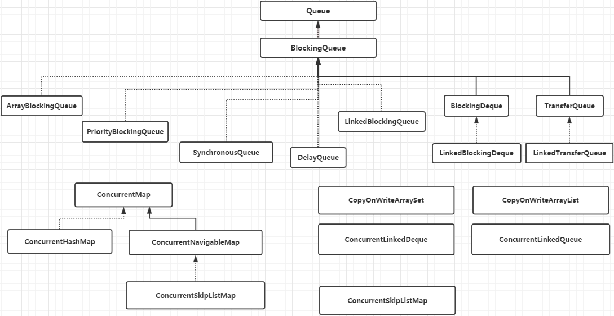

# 一、并发容器集合存在的必要

Java 的**并发集合容器**提供了在**多线程环境**中高效访问和操作的数据结构。这些容器通过**内部的同步机制**实现了线程安全，使得**开发者无需显式同步代码**就能在并发环境下安全使用，比如说：`ConcurrentHashMap`、阻塞队列和 `CopyOnWrite` 容器等。

`java.util` 包下提供了一些容器类（集合框架），其中 **`Vector` 和 `Hashtable` 是线程安全的**，但实现方式比较粗暴，**通过在方法上加「`sychronized`」关键字实现。**

但即便是 **Vector 这样线程安全的类**，在**应对多线程的复合操作**时也**需要在客户端继续加锁以保证原子性**。来看下面的例子：

```java
public class TestVector {
	private Vector<String> vector;
	//方法一
	public  Object getLast(Vector vector) {
	    int lastIndex = vector.size() - 1;
	    return vector.get(lastIndex);
	}
	//方法二
	public  void deleteLast(Vector vector) {
	    int lastIndex = vector.size() - 1;
	    vector.remove(lastIndex);
	}
	//方法三
	public  Object getLastSysnchronized(Vector vector) {
		synchronized(vector){   // 保证内部原子性
			int lastIndex = vector.size() - 1;
			return vector.get(lastIndex);
		}
	}
	//方法四
	public  void deleteLastSysnchronized(Vector vector) {
		synchronized (vector){	// 保证内部原子性
			int lastIndex = vector.size() - 1;
			vector.remove(lastIndex);
		}
	}

}
```

如果方法一和方法二是一个组合的话，那么**当方法一获取到了`vector`的 size 之后，方法二已经执行完毕，这样就会导致程序出现错误**。

如果方法三与方法四组合的话，就还需在内部加锁来保证 `vector` 上的原子性操作。

于是并发容器就应用而生了，它们是线程安全的，可以在多线程环境下高效地访问和操作数据，而不需要额外的同步措施。

# 二、并发容器类

整体架构如下图所示：



# 三、并发 Map

## 3.1 `ConcurrentMap` 接口

`ConcurrentMap` 接口继承了 Map 接口，在 Map 接口的基础上又定义了四个方法：

```java
public interface ConcurrentMap<K, V> extends Map<K, V> {

    //插入元素
    V putIfAbsent(K key, V value);

    //移除元素
    boolean remove(Object key, Object value);

    //替换元素
    boolean replace(K key, V oldValue, V newValue);

    //替换元素
    V replace(K key, V value);

}
```

- **`putIfAbsent`：** 与原有 put 方法不同的是，`putIfAbsent` **如果插入的 key 相同，则不替换原有的 value 值**；
- **`remove`：** 与原有 remove 方法不同的是，新 remove 方法中增加了对 value 的判断，如果**要删除的 key-value 不能与 Map 中原有的 key-value 对应上，则不会删除该元素**;
- **`replace(K,V,V)`：** 增加了对 value 值的判断，如果 **`key-oldValue` 能与 Map 中原有的 key-value 对应上，才进行替换操作**；
- **`replace(K,V)`：** 与上面的 replace 不同的是，此 replace **不会对 Map 中原有的 key-value 进行比较**，如果 **key 存在则直接替换**；

## 3.2 `ConcurrentHashMap`

### 3.2.1 TODO：源码解析

### 3.2.2 示例

假设我们想要构建一个线程安全的高并发**统计用户访问次数**的功能。在这里，`ConcurrentHashMap` 是一个很好的选择，因为它提供了高并发性能。

```java
import java.util.concurrent.ConcurrentHashMap;

public class UserVisitCounter {

    private final ConcurrentHashMap<String, Integer> visitCountMap;

    public UserVisitCounter() {
        this.visitCountMap = new ConcurrentHashMap<>();
    }

    // 用户访问时调用的方法
    public void userVisited(String userId) {
        visitCountMap.compute(userId, (key, value) -> value == null ? 1 : value + 1);
    }

    // 获取用户的访问次数
    public int getVisitCount(String userId) {
        return visitCountMap.getOrDefault(userId, 0);
    }

    public static void main(String[] args) {
        UserVisitCounter counter = new UserVisitCounter();

        // 模拟用户访问
        counter.userVisited("user1");
        counter.userVisited("user1");
        counter.userVisited("user2");

        System.out.println("User1 visit count: " + counter.getVisitCount("user1")); // 输出: User1 visit count: 2
        System.out.println("User2 visit count: " + counter.getVisitCount("user2")); // 输出: User2 visit count: 1
    }
}
```

在上述示例中：

- 我们使用了 `ConcurrentHashMap` 来存储用户的访问次数。
- 当用户访问时，我们通过 userVisited 方法更新访问次数。
- 使用 `ConcurrentHashMap` 的 compute 方法可以确保原子地更新用户的访问次数。
- 可以通过 getVisitCount 方法检索任何用户的访问次数。

`ConcurrentHashMap` 使我们能够无需担心并发问题就能构建这样一个高效的统计系统。

## 3.3 `ConcurrentSkipListMap`

`ConcurrentNavigableMap` 接口继承了 `NavigableMap` 接口，这个接口提供了针对给定搜索目标返回最接近匹配项的导航方法。

`ConcurrentNavigableMap` 接口的主要实现类是 `ConcurrentSkipListMap` 类。从名字上来看，它的**底层使用的是跳表**（`SkipList`）。跳表是一种”空间换时间“的数据结构，可以使用 `CAS` 来保证并发安全性。

与 `ConcurrentHashMap` 的读密集操作相比，`ConcurrentSkipListMap`  的**读和写操作的性能相对较低**。这是由其数据结构导致的，因为跳表的插入和删除需要更复杂的指针操作。然而，`ConcurrentSkipListMap`  **提供了有序性**，这是 `ConcurrentHashMap` 所没有的。

`ConcurrentSkipListMap` 适用于**需要线程安全的同时又需要元素有序的场合**。如果不需要有序，`ConcurrentHashMap` 可能是更好的选择，因为它通常具有更高的性能。

# 四、并发 Queue

`JDK` 并**没有提供线程安全的 List 类**，因为对 List 来说，**很难去开发一个通用并且没有并发瓶颈的线程安全的 List**。因为即使简单的读操作，比如 `contains()`，也**需要在搜索的时候锁住整个 list**。

所以退一步，`JDK` 提供了**队列和双端队列的线程安全类**：`ConcurrentLinkedQueue` 和 `ConcurrentLinkedDeque`。因为队列相对于 List 来说，有更多的限制。这两个类是**使用 `CAS` 来实现线程安全**的。

## 4.1 `ConcurrentLinkedQueue`

`ConcurrentLinkedQueue` 是一种**先进先出（FIFO，First-In-First-Out）的队列**，它是一个基于链接节点的无界线程安全队列。该队列的元素遵循先进先出的原则。头是最先加入的，尾是最近加入的。该队列不允许 null 元素。

`ConcurrentLinkedQueue` 采用了 HOPS 的设计，即 head 和 tail 是延迟更新的，这种设计的主要目的是减小多线程环境下的争用，并提高性能。

- `ConcurrentLinkedQueue` 的 offer 方法用于在队列尾部插入一个元素。如果成功添加元素，则返回 true。
- `ConcurrentLinkedQueue` 的 poll 方法用于检索并删除队列的头部元素。如果队列为空，则返回 null。
- `ConcurrentLinkedQueue` 的 `isEmpty` 方法用于检索队列是否为空。
- `ConcurrentLinkedQueue` 的 size 方法用于返回队列的大小。

### 4.1.1 TODO：源码分析


### 4.1.2 使用示例

```java
public class ConcurrentLinkedQueueTest {
    public static void main(String[] args) {
        ConcurrentLinkedQueue<Integer> queue = new ConcurrentLinkedQueue<>();
        queue.offer(1);
        queue.offer(2);
        queue.offer(3);
        queue.offer(4);
        queue.offer(5);
        System.out.println("queue当前是否为空队列：" + queue.isEmpty());
        System.out.poll();
        System.out.println("queue当前是否为空队列：" + queue.isEmpty());
        System.out.println("queue当前的大小为：" + queue.size());
    }
}
```

输出结果为：

```text
queue当前是否为空队列：false
queue当前是否为空队列：false
queue当前的大小为：4
```

# 五、并发 Set

`ConcurrentSkipListSet` 是**线程安全的有序集合**。底层是使用 `ConcurrentSkipListMap` 来实现。

谷歌的 [Guava](https://javabetter.cn/common-tool/guava.html) 实现了一个**线程安全**的 `ConcurrentHashSet`：

```java
Set<String> s = Sets.newConcurrentHashSet();
```

Set 日常开发中用的并不多，所以这里就不展开细讲了。

# 六、阻塞队列

我们假设一种场景，生产者一直生产资源，消费者一直消费资源，资源存储在一个缓冲池中，生产者将生产的资源存进缓冲池中，消费者从缓冲池中拿到资源进行消费，这就是大名鼎鼎的**生产者-消费者模式**。

该模式能够简化开发过程，一方面消除了生产者类与消费者类之间的代码依赖性，另一方面将生产数据的过程与使用数据的过程解耦简化负载。

我们自己 coding 实现这个模式的时候，因为需要让**多个线程操作共享变量**（即资源），所以很容易引发**线程安全问题**，造成**重复消费**和**死锁**，尤其是生产者和消费者存在多个的情况。另外，当缓冲池空了，我们需要阻塞消费者，唤醒生产者；当缓冲池满了，我们需要阻塞生产者，唤醒消费者，这些个**等待-唤醒**逻辑都需要自己实现。

这么容易出错的事情，JDK 当然帮我们做啦，这就是阻塞队列（`BlockingQueue`），**你只管往里面存、取就行，而不用担心多线程环境下存、取共享变量的线程安全问题。**

> `BlockingQueue` 是 Java `util.concurrent` 包下重要的数据结构，区别于普通的队列，`BlockingQueue` 提供了**线程安全的队列访问方式**，并发包下很多高级同步类的实现都是基于 `BlockingQueue` 实现的。

`BlockingQueue` 一般用于生产者-消费者模式，生产者是往队列里添加元素的线程，消费者是从队列里拿元素的线程。**`BlockingQueue` 就是存放元素的容器**。

## 6.1 `BlockingQueue` 的操作方法

阻塞队列提供了四组不同的方法用于插入、移除、检查元素：

| 方法\处理方式 | 抛出异常  | 返回特殊值 |  一直阻塞  |      超时退出      |
| :-----------: | :-------: | :--------: | :--------: | :----------------: |
|   插入方法    |  add(e)   |  offer(e)  | **put(e)** | offer(e,time,unit) |
|   移除方法    | remove()  |   poll()   | **take()** |  poll(time,unit)   |
|   检查方法    | element() |   peek()   |     -      |         -          |

- 抛出异常：如果操作无法立即执行，会抛异常。当阻塞队列满时候，再往队列里插入元素，会抛出 `IllegalStateException(“Queue full”)`异常。当队列为空时，从队列里获取元素时会抛出 `NoSuchElementException` 异常 。
- 返回特殊值：如果操作无法立即执行，会返回一个特殊值，通常是 true / false。
- 一直阻塞：如果操作无法立即执行，则一直阻塞或者响应中断。
- 超时退出：如果操作无法立即执行，该方法调用将会发生阻塞，直到能够执行，但等待时间不会超过给定值。返回一个特定值以告知该操作是否成功，通常是 true / false。

**注意：**

- 不能往阻塞队列中插入 null，会抛出空指针异常。
- 可以访问阻塞队列中的任意元素，调用 `remove(o)`可以将队列之中的特定对象移除，但并不高效，尽量避免使用。


## 6.2 `BlockingQueue` 的实现类

`BlockingQueue` 接口的实现类有  `ArrayBlockingQueue`、`DelayQueue`、`LinkedBlockingDeque`、`LinkedBlockingQueue`、`LinkedTransferQueue`、`PriorityBlockingQueue`、`SynchronousQueue` 等

### 6.2.1 `ArrayBlockingQueue`

**`ArrayBlockingQueue`** 它是一个基于数组的有界阻塞队列：

- 有界：`ArrayBlockingQueue` 的**大小是在构造时就确定了，并且在之后不能更改**。这个界限提供了流量控制，有助于资源的合理使用。
- FIFO：队列操作符合先进先出的原则。
- 当队列容量满时，尝试将元素放入队列将导致阻塞；尝试从一个空的队列取出元素也会阻塞。

需要注意的是，`ArrayBlockingQueue` 并**不能保证绝对的公平**，**所谓公平是指严格按照线程等待的绝对时间顺序，即最先等待的线程能够最先访问到 `ArrayBlockingQueue`。**

这是因为还有其他系统级别的因素，如**线程调度，可能会影响到实际的执行顺序**。如果**需要公平的 `ArrayBlockingQueue`**，可**在声明的时候设置公平标志为 true**：

```java
private static ArrayBlockingQueue<Integer> blockingQueue = new ArrayBlockingQueue<Integer>(10, true);
```

`ArrayBlockingQueue` 的字段如下:

```java
/** The queued items */
final Object[] items;

/** items index for next take, poll, peek or remove */
int takeIndex;

/** items index for next put, offer, or add */
int putIndex;

/** Number of elements in the queue */
int count;

/*
 * Concurrency control uses the classic two-condition algorithm
 * found in any textbook.
 */

/** Main lock guarding all access */
final ReentrantLock lock;

/** Condition for waiting takes */
private final Condition notEmpty;

/** Condition for waiting puts */
private final Condition notFull;
```

- `items`: 这是一个用于存储队列元素的数组。队列的大小在构造时定义，并且在生命周期内不会改变。
- `takeIndex`: 这个索引用于下一个 take、poll、peek 或 remove 操作。它指向当前可被消费的元素位置。
- `putIndex`: 这个索引用于下一个 put、offer 或 add 操作。它指向新元素将被插入的位置。
- `count`: 这是队列中当前元素的数量。当达到数组大小时，进一步的 put 操作将被阻塞。
- `lock`: 这是用于保护队列访问的 `ReentrantLock` 对象。所有的访问和修改队列的操作都需要通过这个锁来同步。
- `notEmpty`: 这个条件 Condition 用于等待 take 操作。当队列为空时，尝试从队列中取元素的线程将等待这个条件。
- `notFull`: 这个条件 Condition 用于等待 put 操作。当队列已满时，尝试向队列中添加元素的线程将等待这个条件。

#### 6.2.1.1 put 方法详解

`put(E e)`方法源码如下：

```java
public void put(E e) throws InterruptedException {
    // 确保传入的元素不为null
    checkNotNull(e);
    final ReentrantLock lock = this.lock;

    // 请求锁，如果线程被中断则抛出异常
    lock.lockInterruptibly();
    try {
        // 循环检查队列是否已满，如果满了则在notFull条件上等待
        while (count == items.length) {
            notFull.await();
        }
        // 队列未满，将元素加入队列
        enqueue(e);
    } finally {
        // 在try块后释放锁，确保锁最终被释放
        lock.unlock();
    }
}
```

该方法的逻辑很简单，当队列已满时（`count == items.length`）将线程移入到 notFull 等待队列中，如果满足插入数据的条件，直接调用` enqueue(e)`插入元素。enqueue 方法源码如下：

```java
private void enqueue(E x) {
    // assert lock.getHoldCount() == 1;
    // assert items[putIndex] == null;
    final Object[] items = this.items;
	//插入数据
    items[putIndex] = x;
    if (++putIndex == items.length)
        putIndex = 0;
    count++;
	//通知消费者线程，当前队列中有数据可供消费
    notEmpty.signal();
}
```

enqueue 方法的逻辑同样很简单，先插入数据（`items[putIndex] = x`），然后通知被阻塞的消费者线程：当前队列中有数据可供消费（`notEmpty.signal()`）了。

#### 6.2.1.2 take 方法详解

take 方法的源码如下：

```java
public E take() throws InterruptedException {
    final ReentrantLock lock = this.lock;
    lock.lockInterruptibly();
    try {
		//如果队列为空，没有数据，将消费者线程移入等待队列中
        while (count == 0)
            notEmpty.await();
		//获取数据
        return dequeue();
    } finally {
        lock.unlock();
    }
}
```

1. 如果当前队列为空的话，则将获取数据的消费者线程移入到等待队列中；
2. 如果队列不为空则获取数据，即完成出队操作`dequeue`。dequeue 方法源码如下：

```java
private E dequeue() {
    // assert lock.getHoldCount() == 1;
    // assert items[takeIndex] != null;
    final Object[] items = this.items;
    @SuppressWarnings("unchecked")
	//获取数据
    E x = (E) items[takeIndex];
    items[takeIndex] = null;
    if (++takeIndex == items.length)
        takeIndex = 0;
    count--;
    if (itrs != null)
        itrs.elementDequeued();
    //通知被阻塞的生产者线程
	notFull.signal();
    return x;
}
```

dequeue 方法主要做了两件事情：

1. 获取队列中的数据（`(E) items[takeIndex]`）；
2. 通知可能正在等待插入元素的生产者线程队列现在有可用空间，通过调用notFull 条件变量的 signal 方法实现。

从以上分析可以看出，put 和 take 方法主要通过 Condition 的通知机制来完成阻塞式的数据生产和消费。

#### 6.2.1.3 使用示例

我们再来看一个 `ArrayBlockingQueue` 的使用示例：

```java
public class ArrayBlockingQueueTest {
    private static ArrayBlockingQueue<Integer> blockingQueue = new ArrayBlockingQueue<Integer>(10, true);

    public static void main(String[] args) {
        new Thread(new Producer()).start();
        new Thread(new Consumer()).start();
    }

    static class Producer implements Runnable {
        @Override
        public void run() {
            for (int i = 0; i < 100; i++) {
                try {
                    blockingQueue.put(i);
                    System.out.println("生产者生产数据：" + i);
                } catch (InterruptedException e) {
                    e.printStackTrace();
                }
            }
        }
    }

    static class Consumer implements Runnable {
        @Override
        public void run() {
            for (int i = 0; i < 100; i++) {
                try {
                    Integer data = blockingQueue.take();
                    System.out.println("消费者消费数据：" + data);
                } catch (InterruptedException e) {
                    e.printStackTrace();
                }
            }
        }
    }
}
```

运行的部分结果如下图所示：


### 6.2.2 `LinkedBlockingQueue`

`LinkedBlockingQueue` 是一个**基于链表**的线程安全的阻塞队列：

- 可以在队列头部和尾部进行高效的插入和删除操作。
- 当队列为空时，取操作会被阻塞，直到队列中有新的元素可用。当队列已满时，插入操作会被阻塞，直到队列有可用空间。
- **可以在构造时指定最大容量**。如果不指定，**默认**为 `Integer.MAX_VALUE`，这意味着队列的**大小受限于可用内存**。

`LinkedBlockingQueue` 的字段如下：

```java
/** Current number of elements */
private final AtomicInteger count = new AtomicInteger();

/**
 * Head of linked list.
 * Invariant: head.item == null
 */
transient Node<E> head;

/**
 * Tail of linked list.
 * Invariant: last.next == null
 */
private transient Node<E> last;

/** Lock held by take, poll, etc */
private final ReentrantLock takeLock = new ReentrantLock();

/** Wait queue for waiting takes */
private final Condition notEmpty = takeLock.newCondition();

/** Lock held by put, offer, etc */
private final ReentrantLock putLock = new ReentrantLock();

/** Wait queue for waiting puts */
private final Condition notFull = putLock.newCondition();
```

- `count`: 一个 `AtomicInteger` ，表示**队列中当前元素的数量**。通过**原子操作**保证其线程安全。
- `head`: 队列的头部节点。由于这是一个 FIFO 队列，所以元素总是从头部移除。头部节点的 item 字段始终为 null，它作为一个虚拟节点，用于帮助管理队列。
- `last`: 队列的尾部节点。新元素总是插入到尾部。
- `takeLock` 和 `putLock`: 这是 `LinkedBlockingQueue` 中的**两把 `ReentrantLock` 锁** 。`takeLock` 用于控制**取操作**，`putLock` 用于控制**放入操作**。这样的设计使得**放入和取出操作能够在一定程度上并行执行**，从而提高队列的吞吐量。
- `notEmpty` 和 `notFull`: 这是**两个 Condition 变量，分别与 `takeLock` 和 `putLock` 相关联**。当队列为空时，尝试从队列中取出元素的线程将会在 `notEmpty`  上等待。当新元素被放入队列时，这些等待的线程将会被唤醒。同样地，当队列已满时，尝试向队列中放入元素的线程将会在 `notFull`  上等待，等待队列有可用空间时被唤醒。

#### 6.2.2.1 `put` 方法详解

```java
public void put(E e) throws InterruptedException {
    if (e == null) throw new NullPointerException();
    // Note: convention in all put/take/etc is to preset local var
    // holding count negative to indicate failure unless set.
    int c = -1;
    Node<E> node = new Node<E>(e);
    final ReentrantLock putLock = this.putLock;
    final AtomicInteger count = this.count;
    putLock.lockInterruptibly();
    try {
        /*
         * Note that count is used in wait guard even though it is
         * not protected by lock. This works because count can
         * only decrease at this point (all other puts are shut
         * out by lock), and we (or some other waiting put) are
         * signalled if it ever changes from capacity. Similarly
         * for all other uses of count in other wait guards.
         */
		//如果队列已满，则阻塞当前线程，将其移入等待队列
        while (count.get() == capacity) {
            notFull.await();
        }
		//入队操作，插入数据
        enqueue(node);
        c = count.getAndIncrement();
		//若队列满足插入数据的条件，则通知被阻塞的生产者线程
        if (c + 1 < capacity)
            notFull.signal();
    } finally {
        putLock.unlock();
    }
    if (c == 0)
        signalNotEmpty();
}
```

put 方法的逻辑基本上和 `ArrayBlockingQueue` 的一样。

1. 参数检查：如果传入的元素为 null，则抛出 `NullPointerException`。`LinkedBlockingQueue` 不允许插入 null 元素。

2. 局部变量初始化：

- `int c = -1;` 用于**存储操作前的队列元素数量**，**预设为 -1** 表示失败，除非稍后设置。
- `Node<E> node = new Node<E>(e);` 创建一个新的节点包含要插入的元素 e。
- `final ReentrantLock putLock = this.putLock;` 和 `final AtomicInteger count = this.count;` 获取队列的锁和计数器对象。

3. 获取锁：`putLock.lockInterruptibly();` 尝试**获取用于插入操作的锁**，如果线程被中断，则抛出 `InterruptedException`。

4. 等待队列非满：如果队列已满（`count.get() == capacity）`，当前线程将被阻塞，并等待 notFull 条件被满足。一旦有空间可用，线程将被唤醒继续执行。

5. 入队操作：调用 `enqueue(node);` 将新节点插入队列的尾部。

6. 更新计数：通过 `c = count.getAndIncrement();` 获取并递增队列的元素计数。

7. **检查并可能的唤醒**其他**生产者线程**：如果**队列没有满**（`c + 1 < capacity`），使用 `notFull.signal();` 唤醒可能正在等待插入空间的其他生产者线程。

8. 释放锁：finally 块确保锁在操作完成后被释放。

9. 可能的**唤醒消费者线程**：如果**插入操作将队列从空（`c==-1`）变为非空（`c == 0`）**，则调用 `signalNotEmpty();` 唤醒可能正在等待非空队列的消费者线程

#### 6.2.2.2 `take` 方法详解

```java
public E take() throws InterruptedException {
    E x;
    int c = -1;
    final AtomicInteger count = this.count;
    final ReentrantLock takeLock = this.takeLock;
    takeLock.lockInterruptibly();
    try {
		//当前队列为空，则阻塞当前线程，将其移入到等待队列中，直至满足条件
        while (count.get() == 0) {
            notEmpty.await();
        }
		//移除队头元素，获取数据
        x = dequeue();
        c = count.getAndDecrement();
        //如果当前满足移除元素的条件，则通知被阻塞的消费者线程
		if (c > 1)
            notEmpty.signal();
    } finally {
        takeLock.unlock();
    }
    if (c == capacity)
        signalNotFull();
    return x;
}
```

1. 局部变量初始化：

   - `E x;` 用于存储被取出的元素。

   - `int c = -1;` 用于存储操作前的队列元素数量，预设为 -1 表示失败，除非稍后设置。

   - `final AtomicInteger count = this.count;` 和 `final ReentrantLock takeLock = this.takeLock;` 获取队列的计数器和锁对象。

2. 获取锁：`takeLock.lockInterruptibly();` 尝试获取用于取出操作的锁，如果线程被中断，则抛出 `InterruptedException`。

3. 等待队列非空：如果队列为空（`count.get() == 0`），当前线程将被阻塞，并等待 notEmpty 条件被满足。一旦队列非空，线程将被唤醒继续执行。

4. 出队操作：调用 `x = dequeue();` 从队列的头部移除元素，并将其赋值给 x。

5. 更新计数：通过 `c = count.getAndDecrement();` 获取并递减队列的元素计数。

6. 检查并可能的**唤醒其他消费者线程**：如果**队列仍有其他元素**（`c > 1`），使用 `notEmpty.signal();` 唤醒可能正在等待非空队列的其他消费者线程。

7. 释放锁：finally 块确保锁在操作完成后被释放。

8. 可能的**唤醒生产者线程**：如果取出操作将**队列从满变为未满**（`c == capacity`），则调用 `signalNotFull();` 唤醒可能正在等待插入空间的生产者线程。

9. 返回取出的元素：最后返回被取出的元素 x。

#### 6.2.2.3 使用示例

```JAVA
public class LinkedBlockingQueueTest {
    private static LinkedBlockingQueue<Integer> blockingQueue = new LinkedBlockingQueue<Integer>(10);

    public static void main(String[] args) {
        new Thread(new Producer()).start();
        new Thread(new Consumer()).start();
    }

    static class Producer implements Runnable {
        @Override
        public void run() {
            for (int i = 0; i < 100; i++) {
                try {
                    blockingQueue.put(i);
                    System.out.println("生产者生产数据：" + i);
                } catch (InterruptedException e) {
                    e.printStackTrace();
                }
            }
        }
    }

    static class Consumer implements Runnable {
        @Override
        public void run() {
            for (int i = 0; i < 100; i++) {
                try {
                    Integer data = blockingQueue.take();
                    System.out.println("消费者消费数据：" + data);
                } catch (InterruptedException e) {
                    e.printStackTrace();
                }
            }
        }
    }
}
```

### 6.2.3 `ArrayBlockingQueue` 与 `LinkedBlockingQueue` 的比较

**相同点**：`ArrayBlockingQueue` 和 `LinkedBlockingQueue` 都是通过 Condition 通知机制来实现可阻塞的插入和删除。

**不同点**：

1. `ArrayBlockingQueue` 基于数组实现，而 `LinkedBlockingQueue` 基于链表实现；
2. `ArrayBlockingQueue` 使用一个单独的 `ReentrantLock` 来控制对队列的访问，而 `LinkedBlockingQueue` **使用两个锁（`putLock` 和  `takeLock`），一个用于放入操作，另一个用于取出操作**。这可以提供更细粒度的控制，并可能减少线程之间的竞争。

### 6.2.4 `PriorityBlockingQueue`

`PriorityBlockingQueue` 是一个**具有优先级排序特性**的**无界阻塞队列**。元素在队列中的排序遵循**自然排序**或者通过**提供的比较器进行定制排序**。你可以通过实现 Comparable 接口来定义自然排序。

当需要根据优先级来执行任务时，`PriorityBlockingQueue` 会非常有用。下面的代码演示了如何使用 `PriorityBlockingQueue` 来**管理具有不同优先级的任务**。

```JAVA
class Task implements Comparable<Task> {
    private int priority;
    private String name;

    public Task(int priority, String name) {
        this.priority = priority;
        this.name = name;
    }

    public int compareTo(Task other) {
        return Integer.compare(other.priority, this.priority); // higher values have higher priority
    }

    public String getName() {
        return name;
    }
}

public class PriorityBlockingQueueDemo {
    public static void main(String[] args) throws InterruptedException {
        PriorityBlockingQueue<Task> queue = new PriorityBlockingQueue<>();
        queue.put(new Task(1, "Low priority task"));
        queue.put(new Task(50, "High priority task"));
        queue.put(new Task(10, "Medium priority task"));

        while (!queue.isEmpty()) {
            System.out.println(queue.take().getName());
        }
    }
}
```

上例创建了一个优先级阻塞队列，并添加了**三个具有不同优先级的任务**。它们会**按优先级从高到低的顺序被取出并打印**。运行结果如下：

```
High priority task
Medium priority task
Low priority task
```

### 6.2.5 `SynchronousQueue`

`SynchronousQueue` 是一个非常特殊的阻塞队列，它**不存储任何元素**。**每一个插入操作必须等待另一个线程的移除操作**，反之亦然。因此，`SynchronousQueue` 的内部实际上是空的，但它**允许一个线程向另一个线程逐个传输元素**。

`SynchronousQueue` 允许线程直接将元素交付给另一个线程。因此，如果一个线程尝试插入一个元素，并且有另一个线程尝试移除一个元素，则插入和移除操作将同时成功。

如果想让**一个线程将确切的信息直接发送给另一个线程的情况**下，可以使用 `SynchronousQueue`。下面的代码展示了如何使用 `SynchronousQueue` 进行线程间的通信：

```JAVA
public class SynchronousQueueDemo {
    public static void main(String[] args) {
        SynchronousQueue<String> queue = new SynchronousQueue<>();

        // Producer Thread
        new Thread(() -> {
            try {
                String event = "SYNCHRONOUS_EVENT";
                System.out.println("Putting: " + event);
                queue.put(event);
                System.out.println("Put successfully: " + event);
            } catch (InterruptedException e) {
                Thread.currentThread().interrupt();
            }
        }).start();

        // Consumer Thread
        new Thread(() -> {
            try {
                String event = queue.take();
                System.out.println("Taken: " + event);
            } catch (InterruptedException e) {
                Thread.currentThread().interrupt();
            }
        }).start();
    }
}
```

上例创建了一个 `SynchronousQueue`，并**在一个线程中插入了一个元素，另一个线程中移除了这个元素**。运行结果如下：

```text
Putting: SYNCHRONOUS_EVENT
Put successfully: SYNCHRONOUS_EVENT
Taken: SYNCHRONOUS_EVENT
```

### 6.2.6 `LinkedTransferQueue`

`LinkedTransferQueue` 是一个**基于链表结构**的**无界传输队列**，实现了 TransferQueue  接口，它提供了一种**强大的线程间交流机制**。它的功能与其他阻塞队列类似，但还包括“转移”语义：**如果消费者已经在等待，允许一个元素直接从生产者传输给消费者**。**如果没有等待的消费者，元素将入队**。

常用方法有两个：

- `transfer(E e)`，将**元素转移到等待的消费者**，如果**不存在等待的消费者，则元素会入队并阻塞**直到该元素被消费。
- `tryTransfer(E e)`，**尝试立即转移元素**，如果有消费者正在等待，则传输成功；否则，返回 false。

如果想要更紧密地控制生产者和消费者之间的交互，可以使用 LinkedTransferQueue。

```java
public class LinkedTransferQueueDemo {
    public static void main(String[] args) throws InterruptedException {
        LinkedTransferQueue<String> queue = new LinkedTransferQueue<>();

        // Consumer Thread
        new Thread(() -> {
            try {
                System.out.println("消费者正在等待获取元素...");
                String element = queue.take();
                System.out.println("消费者收到: " + element);
            } catch (InterruptedException e) {
                Thread.currentThread().interrupt();
            }
        }).start();

        // Let consumer thread start first
        TimeUnit.SECONDS.sleep(1);

        // Producer Thread
        System.out.println("生产者正在传输元素");
        queue.transfer("Hello, World!");

        System.out.println("生产者已转移元素");
    }
}
```

消费者线程首先启动并等待接收元素。生产者线程调用 transfer 方法将元素直接传输给消费者。

运行结果如下：

```
消费者正在等待获取元素...
生产者正在传输元素
生产者已转移元素
消费者收到: Hello, World!
```

### 6.2.7 `LinkedBlockingDeque`

`LinkedBlockingDeque` 是一个**基于链表结构**的**双端阻塞队列**。它同时支持从队列头部插入和移除元素，也支持从队列尾部插入和移除元素。因此，`LinkedBlockingDeque` 可以作为 FIFO 队列或 LIFO 队列来使用。

常用方法有：

- `addFirst(E e)`, `addLast(E e)`: 在队列的开头/结尾添加元素。
- `takeFirst()`, `takeLast()`: 从队列的开头/结尾移除和返回元素，如果队列为空，则等待。
- `putFirst(E e)`, `putLast(E e)`: 在队列的开头/结尾插入元素，如果队列已满，则等待。
- `pollFirst(long timeout, TimeUnit unit)`, `pollLast(long timeout, TimeUnit unit)`: 在队列的开头/结尾移除和返回元素，如果队列为空，则等待指定的超时时间。

使用示例：

```java
public class LinkedBlockingDequeDemo {
    public static void main(String[] args) throws InterruptedException {
        LinkedBlockingDeque<String> deque = new LinkedBlockingDeque<>(10);

        // Adding elements at the end of the deque
        deque.putLast("Item1");
        deque.putLast("Item2");

        // Adding elements at the beginning of the deque
        deque.putFirst("Item3");

        // Removing elements from the beginning
        System.out.println(deque.takeFirst()); // Output: Item3

        // Removing elements from the end
        System.out.println(deque.takeLast()); // Output: Item2
    }
}
```

运行结果如下：

```
Item3
Item2
```

### 6.2.8 `DelayQueue`

`DelayQueue` 是一个无界阻塞队列，用于存放实现了 Delayed 接口的元素，这些**元素只能在其到期时才能从队列中取走**。这使得 `DelayQueue` 成为实现时间基于优先级的调度服务的理想选择。

下面的示例展示了如何使用 `DelayQueue`。

```java
public class DelayQueueDemo {
    public static void main(String[] args) {
        DelayQueue<DelayedElement> queue = new DelayQueue<>();

        // 将带有5秒延迟的元素放入队列
        queue.put(new DelayedElement(5000, "这是一个 5 秒延迟的元素"));

        try {
            System.out.println("取一个元素...");
            // take() 将阻塞，直到延迟到期
            DelayedElement element = queue.take();
            System.out.println(element.getMessage());
        } catch (InterruptedException e) {
            e.printStackTrace();
        }
    }

    static class DelayedElement implements Delayed {
        private final long delayUntil;
        private final String message;

        public DelayedElement(long delayInMillis, String message) {
            this.delayUntil = System.currentTimeMillis() + delayInMillis;
            this.message = message;
        }

        public String getMessage() {
            return message;
        }

        @Override
        public long getDelay(TimeUnit unit) {
            return unit.convert(delayUntil - System.currentTimeMillis(), TimeUnit.MILLISECONDS);
        }

        @Override
        public int compareTo(Delayed o) {
            return Long.compare(this.delayUntil, ((DelayedElement) o).delayUntil);
        }
    }
}
```

上例创建了一个 DelayQueue，并将一个带有 5 秒延迟的元素放入队列。然后，它调用 `take()` 方法从队列中取出元素。由于元素的延迟时间为 5 秒，因此 `take()` 方法将阻塞 5 秒，直到元素到期。运行结果如下：

```text
取一个元素...
这是一个 5 秒延迟的元素
```

# 七、`CopyOnWrite` 容器

在聊 `CopyOnWrite` 容器之前我们先来谈谈什么是 `CopyOnWrite` 机制，`CopyOnWrite` 是计算机设计领域的一种优化策略，也是一种在并发场景下常用的设计思想——写入时复制。

什么是写入时复制呢？

就是当有多个调用者同时去请求一个资源数据的时候，有一个调用者出于某些原因需要对当前的数据源进行修改，这个时候系统将会复制一个当前数据源的副本给调用者修改。

`CopyOnWrite` 容器即**写时复制的容器**，当我们**往一个容器中添加元素的时候，不直接往容器中添加，而是将当前容器进行 copy，复制出来一个新的容器，然后向新容器中添加我们需要的元素，最后将原容器的引用指向新容器。**多个线程在读的时候，不需要加锁，因为当前容器不会添加任何元素。写时复制的思想来通过延时更新的策略实现**数据的最终一致性**，并且能够**保证读线程间不阻塞**。当然，**这要牺牲数据的实时性**。

假设 COW 的变化如下图所示：


数组中已有数据 1,2,3，现在写线程想往数组中添加数据 4，我们在第 5 行处打上断点，让写线程暂停。

此时，读线程依然会“不受影响”的从数组中读取数据，可是还是只能读到 1,2,3。

**如果读线程能够立即读到新添加的数据就叫数据实时性**。当对第 5 行的断点放开后，读线程感知到了数据的变化，所以读到了完整的数据 1,2,3,4，这叫**数据最终一致性**，尽管有可能中间间隔了好几秒才感知到。


这样做的好处在于，我们可以在**并发的场景下对容器进行"读操作"而不需要"加锁"**，从而**达到读写分离的目的**。从 JDK 1.5 开始 Java 并发包里提供了两个使用 `CopyOnWrite` 机制实现的并发容器，分别是 `CopyOnWriteArrayList` 和 `CopyOnWriteArraySet`（不常用）。

## 7.1 `CopyOnWriteArrayList` 的缺点

CopyOnWrite 容器有很多优点，但是同时也存在两个问题，即内存占用问题和数据一致性问题。所以在开发的时候需要特别注意。

1. **内存占用问题**：因为 `CopyOnWrite` 的写时复制机制，在进行写操作的时候，内存里会**同时有两个对象，旧的对象和新写入的对象**，分析 add 方法的时候大家都看到了。如果这些**对象占用的内存比较大**，比如说 `200M` 左右，那么再写入 `100M` 数据进去，内存就会占用 `600M`，那么这时候就会**造成频繁的 `minor GC` 和 `major GC`。**

2. **数据一致性问题**：`CopyOnWrite` 容器只能保证数据的最终一致性，不能保证数据的实时一致性。所以如果你**希望写入的的数据，马上能读到，请不要使用 `CopyOnWrite` 容器**，最好通过 `ReentrantReadWriteLock` 自定义一个的列表。

# 八、`ThreadLocal` 类

是 Java 中提供的一种用于实现**线程局部变量**的工具类。它允许**每个线程都拥有自己的独立副本**，从而实现线程隔离，用于解决**多线程中共享对象的线程安全问题**。

通常，我们会使用 `synchronzed` 关键字或者 lock 来控制线程对临界区资源的同步顺序，但这种**加锁的方式会让未获取到锁的线程进行阻塞**，很显然，这种方式的时间效率不会特别高。

**线程安全问题的核心在于多个线程会对同一个临界区的共享资源进行访问**，那如果**每个线程都拥有自己的“共享资源”，各用各的，互不影响**，这样就不会出现线程安全的问题了，对吧？

事实上，这就是一种“**空间换时间**”的思想，每个线程拥有自己的“共享资源”，虽然**内存占用变大了，但由于不需要同步，也就减少了线程可能存在的阻塞问题**，从而提高时间上的效率。

不过，ThreadLocal 并不在 java.util.concurrent 并发包下，而是在 java.lang 包下，但我更倾向于把它当作是一种并发容器。

顾名思义，**`ThreadLocal` 就是线程的“本地变量”，即每个线程都拥有该变量的一个副本，达到人手一份的目的，这样就可以避免共享资源的竞争**。

## 8.1 `ThreadLocal` 的源码分析

### 8.1.1 `set` 方法

**set 方法用于设置当前线程中 `ThreadLocal` 的变量值**，该方法的源码如下：

```java
public void set(T value) {
	//1. 获取当前线程实例对象
    Thread t = Thread.currentThread();

	//2. 通过当前线程实例获取到ThreadLocalMap对象
    ThreadLocalMap map = getMap(t);

    if (map != null)
	   //3. 如果Map不为null,则以当前ThreadLocal实例为key,值为value进行存入
       map.set(this, value);
    else
	  //4.map为null,则新建ThreadLocalMap并存入value
      createMap(t, value);
}
```

- 通过 `Thread.currentThread()` 方法获取当前调用**此方法的线程实例**。
- **每个线程都有自己的 `ThreadLocalMap`**，这个映射表**存储了线程的局部变量**，其中**键是 `ThreadLocal` 对象**，**值为特定于线程的对象**。
- 如果 Map 不为 null，则以**当前 `ThreadLocal` 实例为 key**，值为 value 进行存入；如果 map 为 null，则新建 `ThreadLocalMap` 并存入 value。

set 方法的重要性在于它确保了每个线程都有自己的变量副本。由于这些变量是存储在与线程关联的映射表中的，所以不同的线程之间的这些变量互不影响。

### 8.1.2 `get` 方法

**get 方法用于获取当前线程中 `ThreadLocal` 的变量值**，同样的还是来看源码：

```java
public T get() {
  //1. 获取当前线程的实例对象
  Thread t = Thread.currentThread();

  //2. 获取当前线程的ThreadLocalMap
  ThreadLocalMap map = getMap(t);
  if (map != null) {
	//3. 获取map中当前ThreadLocal实例为key的值的entry
    ThreadLocalMap.Entry e = map.getEntry(this);

    if (e != null) {
      @SuppressWarnings("unchecked")
	  //4. 当前entitiy不为null的话，就返回相应的值value
      T result = (T)e.value;
      return result;
    }
  }
  //5. 若map为null或者entry为null的话通过该方法初始化，并返回该方法返回的value
  return setInitialValue();
}
```

来看下 setInitialValue 主要做了些什么事情？

```java
private T setInitialValue() {
    T value = initialValue();
    Thread t = Thread.currentThread();
    ThreadLocalMap map = getMap(t);
    if (map != null)
        map.set(this, value);
    else
        createMap(t, value);
    return value;
}
```

该方法的逻辑和 set 方法几乎一样，主要来看下 initialValue 方法:

```java
protected T initialValue() {
    return null;
}
```

这个**方法是通过 protected 修饰的，也就意味着 ThreadLocal 的子类可以重写该方法给一个合适的初始值**。

这里是 `initialValue` 方法的典型用法：

```java
private static ThreadLocal<Integer> myThreadLocal = new ThreadLocal<Integer>() {
    @Override
    protected Integer initialValue() {
        return 0; // 初始值设置为0
    }
};
```

此代码段创建了一个新的 `ThreadLocal<Integer>` 对象，其初始值为 0。任何尝试首次访问此 `ThreadLocal` 变量的线程都会看到值 0。

**整个 `setInitialValue` 方法的目的是确保每个线程在第一次尝试访问其 `ThreadLocal` 变量时都有一个合适的值**。这种“懒惰”初始化的方法确保了仅在实际需要特定于线程的值时才创建这些值。

### 8.1.3 `remove` 方法

```java
public void remove() {
	//1. 获取当前线程的ThreadLocalMap
	ThreadLocalMap m = getMap(Thread.currentThread());
 	if (m != null)
		//2. 从map中删除以当前ThreadLocal实例为key的键值对
		m.remove(this);
}
```

remove 方法的作用是**从当前线程的 `ThreadLocalMap` 中删除与当前 `ThreadLocal `实例关联的条目**。这个方法在释放线程局部变量的资源或重置线程局部变量的值时特别有用。

以下是使用 remove 方法的示例代码：

```java
ThreadLocal<String> threadLocal = ThreadLocal.withInitial(() -> "Initial Value");

Thread thread = new Thread(() -> {
    System.out.println(threadLocal.get()); // 输出 "Initial Value"
    threadLocal.set("Updated Value");
    System.out.println(threadLocal.get()); // 输出 "Updated Value"
    threadLocal.remove();
    System.out.println(threadLocal.get()); // 输出 "Initial Value"
});
thread.start();
```

输出结果：

```text
Initial Value
Updated Value
Initial Value
```

## 8.2 `ThreadLocalMap` 的源码分析

TODO:

## 8.3 `ThreadLocal` 的使用场景

ThreadLocal 的使用场景非常多，比如说：

- 用于保存用户登录信息，这样在同一个线程中的任何地方都可以获取到登录信息。
- 用于保存数据库连接、Session 对象等，这样在同一个线程中的任何地方都可以获取到数据库连接、Session 对象等。
- 用于保存事务上下文，这样在同一个线程中的任何地方都可以获取到事务上下文。
- 用于保存线程中的变量，这样在同一个线程中的任何地方都可以获取到线程中的变量。

下面是一个使用 `ThreadLocal` 来保存用户登录信息的示例。这个示例适用于像Web服务器这样的多线程环境，其中每个线程处理一个独立的用户请求。

```JAVA
public class UserAuthenticationService {

    // 创建一个ThreadLocal实例，用于保存用户登录信息(不同的线程各自用一个独立的ThreadLocalMap 进行存储)
    private static ThreadLocal<User> currentUser = ThreadLocal.withInitial(() -> null);

    public static void main(String[] args) {
        // 模拟用户登录
        loginUser(new User("Alice", "password123"));
        System.out.println("User logged in: " + getCurrentUser().getUsername());

        // 模拟另一个线程处理另一个用户
        Runnable task = () -> {
            loginUser(new User("Bob", "password456"));
            System.out.println("User logged in: " + getCurrentUser().getUsername());
        };

        Thread thread = new Thread(task);
        thread.start();
    }

    // 模拟用户登录方法
    public static void loginUser(User user) {
        // 这里通常会有一些身份验证逻辑
        currentUser.set(user);
    }

    // 获取当前线程关联的用户信息
    public static User getCurrentUser() {
        return currentUser.get();
    }

    // 用户类
    public static class User {
        private final String username;
        private final String password;

        public User(String username, String password) {
            this.username = username;
            this.password = password;
        }

        public String getUsername() {
            return username;
        }

        // 其他getter和setter...
    }
}
```

这个示例定义了一个 `UserAuthenticationService` 类，该类**使用 `ThreadLocal` 来保存与当前线程关联的用户登录信息**。

假设用户已经通过身份验证，将用户对象存储在 `currentUser  ThreadLocal` 变量中。`getCurrentUser` 方法用于检索与当前线程关联的用户信息。由于使用了 `ThreadLocal` ，因此**不同的线程可以同时登录不同的用户，而不会相互干扰**。