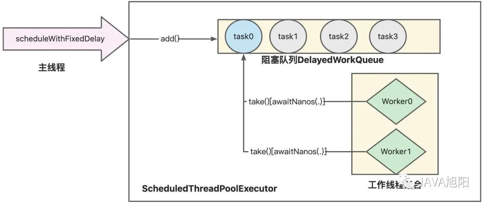

# 一、`ScheduledThreadPoolExecutor` 类

定时任务 `ScheduledThreadPoolExecutor` 类有两个用途：**指定时间延迟后执行任务**；**周期性重复执行任务**。

`JDK 1.5` 之前，主要使用`Timer`类来完成定时任务，但是`Timer`有以下缺陷：

- Timer 是**单线程**模式；
- 如果在执行任务期间某个 `TimerTask` 耗时较久，就会影响其它任务的调度；
- Timer 的任务调度是**基于绝对时间**的，对**系统时间**敏感；
- Timer 不会捕获执行 `TimerTask` 时所抛出的**异常**，由于 Timer 是单线程的，所以**一旦出现异常，线程就会终止，其他任务无法执行**。

于是 `JDK 1.5` 之后，开发者就抛弃了 `Timer`，开始使用`ScheduledThreadPoolExecutor`。先通过下面这张图感受下。



# 二、使用案例

假设我们有这样一个需求，指定时间给其他人发送消息。那么我们会**将消息（包含发送时间）存储在数据库中**，然后用一个定时任务，**每隔 1 秒检查数据库在当前时间有没有需要发送的消息**，那这个计划任务怎么完成呢？下面是一个 Demo:

```java
public class ThreadPool {

    private static final ScheduledExecutorService executor = new
        ScheduledThreadPoolExecutor(1, Executors.defaultThreadFactory());

    private static SimpleDateFormat df = new SimpleDateFormat("yyyy-MM-dd HH:mm:ss");

    public static void main(String[] args){
        // 新建一个固定延迟时间的计划任务
        executor.scheduleWithFixedDelay(new Runnable() {
            @Override
            public void run() {
                if (haveMsgAtCurrentTime()) {
                    System.out.println(df.format(new Date()));
                    System.out.println("大家注意了，我要发消息了");
                }
            }
        }, 1, 1, TimeUnit.SECONDS);
    }

    public static boolean haveMsgAtCurrentTime(){
        //查询数据库，有没有当前时间需要发送的消息
        //这里省略实现，直接返回true
        return true;
    }
}
```

下面截取一段输出（demo 会一直运行下去）：

```
2023-08-24 16:16:48
大家注意了，我要发消息了
2023-08-24 16:16:49
大家注意了，我要发消息了
2023-08-24 16:16:50
大家注意了，我要发消息了
2023-08-24 16:16:51
大家注意了，我要发消息了
2023-08-24 16:16:52
大家注意了，我要发消息了
2023-08-24 16:16:53
大家注意了，我要发消息了
2023-08-24 16:16:54
大家注意了，我要发消息了
2023-08-24 16:16:55
大家注意了，我要发消息了
```

# 三、类结构

```java
public class ScheduledThreadPoolExecutor extends ThreadPoolExecutor
	implements ScheduledExecutorService {

    public ScheduledThreadPoolExecutor(int corePoolSize,ThreadFactory threadFactory) {
         super(corePoolSize, Integer.MAX_VALUE, 0, NANOSECONDS,
              new DelayedWorkQueue(), threadFactory);
    }
    //……
}
```

`ScheduledThreadPoolExecutor` 继承了 `ThreadPoolExecutor` ，并实现了`ScheduledExecutorService`接口。

线程池 `ThreadPoolExecutor` 在之前介绍过了，相信大家都还有印象，接下来我们来看看 `ScheduledExecutorService` 接口。

```java
public interface ScheduledExecutorService extends ExecutorService {

    /**
     * 安排一个Runnable任务在给定的延迟后执行。
     *
     * @param command 需要执行的任务
     * @param delay 延迟时间
     * @param unit 时间单位
     * @return 可用于提取结果或取消的ScheduledFuture
     */
    public ScheduledFuture<?> schedule(Runnable command, long delay, TimeUnit unit);

    /**
     * 安排一个Callable任务在给定的延迟后执行。
     *
     * @param callable 需要执行的任务
     * @param delay 延迟时间
     * @param unit 时间单位
     * @return 可用于提取结果或取消的ScheduledFuture
     */
    public <V> ScheduledFuture<V> schedule(Callable<V> callable, long delay, TimeUnit unit);

    /**
     * 安排一个Runnable任务在给定的初始延迟后首次执行，随后每个period时间间隔执行一次。
     *
     * @param command 需要执行的任务
     * @param initialDelay 首次执行的初始延迟
     * @param period 连续执行之间的时间间隔
     * @param unit 时间单位
     * @return 可用于提取结果或取消的ScheduledFuture
     */
    public ScheduledFuture<?> scheduleAtFixedRate(Runnable command,
                                                  long initialDelay,
                                                  long period,
                                                  TimeUnit unit);

    /**
     * 安排一个Runnable任务在给定的初始延迟后首次执行，随后每次完成任务后等待指定的延迟再次执行。
     *
     * @param command 需要执行的任务
     * @param initialDelay 首次执行的初始延迟
     * @param delay 每次执行结束后的延迟时间
     * @param unit 时间单位
     * @return 可用于提取结果或取消的ScheduledFuture
     */
    public ScheduledFuture<?> scheduleWithFixedDelay(Runnable command,
                                                     long initialDelay,
                                                     long delay,
                                                     TimeUnit unit);
}
```

`ScheduledExecutorService` 接口继承了 `ExecutorService` 接口，并增加了几个定时相关的接口方法。**前两个方法用于单次调度执行任务，区别是有没有返回值**。

**后两个周期性执行任务**，重点介绍一下后面两个方法：

## 3.1 `scheduleAtFixedRate`

`scheduleAtFixedRate` 方法**在 `initialDelay` 时长后第一次执行任务**，以后**每隔`period`时长再次执行任务**。注意，period 是从**任务开始执行算起**的。开始执行任务后，定时器每隔 period 时长**检查该任务是否完成**，如果完成则再次启动任务，**否则等该任务结束后才启动任务**。看下图：


## 3.2 `scheduleWithFixDelay`

该方法**在 `initialDelay` 时长后第一次执行任务**，以后每当任务执行**完成后**，**等待`delay`时长，再次执行任务**。看下图。


# 四、源码分析

TODO:

# 五、`DelayedWorkQueue`

`ScheduledThreadPoolExecutor` 是一个定时任务的线程池，它的主要作用是周期性的执行任务。它的实现原理是**通过 `DelayedWorkQueue` 来保存等待的任务**，`DelayedWorkQueue `是一个无界优先队列，使用数组存储，**底层使用堆结构来实现优先队列的功能**。

我们来看看 `DelayedWorkQueue` 的声明和成员变量：

```java
static class DelayedWorkQueue extends AbstractQueue<Runnable>
implements BlockingQueue<Runnable> {
	// 队列初始容量
	private static final int INITIAL_CAPACITY = 16;
	// 数组用来存储定时任务，通过数组实现堆排序
	private RunnableScheduledFuture[] queue = new RunnableScheduledFuture[INITIAL_CAPACITY];
	// 当前在队首等待的线程
	private Thread leader = null;
	// 锁和监视器，用于leader线程
	private final ReentrantLock lock = new ReentrantLock();
	private final Condition available = lock.newCondition();
	// 其他代码，略
}
```

当**一个线程成为 leader**，它**只需等待队首任务的 delay 时间即可**，其他线程会无条件等待。leader  取到任务**返回前要通知其他线程，直到有线程成为新的 leader**。每当队首的定时任务被其他更早需要执行的任务替换，leader 就设置为  null，其他等待的线程（被当前 leader 通知）和当前的 leader 重新竞争成为 leader。

> **所有线程都会有三种身份中的一种：leader、follower，以及一个干活中的状态：proccesser**。它的基本原则是，**永远最多只有一个  leader**。所有 follower 都在等待成为 leader。线程池启动时会自动产生一个 Leader 负责等待网络 IO  事件，当**有一个事件产生时，Leader 线程首先通知一个 Follower 线程将其提拔为新的  Leader，然后自己就去干活了**，去处理这个网络事件，**处理完毕后加入 Follower 线程等待队列，等待下次成为  Leader**。这种方法可以增强 CPU 高速缓存相似性，及消除动态内存分配和线程间的数据交换。

同时，定义了 `ReentrantLock` 锁 lock 和 `Condition` available 用于控制和通知下一个线程竞争成为 leader。

当一个新的任务成为队首，或者需要有新的线程成为 leader 时，available 监视器上的线程将会被通知，然后竞争成为 leader 线程。**有些类似于 生产者-消费者模式**。

`DelayedWorkQueue` 是一个**优先级队列**，它可以**保证每次出队的任务都是当前队列中执行时间最靠前的**，由于它是基于堆结构的队列，堆结构在执行插入和删除操作时的最坏时间复杂度是 `O(logN)`。