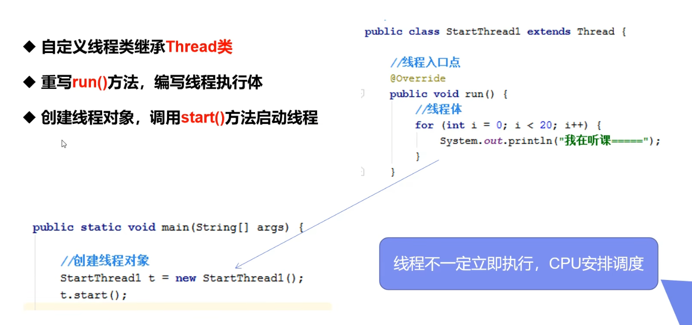
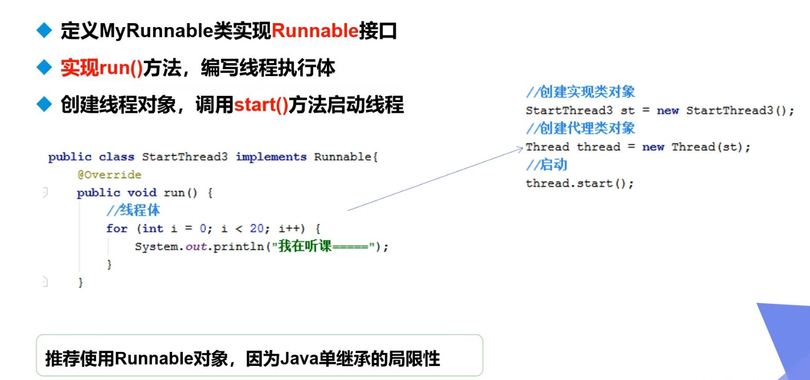
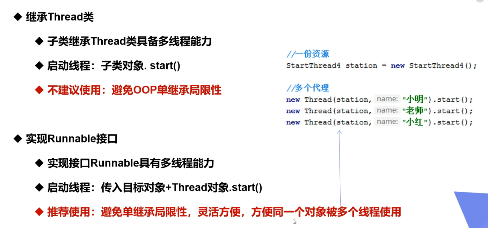
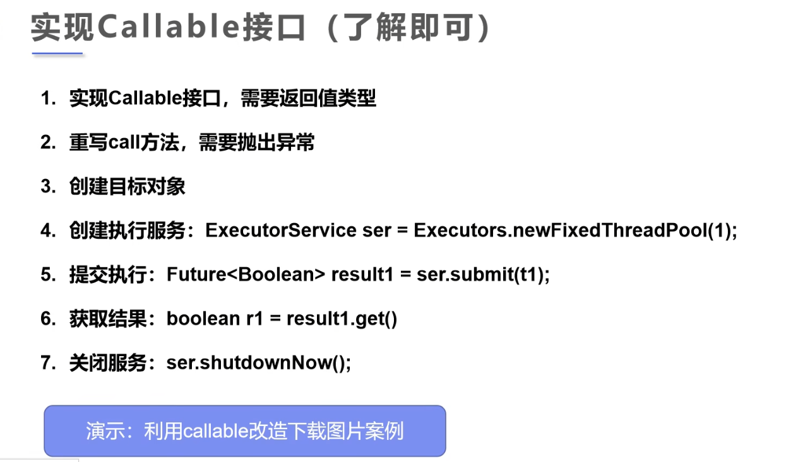
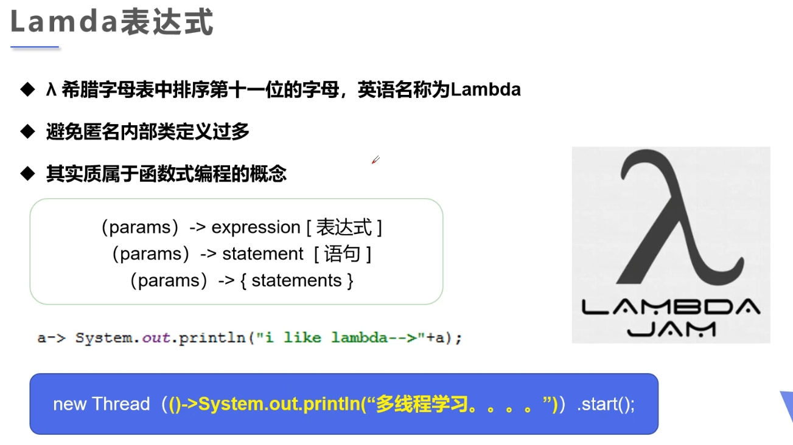
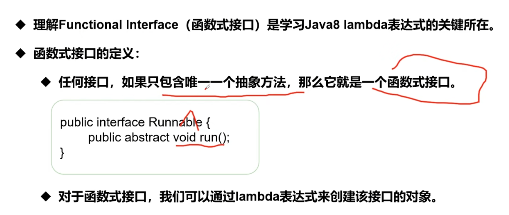
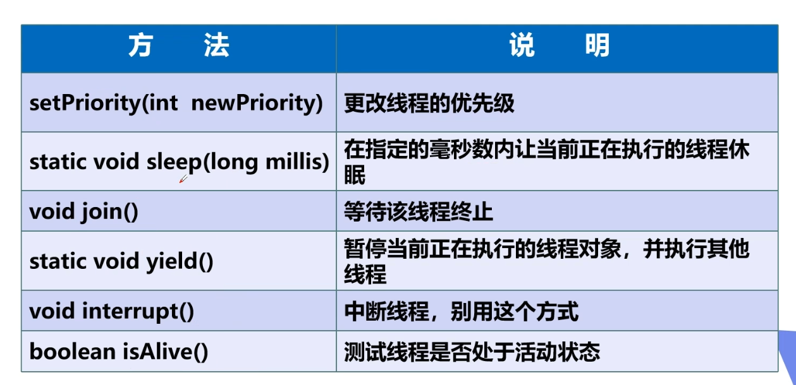
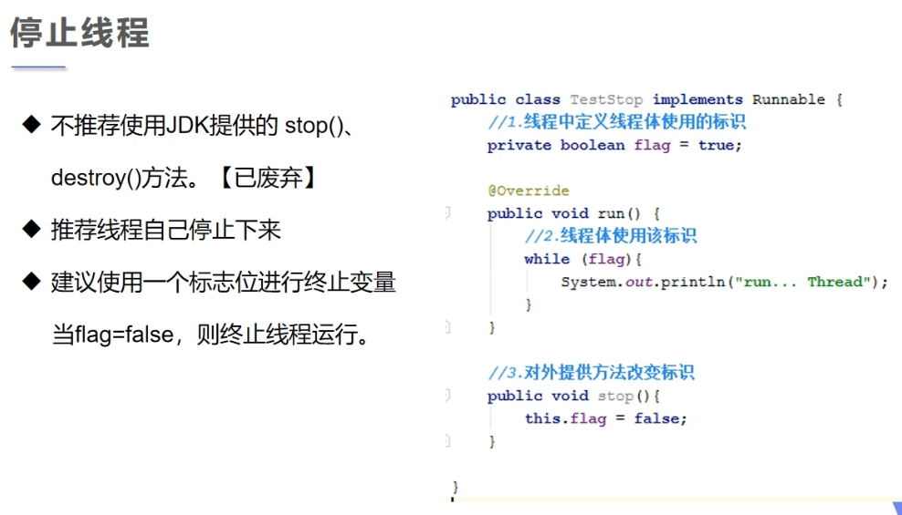
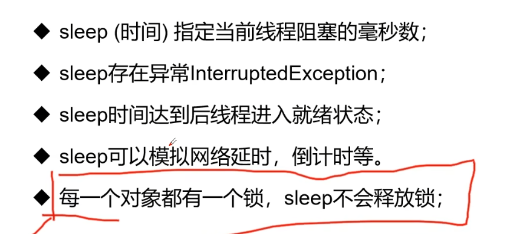

# 一、线程

## 1.1 线程状态


## 1.2 线程创建

创建线程有三种方式：


# 二、继承 `Thread` 类



```java
public class threadClass extends Thread{
    @Override
    public void run() {
        for (int i = 0; i < 100; i++) {
            System.out.println("子线程:" + Thread.currentThread().getName() + i);
        }
    }

    public static void main(String[] args) {
        threadClass ts = new threadClass();
        ts.start();

        for (int i = 0; i < 100; i++) {
            System.out.println("主线程: " + i);
        }
    }
}
```


## 2.1 案例：网络图片下载

> jar 的下载与引用

# 三、实现 `Runnable` 接口





```java
public class runnableInterface implements Runnable{
    @Override
    public void run() {
        for (int i = 0; i < 100; i++) {
            System.out.println("子线程:" + Thread.currentThread().getName() + i);
        }        
    }

    public static void main(String[] args) {
        // 方式一:
        runnableInterface ri = new runnableInterface();
        Thread t1 = new Thread(ri);
        t1.start();
        
        // 方式二：
        // new Thread(ri).start();
        
        for (int i = 0; i < 100; i++) {
            System.out.println("主线程: " + i);
        }
    }
}
```

# 四、实现 `Callable` 接口



```java
public class callableInterface implements Callable<Boolean> {
    private int num;
    public callableInterface(int num) {
        this.num = num;
    }
    @Override
    public Boolean call() throws Exception {
        for (int i = 0; i < 10; i++) {
            System.out.println("子线程:" + num + "-----" + i);
        }
        return true;
    }

    public static void main(String[] args) throws ExecutionException, InterruptedException {
        callableInterface c1 = new callableInterface(1);
        callableInterface c2 = new callableInterface(2);
        callableInterface c3 = new callableInterface(3);

        // 1.创建执行服务（3个线程）
        ExecutorService ser = Executors.newFixedThreadPool(3);
        // 2.提交服务去执行
        Future<Boolean> f1 = ser.submit(c1);
        Future<Boolean> f2 = ser.submit(c2);
        Future<Boolean> f3 = ser.submit(c3);
        // 3.获取三个线程的执行结构
        boolean r1 = f1.get();
        boolean r2 = f2.get();
        boolean r3 = f3.get();
        System.out.println(r1);
        System.out.println(r2);
        System.out.println(r3);
        // 4. 关闭服务
        ser.shutdown();
    }
}
```

# 五、静态代理模式

```java
package threadDemo;

/**
 * 代理模式的好处：
 * 代理对象可以做许多真实对象做不了的事情
 * 真实对象可以专注于自己的事情
 */

public class staticProxy {
    public static void main(String[] args) {
        You you = new You();   // 婚礼主体(真实对象)
        WeddingCompany wc = new WeddingCompany(you);   // 代理对象
        wc.happyMarry();
//        线程的创建也是使用了静态代理模式
//        runnableInterface ri = new runnableInterface();
//        Thread t1 = new Thread(ri);
//        t1.start();
    }
}

interface Marry {
    void happyMarry();
}

class You implements Marry {

    @Override
    public void happyMarry() {
        System.out.println("你结婚了，很高兴");
    }
}

class WeddingCompany implements Marry {
    private Marry target;   // 结婚公司的业务对象

    public WeddingCompany(Marry target) {
        this.target = target;
    }

    @Override
    public void happyMarry() {
        before();
        target.happyMarry();
        after();
    }

    private void after() {
        System.out.println("结婚之后，收取费用");
    }

    private void before() {
        System.out.println("结婚之前，布置婚礼");
    }
}
```

# 六、`Lamda` 表达式

`Lamda` 表达式只能针对于**包含唯一一个抽象方法的接口**。





## 6.1 `Lamda` 表达式的演进由来

我们有一个函数式接口，对其实现的方式演进过程为：

实现类 ---->  内部静态类 -----> 局部内部类 ----> 匿名内部类 ----> `lamda` 表达式

```java
package threadDemo;

// 1.定义一个函数式接口
interface ILike {
    void like(int i);
}
// 2.（独立）实现类
class Like implements ILike {
    public void like(int i) {
        System.out.println("i like lamda" + i);
    }
}

public class lamdaTest {
    // 3.内部静态类
    static class Like2 implements ILike {
        public void like(int i) {
            System.out.println("i like lamda" + i);
        }
    }
    public static void main(String[] args) {
        // 2.使用实现类
        ILike like = new Like();
        like.like(1);
        // 3.使用内部静态类
        ILike like2 = new Like2();
        like2.like(2);

        // 4. 局部内部类
        class Like3 implements ILike {
            public void like(int i) {
                System.out.println("i like lamda" + i);
            }
        }
        ILike like3 = new Like3();
        like3.like(3);

        // 5.匿名内部类
        ILike like4 = new ILike() {
            @Override
            public void like(int i) {
                System.out.println("i like lamda" + i);
            }
        };
        like4.like(4);

        // 6.lamda 表达式
        ILike like5 = (int i)-> {
            System.out.println("i like lamda" + i);
        };
        like5.like(5);
    }
}
```

# 七、线程方法



## 7.1 停止线程



## 7.2 线程休眠

