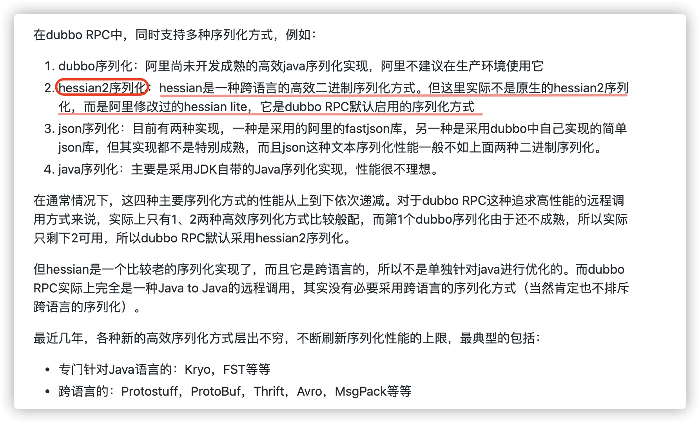

JDK 自带的序列化方式一般不会用 ，因为序列化效率低并且存在安全问题。比较常用的序列化协议有 Hessian、Kryo、Protobuf、ProtoStuff，这些都是基于二进制的序列化协议。

像 JSON 和 XML 这种属于文本类序列化方式。虽然可读性比较好，但是性能较差，一般不会选择

# 一、JDK 自带的序列化方式

JDK 自带的序列化，只需实现 `java.io.Serializable`接口即可。

```java
@AllArgsConstructor
@NoArgsConstructor
@Getter
@Builder
@ToString
public class RpcRequest implements Serializable {
    private static final long serialVersionUID = 1905122041950251207L;
    private String requestId;
    private String interfaceName;
    private String methodName;
    private Object[] parameters;
    private Class<?>[] paramTypes;
    private RpcMessageTypeEnum rpcMessageTypeEnum;
}
```

## 1.1 **serialVersionUID 有什么作用？**

序列化号 `serialVersionUID` 属于版本控制的作用。反序列化时，会检查 `serialVersionUID` 是否和当前类的 `serialVersionUID` 一致。如果 `serialVersionUID` 不一致则会抛出 `InvalidClassException` 异常。**强烈推荐每个序列化类都手动指定其 `serialVersionUID`**，如果**不手动指定，那么编译器会动态生成默认的 `serialVersionUID`**

**serialVersionUID 不是被 static 变量修饰了吗？为什么还会被“序列化”？**

**`static` 修饰的变量是静态变量，属于类而非类的实例，本身是不会被序列化的**。然而，**`serialVersionUID` 是一个特例**，`serialVersionUID` 的序列化做了特殊处理。**当一个对象被序列化时，`serialVersionUID` 会被写入到序列化的二进制流中；在反序列化时，也会解析它并做一致性判断，以此来验证序列化对象的版本一致性**。如果两者不匹配，反序列化过程将抛出 `InvalidClassException`，因为这通常意味着序列化的类的定义已经发生了更改，可能不再兼容。

官方说明如下：

> A serializable class can declare its own serialVersionUID explicitly by declaring a field named `"serialVersionUID"` that must be `static`, `final`, and of type `long`;
>
> 如果想显式指定 `serialVersionUID` ，则需要在类中使用 `static` 和 `final` 关键字来修饰一个 `long` 类型的变量，变量名字必须为 `"serialVersionUID"` 。

也就是说，**`serialVersionUID` 只是用来被 JVM 识别，实际并没有被序列化。**

## 1.2 **如果有些字段不想进行序列化怎么办？**

对于不想进行序列化的变量，可以使用 `transient` 关键字修饰。

`transient` 关键字的作用是：阻止实例中那些用此关键字修饰的的变量序列化；当对象被反序列化时，被 `transient` 修饰的变量值不会被持久化和恢复。

关于 `transient` 还有几点注意：

- `transient` 只能修饰变量，不能修饰类和方法。
- `transient` 修饰的变量，在反序列化后变量值将会被置成类型的默认值。例如，如果是修饰 `int` 类型，那么反序列后结果就是 `0`。
- `static` 变量因为不属于任何对象(Object)，所以无论有没有 `transient` 关键字修饰，均不会被序列化。

## 1.3 **为什么不推荐使用 JDK 自带的序列化？**

我们很少或者说几乎不会直接使用 JDK 自带的序列化方式，主要原因有下面这些原因：

- **不支持跨语言调用** : 如果调用的是其他语言开发的服务的时候就不支持了。
- **性能差**：相比于其他序列化框架性能更低，主要原因是序列化之后的字节数组体积较大，导致传输成本加大。
- **存在安全问题**：序列化和反序列化本身并不存在问题。但当输入的反序列化的数据可被用户控制，那么攻击者即可通过构造恶意输入，让反序列化产生非预期的对象，在此过程中执行构造的任意代码。相关阅读：[应用安全:JAVA 反序列化漏洞之殇 - Cryin](https://cryin.github.io/blog/secure-development-java-deserialization-vulnerability/)、[Java 反序列化安全漏洞怎么回事? - Monica](https://www.zhihu.com/question/37562657/answer/1916596031)

------

## 1.4 常用的其他序列化

Kryo 是一个高性能的序列化/反序列化工具，由于其变长存储特性并使用了字节码生成机制，拥有较高的运行速度和较小的字节码体积。

另外，Kryo 已经是一种非常成熟的序列化实现了，已经在 Twitter、Groupon、Yahoo 以及多个著名开源项目（如 Hive、Storm）中广泛的使用。

GitHub 地址：https://github.com/EsotericSoftware/kryo 。


Protobuf 出自于 Google，性能还比较优秀，也支持多种语言，同时还是跨平台的。就是在使用中过于繁琐，因为你需要自己定义 IDL 文件和生成对应的序列化代码。这样虽然不灵活，但是，另一方面导致 protobuf 没有序列化漏洞的风险。

GitHub 地址：https://github.com/protocolbuffers/protobuf。


由于 Protobuf 的易用性较差，它的哥哥 Protostuff 诞生了。

protostuff 基于 Google protobuf，但是提供了更多的功能和更简易的用法。虽然更加易用，但是不代表 ProtoStuff 性能更差。

GitHub 地址：https://github.com/protostuff/protostuff

------

Hessian 是一个轻量级的，自定义描述的二进制 RPC 协议。Hessian 是一个比较老的序列化实现了，并且同样也是跨语言的。



Dubbo2.x 默认启用的序列化方式是 Hessian2 ,但是，Dubbo 对 Hessian2 进行了修改，不过大体结构还是差不多。

### 总结

Kryo 是专门针对 Java 语言序列化方式并且性能非常好，如果你的应用是专门针对 Java 语言的话可以考虑使用，并且 Dubbo 官网的一篇文章中提到说推荐使用 Kryo 作为生产环境的序列化方式。(文章地址：https://cn.dubbo.apache.org/zh-cn/docsv2.7/user/serialization/）。


像 Protobuf、 ProtoStuff、hessian 这类都是跨语言的序列化方式，如果有跨语言需求的话可以考虑使用。

除了我上面介绍到的序列化方式的话，还有像 Thrift，Avro 这些。

