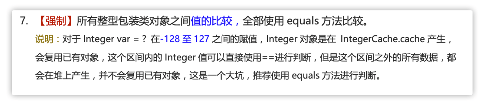

# 一、移位运算符

**使用移位运算符的主要原因**：

1. **高效**：移位运算符直接对应于处理器的移位指令。**现代处理器具有专门的硬件指令来执行这些移位操作**，这些指令通常在一个时钟周期内完成。相比之下，**乘法和除法等算术运算在硬件层面上需要更多的时钟周期来完成**。
2. **节省内存**：通过移位操作，可以使用一个整数（如 `int` 或 `long`）来存储多个布尔值或标志位，从而节省内存。

Java 中有三种移位运算符：

- `<<` :左移运算符，向左移若干位，高位丢弃，低位补零。`x << n`,相当于 x 乘以 2 的 n 次方(不溢出的情况下)。
- `>>` :带符号右移，向右移若干位，高位补符号位，低位丢弃。正数高位补 0,负数高位补 1。`x >> n`,相当于 x 除以 2 的 n 次方。
- `>>>` :**无符号右移，忽略符号位，空位都以 0 补齐**。

虽然移位运算本质上可以分为左移和右移，但在实际应用中，右移操作需要考虑符号位的处理方式。

由于 **`double`，`float` 在二进制中的表现比较特殊，因此不能来进行移位操作**。

移位操作符实际上支持的类型只有`int`和`long`，编译器在**对`short`、`byte`、`char`类型进行移位前，都会将其转换为`int`类型再操作**。


**如果移位的位数超过数值所占有的位数会怎样？**

当 int 类型左移/右移位数大于等于 32 位操作时，会**先求余（%）后再进行左移/右移操作**。也就是说**左移/右移 32 位相当于不进行移位操作（32%32=0）**，左移/右移 42 位相当于左移/右移 10 位（42%32=10）。当 **long 类型进行左移/右移操作时，由于 long 对应的二进制是 64 位，因此求余操作的基数也变成了 64**。

也就是说：`x<<42`等同于`x<<10`，`x>>42`等同于`x>>10`，`x >>>42`等同于`x >>> 10`。

# 二、基本类型和包装类型的区别？

- **用途**：除了定义一些常量和局部变量之外，我们在其他地方比如方法参数、对象属性中很少会使用基本类型来定义变量。并且，包装类型可用于泛型，而基本类型不可以。
- **存储方式**：**基本数据类型的局部变量存放在 Java 虚拟机栈中的局部变量表**中，**基本数据类型的成员变量（未被 `static` 修饰 ）存放在 Java 虚拟机的堆**中。**包装类型属于对象类型，我们知道几乎所有对象实例都存在于堆中**。
- **占用空间**：相比于包装类型（对象类型）， 基本数据类型占用的空间往往非常小。
- **默认值**：成员变量包装类型不赋值就是 `null` ，而基本类型有默认值且不是 `null`。
- **比较方式**：对于**基本数据类型来说，`==` 比较的是值**。对于**包装数据类型来说，`==` 比较的是对象的内存地址**。所有整型包装类对象之间值的比较，全部使用 `equals()` 方法。

**为什么说是几乎所有对象实例都存在于堆中呢？** 这是因为 HotSpot 虚拟机引入了 JIT 优化之后，会对对象进行逃逸分析，如果发现**某一个对象并没有逃逸到方法外部**，那么就可能**通过标量替换来实现栈上分配，而避免堆上分配内存**

⚠️ 注意：**基本数据类型存放在栈中是一个常见的误区！** 基本数据类型的存储位置取决于它们的作用域和声明方式。如果它们是**局部变量，那么它们会存放在栈中**；如果它们是**成员变量，那么它们会存放在堆/方法区/元空间中**。

```java
public class Test {
    // 成员变量，存放在堆中
    int a = 10;
    // 被 static 修饰的成员变量，JDK 1.7 及之前位于方法区，1.8 后存放于元空间，均不存放于堆中。
    // 变量属于类，不属于对象。
    static int b = 20;

    public void method() {
        // 局部变量，存放在栈中
        int c = 30;
        static int d = 40; // 编译错误，不能在方法中使用 static 修饰局部变量
    }
}
```

# 三、包装类型的缓存机制了解么？

Java 基本数据类型的包装类型的大部分都用到了缓存机制来提升性能。

`Byte`,`Short`,`Integer`,`Long` 这 4 种包装类默认创建了数值 **[-128，127]** 的相应类型的**缓存数据**，`Character` 创建了数值在 **[0,127]** 范围的缓存数据，`Boolean` 直接返回 `True` or `False`。

两种**浮点数类型的包装类** `Float`,`Double` 并**没有实现缓存机制**。


下面我们来看一个问题：下面的代码的输出结果是 `true` 还是 `false` 呢？

```
Integer i1 = 40;
Integer i2 = new Integer(40);
System.out.println(i1==i2);
```

`Integer i1=40` 这一行代码会**发生装箱**，也就是说这行代码等价于 `Integer i1=Integer.valueOf(40)` 。因此，**`i1` 直接使用的是缓存中的对象**。

而`Integer i2 = new Integer(40)` 会**直接创建新的对象**。

因此，**答案是 `false`** 。你答对了吗？

记住：**所有整型包装类对象之间值的比较，全部使用 equals 方法比较**。



# 四、自动装箱与拆箱了解吗？原理是什么？

**什么是自动拆装箱？**

- **装箱**：将基本类型用它们对应的引用类型包装起来；
- **拆箱**：将包装类型转换为基本数据类型；

举例：

```
Integer i = 10;  //装箱
int n = i;   //拆箱
```

**装箱**其实就是调用了 **包装类的`valueOf()`方法**，**拆箱**其实就是**调用了 `xxxValue()`方法**。因此，

- `Integer i = 10` 等价于 `Integer i = Integer.valueOf(10)`
- `int n = i` 等价于 `int n = i.intValue()`;

注意：**如果频繁拆装箱的话，也会严重影响系统的性能。我们应该尽量避免不必要的拆装箱操作。**

```java
private static long sum() {
    // 应该使用 long 而不是 Long
    Long sum = 0L;
    for (long i = 0; i <= Integer.MAX_VALUE; i++)
        sum += i;
    return sum;
}
```

# 五、如何解决浮点数运算的精度丢失问题？

`BigDecimal` 可以实现对浮点数的运算，不会造成精度丢失。通常情况下，大部分需要浮点数精确运算结果的业务场景（比如涉及到钱的场景）都是通过 `BigDecimal` 来做的。

```java
BigDecimal a = new BigDecimal("1.0");
BigDecimal b = new BigDecimal("1.00");
BigDecimal c = new BigDecimal("0.8");

BigDecimal x = a.subtract(c);
BigDecimal y = b.subtract(c);

System.out.println(x); /* 0.2 */
System.out.println(y); /* 0.20 */
// 比较内容，不是比较值
System.out.println(Objects.equals(x, y)); /* false */
// 比较值相等用相等compareTo，相等返回0
System.out.println(0 == x.compareTo(y)); /* true */
```

关于 `BigDecimal` 的详细介绍，可以看看我写的这篇文章：[BigDecimal 详解](https://javaguide.cn/java/basis/bigdecimal.html)

# 六、超过 long 整型的数据应该如何表示？

基本数值类型都有一个表达范围，如果超过这个范围就会有数值溢出的风险。

在 Java 中，64 位 long 整型是最大的整数类型。

```
long l = Long.MAX_VALUE;
System.out.println(l + 1); // -9223372036854775808
System.out.println(l + 1 == Long.MIN_VALUE); // true
```

**`BigInteger` 内部使用 `int[]` 数组来存储任意大小的整形数据**。

相对于常规整数类型的运算来说，`BigInteger` 运算的效率会相对较低

# 七、字符型常量和字符串常量的区别?

**形式** : 字符常量是单引号引起的一个字符，字符串常量是双引号引起的 0 个或若干个字符。

**含义** : 字符常量相当于一个整型值( ASCII 值),可以参加表达式运算; 字符串常量代表一个地址值(该字符串在内存中存放位置)。

**占内存大小**：字符常量只占 2 个字节; 字符串常量占若干个字节。

 注意 **`char` 在 Java 中占两个字节**。

# 八、静态方法为什么不能调用非静态成员?

这个需要结合 JVM 的相关知识，主要原因如下：

1. **静态方法是属于类的，在类加载的时候就会分配内存**，可以通过类名直接访问。而**非静态成员属于实例对象，只有在对象实例化之后才存在**，需要**通过类的实例对象去访问**。
2. 在**类的非静态成员不存在的时候静态方法就已经存在了**，此时**调用在内存中还不存在的非静态成员，属于非法操作**。

# 九、静态方法和实例方法有何不同？

**1、调用方式**

在外部调用静态方法时，可以使用 `类名.方法名` 的方式，也可以使用 `对象.方法名` 的方式，而实例方法只有后面这种方式。也就是说，**调用静态方法可以无需创建对象** 。

不过，需要注意的是一般不建议使用 `对象.方法名` 的方式来调用静态方法。这种方式非常容易造成混淆，静态方法不属于类的某个对象而是属于这个类。

因此，**一般建议使用 `类名.方法名` 的方式来调用静态方法**。

```
public class Person {
    public void method() {
      //......
    }

    public static void staicMethod(){
      //......
    }
    public static void main(String[] args) {
        Person person = new Person();
        // 调用实例方法
        person.method();
        // 调用静态方法
        Person.staicMethod()
    }
}
```

**2、访问类成员是否存在限制**

**静态方法在访问本类的成员时，只允许访问静态成员**（即静态成员变量和静态方法），不允许访问实例成员（即实例成员变量和实例方法），而**实例方法不存在这个限制。**


# 十、重载和重写有什么区别？

1. 重载

重载就是同一个类中多个**同名方法**根据**不同的传参**来执行不同的逻辑处理。


2. 重写

重写发生在运行期，是子类对父类的允许访问的方法的实现过程进行重新编写。

1. 方法名、参数列表必须相同，子类方法返回值类型应比父类方法返回值类型更小或相等，抛出的异常范围小于等于父类，访问修饰符范围大于等于父类。
2. 如果父类方法访问修饰符为 `private/final/static` 则子类就不能重写该方法，但是被 `static` 修饰的方法能够被再次声明。
3. 构造方法无法被重写

**方法的重写要遵循“两同两小一大”**（以下内容摘录自《疯狂 Java 讲义》，[issue#892](https://github.com/Snailclimb/JavaGuide/issues/892) ）：

- “两同”即方法名相同、形参列表相同；
- “两小”指的是子类方法返回值类型应比父类方法返回值类型更小或相等，子类方法声明抛出的异常类应比父类方法声明抛出的异常类更小或相等；
- “一大”指的是子类方法的访问权限应比父类方法的访问权限更大或相等。

⭐️ 关于 **重写的返回值类型** 这里需要额外多说明一下，上面的表述不太清晰准确：如果方法的**返回类型是 void 和基本数据类型，则返回值重写时不可修改**。但是如果方法的**返回值是引用类型，重写时是可以返回该引用类型的子类**的。

# 十一、什么是可变长参数？

从 Java5 开始，Java 支持定义可变长参数，所谓可变长参数就是允许在调用方法时传入不定长度的参数。就比如下面这个方法就**可以接受 0 个或者多个参数**。

```
public static void method1(String... args) {
   //......
}
```

另外，**可变参数只能作为函数的最后一个参数**，但其前面可以有也可以没有任何其他参数。

```
public static void method2(String arg1, String... args) {
   //......
}
```

**遇到方法重载的情况怎么办呢？会优先匹配固定参数还是可变参数的方法呢？**

答案是会**优先匹配固定参数的方法**，因为固定参数的方法匹配度更高。

```java
/**
 * 微信搜 JavaGuide 回复"面试突击"即可免费领取个人原创的 Java 面试手册
 *
 * @author Guide哥
 * @date 2021/12/13 16:52
 **/
public class VariableLengthArgument {

    public static void printVariable(String... args) {
        for (String s : args) {
            System.out.println(s);
        }
    }

    public static void printVariable(String arg1, String arg2) {
        System.out.println(arg1 + arg2);
    }

    public static void main(String[] args) {
        printVariable("a", "b");
        printVariable("a", "b", "c", "d");
    }
}
```

输出：

```
ab
a
b
c
d
```

另外，Java 的**可变参数编译后实际会被转换成一个数组**，我们看编译后生成的 `class`文件就可以看出来了。

```java
public class VariableLengthArgument {

    public static void printVariable(String... args) {
        String[] var1 = args;
        int var2 = args.length;

        for(int var3 = 0; var3 < var2; ++var3) {
            String s = var1[var3];
            System.out.println(s);
        }

    }
    // ......
}
```

