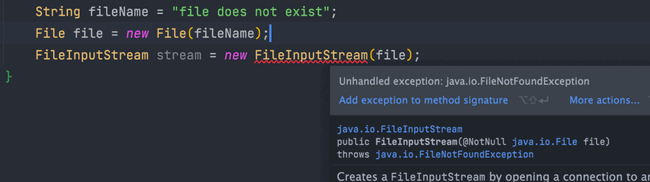

**Java 异常类层次结构图概览**：


# 一、Exception 和 Error 有什么区别？

在 Java 中，所有的异常都有一个共同的祖先 `java.lang` 包中的 `Throwable` 类。`Throwable` 类有两个重要的子类:

- **`Exception`** :程序本身可以处理的异常，**可以通过 `catch` 来进行捕获**。`Exception` 又可以分为 Checked Exception (受检查异常，必须处理) 和 Unchecked Exception (不受检查异常，可以不处理)。
- **`Error`**：`Error` 属于程序无法处理的错误 ，我们**没办法通过 `catch` 来进行捕获不建议通过`catch`捕获** 。例如 Java 虚拟机运行错误（`Virtual MachineError`）、虚拟机内存不够错误(`OutOfMemoryError`)、类定义错误（`NoClassDefFoundError`）等 。**这些异常发生时，Java 虚拟机（JVM）一般会选择线程终止。**

# 二、Checked Exception 和 Unchecked Exception 有什么区别？

**Checked Exception** 即 受检查异常 ，Java 代码在编译过程中，如果受检查异常**没有被 `catch`或者`throws` 关键字处理的话，就没办法通过编译。**

比如下面这段 IO 操作的代码：



除了`RuntimeException`及其子类以外，其他的`Exception`类及其子类都属于受检查异常 。常见的受检查异常有：IO 相关的异常、`ClassNotFoundException`、`SQLException`...。


**Unchecked Exception** 即 **不受检查异常** ，Java 代码在编译过程中 ，我们**即使不处理不受检查异常也可以正常通过编译。**

`RuntimeException` 及其子类都统称为非受检查异常，常见的有（建议记下来，日常开发中会经常用到）：

- `NullPointerException`(空指针错误)
- `IllegalArgumentException`(参数错误比如方法入参类型错误)
- `NumberFormatException`（字符串转换为数字格式错误，`IllegalArgumentException`的子类）
- `ArrayIndexOutOfBoundsException`（数组越界错误）
- `ClassCastException`（类型转换错误）
- `ArithmeticException`（算术错误）
- `SecurityException` （安全错误比如权限不够）
- `UnsupportedOperationException`(不支持的操作错误比如重复创建同一用户)

# 三、Throwable 类常用方法有哪些？

`String getMessage()`: 返回异常发生时的详细信息

`String toString()`: 返回异常发生时的简要描述

`String getLocalizedMessage()`: 返回异常对象的本地化信息。使用 `Throwable` 的子类覆盖这个方法，可以生成本地化信息。如果子类没有覆盖该方法，则该方法返回的信息与 `getMessage()`返回的结果相同

`void printStackTrace()`: 在控制台上打印 `Throwable` 对象封装的异常信息

# 四、try-catch-finally 如何使用？

`try`块：用于捕获异常。其后可接零个或多个 `catch` 块，如果没有 `catch` 块，则必须跟一个 `finally` 块。

`catch`块：用于处理 try 捕获到的异常。

`finally` 块：无论是否捕获或处理异常，`finally` 块里的语句都会被执行。**当在 `try` 块或 `catch` 块中遇到 `return` 语句时，`finally` 语句块将在方法返回之前被执行。**


**注意：不要在 finally 语句块中使用 return!** 

当 **try 语句和 finally 语句中都有 return 语句时，try 语句块中的 return 语句会被忽略**。这是因为 try 语句中的 return 返回值会先被暂存在一个本地变量中，当执行到 finally 语句中的 return 之后，这个本地变量的值就变为了 finally 语句中的 return 返回值。

代码示例：

```java
public static void main(String[] args) {
    System.out.println(f(2));
}

public static int f(int value) {
    try {
        return value * value;
    } finally {
        if (value == 2) {
            return 0;
        }
    }
}
```

输出：

```
0
```

# 五、finally 中的代码一定会执行吗？

不一定的！在某些情况下，finally 中的代码不会被执行。

就比如说 finally 之前**虚拟机被终止运行**的话，finally 中的代码就不会被执行。

```
try {
    System.out.println("Try to do something");
    throw new RuntimeException("RuntimeException");
} catch (Exception e) {
    System.out.println("Catch Exception -> " + e.getMessage());
    // 终止当前正在运行的Java虚拟机
    System.exit(1);
} finally {
    System.out.println("Finally");
}
```

输出：

```
Try to do something
Catch Exception -> RuntimeException
```

另外，在以下 2 种特殊情况下，`finally` 块的代码也不会被执行：

1. 程序所在的线程死亡。
2. 关闭 CPU。
