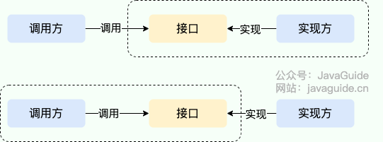
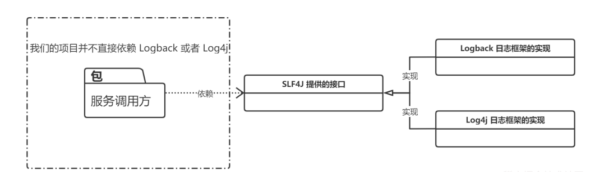
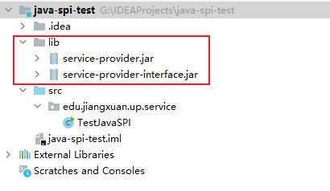

# 一、SPI 和 API 有什么区别？

说到 SPI 就不得不说一下 API（Application Programming Interface） 了，从广义上来说它们都属于接口，而且很容易混淆。下面先用一张图说明一下：



一般模块之间都是通过接口进行通讯，因此我们在服务调用方和服务实现方（也称服务提供者）之间引入一个“接口”。

- 当**实现方提供了接口和实现**，我们可以通过调用实现方的接口从而拥有实现方给我们提供的能力，这就是 **API**。这种情况下，接口和实现都是放在实现方的包中。调用方通过接口调用实现方的功能，而不需要关心具体的实现细节。
- 当**接口存在于调用方**这边时，这就是 **SPI** 。由**接口调用方确定接口规则**，然后由不同的厂商根据这个规则对这个接口进行实现，从而提供服务。

举个通俗易懂的例子：公司 H 是一家科技公司，新设计了一款芯片，然后现在需要量产了，而市面上有好几家芯片制造业公司，这个时候，只要 H 公司指定好了这芯片生产的标准（定义好了接口标准），那么这些合作的芯片公司（服务提供者）就按照标准交付自家特色的芯片（提供不同方案的实现，但是给出来的结果是一样的）


# 二、实战演示

SLF4J （Simple Logging Facade for Java）是 Java 的一个日志门面（接口），其具体实现有几种，比如：Logback、Log4j、Log4j2 等等，而且还可以切换，在**切换日志具体实现的时候我们是不需要更改项目代码的，只需要在 Maven 依赖里面修改一些 pom 依赖就好了**。



这就是依赖 SPI 机制实现的，那我们接下来就实现一个简易版本的日志框架。

## 2.1 Service Provider Interface

新建一个 Java 项目 `service-provider-interface` 目录结构如下：（注意直接新建 Java 项目就好了，不用新建 Maven 项目，Maven 项目会涉及到一些编译配置，如果有私服的话，直接 deploy 会比较方便，但是没有的话，在过程中可能会遇到一些奇怪的问题。）

```
│  service-provider-interface.iml
│
├─.idea
│  │  .gitignore
│  │  misc.xml
│  │  modules.xml
│  └─ workspace.xml
│
└─src
    └─edu
        └─jiangxuan
            └─up
                └─spi
                        Logger.java
                        LoggerService.java
                        Main.class
```

新建 `Logger` 接口，这个就是 SPI ， **服务提供者接口**，后面的**服务提供者就要针对这个接口进行实现**。

```java
package edu.jiangxuan.up.spi;

public interface Logger {
    void info(String msg);
    void debug(String msg);
}
```

接下来就是 `LoggerService` 类，这个是**服务使用者（调用方）**。这个类也是实现 Java SPI 机制的关键所在，如果存在疑惑的话可以先往后面继续看。

```java
package edu.jiangxuan.up.spi;

import java.util.ArrayList;
import java.util.List;
import java.util.ServiceLoader;

public class LoggerService {
    private static final LoggerService SERVICE = new LoggerService();

    private final Logger logger;

    private final List<Logger> loggerList;

    private LoggerService() {
        ServiceLoader<Logger> loader = ServiceLoader.load(Logger.class);
        List<Logger> list = new ArrayList<>();
        for (Logger log : loader) {
            list.add(log);
        }
        // LoggerList 是所有 ServiceProvider
        loggerList = list;
        if (!list.isEmpty()) {
            // Logger 只取一个
            logger = list.get(0);
        } else {
            logger = null;
        }
    }

    public static LoggerService getService() {
        return SERVICE;
    }

    public void info(String msg) {
        if (logger == null) {
            System.out.println("info 中没有发现 Logger 服务提供者");
        } else {
            logger.info(msg);
        }
    }

    public void debug(String msg) {
        if (loggerList.isEmpty()) {
            System.out.println("debug 中没有发现 Logger 服务提供者");
        }
        loggerList.forEach(log -> log.debug(msg));
    }
}
```

新建 `Main` 类（服务使用者，调用方），启动程序查看结果。

```java
package org.spi.service;

public class Main {
    public static void main(String[] args) {
        LoggerService service = LoggerService.getService();

        service.info("Hello SPI");
        service.debug("Hello SPI");
    }
}
```

程序结果：

> info 中没有发现 Logger 服务提供者
>  debug 中没有发现 Logger 服务提供者

此时我们只是**空有接口，并没有为 `Logger` 接口提供任何的实现**，所以输出结果中没有按照预期打印相应的结果。

你可以使用命令或者直接使用 IDEA **将整个程序直接打包成 jar 包**.

## 2.2 Service Provider

接下来新建一个项目用来**实现 `Logger` 接口**

新建项目 `service-provider` 目录结构如下：

```
│  service-provider.iml
│
├─.idea
│  │  .gitignore
│  │  misc.xml
│  │  modules.xml
│  └─ workspace.xml
│
├─lib
│      service-provider-interface.jar
|
└─src
    ├─edu
    │  └─jiangxuan
    │      └─up
    │          └─spi
    │              └─service
    │                      Logback.java
    │
    └─META-INF
        └─services
                edu.jiangxuan.up.spi.Logger
```

新建 `Logback` 类

```java
package edu.jiangxuan.up.spi.service;

import edu.jiangxuan.up.spi.Logger;

public class Logback implements Logger {
    @Override
    public void info(String s) {
        System.out.println("Logback info 打印日志：" + s);
    }

    @Override
    public void debug(String s) {
        System.out.println("Logback debug 打印日志：" + s);
    }
}
```

将 `service-provider-interface` 的 jar 导入项目中。

**新建 lib 目录，然后将 jar 包拷贝过来，再添加到项目中。**


再点击 OK 。


接下来就可以在项目中导入 jar 包里面的一些类和方法了，就像 JDK 工具类导包一样的。

实现 `Logger` 接口，在 **`src` 目录下新建 `META-INF/services` 文件夹**，然后**新建文件 `edu.jiangxuan.up.spi.Logger` （SPI 的全类名）**，**文件里面的内容是：`edu.jiangxuan.up.spi.service.Logback` （Logback 的全类名，即 SPI 的实现类的包名 + 类名）**。

**以上是 JDK SPI 机制 ServiceLoader 约定好的标准。**

这里先大概解释一下：Java 中的 SPI 机制就是在每次类加载的时候会先去找到 **classpath 目录下的 `META-INF` 文件夹下的 services 文件夹下的文件**，将这个文件夹下面的**所有文件先加载到内存中，然后根据这些文件的文件名和里面的文件内容找到相应接口的具体实现类**，找到实现类后就可以**通过反射**去生成对应的对象，**保存在一个 list 列表里面**，所以可以通过迭代或者遍历的方式拿到对应的实例对象，生成不同的实现。

所以会提出一些规范要求：**文件名一定要是接口的全类名**，然后**里面的内容一定要是实现类的全类名**，实现类可以有多个，直接换行就好了，多个实现类的时候，会一个一个的迭代加载。

接下来**同样将 `service-provider` 项目打包成 jar 包，这个 jar 包就是服务提供方的实现**。通常我们导入 maven 的 pom 依赖就有点类似这种，只不过我们**现在没有将这个 jar 包发布到 maven 公共仓库中，所以在需要使用的地方只能手动的添加到项目中。**

## 2.3 效果展示

为了更直观的展示效果，我这里再新建一个专门用来测试的工程项目：`java-spi-test`

然后先导入 **`Logger` 的接口 jar 包**，再导入**具体的实现类的 jar 包**。



新建 Main 方法测试：

```java
package edu.jiangxuan.up.service;

import edu.jiangxuan.up.spi.LoggerService;

public class TestJavaSPI {
    public static void main(String[] args) {
        LoggerService loggerService = LoggerService.getService();
        loggerService.info("你好");
        loggerService.debug("测试Java SPI 机制");
    }
}
```

运行结果如下：

> Logback info 打印日志：你好
>  Logback debug 打印日志：测试 Java SPI 机制

说明导入 jar 包中的实现类生效了。

如果我们不导入具体的实现类的 jar 包，那么此时程序运行的结果就会是：

> info 中没有发现 Logger 服务提供者
>  debug 中没有发现 Logger 服务提供者

通过使用 SPI 机制，可以看出**服务（`LoggerService`）和 服务提供者两者之间的耦合度非常低**，如果说我们**想要换一种实现，那么其实只需要修改 `service-provider` 项目中针对 `Logger` 接口的具体实现就可以了**，**只需要换一个 jar 包即可**，也可以有在一个项目里面有多个实现，这不就是 SLF4J 原理吗？

如果某一天需求变更了，此时需要将日志输出到消息队列，或者做一些别的操作，这个时候完全不需要更改 Logback 的实现，只需要新增一个服务实现（service-provider）可以通过在本项目里面新增实现也可以从外部引入新的服务实现 jar 包。我们可以在服务(LoggerService)中选择一个具体的 服务实现(service-provider) 来完成我们需要的操作。

那么接下来我们具体来说说 Java SPI 工作的重点原理—— **ServiceLoader** 

# 三、ServiceLoader

## 3.1 ServiceLoader 介绍

ServiceLoader 是 Java 提供的一个工具类，用于实现服务提供者机制（Service Provider Mechanism）。它允许开发者**通过配置文件的方式动态加载接口或抽象类的实现类，而无需在代码中硬编码具体的实现类**。这种方式符合开闭原则（对扩展开放，对修改关闭），是一种非常灵活的设计。

`ServiceLoader` 是 **JDK 提供的一个工具类**， 位于`package java.util;`包下。

```
A facility to load implementations of a service.
```

这是 JDK 官方给的注释：**一种加载服务实现的工具。**

再往下看，我们发现这个类是一个 `final` 类型的，所以是不可被继承修改，同时它实现了 `Iterable` 接口。之所以**实现了迭代器，是为了方便后续我们能够通过迭代的方式得到对应的服务实现**。

```
public final class ServiceLoader<S> implements Iterable<S>{ xxx...}
```

### 3.1.1 基本概念

- 服务（Service）：一个接口或抽象类，定义了需要实现的功能。
- 服务提供者（Service Provider）：实现了服务接口的具体类。
- 服务加载器（ServiceLoader）：用于动态加载服务提供者的工具类。

### 3.1.2 工作原理

ServiceLoader 的工作原理如下：

1. 它会扫描 META-INF/services 目录下的文件，找到与指定服务接口对应的文件。

> META-INF 目录是一个在多种Java应用程序和框架中使用的特殊目录，主要用于存放配置文件和其他元数据。它通常位于JAR（Java Archive）、WAR（Web Application Archive）等归档文件的根目录下。
>
> 以下是 META-INF 目录的一些主要用途：
>
> - 清单文件（MANIFEST.MF）：这是 META-INF 文件夹中最常见的文件之一。它包含了关于该JAR文件或WAR文件的元数据，如版本信息、创建者、依赖项以及其他配置参数。例如，可以指定主类（Main-Class），这样双击JAR文件时就知道从哪个类开始执行。
> - 安全策略文件：在一些情况下，META-INF 目录可能包含有关安全策略的定义，用于指定代码的安全属性，比如哪些权限被授予给来自特定源的代码。
> - 服务提供者配置文件：根据Java的服务提供者机制，开发者可以在 META-INF/services 下放置一个以接口全限定名为名称的文件，文件的内容是实现了该接口的具体类的全限定名。这允许运行时动态发现和加载服务实现。
> - 持久化配置：在某些Java EE技术中，如EJB（Enterprise JavaBeans）或JPA（Java Persistence API），META-INF 目录下可能会有额外的配置文件来定义持久化单元、EJB模块等。
> - Spring配置文件：如果你正在使用Spring框架，META-INF 目录可以用来存放Spring的配置文件，如Bean配置等，尽管这不是必须的，因为这些配置也可以放在其他位置。
> - 自定义配置：除了上述标准用途外，开发团队也可能将自定义的配置文件放置在 META-INF 目录下，以便于组织内部的部署和管理流程。

2. 读取文件中的实现类全限定名。

3. 使用反射机制加载每一行指定的实现类。需要注意的是，这里**只会加载类，不会立即实例化它们**。具体的实例化操作是在迭代过程中完成的。

4. 将实现类存储在一个迭代器中，供用户遍历使用。ServiceLoader 使用了延迟加载的方式，即只有**在迭代器遍历时才会真正创建服务提供者的实例**。这样做可以节省资源，特别是当有多个服务提供者时，避免不必要的初始化开销。同时，为了提高效率，ServiceLoader 会**对已加载的实现类进行缓存**。

### 3.1.3 使用步骤

1. 定义服务接口

```java
public interface MyService {
    void execute();
}
```

2. 创建服务实现类

```java
public class MyServiceImpl1 implements MyService {
    @Override
    public void execute() {
        System.out.println("Executing MyServiceImpl1");
    }
}

public class MyServiceImpl2 implements MyService {
    @Override
    public void execute() {
        System.out.println("Executing MyServiceImpl2");
    }
}
```

3. 注册服务提供者

在 META-INF/services 目录下创建一个以服务接口全限定名命名的文件，并在文件中列出所有实现类的全限定名。例如：

文件路径：META-INF/services/com.example.MyService

文件内容：

```
com.example.MyServiceImpl1
com.example.MyServiceImpl2
```

4. 使用 ServiceLoader 加载服务

```java
import java.util.ServiceLoader;

public class Main {
    public static void main(String[] args) {
        ServiceLoader<MyService> serviceLoader = ServiceLoader.load(MyService.class);

        for (MyService service : serviceLoader) {
            service.execute();
        }
    }
}
```

输出结果：

```
Executing MyServiceImpl1
Executing MyServiceImpl2
```

### 3.1.4 存在的问题

1. 线程安全问题

ServiceLoader 自身**不是线程安全的**。如果需要在多线程环境中使用 ServiceLoader，应该采取适当的同步措施。通常的做法是在**应用启动时预先加载所有服务提供者**，然后将其存储在一个**线程安全的集合**中供后续使用。

2. 性能考虑

由于 ServiceLoader 每次都会扫描整个类路径来寻找服务提供者配置文件，并且每次迭代都需要检查是否已经加载了某个服务提供者，这可能会带来一定的性能开销。因此，在对性能要求较高的场景下，建议提前加载所需的服务提供者，或者考虑使用其他更高效的替代方案。

3. 局限性

- 不支持优先级：ServiceLoader 不支持为不同的服务提供者设置优先级，默认按照配置文件中定义的顺序加载。
- 错误处理有限：如果某个服务提供者无法加载（如类不存在或构造函数失败），ServiceLoader 只能抛出异常，而不能提供详细的上下文信息。

## 3.2 自己实现一个 ServiceLoader

```java
package edu.jiangxuan.up.service;

import java.io.BufferedReader;
import java.io.InputStream;
import java.io.InputStreamReader;
import java.lang.reflect.Constructor;
import java.net.URL;
import java.net.URLConnection;
import java.util.ArrayList;
import java.util.Enumeration;
import java.util.List;

public class MyServiceLoader<S> {

    // 对应的接口 Class 模板
    private final Class<S> service;

    // 对应实现类的 可以有多个，用 List 进行封装
    private final List<S> providers = new ArrayList<>();

    // 类加载器
    private final ClassLoader classLoader;

    // 暴露给外部使用的方法，通过调用这个方法可以开始加载自己定制的实现流程。
    public static <S> MyServiceLoader<S> load(Class<S> service) {
        return new MyServiceLoader<>(service);
    }

    // 构造方法私有化
    private MyServiceLoader(Class<S> service) {
        this.service = service;
        this.classLoader = Thread.currentThread().getContextClassLoader();
        doLoad();
    }

    // 关键方法，加载具体实现类的逻辑
    private void doLoad() {
        try {
            // 读取所有 jar 包里面 META-INF/services 包下面的文件，这个文件名就是接口名，然后文件里面的内容就是具体的实现类的路径加全类名
            Enumeration<URL> urls = classLoader.getResources("META-INF/services/" + service.getName());
            // 挨个遍历取到的文件
            while (urls.hasMoreElements()) {
                // 取出当前的文件
                URL url = urls.nextElement();
                System.out.println("File = " + url.getPath());
                // 建立链接
                URLConnection urlConnection = url.openConnection();
                urlConnection.setUseCaches(false);
                // 获取文件输入流
                InputStream inputStream = urlConnection.getInputStream();
                // 从文件输入流获取缓存
                BufferedReader bufferedReader = new BufferedReader(new InputStreamReader(inputStream));
                // 从文件内容里面得到实现类的全类名
                String className = bufferedReader.readLine();

                while (className != null) {
                    // 通过反射拿到实现类的实例
                    Class<?> clazz = Class.forName(className, false, classLoader);
                    // 如果声明的接口跟这个具体的实现类是属于同一类型，（可以理解为Java的一种多态，接口跟实现类、父类和子类等等这种关系。）则构造实例
                    if (service.isAssignableFrom(clazz)) {
                        Constructor<? extends S> constructor = (Constructor<? extends S>) clazz.getConstructor();
                        S instance = constructor.newInstance();
                        // 把当前构造的实例对象添加到 Provider的列表里面
                        providers.add(instance);
                    }
                    // 继续读取下一行的实现类，可以有多个实现类，只需要换行就可以了。
                    className = bufferedReader.readLine();
                }
            }
        } catch (Exception e) {
            System.out.println("读取文件异常。。。");
        }
    }

    // 返回spi接口对应的具体实现类列表
    public List<S> getProviders() {
        return providers;
    }
}
```

主要的流程就是：

1. 通过 URL 工具类从 jar 包的 `/META-INF/services` 目录下面找到对应的文件，
2. 读取这个文件的名称找到对应的 spi 接口，
3. 通过 `InputStream` 流将文件里面的具体实现类的全类名读取出来，
4. 根据获取到的全类名，先判断跟 spi 接口是否为同一类型，如果是的，那么就通过反射的机制构造对应的实例对象，
5. 将构造出来的实例对象添加到 `Providers` 的列表中

# 四、总结

其实不难发现，SPI 机制的具体实现本质上还是通过反射完成的。即：**我们按照规定将要暴露对外使用的具体实现类在 `META-INF/services/` 文件下声明。**

另外，SPI 机制在很多框架中都有应用：Spring 框架的基本原理也是类似的方式。还有 Dubbo 框架提供同样的 SPI 扩展机制，只不过 Dubbo 和 spring 框架中的 SPI 机制具体实现方式跟咱们今天学得这个有些细微的区别，不过整体的原理都是一致的，相信大家通过对 JDK 中 SPI 机制的学习，能够一通百通，加深对其他高深框的理解。

通过 SPI 机制能够大大地提高接口设计的灵活性，但是 SPI 机制也存在一些缺点，比如：

1. **遍历加载所有的实现类，这样效率还是相对较低的**；
2. 当**多个 `ServiceLoader` 同时 `load` 时，会有并发问题**。