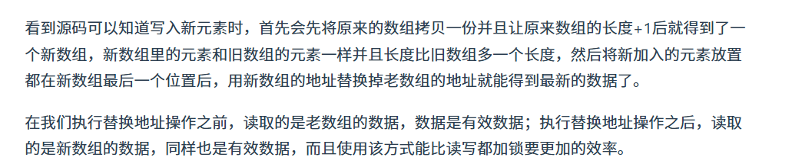
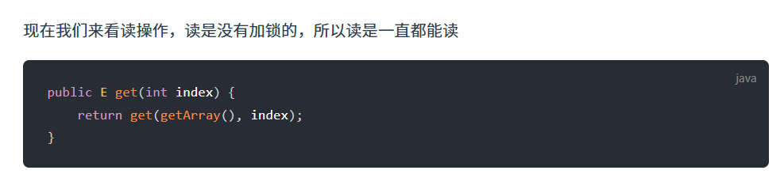
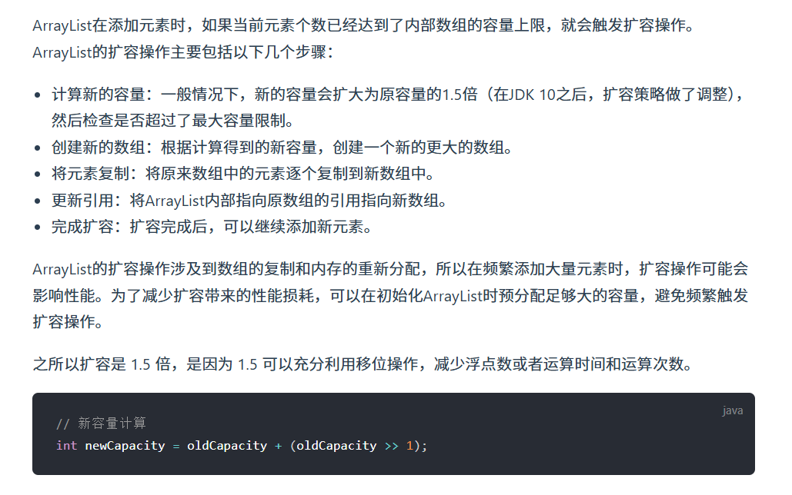
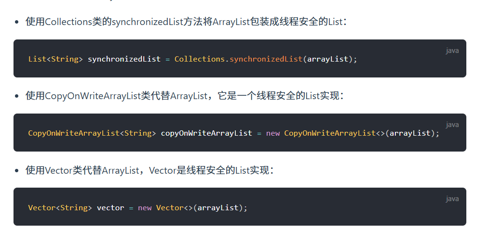
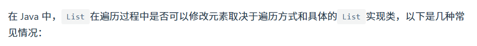
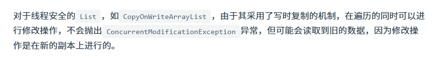

# 一、ArrayList 和 Array（数组）的区别？

`ArrayList` 内部基于**动态数组**实现，比 `Array`（静态数组） 使用起来更加灵活：

- `ArrayList`会根据实际存储的元素动态地**扩容或缩容**，而 `Array` 被创建之后就不能改变它的长度了。
- `ArrayList` 允许你使用泛型来确保类型安全，`Array` 则不可以。
- `ArrayList` 中**只能存储对象**。对于基本类型数据，需要使用其对应的包装类（如 Integer、Double 等）。`Array` 可以直接存储基本类型数据，也可以存储对象。
- `ArrayList` 支持插入、删除、遍历等常见操作，并且提供了丰富的 API 操作方法，比如 `add()`、`remove()`等。`Array` 只是一个固定长度的数组，只能按照下标访问其中的元素，不具备动态添加、删除元素的能力。
- `ArrayList`创建时不需要指定大小，而`Array`创建时必须指定大小。

# 二、ArrayList 和 Vector 的区别?

`ArrayList` 是 `List` 的主要实现类，底层使用 `Object[]`存储，适用于频繁的查找工作，**线程不安全** 。

`Vector` 是 `List` 的古老实现类，底层使用`Object[]` 存储，**线程安全**。

# 三、Vector 和 Stack 的区别?

- `Vector` 和 `Stack` 两者**都是线程安全的**，都是使用 `synchronized` 关键字进行同步处理。
- `Stack` 继承自 `Vector`，是一个**后进先出的栈**，而 `Vector` 是一个**列表**。

随着 Java 并发编程的发展，**`Vector` 和 `Stack` 已经被淘汰，推荐使用并发集合类（例如 `ConcurrentHashMap`、`CopyOnWriteArrayList` 等）**或者手动实现线程安全的方法来提供安全的多线程操作支持。

# 四、ArrayList 可以添加 null 值吗？

`ArrayList` 中**可以存储任何类型的对象，包括 `null` 值**。不过，**不建议向`ArrayList` 中添加 `null` 值**， `null` 值无意义，会让代码难以维护比如忘记做判空处理就会**导致空指针异常**。

示例代码：

```
ArrayList<String> listOfStrings = new ArrayList<>();
listOfStrings.add(null);
listOfStrings.add("java");
System.out.println(listOfStrings);
```

输出：

```
[null, java]
```

------

# 五、ArrayList 插入和删除元素的时间复杂度？

对于插入：

- 头部插入：由于需要将所有元素都依次向后移动一个位置，因此时间复杂度是 O(n)。
- 尾部插入：当 `ArrayList` 的**容量未达到极限**时，往列表末尾插入元素的**时间复杂度是 O(1)**，因为它只需要在数组末尾添加一个元素即可；当**容量已达到极限并且需要扩容时，则需要执行一次 O(n) 的操作将原数组复制到新的更大的数组中**，然后再执行 O(1) 的操作添加元素。
- 指定位置插入：需要将目标位置之后的所有元素都向后移动一个位置，然后再把新元素放入指定位置。这个过程需要移动平均 n/2 个元素，因此时间复杂度为 O(n)。

对于删除：

- 头部删除：由于需要将所有元素依次向前移动一个位置，因此时间复杂度是 O(n)。
- 尾部删除：当删除的元素位于列表末尾时，时间复杂度为 O(1)。
- 指定位置删除：需要将目标元素之后的所有元素向前移动一个位置以填补被删除的空白位置，因此需要移动平均 n/2 个元素，时间复杂度为 O(n)。

# 六、LinkedList 插入和删除元素的时间复杂度？

1. 头部插入/删除：只需要修改头结点的指针即可完成插入/删除操作，因此时间复杂度为 O(1)。
2. 尾部插入/删除：只需要修改尾结点的指针即可完成插入/删除操作，因此时间复杂度为 O(1)。
3. 指定位置插入/删除：需要先移动到指定位置，再修改指定节点的指针完成插入/删除，不过**由于有头尾指针，可以从较近的指针出发，因此需要遍历平均 n/4 个元素**，时间复杂度为 O(n)。

# 七、LinkedList 为什么不能实现 RandomAccess 接口？

`RandomAccess` 是一个标记接口，用来表明**实现该接口的类支持随机访问（即可以通过索引快速访问元素）**。由于 `LinkedList` 底层数据结构是链表，内存地址不连续，只能通过指针来定位，不支持随机快速访问，所以不能实现 `RandomAccess` 接口。

## 7.1 补充内容:RandomAccess 接口

```java
public interface RandomAccess {
}
```

查看源码我们发现**实际上 `RandomAccess` 接口中什么都没有定义**。所以，在我看来 **`RandomAccess` 接口不过是一个标识罢了**。标识什么？ **标识实现这个接口的类具有随机访问功能**。

在 `binarySearch()` 方法中，它要判断传入的 list 是否 `RandomAccess` 的实例，如果是，调用`indexedBinarySearch()`方法，如果不是，那么调用`iteratorBinarySearch()`方法

```java
public static <T>
    int binarySearch(List<? extends Comparable<? super T>> list, T key) {
    if (list instanceof RandomAccess || list.size()<BINARYSEARCH_THRESHOLD)
        return Collections.indexedBinarySearch(list, key);
    else
        return Collections.iteratorBinarySearch(list, key);
}
```

`ArrayList` 实现了 `RandomAccess` 接口， 而 `LinkedList` 没有实现。为什么呢？我觉得还是和底层数据结构有关！`ArrayList` 底层是数组，而 `LinkedList` 底层是链表。数组天然支持随机访问，时间复杂度为 O(1)，所以称为快速随机访问。链表需要遍历到特定位置才能访问特定位置的元素，时间复杂度为 O(n)，所以不支持快速随机访问。`ArrayList` 实现了 `RandomAccess` 接口，就表明了他具有快速随机访问功能。 **`RandomAccess` 接口只是标识**，并**不是说 `ArrayList` 实现 `RandomAccess` 接口才具有快速随机访问功能的！**

------

# 八、ArrayList 与 LinkedList 区别?

**是否保证线程安全：** `ArrayList` 和 `LinkedList` 都是不同步的，也就是不保证线程安全；

**底层数据结构：** `ArrayList` 底层使用的是 **`Object` 数组**；`LinkedList` 底层使用的是 **双向链表** 数据结构（JDK1.6 之前为循环链表，JDK1.7 取消了循环。注意双向链表和双向循环链表的区别，下面有介绍到！）

**插入和删除是否受元素位置的影响：**

- `ArrayList` 采用数组存储，所以插入和删除元素的时间复杂度受元素位置的影响。 比如：执行`add(E e)`方法的时候， `ArrayList` 会默认在将指定的元素追加到此列表的末尾，这种情况时间复杂度就是 O(1)。但是如果要在指定位置 i 插入和删除元素的话（`add(int index, E element)`），时间复杂度就为 O(n)。因为在进行上述操作的时候集合中第 i 和第 i 个元素之后的(n-i)个元素都要执行向后位/向前移一位的操作。
- `LinkedList` 采用链表存储，所以在头尾插入或者删除元素不受元素位置的影响（`add(E e)`、`addFirst(E e)`、`addLast(E e)`、`removeFirst()`、 `removeLast()`），时间复杂度为 O(1)，如果是要在指定位置 `i` 插入和删除元素的话（`add(int index, E element)`，`remove(Object o)`,`remove(int index)`）， 时间复杂度为 O(n) ，因为需要先移动到指定位置再插入和删除。

**是否支持快速随机访问：** `LinkedList` 不支持高效的随机元素访问，而 `ArrayList`（实现了 `RandomAccess` 接口） 支持。快速随机访问就是通过元素的序号快速获取元素对象(对应于`get(int index)`方法)。

**内存空间占用：** `ArrayList` 的空间浪费主要体现在**在 list 列表的结尾会预留一定的容量空间**，而 LinkedList 的空间花费则体现在它的**每一个元素都需要消耗比 ArrayList 更多的空间**（因为要存放直接后继和直接前驱以及数据）。

我们在项目中一般是不会使用到 `LinkedList` 的，**需要用到 `LinkedList` 的场景几乎都可以使用 `ArrayList` 来代替，并且，性能通常会更好**！就连 `LinkedList` 的作者约书亚 · 布洛克（Josh Bloch）自己都说从来不会使用 `LinkedList` 。

另外，不要下意识地认为 `LinkedList` 作为链表就最适合元素增删的场景。我在上面也说了，**`LinkedList` 仅仅在头尾插入或者删除元素的时候时间复杂度近似 O(1)，其他情况增删元素的平均时间复杂度都是 O(n)** 。

------

# 九、 CopyonWriteArraylist 如何实现线程安全

在 JDK1.5 之前，如果想要使用并发安全的 `List` 只能选择 `Vector`。而 `Vector` 是一种老旧的集合，已经被淘汰。`Vector` 对于增删改查等方法基本都加了 `synchronized`，这种方式虽然能够保证同步，但这相当于对整个 `Vector` 加上了一把大锁，使得每个方法执行的时候都要去获得锁，导致性能非常低下。

JDK1.5 引入了 `Java.util.concurrent`（JUC）包，其中提供了很多线程安全且并发性能良好的容器，其中唯一的线程安全 `List` 实现就是 `CopyOnWriteArrayList` 。

对于大部分业务场景来说，**读取操作往往是远大于写入操作的**。由于读取操作不会对原有数据进行修改，因此，对于每次读取都进行加锁其实是一种资源浪费。相比之下，我们**应该允许多个线程同时访问 `List` 的内部数据，毕竟对于读取操作来说是安全的**。

这种思路与 `ReentrantReadWriteLock` 读写锁的设计思想非常类似，即读读不互斥、读写互斥、写写互斥（只有读读不互斥）。`CopyOnWriteArrayList` 更进一步地实现了这一思想。为了将读操作性能发挥到极致，`CopyOnWriteArrayList` 中的**读取操作是完全无需加锁的**。更加厉害的是，**写入操作也不会阻塞读取操作**，**只有写写才会互斥**。这样一来，读操作的性能就可以大幅度提升。

`CopyOnWriteArrayList` 线程安全的核心在于其采用了 **写时复制（Copy-On-Write）** 的策略，从 `CopyOnWriteArrayList` 的名字就能看出了。

当需要修改（ `add`，`set`、`remove` 等操作） `CopyOnWriteArrayList` 的内容时，**不会直接修改原数组，而是会先创建底层数组的副本，对副本数组进行修改，修改完之后再将修改后的数组赋值回去**，这样就可以保证写操作不会影响读操作了。

CopyOnWriteArrayList 底层也是通过一个数组保存数据，使用volatile关键字修饰数组，保证**当前线程对数组对象重新赋值后，其他线程可以及时感知到**。

```java
private transient volatile Object[] array;
```

在写入操作时，加了一把互斥锁ReentrantLock以保证线程安全。






# 十、ArrayList的扩容机制



# 十一、把ArrayList变成线程安全有哪些方法？



# 十二、list可以一边遍历一边修改元素吗？




> 通过解语法糖，我们知道 for-each 在编译后会被解析为普通的 for 循环或者 iterator 循环，而使用 iterator 时不能对原集合进行修改。


