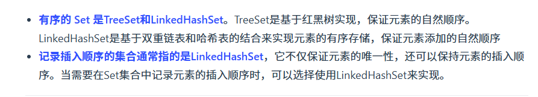

# 一、Comparable 和 Comparator 的区别

`Comparable` 接口和 `Comparator` 接口都是 Java 中用于排序的接口，它们在实现类对象之间比较大小、排序等方面发挥了重要作用：

- **`Comparable` 接口**实际上是出自`java.lang`包 它有一个 **`compareTo(Object obj)`方法**用来排序

> 使用场景：当你需要为某个类型的对象定义一种默认的、内在的排序规则时使用。
>
> 在类本身内部实现 Comparable 接口并重写 compareTo(Object obj) 方法，这意味着该类的对象之间可以相互比较，并且这种比较方式是这个类的一部分。

- **`Comparator`接口**实际上是出自 `java.util` 包它有一个**`compare(Object obj1, Object obj2)`方法**用来排序

> 使用场景：
>
> 1. 当你需要提供多种排序方式或不想改变原有类的排序规则时使用。它可能需要根据不同的属性进行排序（例如，按名字、年龄或地址等），那么你可以为每种排序需求创建一个单独的 Comparator 实现。这比修改类本身的 Comparable 接口实现要灵活得多。
> 2. 当你使用的类不是你自己编写的，或者出于设计考虑你不希望或不能修改该类时（比如该类是第三方库的一部分或是final类），你可以通过提供一个外部的 Comparator 来定义排序规则，而不是让该类实现 Comparable 接口。
> 3. 如果你只是偶尔需要对某些对象集合按照特定顺序进行一次或几次排序，而不是永久性地改变它们的自然顺序，那么使用 Comparator 会更加方便和合适。
>
> 不修改原始类的情况下，为类创建比较器，这个比较器类实现Comparator接口。这意味着你可以在运行时根据不同的标准对同一组对象进行排序。使用 Comparator 可以轻松实现降序排列或者其他复杂的排序逻辑，而不需要改变类本身默认的自然顺序（由 Comparable 定义）。
>
> 通常以匿名内部类的形式将创建的比较器类作为方法的参数进行传递。Java 集合框架提供了很多可以直接接受 Comparator 参数的方法，如 Collections.sort(List<T> list, Comparator<? super T> c) 和 Arrays.sort(T[] a, Comparator<? super T> c) 等，使得我们可以非常方便地对集合或数组进行自定义排序。

------

## 1.1 Comparator 接口定制排序

```java
ArrayList<Integer> arrayList = new ArrayList<Integer>();
arrayList.add(-1);
arrayList.add(3);
arrayList.add(3);
arrayList.add(-5);
arrayList.add(7);
arrayList.add(4);
arrayList.add(-9);
arrayList.add(-7);
System.out.println("原始数组:");
System.out.println(arrayList);
// void reverse(List list)：反转
Collections.reverse(arrayList);
System.out.println("Collections.reverse(arrayList):");
System.out.println(arrayList);

// void sort(List list),按自然排序的升序排序
Collections.sort(arrayList);
System.out.println("Collections.sort(arrayList):");
System.out.println(arrayList);
// 定制排序的用法
Collections.sort(arrayList, new Comparator<Integer>() {
    @Override
    public int compare(Integer o1, Integer o2) {
        return o2.compareTo(o1);
    }
});
System.out.println("定制排序后：");
System.out.println(arrayList);
```

## 1.2 Comparable 接口自然排序

```java
// person对象没有实现Comparable接口，所以必须实现，这样才不会出错，才可以使treemap中的数据按顺序排列
// 前面一个例子的String类已经默认实现了Comparable接口，详细可以查看String类的API文档，另外其他
// 像Integer类等都已经实现了Comparable接口，所以不需要另外实现了
public  class Person implements Comparable<Person> {
    private String name;
    private int age;

    public Person(String name, int age) {
        super();
        this.name = name;
        this.age = age;
    }

    public String getName() {
        return name;
    }

    public void setName(String name) {
        this.name = name;
    }

    public int getAge() {
        return age;
    }

    public void setAge(int age) {
        this.age = age;
    }

    /**
     * T重写compareTo方法实现按年龄来排序
     */
    @Override
    public int compareTo(Person o) {
        if (this.age > o.getAge()) {
            return 1;
        }
        if (this.age < o.getAge()) {
            return -1;
        }
        return 0;
    }
}
```

```java
public static void main(String[] args) {
    TreeMap<Person, String> pdata = new TreeMap<Person, String>();
    pdata.put(new Person("张三", 30), "zhangsan");
    pdata.put(new Person("李四", 20), "lisi");
    pdata.put(new Person("王五", 10), "wangwu");
    pdata.put(new Person("小红", 5), "xiaohong");
    // 得到key的值的同时得到key所对应的值
    Set<Person> keys = pdata.keySet();
    for (Person key : keys) {
        System.out.println(key.getAge() + "-" + key.getName());

    }
}
```

Output：

```
5-小红
10-王五
20-李四
30-张三
```

# 二、无序性和不可重复性的含义是什么

1. 无序性不等于随机性 ，无序性是指**存储的数据在底层数组**中并非按照数组索引的顺序添加 ，而是**根据数据的哈希值决定**的。
2. 不可重复性是指添加的元素按照 `equals()` 判断时 ，返回 false，需要同时重写 `equals()` 方法和 `hashCode()` 方法。

# 三、比较 HashSet、LinkedHashSet 和 TreeSet 三者的异同

1. `HashSet`、`LinkedHashSet` 和 `TreeSet` 都是 `Set` 接口的实现类，**都能保证元素唯一**，并且**都不是线程安全**的。
2. `HashSet`、`LinkedHashSet` 和 `TreeSet` 的主要区别在于底层数据结构不同。**`HashSet` 的底层数据结构是哈希表**（基于 `HashMap` 实现）。**`LinkedHashSet` 的底层数据结构是链表和哈希表**，**元素的插入和取出顺序满足 FIFO**。**`TreeSet` 底层数据结构是红黑树，元素是有序的**，排序的方式有自然排序和定制排序。
3. 底层数据结构不同又导致这三者的应用场景不同。**`HashSet` 用于不需要保证元素插入和取出顺序的场景**，**`LinkedHashSet` 用于保证元素的插入和取出顺序满足 FIFO** 的场景，**`TreeSet` 用于支持对元素自定义排序规则**的场景。



------

