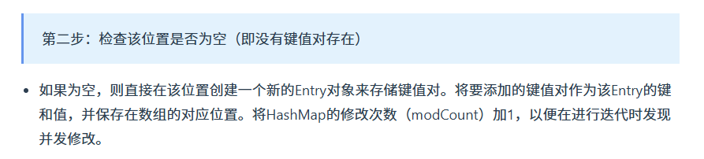
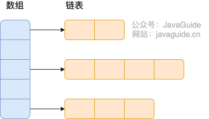

# 一、HashMap 和 Hashtable 的区别

- **线程是否安全：** `HashMap` 是非线程安全的，`Hashtable` 是线程安全的,因为 `Hashtable` 内部的方法基本都经过`synchronized` 修饰。（如果你要保证线程安全的话就使用 `ConcurrentHashMap` 吧！）；

> 
>
> 

- **效率：** 因为线程安全的问题，`HashMap` 要比 `Hashtable` 效率高一点。另外，**`Hashtable` 基本被淘汰，不要在代码中使用它**；
- **对 Null key 和 Null value 的支持：** **`HashMap` 可以存储 null 的 key 和 value**，但 **null 作为键只能有一个**，null 作为值可以有多个；**Hashtable 不允许有 null 键和 null 值**，否则会抛出 `NullPointerException`。

> 

- **初始容量大小和每次扩充容量大小的不同：** ① 创建时如果不指定容量初始值，`Hashtable` 默认的初始大小为 11，之后每次扩充，容量变为原来的 2n+1。**`HashMap` 默认的初始化大小为 16。之后每次扩充，容量变为原来的 2 倍**。② 创建时如果**给定了容量初始值，那么 `Hashtable` 会直接使用你给定的大小，而 `HashMap` 会将其扩充为 2 的幂次方大小**（`HashMap` 中的`tableSizeFor()`方法保证，下面给出了源代码）。也就是说 `HashMap` 总是使用 2 的幂作为哈希表的大小,后面会介绍到为什么是 2 的幂次方。
- **底层数据结构：** JDK1.8 以后的 `HashMap` 在解决哈希冲突时有了较大的变化，当**链表长度大于阈值（默认为 8）时，将链表转化为红黑树**（将链表转换成红黑树前会判断，如果当前数组的长度小于 64，那么会选择先进行数组扩容，而不是转换为红黑树），以减少搜索时间（后文中我会结合源码对这一过程进行分析）。`Hashtable` 没有这样的机制。
- **哈希函数的实现**：`HashMap` 对**哈希值进行了高位和低位的混合扰动处理以减少冲突**，而 `Hashtable` **直接使用键的 `hashCode()` 值**。

**`HashMap` 中带有初始容量的构造函数：**

```java
public HashMap(int initialCapacity, float loadFactor) {
    if (initialCapacity < 0)
        throw new IllegalArgumentException("Illegal initial capacity: " +
                                           initialCapacity);
    if (initialCapacity > MAXIMUM_CAPACITY)
        initialCapacity = MAXIMUM_CAPACITY;
    if (loadFactor <= 0 || Float.isNaN(loadFactor))
        throw new IllegalArgumentException("Illegal load factor: " +
                                           loadFactor);
    this.loadFactor = loadFactor;
    this.threshold = tableSizeFor(initialCapacity);
}
public HashMap(int initialCapacity) {
    this(initialCapacity, DEFAULT_LOAD_FACTOR);
}
```

下面这个方法**保证了 `HashMap` 总是使用 2 的幂作为哈希表的大小**。

```java
/**
 * Returns a power of two size for the given target capacity.
 */
static final int tableSizeFor(int cap) {
    int n = cap - 1;
    n |= n >>> 1;
    n |= n >>> 2;
    n |= n >>> 4;
    n |= n >>> 8;
    n |= n >>> 16;
    return (n < 0) ? 1 : (n >= MAXIMUM_CAPACITY) ? MAXIMUM_CAPACITY : n + 1;
}
```

# 二、HashMap 和 HashSet 区别

如果你看过 `HashSet` 源码的话就应该知道：**`HashSet` 底层就是基于 `HashMap` 实现的**。（`HashSet` 的源码非常非常少，因为除了 `clone()`、`writeObject()`、`readObject()`是 `HashSet` 自己不得不实现之外，**其他方法都是直接调用 `HashMap` 中的方法**。

|               `HashMap`                |                          `HashSet`                           |
| :------------------------------------: | :----------------------------------------------------------: |
|           实现了 `Map` 接口            |                       实现 `Set` 接口                        |
|               存储键值对               |                        仅存储**对象**                        |
|     调用 `put()`向 map 中添加元素      |             调用 `add()`方法向 `Set` 中添加元素              |
| `HashMap` 使用键（Key）计算 `hashcode` | `HashSet` **使用成员对象来计算 `hashcode` 值**，对于**两个对象来说 `hashcode` 可能相同，所以`equals()`方法用来判断对象的相等性** |

# 三、HashMap 和 TreeMap 区别

`TreeMap` 和`HashMap` 都继承自`AbstractMap` ，但是需要注意的是`TreeMap`它还实现了`NavigableMap`接口和`SortedMap` 接口。


实现 `NavigableMap` 接口让 `TreeMap` 有了**对集合内元素的搜索的能力**。

`NavigableMap` 接口提供了丰富的方法来探索和操作键值对:

1. **定向搜索**: `ceilingEntry()`, `floorEntry()`, `higherEntry()`和 `lowerEntry()` 等方法可以用于定位大于等于、小于等于、严格大于、严格小于给定键的最接近的键值对。
2. **子集操作**: `subMap()`, `headMap()`和 `tailMap()` 方法可以高效地创建原集合的子集视图，而无需复制整个集合。
3. **逆序视图**:`descendingMap()` 方法返回一个逆序的 `NavigableMap` 视图，使得可以反向迭代整个 `TreeMap`。
4. **边界操作**: `firstEntry()`, `lastEntry()`, `pollFirstEntry()`和 `pollLastEntry()` 等方法可以方便地访问和移除元素。

这些方法都是**基于红黑树数据结构**的属性实现的，红黑树保持平衡状态，从而保证了搜索操作的时间复杂度为 O(log n)，这让 `TreeMap` 成为了处理有序集合搜索问题的强大工具。

实现`SortedMap`接口让 `TreeMap` 有了对集合中的元素根据键排序的能力。**默认是按 key 的升序排序**，不过我们也**可以指定排序的比较器**。示例代码如下：

```java
/**
 * @author shuang.kou
 * @createTime 2020年06月15日 17:02:00
 */
public class Person {
    private Integer age;

    public Person(Integer age) {
        this.age = age;
    }

    public Integer getAge() {
        return age;
    }


    public static void main(String[] args) {
        TreeMap<Person, String> treeMap = new TreeMap<>(new Comparator<Person>() {
            @Override
            public int compare(Person person1, Person person2) {
                int num = person1.getAge() - person2.getAge();
                return Integer.compare(num, 0);
            }
        });
        treeMap.put(new Person(3), "person1");
        treeMap.put(new Person(18), "person2");
        treeMap.put(new Person(35), "person3");
        treeMap.put(new Person(16), "person4");
        treeMap.entrySet().stream().forEach(personStringEntry -> {
            System.out.println(personStringEntry.getValue());
        });
    }
}
```

输出:

```
person1
person4
person2
person3
```

可以看出，`TreeMap` 中的元素已经是按照 `Person` 的 age 字段的升序来排列了。

上面，我们是通过**传入匿名内部类的方式**实现的，你可以将代码替换成 **Lambda 表达式实现**的方式：

```
TreeMap<Person, String> treeMap = new TreeMap<>((person1, person2) -> {
  int num = person1.getAge() - person2.getAge();
  return Integer.compare(num, 0);
});
```

**综上，相比于`HashMap`来说， `TreeMap` 主要多了对集合中的元素根据键排序的能力以及对集合内元素的搜索的能力。**

# 四、HashSet 如何检查重复?

以下内容摘自我的 Java 启蒙书《Head first java》第二版：

> 当你把对象加入`HashSet`时，`HashSet` 会**先计算对象的`hashcode`值**来判断对象加入的位置，同时也会**与其他加入的对象的 `hashcode` 值作比较**，如果**没有相符的 `hashcode`，`HashSet` 会假设对象没有重复出现**。但是如果发现**有相同 `hashcode` 值的对象，这时会调用`equals()`方法来检查 `hashcode` 相等的对象是否真的相同**。如果两者相同，`HashSet` 就不会让加入操作成功。

在 JDK1.8 中，`HashSet`的`add()`方法只是简单的调用了`HashMap`的`put()`方法，并且判断了一下返回值以确保是否有重复元素。直接看一下`HashSet`中的源码：

```java
// Returns: true if this set did not already contain the specified element
// 返回值：当 set 中没有包含 add 的元素时返回真
public boolean add(E e) {
        return map.put(e, PRESENT)==null;
}
```

而在`HashMap`的`putVal()`方法中也能看到如下说明：

```java
// Returns : previous value, or null if none
// 返回值：如果插入位置没有元素返回null，否则返回上一个元素
final V putVal(int hash, K key, V value, boolean onlyIfAbsent,
                   boolean evict) {
...
}
```

也就是说，在 JDK1.8 中，实际上**无论`HashSet`中是否已经存在了某元素，`HashSet`都会直接插入**，**只是会在`add()`方法的返回值处告诉我们插入前是否存在相同元素**。

# 五、HashMap 的底层实现

## 5.1 JDK1.8 之前

JDK1.8 之前 `HashMap` 底层是 **数组和链表** 结合在一起使用也就是 **链表散列**。过程如下：

1. 计算哈希值：对于插入的每一个键值对，首先通过 key.hashCode() 方法获取键的哈希码，然后通过一定的算法**将这个哈希码转换成数组的有效索引位置**。

> 1. 首先调用键的 hashCode() 方法，生成一个整数类型的哈希码（int 类型）。这是 Object 类的一个方法，所有对象都继承了它。
> 2. 直接使用 hashCode() 的结果可能会导致分布不均匀，从而增加哈希冲突的概率。为了减少冲突，HashMap 内部会对哈希码进行一次扰动处理。在 Java 8 中，HashMap 使用了一个简单的扰动函数：
>
> ```java
> static final int hash(Object key) {
>     int h;
>     return (key == null) ? 0 : (h = key.hashCode()) ^ (h >>> 16);
> }
> 这个函数的核心思想是将哈希码的高 16 位与低 16 位进行异或操作（^），从而混合高位和低位的信息。
> 这样可以使得即使在数组容量较小的情况下（桶数量少），也能充分利用哈希码的所有位信息，减少冲突。
> ```
>
> 3. 扰动后的哈希值需要映射到数组的索引范围 [0, 数组长度-1]。为了实现这一点，HashMap 使用按位与操作（&）来计算索引：
>
> ```java
> index = hash & (table.length - 1)   // 其实就相当于对数组长度进行 % 运行
> ```
>
> 按位与操作会保留哈希值的低位部分，同时丢弃高位部分，从而得到一个有效的数组索引。

2. 定位桶位置：根据计算出的索引，确定键值对在数组中的具体位置（即桶的位置）。

3. 解决哈希冲突：

   1. 如果该位置没有其他元素，则直接放置新元素。

   2. 如果该位置已经有元素存在（即发生了哈希冲突），则检查这个元素是否与新元素相等（通过 equals 方法比较键）。如果相等，则更新旧值；如果不等，则将新元素添加到链表末尾（或转换为红黑树节点）。

所谓 **“拉链法”** 就是：将链表和数组相结合。也就是说创建一个链表数组，数组中每一格就是一个链表。若遇到哈希冲突，则将冲突的值加到链表中即可。


## 5.2 JDK1.8 之后

相比于之前的版本， JDK1.8 之后在解决哈希冲突时有了较大的变化，当**链表长度大于阈值**（**默认为 8**）（将链表转换成红黑树前会判断，**如果当前数组的长度小于 64，那么会选择先进行数组扩容，而不是转换为红黑树**）时，**将链表转化为红黑树**，以减少搜索时间。


## 5.3 hashmap 的 put 过程





> 键值对数量/数组长度 > 负载因子，说明平均每个 bucket 中承载的键值对过多，需要通过扩容降低每个 bucket 中链表的长度。

## 5.4 hashmap 的扩容过程


因为我们使用的是2次幂的扩展(指长度扩为原来2倍)，元素的位置要么是在原bucket中，要么是在原bucket再移动2次幂的bucket。


> 扩充之后，看 hash 值的最高位，如果是0则还在原来的 bucket 中，如果是1则移动进新的 bucket 中
>
> 新 bucket 索引 = 老 bucket 索引 + 原数组长度

# 六、HashMap 的长度为什么是 2 的幂次方

为了让 `HashMap` 存取高效并减少碰撞，我们需要确保数据尽量均匀分布。**哈希值在 Java 中通常使用 `int` 表示**，其**范围是 `-2147483648 ~ 2147483647`前后加起来大概 40 亿的映射空间**，只要哈希函数映射得比较均匀松散，一般应用是很难出现碰撞的。但是，问题是**一个 40 亿长度的数组，内存是放不下的**。所以，这个**散列值是不能直接拿来用的**。用之前还要**先做对数组的长度取模运算**，**得到的余数**才能**用来要存放的位置**也就是对应的数组下标。

**这个算法应该如何设计呢？**

我们首先可能会想到采用 % 取余的操作来实现。但是，重点来了：“**取余(%)操作中如果除数是 2 的幂次则等价于与其除数减一的与(&)操作**（也就是说 `hash%length==hash&(length-1)` 的前提是 length 是 2 的 n 次方）。” 并且，**采用二进制位操作 & 相对于 % 能够提高运算效率**。


除了上面所说的位运算比取余效率高之外，我觉得更重要的一个原因是：**长度是 2 的幂次方，可以让 `HashMap` 在扩容的时候更均匀**。例如:

- length = 8 时，length - 1 = 7 的二进制位`0111`
- length = 16 时，length - 1 = 15 的二进制位`1111`

**二倍扩容后**，原本存在 `HashMap` 中的元素**计算新的数组位置**时 `hash&(length-1)`，**取决 hash 的第四个二进制位（从右数）**，会出现两种情况：

1. 第四个二进制位为 0，数组位置不变，也就是说**当前元素在新数组和旧数组的位置相同**。
2. 第四个二进制位为 1，**数组位置在新数组扩容之后的那一部分**。

这里列举一个例子：

```java
假设有一个元素的哈希值为 10101100

旧数组元素位置计算：
hash        = 10101100
length - 1  = 00000111
& -----------------
index       = 00000100  (4)

新数组元素位置计算：
hash        = 10101100
length - 1  = 00001111
& -----------------
index       = 00001100  (12)

看第四位（从右数）：
1.高位为 0：位置不变。
2.高位为 1：移动到新位置（原索引位置+原容量）。
```

⚠️注意：这里列举的场景看的是第四个二进制位，**更准确点来说看的是最高位（从右数）**，例如 `length = 32` 时，`length - 1 = 31`，二进制为 `11111`，这里看的就是第五个二进制位。

也就是说扩容之后，在**旧数组元素 hash 值比较均匀**（至于 hash 值均不均匀，取决于前面讲的对象的 `hashcode()` 方法和扰动函数）**的情况下，新数组元素也会被分配的比较均匀**，最好的情况是会有**一半在新数组的前半部分**，**一半在新数组后半部分**。

这样也使得扩容机制变得简单和高效，**扩容后只需检查哈希值高位的变化来决定元素的新位置**，**要么位置不变（高位为 0），要么就是移动到新位置（高位为 1，原索引位置+原容量）**。

最后，简单总结一下 `HashMap` 的长度是 2 的幂次方的原因：

1. 位运算效率更高：位运算(&)比取余运算(%)更高效。当长度为 2 的幂次方时，`hash % length` 等价于 `hash & (length - 1)`。
2. 可以更好地保证哈希值的均匀分布：扩容之后，在旧数组元素 hash 值比较均匀的情况下，新数组元素也会被分配的比较均匀，最好的情况是会有一半在新数组的前半部分，一半在新数组后半部分。
3. 扩容机制变得简单和高效：扩容后只需检查哈希值高位的变化来决定元素的新位置，要么位置不变（高位为 0），要么就是移动到新位置（高位为 1，原索引位置+原容量）。

# 七、HashMap 多线程操作导致死循环问题

JDK1.7 及之前版本的 `HashMap` 在多线程环境下扩容操作可能存在死循环问题，这是由于**当一个桶位中有多个元素需要进行扩容时，多个线程同时对链表进行操作，头插法可能会导致链表中的节点指向错误的位置，从而形成一个环形链表，进而使得查询元素的操作陷入死循环无法结束**。

为了解决这个问题，JDK1.8 版本的 HashMap **采用了尾插法而不是头插法**来避免链表倒置，使得**插入的节点永远都是放在链表的末尾**，避免了链表中的环形结构。但是还是**不建议在多线程下使用 `HashMap`**，因为**多线程下使用 `HashMap` 还是会存在数据覆盖的问题**。并发环境下，推荐使用 `ConcurrentHashMap` 。

一般面试中这样介绍就差不多，不需要记各种细节，个人觉得也没必要记。如果想要详细了解 `HashMap` 扩容导致死循环问题，可以看看耗子叔的这篇文章：[Java HashMap 的死循环](https://coolshell.cn/articles/9606.html)。

# 八、HashMap 为什么线程不安全？

## 8.1 put 操作不安全

JDK1.7 及之前版本，在多线程环境下，`HashMap` 扩容时会造成死循环和数据丢失的问题。

**数据丢失**这个在 JDK1.7 和 JDK 1.8 中都存在，这里以 JDK 1.8 为例进行介绍。

JDK 1.8 后，在 `HashMap` 中，多个键值对可能会被分配到同一个桶（bucket），并以链表或红黑树的形式存储。**多个线程对 `HashMap` 的 `put` 操作会导致线程不安全，具体来说会有数据覆盖的风险。**

举个例子：

- 两个线程 1,2 同时进行 put 操作，并且发生了哈希冲突（hash 函数计算出的插入下标是相同的）。
- 不同的线程可能在不同的时间片获得 CPU 执行的机会，**当前线程 1 执行完哈希冲突判断后，由于时间片耗尽挂起。线程 2 先完成了插入操作**。
- 随后，**线程 1 获得时间片，由于之前已经进行过 hash 碰撞的判断，所以此时会直接进行插入**，这就导致**线程 2 插入的数据被线程 1 覆盖了**。

还有一种情况是这两个线程**同时 `put` 操作导致 `size` 的值不正确**，进而导致数据覆盖的问题：

1. 线程 1 执行 `if(++size > threshold)` 判断时，假设获得 `size` 的值为 10，由于时间片耗尽挂起。
2. 线程 2 也执行 `if(++size > threshold)` 判断，获得 `size` 的值也为 10，并将元素插入到该桶位中，并将 `size` 的值更新为 11。
3. 随后，线程 1 获得时间片，它也将元素放入桶位中，并将 size 的值更新为 11。
4. **线程 1、2 都执行了一次 `put` 操作，但是 `size` 的值只增加了 1**，也就导致**实际上只有一个元素被添加到了 `HashMap` 中**。

## 8.2 get 操作不安全


# 九、HashMap 常见的遍历方式?

HashMap **遍历从大的方向来说，可分为以下 4 类**：

1. 迭代器（Iterator）方式遍历；
2. For Each 方式遍历；
3. Lambda 表达式遍历（JDK 1.8+）;
4. Streams API 遍历（JDK 1.8+）。

但每种类型下又有不同的实现方式，因此具体的遍历方式又可以分为以下 7 种：

1. 使用迭代器（Iterator）EntrySet 的方式进行遍历；
2. 使用迭代器（Iterator）KeySet 的方式进行遍历；
3. 使用 For Each EntrySet 的方式进行遍历；
4. 使用 For Each KeySet 的方式进行遍历；
5. 使用 Lambda 表达式的方式进行遍历；
6. 使用 Streams API 单线程的方式进行遍历；
7. 使用 Streams API 多线程的方式进行遍历。

接下来我们来看每种遍历方式的具体实现代码。

## 9.1 迭代器 EntrySet

```java
public class HashMapTest {
    public static void main(String[] args) {
        // 创建并赋值 HashMap
        Map<Integer, String> map = new HashMap();
        map.put(1, "Java");
        map.put(2, "JDK");
        map.put(3, "Spring Framework");
        map.put(4, "MyBatis framework");
        map.put(5, "Java中文社群");
        // 遍历
        Iterator<Map.Entry<Integer, String>> iterator = map.entrySet().iterator();
        while (iterator.hasNext()) {
            Map.Entry<Integer, String> entry = iterator.next();
            System.out.println(entry.getKey());
            System.out.println(entry.getValue());
        }
    }
}
```

## 9.2 迭代器 KeySet

```java
public class HashMapTest {
    public static void main(String[] args) {
        // 创建并赋值 HashMap
        Map<Integer, String> map = new HashMap();
        map.put(1, "Java");
        map.put(2, "JDK");
        map.put(3, "Spring Framework");
        map.put(4, "MyBatis framework");
        map.put(5, "Java中文社群");
        // 遍历
        Iterator<Integer> iterator = map.keySet().iterator();
        while (iterator.hasNext()) {
            Integer key = iterator.next();
            System.out.println(key);
            System.out.println(map.get(key));
        }
    }
}
```

## 9.3 ForEach EntrySet

```java
public class HashMapTest {
    public static void main(String[] args) {
        // 创建并赋值 HashMap
        Map<Integer, String> map = new HashMap();
        map.put(1, "Java");
        map.put(2, "JDK");
        map.put(3, "Spring Framework");
        map.put(4, "MyBatis framework");
        map.put(5, "Java中文社群");
        // 遍历
        for (Map.Entry<Integer, String> entry : map.entrySet()) {
            System.out.println(entry.getKey());
            System.out.println(entry.getValue());
        }
    }
}
```

## 9.4 ForEach KeySet

```java
public class HashMapTest {
    public static void main(String[] args) {
        // 创建并赋值 HashMap
        Map<Integer, String> map = new HashMap();
        map.put(1, "Java");
        map.put(2, "JDK");
        map.put(3, "Spring Framework");
        map.put(4, "MyBatis framework");
        map.put(5, "Java中文社群");
        // 遍历
        for (Integer key : map.keySet()) {
            System.out.println(key);
            System.out.println(map.get(key));
        }
    }
}
```

## 9.5 Lambda

```java
public class HashMapTest {
    public static void main(String[] args) {
        // 创建并赋值 HashMap
        Map<Integer, String> map = new HashMap();
        map.put(1, "Java");
        map.put(2, "JDK");
        map.put(3, "Spring Framework");
        map.put(4, "MyBatis framework");
        map.put(5, "Java中文社群");
        // 遍历
        map.forEach((key, value) -> {
            System.out.println(key);
            System.out.println(value);
        });
    }
}
```

## 9.6 Streams API 单线程

```java
public class HashMapTest {
    public static void main(String[] args) {
        // 创建并赋值 HashMap
        Map<Integer, String> map = new HashMap();
        map.put(1, "Java");
        map.put(2, "JDK");
        map.put(3, "Spring Framework");
        map.put(4, "MyBatis framework");
        map.put(5, "Java中文社群");
        // 遍历
        map.entrySet().stream().forEach((entry) -> {
            System.out.println(entry.getKey());
            System.out.println(entry.getValue());
        });
    }
}
```

## 9.7 Streams API 多线程

```java
public class HashMapTest {
    public static void main(String[] args) {
        // 创建并赋值 HashMap
        Map<Integer, String> map = new HashMap();
        map.put(1, "Java");
        map.put(2, "JDK");
        map.put(3, "Spring Framework");
        map.put(4, "MyBatis framework");
        map.put(5, "Java中文社群");
        // 遍历
        map.entrySet().parallelStream().forEach((entry) -> {
            System.out.println(entry.getKey());
            System.out.println(entry.getValue());
        });
    }
}
```

需要注意，以上程序的执行结果为：(_乱序)

```java
4

MyBatis framework

5

Java中文社群

1

Java

2

JDK

3

Spring Framework
```

## 9.8 性能对比

单线程的六种方法对比如下：


从以上结果可以看出，两个 `entrySet` 的性能相近，并且执行速度最快，接下来是 `stream` ，然后是两个 `keySet`，性能最差的是 `lambda` 。

**从以上结果可以看出 `entrySet` 的性能比 `keySet` 的性能高出了一倍之多，因此我们应该尽量使用 `entrySet` 来实现 Map 集合的遍历**。

**存在阻塞时 parallelStream 性能最高, 非阻塞时 parallelStream 性能最低** 。

当遍历**不存在阻塞**时, parallelStream 的**性能是最低**的：

```
Benchmark               Mode  Cnt     Score      Error  Units
Test.entrySet           avgt    5   288.651 ±   10.536  ns/op
Test.keySet             avgt    5   584.594 ±   21.431  ns/op
Test.lambda             avgt    5   221.791 ±   10.198  ns/op
Test.parallelStream     avgt    5  6919.163 ± 1116.139  ns/op
```

**加入阻塞代码**`Thread.sleep(10)`后, parallelStream 的**性能才是最高**的:

```
Benchmark               Mode  Cnt           Score          Error  Units
Test.entrySet           avgt    5  1554828440.000 ± 23657748.653  ns/op
Test.keySet             avgt    5  1550612500.000 ±  6474562.858  ns/op
Test.lambda             avgt    5  1551065180.000 ± 19164407.426  ns/op
Test.parallelStream     avgt    5   186345456.667 ±  3210435.590  ns/op
```

# 十、HashMap一般用什么做Key


# 十、ConcurrentHashMap 和 Hashtable 的区别

`ConcurrentHashMap` 和 `Hashtable` 的区别主要体现在**实现线程安全的方式上不同**。

**底层数据结构：** JDK1.7 的 `ConcurrentHashMap` 底层采用 **分段的数组+链表** 实现，JDK1.8 采用的数据结构跟 `HashMap1.8` 的结构一样，**数组+链表/红黑二叉树**。`Hashtable` 和 JDK1.8 之前的 `HashMap` 的底层数据结构类似都是采用 **数组+链表** 的形式。

**实现线程安全的方式（重要）：**

在 JDK1.7 的时候，`ConcurrentHashMap` **对整个桶数组进行了分割分段**(`Segment`，分段锁)，**每一把锁只锁容器其中一部分数据**（下面有示意图），多线程访问容器里不同数据段的数据，就不会存在锁竞争，**提高并发访问率**。

到了 JDK1.8 的时候，`ConcurrentHashMap` 已经**摒弃了 `Segment` 的概念**，而是直接**用 `Node` 数组+链表+红黑树的数据结构**来实现，**并发控制使用 `synchronized` 和 CAS 来操作**。（JDK1.6 以后 `synchronized` 锁做了很多优化） 整个看起来就像是优化过且线程安全的 `HashMap`，虽然在 JDK1.8 中还能看到 `Segment` 的数据结构，但是已经简化了属性，只是为了兼容旧版本；

**`Hashtable`(同一把锁)** :使用 `synchronized` 来保证线程安全，**效率非常低下**。当一个线程访问同步方法时，其他线程也访问同步方法，可能会进入阻塞或轮询状态，如**使用 put 添加元素，另一个线程不能使用 put 添加元素，也不能使用 get**，竞争会越来越激烈效率越低。


下面，我们再来看看两者底层数据结构的对比图。

**Hashtable** :



**JDK1.7 的 ConcurrentHashMap**：


`ConcurrentHashMap` 是由 `Segment` 数组结构和 `HashEntry` 数组结构组成。

`Segment` 数组中的**每个元素包含一个 `HashEntry` 数组**，每个 `HashEntry` 数组属于链表结构。

**JDK1.8 的 ConcurrentHashMap**：


JDK1.8 的 `ConcurrentHashMap` 不再是 **Segment 数组 + HashEntry 数组 + 链表**，而是 **Node 数组 + 链表 / 红黑树**。不过，Node 只能用于链表的情况，红黑树的情况需要使用 **`TreeNode`**。当冲突链表达到一定长度时，链表会转换成红黑树。

> `TreeNode`是存储红黑树节点，被`TreeBin`包装。`TreeBin`通过`root`属性维护红黑树的根结点，因为**红黑树在旋转的时候，根结点可能会被它原来的子节点替换掉**，在这个时间点，**如果有其他线程要写这棵红黑树就会发生线程不安全问题**，所以在 `ConcurrentHashMap` 中**`TreeBin`通过`waiter`属性维护当前使用这棵红黑树的线程，来防止其他线程的进入**。

# 十一、ConcurrentHashMap 线程安全的具体实现方式/底层具体实现

## 11.1 JDK1.7 之前


首先将数据分为一段一段（这个“段”就是 `Segment`）的存储，然后给每一段数据配一把锁，当一个线程占用锁访问其中一个段数据时，其他段的数据也能被其他线程访问。

**`ConcurrentHashMap` 是由 `Segment` 数组结构和 `HashEntry` 数组结构组成**。

**`Segment` 继承了 `ReentrantLock`,所以 `Segment` 是一种可重入锁**，扮演锁的角色。`HashEntry` 用于存储键值对数据。

一个 `ConcurrentHashMap` 里包含一个 `Segment` 数组，`Segment` 的个数一旦**初始化就不能改变**。 **`Segment` 数组的大小默认是 16**，也就是说**默认可以同时支持 16 个线程并发写**。

`Segment` 的结构和 `HashMap` 类似，是一种数组和链表结构，一个 `Segment` 包含一个 `HashEntry` 数组，每个 `HashEntry` 是一个链表结构的元素，每个 `Segment` 守护着一个 `HashEntry` 数组里的元素，当对 `HashEntry` 数组的数据进行修改时，必须首先获得对应的 `Segment` 的锁。也就是说，对同一 `Segment` 的并发写入会被阻塞，不同 `Segment` 的写入是可以并发执行的。

## 11.2 JDK1.8 之后


Java 8 几乎完全重写了 `ConcurrentHashMap`，代码量从原来 Java 7 中的 1000 多行，变成了现在的 6000 多行。

`ConcurrentHashMap` 取消了 `Segment` 分段锁，采用 `Node + CAS + synchronized` 来保证并发安全。数据结构跟 `HashMap` 1.8 的结构类似，数组+链表/红黑二叉树。**Java 8 在链表长度超过一定阈值（8）时将链表（寻址时间复杂度为 O(N)）转换为红黑树（寻址时间复杂度为 O(log(N))）。**


Java 8 中，锁粒度更细，`synchronized` **只锁定**当前链表或红黑二叉树的**首节点**，这样只要 hash 不冲突，就不会产生并发，就不会影响其他 Node 的读写，效率大幅提升。

## 11.3 ConcurrentHashMap 1.8 用了悲观锁还是乐观锁?


## 11.3 区别总结

**线程安全实现方式**：JDK 1.7 采用 `Segment` 分段锁来保证安全， `Segment` 是继承自 `ReentrantLock`。JDK1.8 放弃了 `Segment` 分段锁的设计，采用 `Node + CAS + synchronized` 保证线程安全，锁粒度更细，`synchronized` 只锁定当前链表或红黑二叉树的首节点。

**Hash 碰撞解决方法** : JDK 1.7 采用**拉链法**，JDK1.8 采用**拉链法结合红黑树**（链表长度超过一定阈值时，将链表转换为红黑树）。

**并发度**：JDK 1.7 **最大并发度是 Segment 的个数，默认是 16**。JDK 1.8 **最大并发度是 Node 数组的大小，并发度更大**。

# 十二、ConcurrentHashMap 为什么 key 和 value 不能为 null？

`ConcurrentHashMap` 的 key 和 value 不能为 null 主要是为了避免二义性。

null 是一个特殊的值，表示**没有对象**或**没有引用**。如果你用 null 作为键，那么你就无法区分这个键是存在于 `ConcurrentHashMap` 中，还是根本没有这个键。同样，如果你用 null 作为值，那么你就无法区分这个值是否是真正存储在 `ConcurrentHashMap` 中的，还是因为找不到对应的键而返回的。

拿 get 方法取值来说，**返回的结果为 null** 存在**两种情况**：

- 值没有在集合中 ；
- 值本身就是 null。

这也就是二义性的由来。

**多线程环境下，存在一个线程操作此 `ConcurrentHashMap` 时，其他的线程将此`ConcurrentHashMap` 修改（原本是null，将其又删除了，但是前后都是null）的情况**，所以无法通过 `containsKey(key)` 来判断否存在这个键值对，也就**没办法解决二义性问题**了。

与此形成对比的是，**`HashMap` 可以存储 null 的 key 和 value，但 null 作为键只能有一个**，null 作为值可以有多个。如果传入 null 作为参数，就会返回 hash 值为 0 的位置的值。**单线程环境下，不存在一个线程操作该 HashMap 时，其他的线程将该 `HashMap` 修改的情况**，所以**可以通过 `contains(key)`来做判断是否存在这个键值对**，从而做相应的处理，也就不存在二义性问题。

也就是说，**多线程下无法正确判定键值对是否存在（存在其他线程修改的情况）**，**单线程是可以的（不存在其他线程修改的情况）**。

如果你确实需要在 ConcurrentHashMap 中使用 null 的话，可以使用一个**特殊的静态空对象**来代替 null。

```java
public static final Object NULL = new Object();
```

> 单线程下可以容忍歧义，而多线程下无法容忍。

# 十三、ConcurrentHashMap 能保证复合操作的原子性吗？

`ConcurrentHashMap` 是线程安全的，意味着它可以保证**多个线程同时对它进行读写操作时，不会出现数据不一致**的情况，也**不会导致 JDK1.7 及之前版本的 `HashMap` 多线程操作导致死循环**问题。但是，这并**不意味着它可以保证所有的复合操作都是原子性的**，一定不要搞混了！

**复合操作是指由多个基本操作(如`put`、`get`、`remove`、`containsKey`等)组成的操作**，例如先判断某个键是否存在`containsKey(key)`，然后根据结果进行插入或更新`put(key, value)`。这种操作在执行过程中可能会被其他线程打断，导致结果不符合预期。

例如，有两个线程 A 和 B 同时对 `ConcurrentHashMap` 进行复合操作，如下：

```java
// 线程 A
if (!map.containsKey(key)) {
map.put(key, value);
}
// 线程 B
if (!map.containsKey(key)) {
map.put(key, anotherValue);
}
```

如果线程 A 和 B 的执行顺序是这样：

1. 线程 A 判断 map 中不存在 key
2. 线程 B 判断 map 中不存在 key
3. 线程 B 将 (key, anotherValue) 插入 map
4. 线程 A 将 (key, value) 插入 map

那么**最终的结果是 (key, value)，而不是预期的 (key, anotherValue)**。这就是复合操作的非原子性导致的问题。

**那如何保证 `ConcurrentHashMap` 复合操作的原子性呢？**

`ConcurrentHashMap` **提供了一些原子性的复合操作，如 `putIfAbsent`、`compute`、`computeIfAbsent` 、`computeIfPresent`、`merge`等**。这些方法都可以接受一个函数作为参数，根据给定的 key 和 value 来计算一个新的 value，并且将其更新到 map 中。

上面的代码可以改写为：

```java
// 线程 A
map.putIfAbsent(key, value);
// 线程 B
map.putIfAbsent(key, anotherValue);
```

或者：

```java
// 线程 A
map.computeIfAbsent(key, k -> value);
// 线程 B
map.computeIfAbsent(key, k -> anotherValue);
```

很多同学可能会说了，这种情况也能加锁同步呀！确实可以，但**不建议使用加锁的同步机制，违背了使用 `ConcurrentHashMap` 的初衷**。在使用 `ConcurrentHashMap` 的时候，**尽量使用这些原子性的复合操作方法来保证原子性**。

